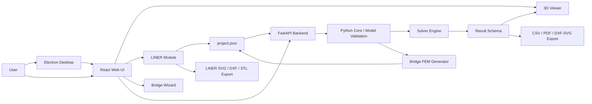
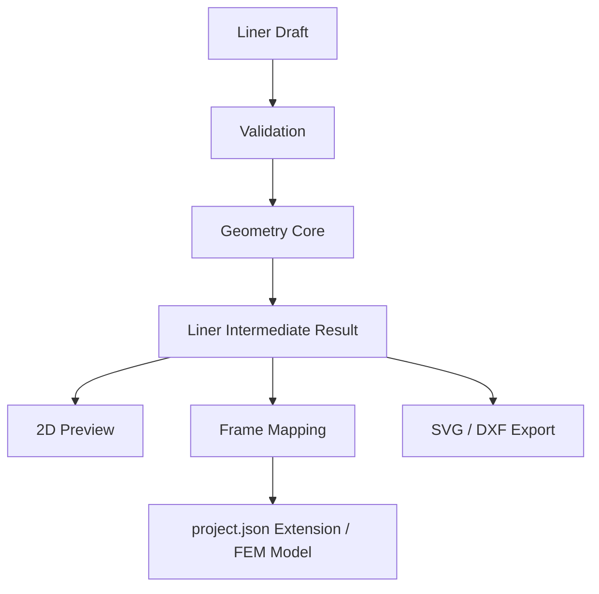
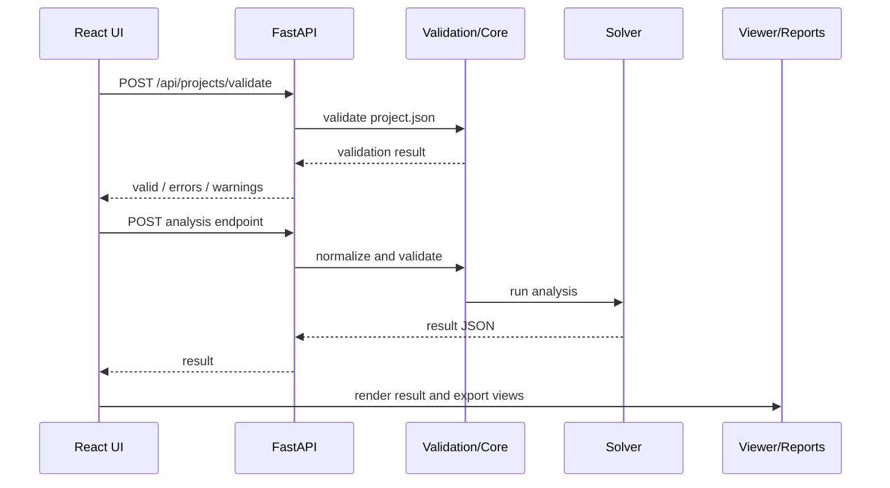

# Architecture

`spacer-clone` は、UI、API、解析エンジン、Viewer、LINER、出力機能を分離して構成しています。中心データは `project.json` と analysis result JSON です。

## Overview



## Layers

### Frontend

Location: `frontend/src/`

Responsibilities:

- Project editing UI
- Analysis execution UI
- Result tables and charts
- Time history dashboard
- Bridge Wizard
- LINER UI
- Export triggers
- i18n and user-facing text

The frontend must not duplicate solver logic. It may prepare requests, render results, and run UI-specific validation, but numerical analysis belongs to the backend engine or isolated LINER calculation modules.

### Backend

Location: `backend/app/`

Responsibilities:

- FastAPI endpoints
- Project validation API
- Analysis execution API
- Save/load/autosave
- Examples API
- Bridge project API
- Report CSV generation
- Structured error responses

Important endpoints include:

- `GET /health`
- `POST /api/projects/validate`
- `POST /api/analysis/run`
- `POST /api/analysis/eigen`
- `POST /api/analysis/response-spectrum`
- `POST /api/analysis/time-history`
- `POST /api/influence/run`
- `POST /api/moving-load/run`
- `GET /api/examples`
- `GET/POST/PUT/DELETE /api/bridge`

### Core

Location: `backend/engine/model.py`, `schemas/`

Responsibilities:

- `project.json` parsing and validation
- Reference integrity checks
- Non-finite value rejection
- Analysis settings validation
- Shared data model normalization

JSON Schemas:

- `schemas/project.schema.json`
- `schemas/result.schema.json`
- `schemas/bridge.schema.json`
- `schemas/generated-fem.schema.json`

### Solver

Location: `backend/engine/`

Responsibilities:

- Matrix assembly
- DOF management
- Element stiffness and member force calculation
- Linear static analysis
- Mass matrix handling
- Eigenvalue analysis
- Response spectrum analysis
- Time history analysis
- Influence line analysis
- Moving load analysis

Key modules:

- `assembly.py`
- `solver.py`
- `element.py`
- `dof.py`
- `mass.py`
- `eigen.py`
- `response_spectrum.py`
- `time_history_analysis.py`
- `influence.py`
- `moving_load.py`

### Viewer

Location: `frontend/src` viewer-related components and result view models.

Responsibilities:

- Model display
- Support/load visualization
- Deformed shape
- Mode shape and response animation
- Result labels
- Display-size controls
- WebGL fallback handling

Viewer input is limited to `project.json`, analysis result JSON, and UI display settings.

### LINER

Location: `frontend/src/liner/`, `docs/liner/`

Responsibilities:

- Alignment domain model
- Horizontal / vertical / cross-section calculation
- Station and grid generation
- Intermediate result model
- LINER project persistence and migration
- Frame model mapping
- LINER UI pages
- LINER-specific export paths

LINER uses a computed intermediate result as the source of truth for downstream frame mapping and exports.



### DXF / Export

Locations:

- `frontend/src/exports/`
- `frontend/src/liner/exports/`
- `backend/app/reports.py`
- `docs/liner/cad_output_spec.md`

Responsibilities:

- CSV result export
- Printable HTML/PDF report generation
- LINER plan/profile drawing output
- DXF subset experiments and validation
- STL/JSCAD-related export utilities

DXF Export is still being stabilized. The LINER CAD specification currently treats SVG as the stable MVP format and DXF as a subset under active improvement.

### Utilities

Locations:

- `scripts/`
- `start-windows.ps1`
- `start-mac.sh`
- `start-ubuntu.sh`

Responsibilities:

- Startup orchestration
- Icon generation
- Source hygiene checks
- Japanese string checks
- Build helper scripts

## Data Flow



## Dependency Rules

- `backend/engine` must not depend on FastAPI, React, Electron, or Three.js.
- `backend/app` may call `backend/engine`, but must not contain solver implementation.
- `frontend` depends on API contracts and schemas, not Python internals.
- Electron contains app shell, menu, window, and GPU compatibility logic only.
- Viewer logic consumes model/result data and display settings only.
- LINER geometry core should remain independent from React components where practical.
- Generated files and build artifacts should not become source of truth.

## Runtime Modes

Development web:

```text
React/Vite dev server -> FastAPI backend
```

Development desktop:

```text
Electron -> Vite dev server -> FastAPI backend
```

Packaged desktop:

```text
Electron -> frontend/dist -> packaged backend executable
```

## Related Documents

- [docs/03_architecture.md](docs/03_architecture.md)
- [docs/04_input_schema.md](docs/04_input_schema.md)
- [docs/05_analysis_engine_spec.md](docs/05_analysis_engine_spec.md)
- [docs/06_result_schema.md](docs/06_result_schema.md)
- [docs/07_api_spec.md](docs/07_api_spec.md)
- [docs/08_ui_spec.md](docs/08_ui_spec.md)
- [docs/09_3d_view_spec.md](docs/09_3d_view_spec.md)
- [docs/liner/README.md](docs/liner/README.md)
