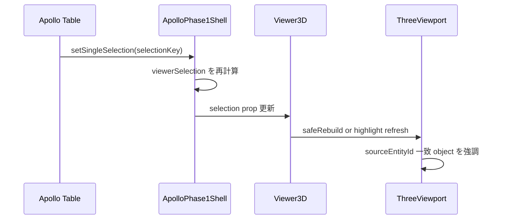
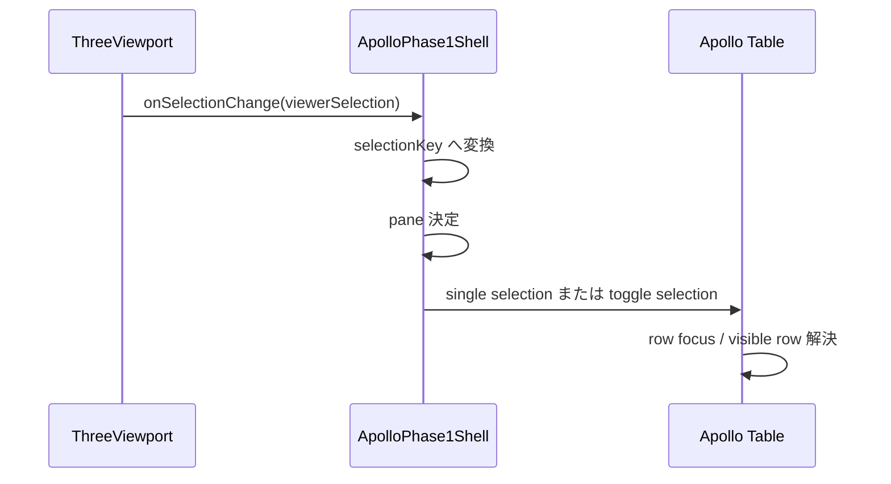
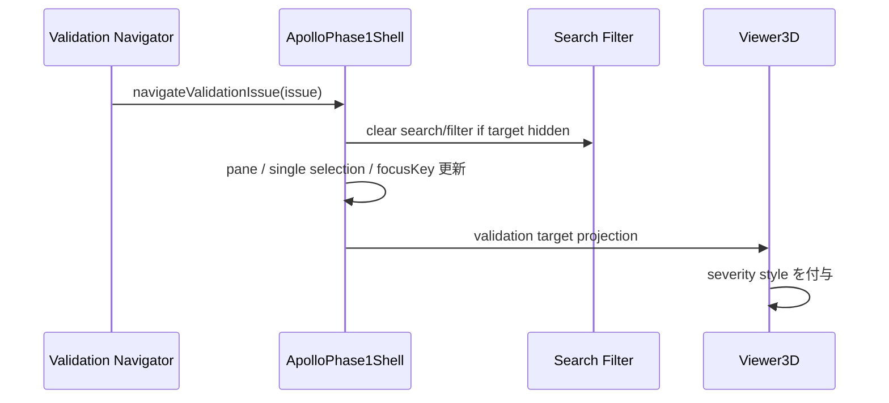

APOLLO_3D_SELECTION_OWNERSHIP_VERDICT: FROZEN
APOLLO_3D_SELECTION_MAPPING_VERDICT: FROZEN_WITH_PROVISIONAL_ITEMS
APOLLO_3D_VALIDATION_MAPPING_VERDICT: FROZEN
APOLLO_3D_FOCUS_FLOW_VERDICT: FROZEN
APOLLO_3D_STEP5_IMPLEMENTATION_READINESS: READY_WITH_PROVISIONAL_POC_ASSUMPTIONS
RECOMMENDED_NEXT_STEP: STEP6_SIMPLE_SOLID_DESIGN

# 08. Apollo入力・選択・Validation連動設計

## 1. 目的

本書は、Apollo Phase 1 Unit 3 の入力表、3D Viewer、Validation Navigator の間で、選択、フォーカス、強調表示を安全に連動させるための実装前設計を固定する。  
本Stepでは production code を変更せず、Step 5 実装開始時に state ownership、ID mapping、競合優先順位、filtered/deleted 時の挙動で迷わない状態を作る。

## 2. 判定と前提

- `CONFIRMED`: Apollo UI selection state は既に `frontend/src/apollo/selection.ts` に集約されている。
- `CONFIRMED`: Viewer 側の現在 selection contract は `frontend/src/viewer/types.ts` の `ViewerSelection = { type: "node" | "member"; id: string } | null` に限定される。
- `CONFIRMED`: Validation Navigator は `frontend/src/apollo/validationNavigator.ts` の `ApolloValidationIssue` と `focusLocator` を用い、`frontend/src/apollo/ApolloPhase1Shell.tsx` から selection/pane/filter に影響する。
- `PROVISIONAL`: support の 3D pick 対応は Step 5 実装で `ViewerSelection` 拡張が必要。
- `PROVISIONAL`: hover のグローバル所有者は追加せず、viewer-local ephemeral state とする。
- `NON_BLOCKING_FOR_IMPLEMENTATION`: material/section など node/member/support 以外の validation target は直接 3D object を持たず、focus locator と row focus を優先する。

## 3. current implementation evidence

参照パス:

- `frontend/src/apollo/ApolloPhase1Shell.tsx`
- `frontend/src/apollo/selection.ts`
- `frontend/src/apollo/validationNavigator.ts`
- `frontend/src/apollo/searchFilter.ts`
- `frontend/src/apollo/unit2Draft.ts`
- `frontend/src/viewer/types.ts`
- `frontend/src/viewer/ThreeViewport.tsx`
- `frontend/src/viewer/Fallback2DViewport.tsx`
- `frontend/src/viewer/SceneBuilder.ts`

確認事項:

- `ApolloPhase1Shell.tsx`
  - `viewerSelection` は single selection かつ `kind === "node" || kind === "member"` の場合のみ 3D viewer に渡す。
  - `handleViewerSelection()` は 3D click を Apollo UI selection state へ戻し、pane を `nodes` または `members` に切り替える。
  - `navigateValidationIssue()` は search filter を clear した上で、pane と single selection を更新し、`focusKey` と `validationFocusToken` を設定する。
- `selection.ts`
  - 正本 state は `ApolloSelectionState { orderedRefs, anchorRef }`。
  - multi-select、range select、toggle、prune の既存 utility が存在する。
- `validationNavigator.ts`
  - `ApolloValidationIssue` は `entityType`、`entityId`、`severity`、`paneId`、`focusLocator` を保持する。
  - `resolveApolloValidationFocusLocator()` が field 単位の focus を UI 入力へ誘導する前提を持つ。
- `searchFilter.ts`
  - `buildApolloVisibleRefs()` が filtered state を決める。
- `ThreeViewport.tsx`
  - raycast 結果から `userData.selectable` を読んで `onSelectionChange({ type, id })` を返す。
  - current implementation では node/member のみ選択可能。
  - hover は pointer move まで実装済みだが、hover owner は外部公開していない。
- `Fallback2DViewport.tsx`
  - 2D fallback でも node/member click selection を返す。

## 4. 状態インベントリ

| 状態 | current owner | current shape | 判定 | 備考 |
|---|---|---|---|---|
| active selection | Apollo UI | `ApolloSelectionState` | `CONFIRMED` | `selection.ts` 正本 |
| multi-selection | Apollo UI | `orderedRefs[]` | `CONFIRMED` | anchor を保持 |
| active pane | Apollo UI | `ApolloEntityKind` | `CONFIRMED` | table focus先 |
| validation focus | Apollo UI transient | `focusKey`, `validationFocusToken`, `validationIssueIndex` | `CONFIRMED` | selection とは別 intent |
| viewer selection | derived | `ViewerSelection` | `CONFIRMED` | UI selection から投影 |
| viewer hover | viewer-local | ephemeral | `PROVISIONAL` | Step 5でも SoR 化しない |
| visible refs | derived | `buildApolloVisibleRefs()` | `CONFIRMED` | filter/search 依存 |
| object highlight | derived | scene object material/style | `PROVISIONAL` | selection/validation 合成で決定 |

## 5. ownership freeze

### 5.1 正本

- `Apollo UI selection state = authoritative UI selection`
- `Viewer selection = derived projection`
- `Validation focus = separate transient intent`
- `Hover = viewer-local ephemeral state`

### 5.2 競合優先順位

優先順位を以下で固定する。

1. validation target の存在確認
2. active selection の存在確認
3. hover
4. default style

ただし表現は以下に分離する。

- selection: 輪郭強調または基本ハイライト
- validation error: 赤系強調
- validation warning: 黄系強調
- selection と validation が同一 entity に重なる場合: validation color を優先し、selection outline または scale accent を重ねる
- hover は selection/validation を上書きしない

## 6. ID / mapping contract

### 6.1 固定する key

| 項目 | 定義 | source | 状態 |
|---|---|---|---|
| `entityKind` | `node \| member \| support` を Step 5 実装対象とする | draft entity type | `FROZEN_WITH_PROVISIONAL_ITEMS` |
| `sourceEntityId` | Draft 上の entity id | `draft.nodes[].id` 等 | `FROZEN` |
| `selectionKey` | `${entityKind}:${sourceEntityId}` | Apollo UI selection ref | `FROZEN` |
| `validationTargetKey` | `${entityType}:${entityId}` を基本とし field path は別保持 | validation issue | `FROZEN` |
| `viewerObjectKey` | `${entityKind}:${sourceEntityId}:${objectRole}` | scene object `userData` | `FROZEN` |
| `rowLocator` | pane + entity id + visible index 再解決 | table view | `FROZEN` |
| `focusLocator` | `resolveApolloValidationFocusLocator()` 互換 shape | validation navigator | `FROZEN` |

### 6.2 duplicate / stale / missing handling

- duplicate ID: `BLOCKING_FOR_IMPLEMENTATION`
  - Apollo draft validator または builder で検知し、3D pick 対象を生成しない。
- stale ID:
  - selection rebuild 時に `pruneApolloSelection()` 相当の cleanup を必須化する。
  - validation target が stale の場合は issue list 上に残しても 3D/table focus は no-op + warning banner とする。
- missing target:
  - 3D object 不在なら table focus を試行する。
  - table row も不在なら Validation Navigator の issue detail のみ表示し、viewer は clear highlight。

## 7. event flow

### 7.1 table row -> 3D highlight



設計判断:

- selection 正本は table 側に残す。
- Viewer は selection prop のみを読み取り、scene を更新する。
- multi-select 時は primary selection を camera focus 候補とし、highlight 自体は複数 entity を許容する設計へ拡張する。

### 7.2 3D click -> table selection



設計判断:

- Step 5 実装では click は single select を基本とし、modifier key multi-select は `PROVISIONAL`。
- double click または explicit command で row focus / scroll into view を行う。
- support pick は Step 5 実装時に `ViewerSelection` 拡張後に有効化する。

### 7.3 Validation Navigator -> 3D highlight



設計判断:

- current precedent のとおり filtered-out row は search/filter を clear して可視化する。
- validation focus は selection と別 state とし、selection state へ dual write しない。
- validation target が node/member/support 以外なら 3D highlight を持たず table focus のみ。

## 8. precedence rules

| ケース | table selection | viewer highlight | validation focus | 判定 |
|---|---|---|---|---|
| node selected | 正本 | node highlight | なし | `CONFIRMED` |
| member selected | 正本 | member highlight | なし | `CONFIRMED` |
| selection + validation same target | 正本 | selection outline + severity color | あり | `FROZEN` |
| selection + validation different target | 正本 | primary selection + validation target を同時表示 | あり | `FROZEN_WITH_PROVISIONAL_ITEMS` |
| filtered target | 正本 | filter clear 後に描画 | あり/なし | `CONFIRMED` |
| deleted target | cleanup | clear | issue stale 扱い | `FROZEN` |
| hidden entity | 正本 | hidden policy を上書きして一時表示しない | あり/なし | `PROVISIONAL` |

補足:

- hidden entity selection は `visibility override` を新設せず、Step 5 では panel 側可視化を優先する。
- validation が hidden entity を指す場合は UI で hidden 状態を明示し、user action で reveal できる設計を `DEFERRED` とする。

## 9. multi-select policy

- 正本は `ApolloSelectionState.orderedRefs`。
- Viewer 派生 selection は Step 5 実装で `ViewerSelection[]` 互換へ広げるか、`primary selection + secondary highlight ids` を別 prop 化する。
- 本設計では後方互換を優先し、次の仮称を採用する。

```ts
type ApolloViewerSelectionProjection = {
  primary: ViewerSelection | null;
  secondaryKeys: string[];
};
```

仮称であり production code ではない。

判断:

- `primary`: table anchor または最後に選択された entity
- `secondaryKeys`: orderedRefs から primary を除いた同種または異種 entity
- mixed kind multi-select は 3D 上でも許容するが camera focus は primary のみ

## 10. hidden / filtered / deleted handling

| 状況 | 方針 | 状態 |
|---|---|---|
| filtered-out row | 既存 precedent どおり filter clear 後に focus | `CONFIRMED` |
| deleted entity | selection prune、validation stale 化 | `FROZEN` |
| hidden by visibility toggle | selection は維持、viewer object は非表示 | `PROVISIONAL` |
| unsupported entity kind | 3D pick なし、table focus のみ | `FROZEN` |
| support entity | Step 5 実装で pick 対応を追加 | `PROVISIONAL` |

## 11. accessibility / keyboard

- keyboard focus の正本は table row に残す。
- 3D viewer は pointer-driven 補助 UI とし、tab order の中心にしない。
- validation navigation は current navigator shortcut/flow を維持する。
- 3D click で selection が変わった場合でも、table 側 row focus を再取得し screen reader 対応を保つ。
- no-result 時は selection clear と explanatory message を表示する。

## 12. file change forecast

想定変更候補:

- `frontend/src/viewer/types.ts`
  - `ViewerSelection` の support 拡張、または projection type 追加
- `frontend/src/viewer/ThreeViewport.tsx`
  - multi-highlight、validation severity、support pick
- `frontend/src/viewer/SceneBuilder.ts`
  - selectable metadata と highlight role 分離
- `frontend/src/apollo/ApolloPhase1Shell.tsx`
  - selection/validation projection adapter
- `frontend/src/apollo/selection.ts`
  - cleanup hook 追加の可能性
- `frontend/src/apollo/__tests__/ApolloPhase1Shell.test.tsx`
  - selection/validation integration test 拡張

変更禁止:

- Solver
- Numeric
- LINER calculation
- Backend
- import fail-closed policy
- unrelated viewer feature

## 13. test matrix

| テスト | 期待結果 | 状態 |
|---|---|---|
| table row select -> 3D highlight | 同一 entity が強調 | `REQUIRED` |
| 3D click -> table single select | pane と row focus が同期 | `REQUIRED` |
| multi-select projection | primary/secondary が分離 | `REQUIRED` |
| validation issue -> 3D severity highlight | severity 表示と focusKey 更新 | `REQUIRED` |
| filtered target navigation | filter clear 後に対象へ移動 | `REQUIRED` |
| deleted selected entity | selection prune | `REQUIRED` |
| stale validation id | crash せず no-op + warning | `REQUIRED` |
| support selection | pick -> support row selection | `PROVISIONAL_REQUIRED` |
| hover only | selection を汚染しない | `REQUIRED` |
| undo/redo | selection cleanup と viewer refresh | `REQUIRED` |

## 14. implementation entry gate

- Step 0〜Step 4 文書が `origin/main` に存在すること
- `ViewerSelection` 拡張方針を PR 単位で確定すること
- support entity の selectable object role を `SceneBuilder` で定義すること
- selection/validation 用 style token を viewer 側へ限定すること
- table focus と viewer highlight を dual write しないこと

## 15. implementation completion gate

- table row -> 3D highlight が node/member/support で成立
- 3D click -> table single selection が成立
- Validation Navigator -> severity highlight が成立
- filtered-out target への遷移が fail-closed せず成立
- deleted entity 後に stale selection が残らない
- undo/redo 後に selection と viewer 表示が再同期する
- Viewer mesh/object state が Apollo 設計正本へ混入しない
- Unit 3 既存編集挙動へ副作用を入れない

## 16. unresolved items

| 項目 | 分類 | 内容 | 見直し条件 |
|---|---|---|---|
| support 3D selectable shape | `PROVISIONAL` | current `ViewerSelection` が未対応 | Step 5 implementation PR-1 で types 拡張時 |
| mixed-kind multi-select camera behavior | `ASSUMED_FOR_POC` | primary のみ fit/focus 対象 | user feedback または UX review |
| hidden entity reveal UX | `DEFERRED` | auto reveal を今回固定しない | visibility state 実装時 |
| material/section validation target の 3D 表現 | `OUT_OF_SCOPE` | 直接 3D object を持たない | future metadata visualization |

## 17. 実装開始判断

- `APOLLO_3D_SELECTION_OWNERSHIP_VERDICT: FROZEN`
- `APOLLO_3D_SELECTION_MAPPING_VERDICT: FROZEN_WITH_PROVISIONAL_ITEMS`
- `APOLLO_3D_VALIDATION_MAPPING_VERDICT: FROZEN`
- `APOLLO_3D_FOCUS_FLOW_VERDICT: FROZEN`
- `APOLLO_3D_STEP5_IMPLEMENTATION_READINESS: READY_WITH_PROVISIONAL_POC_ASSUMPTIONS`

Step 5 は、support pick と multi-select projection の仮称 contract を含むが、current repository implementation と矛盾しない範囲で PoC 実装へ進める。
