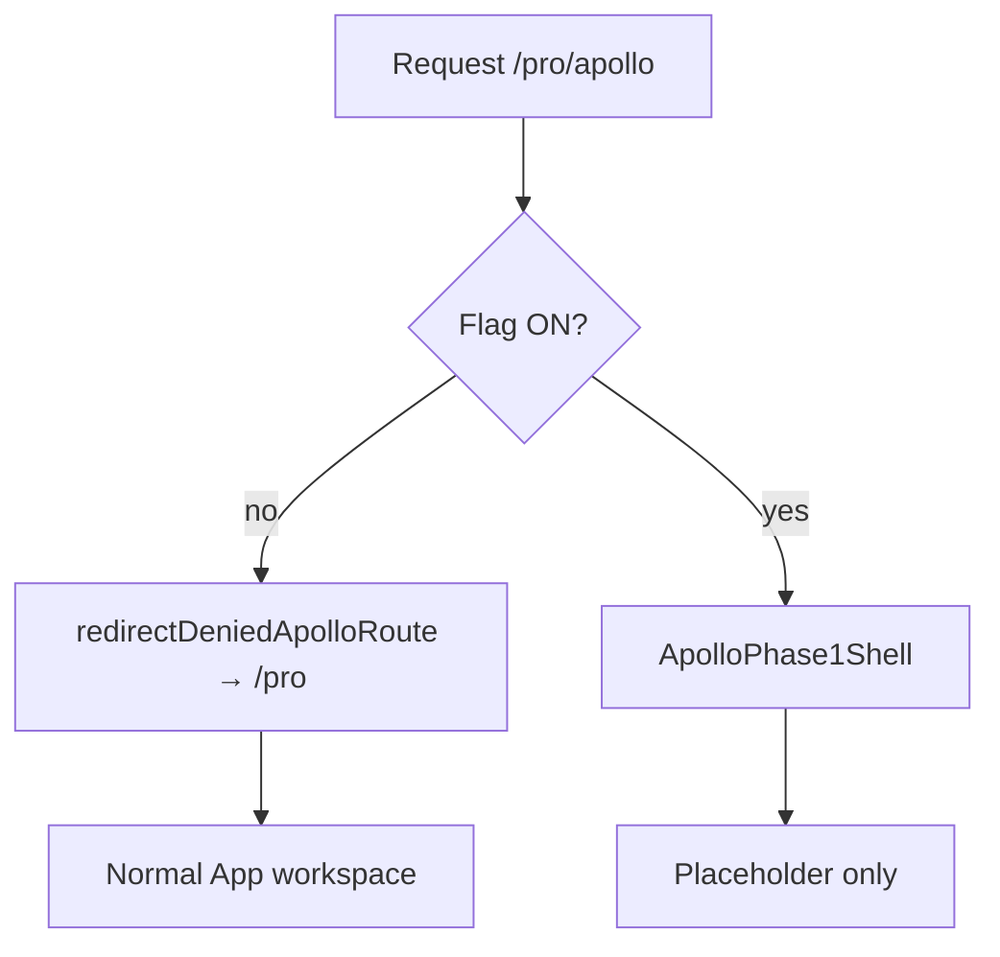

# Entry Guard Design — Apollo Phase 1

**Authority:** AP-00 / P01  
**Date:** 2026-07-27

## Routes

| Path | Purpose |
|------|---------|
| `/pro/apollo` | Phase 1 guarded shell (flag ON only) |
| `/pro/apollo/*` | Denied or shell per flag (subpaths reserved; no workspace body in P01) |

Denied redirect target: `/pro` (existing Frame workspace).

## Guard layers

### 1. Synchronous redirect (`entryGuard.ts`)

`redirectDeniedApolloRoute()` runs at `App` startup (alongside legacy route redirect). When flag OFF and pathname matches Apollo, `history.replaceState` to `/pro` before workspace render.

### 2. Early return (`App.tsx`)

When flag ON and pathname is Apollo, `App` returns `ApolloPhase1Shell` only — no `ProjectModel` workspace, viewer, or analysis toolbar actions.

### 3. Entry visibility (`Toolbar.tsx`)

`onOpenApolloPhase1` is passed only when flag ON. No user-visible Apollo button when OFF.

## Shell contents (ON)

Allowed:

- Title: Apollo Phase 1
- Message: foundation / not authorized for design input
- Return to `/pro` control

Forbidden in shell (P01):

- BSDD property forms
- Target Standard numerics
- Phase 1外 bridge type pickers
- Analysis run / validate / export controls

## Side-effect boundary

| Flag | Apollo state on ProjectModel | Frame / Road behavior |
|------|------------------------------|------------------------|
| OFF | none | unchanged |
| ON | none (shell only) | unchanged |

## Modules

| File | Role |
|------|------|
| `apollo/featureFlag.ts` | Flag parse + read |
| `apollo/routes.ts` | Path constants + match |
| `apollo/entryGuard.ts` | Access resolution + deny redirect |
| `apollo/ApolloPhase1Shell.tsx` | Guarded placeholder UI |

## Electron vs web

Single Vite entry (`main.tsx` → `App` for `/pro/*`). No separate Electron flag path; env is read via `import.meta.env` in both targets.
