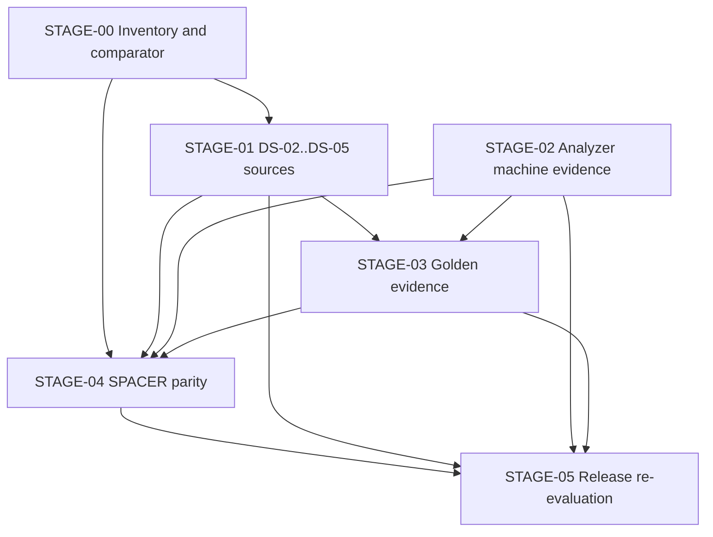

# EA-00 Evidence Acquisition Sequence

Checkpoint: `7386bdf8be5b11cb38d445e32ddce16464fdb3c1`

This sequence is deterministic and fail-closed. Each stage closes only against its own acceptance criteria in the canonical registers. Document-validation PASS does not substitute for machine, licensed-source, Golden, or parity evidence.

## Stage map

| Stage | Scope | Canonical gates | Exit criterion |
|---|---|---|---|
| STAGE-00 | Inventory and non-product tooling | EA-00; PAR-BLK-006 harness | Comparator validation bundle versioned; inventory reconciled |
| STAGE-01 | DS-02 through DS-05 licensed source numerics | GATE-NR-01; SG-002..SG-009; BLK-S1-002/004/005/006; PKG-R7-V; PKG-DS03; PKG-DS04; PKG-SCOPE-P1B | Zero open DS-02..DS-05 numeric adoption blockers |
| STAGE-02 | DS-06 Analyzer identity and physical I/O | GATE-NR-02; AN-BLK-001..010; BLK-S1-011; PKG-DS06; EXT-ID-001..003 | All ten AN blockers closed with checksum bundles |
| STAGE-03 | DS-07 approved reproducible Goldens | GATE-NR-03; GOLD-BLK-001..008; GOLD-001..016 | Required Goldens independently derived or reference-bound, reproducible, and approved |
| STAGE-04 | DS-08 fixed-version SPACER parity | GATE-NR-04; PAR-BLK-001..008; PAR-001..015 | Semantic and numeric parity pass under frozen comparator rules |
| STAGE-05 | DS-09 numeric release re-evaluation | GATE-NR-05 through GATE-NR-07 | Full gate conjunction PASS at same checkpoint |

## STAGE-00 — Inventory and comparator groundwork (parallel-safe)

**Order within stage**

1. Complete EA-00 inventory deliverables (`current_blocker_snapshot.csv`, reconciliation report, work items, this sequence).
2. Execute WI-001 (PAR-BLK-006): build design-numeric-free fail-closed comparator validation bundle in the repository.
3. Execute WI-003 (GOLD-BLK-002): freeze per-quantity tolerance worksheet templates before any product comparison.

**Blocked actions:** No production engineering numerics; no SPACER parity claim; no Golden approval from Apollo output alone.

**Traceability:** `executable_work_items.csv` WI-001, WI-003; `parity_blocker_register.csv` PAR-BLK-006.

## STAGE-01 — Licensed source closure for DS-02 through DS-05

**Prerequisite:** STAGE-00 inventory complete.

**Order within stage**

1. BLK-S1-009 evidence-rights decision (organizational; does not alone release numerics but governs extract retention).
2. BLK-S1-001, BLK-S1-003, DTR-06, BLK-S1-008 — DS-01 metadata, manual edition map, errata, and image-export locator quality (SG-001 predecessors).
3. BLK-S1-002 — 34 JIS per-row packages (SG-002).
4. BLK-S1-005 — 39 material property packages (SG-003).
5. BLK-S1-004 — load model, factor, combination, and engineering quantity locators (SG-004, SG-005, SG-006).
6. PKG-R7-V, PKG-DS03, PKG-DS04 — DS-05 verification, material, and load input packages (SG-007, SG-008, SG-009).
7. BLK-S1-006 — cross-register human-verified locator manifest.
8. PKG-SCOPE-P1B — signed Phase 1B scope table.
9. BLK-S1-007 — historical Apollo baseline decision (parallel with licensed source work where lawful).

**Exit:** GATE-NR-01 predicate satisfied; `source_gap_register.csv` SG-002 through SG-009 closed.

**Traceability:** `executable_work_items.csv` WI-006 through WI-010; `source_gap_register.csv`.

## STAGE-02 — External identity and Analyzer machine evidence

**Prerequisite:** STAGE-01 DS-02..DS-05 numeric chain closed for GOLD-BLK-007 and PAR-BLK-007 material facets; identity capture may start once licenses and machines are available.

**Order within stage**

1. EXT-ID-002 SPACER product shell identity (WI-012) — enables SPACER module boundary.
2. EXT-ID-003 SPACER STATICS module identity (WI-013).
3. EXT-ID-001 Historical APOLLO Analyzer identity (WI-011) — relationship evidence to SPACER and repository solver.
4. AN-BLK-001 closure — composite identity bundle across three external identities.
5. AN-BLK-002 invocation and physical files (WI-014).
6. AN-BLK-003 units and textual representation.
7. AN-BLK-004 coordinates DOF I-J and signs.
8. AN-BLK-005 error exit and license probes per `analyzer_probe_matrix.csv` and `analyzer_error_exit_license_matrix.csv`.
9. AN-BLK-006 staleness overwrite and malformed output.
10. AN-BLK-007 timeout cancellation concurrency cleanup and recovery.
11. AN-BLK-008 reproducibility three-run bundle (WI-015).
12. AN-BLK-009 CSV PDF and mock authority.
13. AN-BLK-010 load case and combination mapping.
14. BLK-S1-011 DS-06 machine-evidence closure manifest.
15. PKG-DS06 Analyzer response mapping to DS-05 quantities.

**Exit:** GATE-NR-02 PASS; SG-010 closed; all AN-BLK-001..010 statuses closed in canonical registers.

**Traceability:** `analyzer_blocker_register.csv`; `analyzer_identity_register.csv`; `executable_work_items.csv` WI-011 through WI-015.

## STAGE-03 — Golden expected-value evidence

**Prerequisite:** STAGE-02 identity fixed for reference-software cases; STAGE-01 closed for GOLD-BLK-007 and GOLD-015.

**Order within stage**

1. GOLD-BLK-002 tolerance worksheet frozen (may overlap STAGE-00 WI-003).
2. GOLD-BLK-001 independent analytical derivations for GOLD-001..005 (WI-002) — closure requires fixed-input traceability plus two agreeing independent derivations per quantity (D-005).
3. GOLD-BLK-004 canonical serialization package for GOLD-011 (WI-004).
4. GOLD-BLK-006 negative contracts for GOLD-012..014 (WI-005).
5. GOLD-BLK-003 reference bundles for GOLD-006 and GOLD-010 (WI-016) — requires STAGE-02 identity.
6. GOLD-BLK-005 bridge reference bundles for GOLD-007..009 (WI-017).
7. GOLD-BLK-007 design-verification package for GOLD-015 (WI-018) — requires STAGE-01.
8. GOLD-BLK-008 export lineage for GOLD-016 (WI-019) — requires approved parent numeric Golden and live IF3 authority.
9. Independent review and approval decisions for all sixteen catalog cases in `golden_approval_register.csv`.

**Exit:** GATE-NR-03 PASS; all required GOLD-001..016 approvals recorded as approved with evidence manifests, not `NOT_APPROVED`.

**Traceability:** `golden_blocker_register.csv`; `golden_approval_register.csv`; `executable_work_items.csv` WI-002 through WI-005, WI-016 through WI-019.

## STAGE-04 — SPACER semantic and numeric parity

**Prerequisite:** STAGE-02 identity; STAGE-03 Golden gates for numeric parity cases; PAR-BLK-006 comparator from STAGE-00.

**Order within stage**

1. PAR-BLK-001 reference identity closure (depends EXT-ID-002/003).
2. PAR-BLK-002 input and topology semantics — PAR-001, PAR-002.
3. PAR-BLK-007 materials and stiffness — PAR-003 (requires STAGE-01 DS-03 sources).
4. PAR-BLK-003 coordinates DOF I-J and signs — PAR-004, PAR-005, PAR-012.
5. PAR-BLK-004 load cases and combinations — PAR-006, PAR-007.
6. PAR-BLK-006 comparator validation complete (if not already in STAGE-00).
7. PAR-BLK-005 actual numeric results — PAR-008, PAR-009, PAR-010, PAR-011.
8. PAR-BLK-008 report drawing and file parity — PAR-013, PAR-014, PAR-015.
9. Independent approval for all fifteen parity cases in `parity_approval_register.csv` with manifest IDs and checksums.

**Exit:** GATE-NR-04 PASS; SG-012 closed; PAR-001..015 approvals no longer `NOT_APPROVED`.

**Traceability:** `parity_blocker_register.csv`; `parity_approval_register.csv`; `executable_work_items.csv` WI-001, WI-020.

## STAGE-05 — Numeric release re-evaluation

**Prerequisite:** STAGE-01 through STAGE-04 closed; unresolved evidence count zero.

**Order within stage**

1. Verify GATE-NR-05: `unresolved_evidence_requirements.csv` has zero open blocker rows.
2. Repeat GATE-NR-06 independent governance review at current checkpoint.
3. Repeat GATE-NR-07 full repository validation (typecheck, lint, frontend/backend tests, regression, production build).
4. Record numeric release decision in `numeric_release_gate.md` and `final_verdicts.md` through governed update process only after all gates PASS.

**Exit:** `NUMERIC_IMPLEMENTATION_RELEASE_VERDICT` changes from `BLOCKED` only when all seven GATE-NR predicates are PASS at the same checkpoint.

## Dependency diagram

## Count summary (deterministic)

| Set | Count | Current canonical status |
|---|---:|---|
| AN-BLK-001..010 | 10 | All blocked |
| GOLD-BLK-001..008 | 8 | All blocked |
| PAR-BLK-001..008 | 8 | All blocked |
| GOLD-001..016 approvals | 16 | All NOT_APPROVED |
| PAR-001..015 approvals | 15 | All NOT_APPROVED |
| External identities | 3 | All blocked |
| DS-02..DS-05 source gaps SG-002..009 | 8 | All blocked |
| Unresolved evidence register rows | 42 | All blocked |

Numeric implementation remains blocked until STAGE-05 completes with full gate conjunction PASS.
