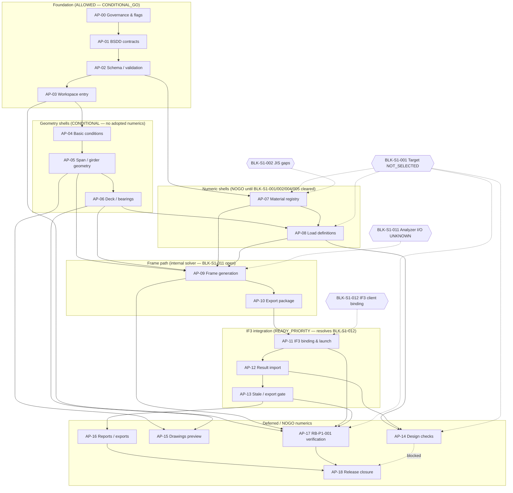

# Apollo Phase 1 — Implementation Dependency Graph

**Authority:** DESIGN PLANNING / STEP 1 (P09)  
**Date:** 2026-07-27  
**Base commit:** `555a3c5d9a4242cc8ea838973a0ce41a5ec1613b`

## Mermaid diagram



## Critical path (minimum viable Phase 1 demo)

```text
AP-00 → AP-01 → AP-02 → AP-03 → AP-04 → AP-05 → AP-06
  → AP-09 → AP-10 → AP-11 → AP-12 → AP-13
```

AP-07/AP-08 may proceed as **PLACEHOLDER shells** in parallel with AP-04..AP-06 but must not adopt numerics.

## External blockers (not AP-* dependencies)

| Blocker | Blocks |
|---------|--------|
| BLK-S1-001 | Adopted loads, materials, design-check numerics (AP-07, AP-08, AP-14, AP-17 golden) |
| BLK-S1-002 | Material property adoption (AP-07) |
| BLK-S1-004 | Auto numeric determination (AP-05..AP-08) |
| BLK-S1-011 | Legacy Analyzer parity claims (AP-09); internal path unaffected |
| BLK-S1-012 | Authoritative export (AP-10..AP-16); **resolved by AP-11** |
| LIM-P03-003 | PRINT visual release (AP-15, AP-16) |

## Parallelization opportunities

| Track A | Track B |
|---------|---------|
| AP-00..AP-03 foundation | — |
| AP-04..AP-06 geometry | AP-11 IF3 client fix (can start after AP-02; independent of geometry) |
| AP-09..AP-10 frame gen | AP-07/AP-08 shells (no numerics) |
| AP-13 export gates | AP-15 drawing preview (non-authoritative) |
