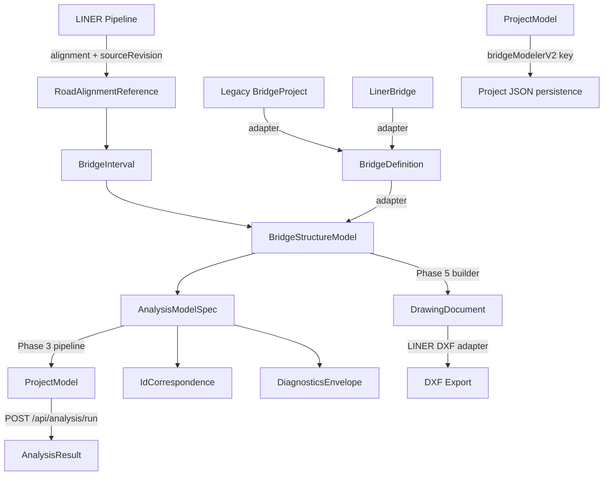

# 01 — Architecture and Domain Model

Date: 2026-07-14  
Status: 設計文書（監督決定に基づく）  
Authority: `_supervisor_decisions.md` の ADR-BMV2-003, 004, 006, 007, 009, 010, 013, 014 に準拠

---

## 1. 4層モデル

ADR-BMV2-003 に従い、Bridge Modeler V2 は以下の 4 層で構成される。

```
┌─────────────────────────────────────────────────────┐
│  Layer 4: AnalysisModelSpec / ProjectModel          │
│  ─ nodes, members, springs, constraints, loadCases  │
│  ─ solver 入力形状                                   │
│  ─ backend 既存 solver で処理                        │
├─────────────────────────────────────────────────────┤
│  Layer 3: BridgeStructureModel                      │
│  ─ supports, girders, cross girders, bearings        │
│  ─ sections, materials                               │
│  ─ Phase 2 入力対象                                  │
├─────────────────────────────────────────────────────┤
│  Layer 2: BridgeInterval                            │
│  ─ deck classification refs                          │
│  ─ start/end station                                 │
├─────────────────────────────────────────────────────┤
│  Layer 1: RoadAlignmentReference                    │
│  ─ LINER alignment 参照                              │
│  ─ live LINER evaluation                            │
│  ─ sourceRevision tracking                          │
└─────────────────────────────────────────────────────┘
```

### 層間関係
- Layer 1 → Layer 2: alignment 参照から interval 決定
- Layer 2 → Layer 3: interval 上に structure を配置
- Layer 3 → Layer 4: structure から FEM メッシュ生成

### コード上の現状
- Layer 3 の BridgeDefinition は `frontend/src/bridgeDefinition/types.ts` に実装済み（schema 1.0.0）
- Layer 4 の `ProjectModel` は `frontend/src/types.ts` に定義済み
- Layer 1-2 の V2 専用型は未実装（新規作成対象）

## 2. 型概念

### 2.1 BridgeModelerV2Document（V2 root aggregate）

```typescript
// 未実装 — 新規作成対象
type BridgeModelerV2Document = {
  schemaVersion: "bmv2-1.0.0";
  id: string;
  name: string;
  roadAlignment: RoadAlignmentReference;
  intervals: BridgeInterval[];
  structure: BridgeStructureModel;
  analysisSpec?: AnalysisModelSpec;
  generated?: {
    projectModel: ProjectModel;
    idCorrespondence: IdCorrespondence[];
    diagnostics: DiagnosticsEnvelope[];
  };
  metadata: DocumentMetadata;
};
```

### 2.2 RoadAlignmentReference（ADR-BMV2-002）

LINER の alignment を参照するが、geometry を fork しない。

```typescript
type RoadAlignmentReference = {
  linerProjectId?: string;
  linerModelId: string;
  alignmentId: string;
  sourceRevision: string;  // sourceRevisionFor() の結果
  startStationM: number;
  endStationM: number;
  localOriginPolicy: "liner-canonical" | "local-drawing-origin";
};
```

- **根拠**: `frontend/src/liner/core/pipeline/sourceRevision.ts:18` — `sourceRevisionFor` は SHA-256 ベース
- **根拠**: `frontend/src/liner/core/pipeline/pipeline.ts:505` — pipeline 内で sourceRevision を生成

### 2.3 BridgeInterval

橋梁の区間定義。

```typescript
type BridgeInterval = {
  id: string;  // deterministic stable ID (ADR-BMV2-004)
  startStationM: number;
  endStationM: number;
  deckClassificationRef?: string;
};
```

### 2.4 BridgeStructureModel

Legacy `BridgeProject` より富かな構造モデル。

```typescript
type BridgeStructureModel = {
  supports: BridgeSupport[];
  girders: BridgeGirder[];
  crossGirders: BridgeCrossGirder[];
  bearings: BridgeBearing[];
  sections: BridgeSection[];
  materials: BridgeMaterial[];
};
```

- **BridgeDefinition との違い**: `BridgeDefinition` (`frontend/src/bridgeDefinition/types.ts:173`) は importer/legacy adapter の中間層。V2 の `BridgeStructureModel` はより豊富（明示的支持線、ガーダーポリライン、skew 対応）。
- **根拠**: `frontend/src/bridgeDefinition/types.ts:96-101` — `BridgeDefinitionSuperstructure` は `params?: Record<string, unknown>` で拡張可能

### 2.5 AnalysisModelSpec → ProjectModel

**正式定義は 14_implementation_contract_catalog.md §3.20 を参照。**

```typescript
type AnalysisModelSpec = {
  id: string;                       // aspec:{label}
  stationSet: number[];             // BridgeInterval から生成
  generationStationSet?: GenerationStationSet;
  includeDeadLoad?: boolean;        // default: true
  includeLiveLoad?: boolean;        // default: true
  meshDensity?: "coarse" | "standard" | "fine";  // default: "standard"
};

// 生成結果
type GeneratedFemOutput = {
  projectModel: ProjectModel;           // 既存型を再利用
  idCorrespondence: IdCorrespondence[]; // V2 ID → ProjectModel ID 対応
  diagnostics: DiagnosticsEnvelope[];
};
```

- **根拠**: `frontend/src/types.ts:1-40` — `ProjectModel`, `NodeItem`, `Member` は既存
- **根拠**: `backend/engine/bridge_fem_generator.py:136` — `generate_fem_model` が `ProjectModel` を生成

### 2.6 Deterministic Stable IDs（ADR-BMV2-004）

```typescript
// セマンティックキーから ID を生成
// 例: "sup:A1", "gir:G2", "node:{stationMm}:{offsetMm}:{role}"
type StableId = string;

// Legacy との違い
// Legacy: "N1", "N2", ... (インデックスベース) — backend/engine/bridge_fem_generator.py:162
// V2: セマンティックキー (例: "sup:A1") — 再生成時に ID 保持
```

### 2.7 Diagnostics Envelope（ADR-BMV2-013）

```typescript
type DiagnosticsEnvelope = {
  severity: "info" | "warning" | "error";
  code: string;        // prefix: "BMV2_"
  message: string;
  path?: string;
  entityIds?: string[];
};
```

- **根拠**: `frontend/src/liner/drawing/model/diagnostics.ts:1-8` — LINER の `DrawingDiagnostic` と同構造
- **根拠**: `frontend/src/bridge/types.ts:85-90` — Legacy の `BridgeFemResponse.diagnostics` も同構造

## 3. Mermaid — データフロー



## 4. Adapter 境界

### 4.1 BridgeDefinition — importer/legacy adapter 中間層

ADR-BMV2-014 に従い、`BridgeDefinition` は中間層として保持される。

```
Legacy Path:
  BridgeProject (0.1.0) ──adapter──→ BridgeDefinition (1.0.0) ──adapter──→ BridgeStructureModel

LINER Path:
  LinerBridge ──adapter──→ BridgeDefinition (1.0.0) ──adapter──→ BridgeStructureModel

V2 Native Path:
  BridgeStructureModel (direct authoring)
```

- **根拠**: `frontend/src/bridgeDefinition/adapters/fromBridgeProject.ts:82` — `createBridgeDefinitionFromBridgeProject`
- **根拠**: `frontend/src/bridgeDefinition/adapters/fromLinerBridge.ts:87` — `createBridgeDefinitionFromLinerBridge`
- **根拠**: `frontend/src/bridgeDefinition/adapters/index.ts` — 両 adapter を export

### 4.2 Adapters の特徴
- 純粋関数（入力不変、非決定論的値なし）
- `validate*` 関数で non-fatal warnings を生成
- BridgeDefinition → StructuralModel は `frontend/src/bridgeDefinition/generator/structuralModelGenerator.ts` で実装

## 5. Frontend / Backend 分担

ADR-BMV2-010 に従う。

### Frontend（TypeScript）
| モジュール | 責務 |
| --- | --- |
| `bridgeModelerV2/` | V2 ルート、UI、ドメインロジック |
| `bridgeDefinition/` | BridgeDefinition 型、adapters、generator |
| `bridge/` | Legacy BridgeWizard（保持） |
| `liner/` | LINER pipeline、drawing、DXF |
| `viewer/` | 3D ビューア |

### Backend（Python）
| モジュール | 責務 |
| --- | --- |
| `engine/solver.py` | 既存 solver（`/api/analysis/run` 経由） |
| `engine/bridge_fem_generator.py` | Legacy FEM 生成（V2 経路で使用禁止） |
| `app/main.py:1017` | `POST /api/fem/generate` (Legacy 専用、V2 では使用禁止) |
| `app/main.py:1065` | `GET /api/viewer/bridge/{bridge_id}` |

- V2 解析経路: Frontend で `ProjectModel` を生成し、`POST /api/analysis/run` で solver に送信（C-05 確定）
- V2 専用 Backend API は MVP1 後の PR（ADR-BMV2-010: "optional backend persistence endpoints for V2 documents: design for `/api/bridge-modeler-v2/...` but implementation is later PRs"）

## 6. ProjectModel / Viewer / Drawing 責務

### ProjectModel
- 既存型 `frontend/src/types.ts` を再利用
- FEM solver の入出力形状
- V2 では `AnalysisModelSpec` から生成
- **ProjectModel 拡張**: `ProjectModel.bridgeModelerV2?: BridgeModelerV2Document` — 既存 `liner` / `linerTrace` と同型の camelCase 拡張スロット（ADR-BMV2-015）

### Viewer
- `frontend/src/viewer/Viewer3D.tsx` — App 全体の 3D ビューア
- `frontend/src/bridge/viewer/BridgeThreeViewer.tsx` — Bridge 専用 viewer
- `frontend/src/liner/adapters/linerViewerAdapter.ts` — LINER の viewer adapter
- V2 では `BridgeStructureModel` から 3D preview を生成

### Drawing
- `frontend/src/liner/drawing/model/document.ts:38` — `DrawingDocument` 型
- `frontend/src/liner/dxf/mapper/mapDrawingDocumentToDxf.ts` — DXF 変換
- Phase 5 で Bridge 描図に `DrawingDocument` を使用

## 7. Stable ID / Revision / Diagnostics

### Stable ID
- `node:{stationMm}:{offsetMm}:{role}` パターン
- 再生成時に同じセマンティックキーなら ID 保持
- 衝突時は suffix policy（ID appendix で文書化予定）
- **Legacy との違い**: `backend/engine/bridge_fem_generator.py:162` — `nid = f"N{counter}"`

### Revision
- `sourceRevisionFor()` (`frontend/src/liner/core/pipeline/sourceRevision.ts:18`) を V2 でも使用
- LINER alignment の変更検知に使用
- stale detection は Phase 1 の機能

### Diagnostics
- `severity | code | message | path? | entityIds?`
- code prefix: `BMV2_`
- Fatal errors: FEM emit を block
- Warnings: emit 許可 + banner 表示
- **根拠**: `frontend/src/liner/drawing/model/diagnostics.ts:1-8` — LINER の DrawingDiagnostic と同構造

## 8. BridgeDefinition 関係（ADR-BMV2-014）

```
BridgeDefinition (schema 1.0.0)
├── source: { kind: "liner" | "bridgeProject" | "manual" | "unknown" }
├── coordinatePolicy: { frame, axisConvention, units }
├── alignmentRefs: AlignmentRef[]
├── stations: Station[]
├── spans: Span[]
├── supports: Support[]
├── superstructure: { kind, params }
├── girders: Girder[]
├── crossBeams: CrossBeam[]
├── bearings: Bearing[]
├── deck: Deck
├── loads: Load[]
└── generationSettings: GenerationSettings
```

- **V2 BridgeStructureModel より弱い点**: 明示的支持線、ガーダーポリライン、skew の表現が限定的
- **保持理由**: Legacy/LINER からの import 経路を単一化するため
- **根拠**: `frontend/src/bridgeDefinition/types.ts:166-172` — JSDoc 明記 "upstream of FEM"

---

## ADR 一一覧（転記）

| ID | タイトル | 本文書との関連 |
| --- | --- | --- |
| ADR-BMV2-001 | New route, keep Legacy | §2.1, §7 |
| ADR-BMV2-002 | LINER is source of truth for RoadAlignment | §2.2 |
| ADR-BMV2-003 | Four layers | §1 |
| ADR-BMV2-004 | Deterministic stable IDs | §2.6, §7 |
| ADR-BMV2-005 | Separate deck / traffic load surface / FEM | §1 (Phase 4) |
| ADR-BMV2-006 | DrawingDocument is the drawing IR | §6 |
| ADR-BMV2-007 | Staged FEM pipeline with diagnostics | §1, §2.5, §7 |
| ADR-BMV2-008 | Schema & persistence | §2.1, §7 |
| ADR-BMV2-009 | Units & coordinates | §2.2 |
| ADR-BMV2-010 | Frontend/backend split | §5 |
| ADR-BMV2-011 | Feature flag | §7 |
| ADR-BMV2-012 | Undo/redo | §6 (command stack) |
| ADR-BMV2-013 | Diagnostics envelope | §2.7, §7 |
| ADR-BMV2-014 | BridgeDefinition relationship | §4, §8 |
