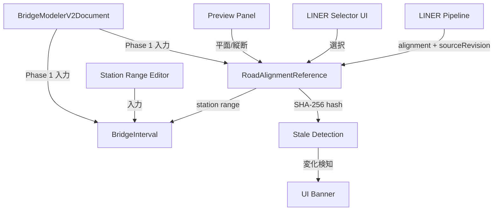
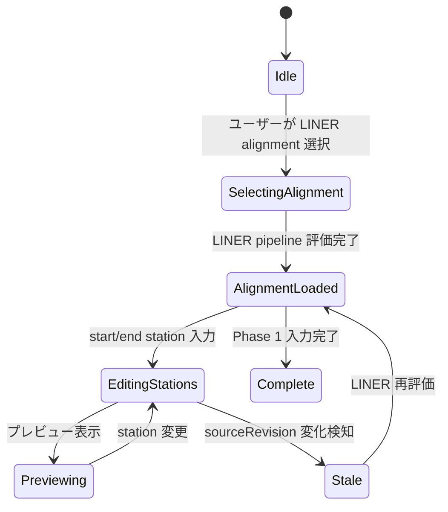

# 02 — Phase 1: LINER Bridge Interval Reference

Date: 2026-07-14  
Status: 設計文書（監督決定に基づく）  
Authority: `_supervisor_decisions.md` — ADR-BMV2-002, 004, 008, 011  
Scope constraint: LINER 参照・測点・revision・stale・preview のみ。構造/FEM/荷重/図面は対象外  
Reference: 型・ID パターン・FEM pipeline は [14_implementation_contract_catalog.md](14_implementation_contract_catalog.md) を正とする。矛盾がある場合は 14 優先

---

## 1. 目的

Phase 1 は Bridge Modeler V2 の基盤レイヤーである。LINER パイプラインの alignment 参照を受け取り、橋梁区間（BridgeInterval）の start/end station を定義し、sourceRevision による stale detection を提供する。LINER の geometry を V2 store に fork せず、参照のみを保持する（ADR-BMV2-002）。

## 2. 対象範囲

| 対象 | 説明 |
| --- | --- |
| LINER alignment 参照選択 | ユーザーが LINER project 内の alignment を選択 |
| `RoadAlignmentReference` | alignmentId, linerModelId, sourceRevision, start/end station |
| `BridgeInterval` | station range の定義 |
| Stale detection | sourceRevision 変化の検知 |
| Preview | alignment の平面・縦断プレビュー |
| Feature flag | `VITE_BRIDGE_MODELER_V2=true` 時のみルート登録 |

## 3. 対象外

| 対象外 | 根拠 |
| --- | --- |
| Supports, girders | Phase 2 |
| FEM generation | Phase 3 |
| Traffic load zones | Phase 4 |
| Drawing/DXF | Phase 5 |
| Backend API 追加 | MVP1 後の PR (ADR-BMV2-010) |

## 4. 現行実装（証拠パス）

| 項目 | 状態 | 証拠パス |
| --- | --- | --- |
| Legacy Wizard: LINER 選択 UI | **ABSENT** | `frontend/src/bridge/BridgeWizard.tsx` — LINER 選択ステップなし |
| Legacy Wizard: station range 指定 | **ABSENT** | Step1 は crossSection のみ (`frontend/src/bridge/steps/Step1RoadCondition.tsx:10`) |
| `sourceRevisionFor` 関数 | **CONFIRMED** | `frontend/src/liner/core/pipeline/sourceRevision.ts:18` — SHA-256 ベース |
| `canonicalJson` | **CONFIRMED** | `frontend/src/liner/core/pipeline/sourceRevision.ts:3` |
| Pipeline での sourceRevision 生成 | **CONFIRMED** | `frontend/src/liner/core/pipeline/pipeline.ts:505` |
| DependencySnapshot 生成 | **CONFIRMED** | `frontend/src/liner/core/pipeline/pipeline.ts:470-499` |
| BridgeDefinitionAlignmentRef | **CONFIRMED** | `frontend/src/bridgeDefinition/types.ts:52-56` |
| BridgeDefinitionStation | **CONFIRMED** | `frontend/src/bridgeDefinition/types.ts:59-68` |
| Feature flag `VITE_USE_BRIDGE_DEFINITION_STRUCTURAL_MODEL` | **CONFIRMED** | `frontend/src/bridgeDefinition/featureFlags.ts:1` |
| V2 専用 feature flag `VITE_BRIDGE_MODELER_V2` | **ABSENT** | 新規作成対象 |
| V2 ルート | **ABSENT** | `/pro/bridge-modeler-v2` は未存在 |

## 5. 再利用資産

| 資産 | 再利用方法 | 根拠 |
| --- | --- | --- |
| `sourceRevisionFor` | alignment の revision ハッシュ計算 | `frontend/src/liner/core/pipeline/sourceRevision.ts:18` |
| `formatStationPlanNotation` / `formatStationDisplay` | Station 表示 | ADR-BMV2-009 |
| `BridgeDefinitionAlignmentRef` | alignment 参照型の参考 | `frontend/src/bridgeDefinition/types.ts:52-56` |
| `BridgeDefinitionStation` | station 型の参考 | `frontend/src/bridgeDefinition/types.ts:59-68` |
| LINER pipeline | alignment 評価、station 生成 | `frontend/src/liner/core/pipeline/pipeline.ts` |

## 6. 新規責務

| 新規型/モジュール | 責務 |
| --- | --- |
| `RoadAlignmentReference` | LINER alignment 参照。geometry fork なし |
| `BridgeInterval` | start/end station の橋梁区間定義 |
| V2 route (`/pro/bridge-modeler-v2`) | ルートベースのワークスペース |
| Feature flag gate | `VITE_BRIDGE_MODELER_V2` によるルート登録制御 |
| Stale detection hook | sourceRevision 変化の検知と UI 表示 |
| LINER alignment selector UI | alignment 選択コンポーネント |
| Station range editor | start/end station 入力 |
| Preview panel | alignment の平面・縦断プレビュー |

## 7. データモデル

### RoadAlignmentReference

```typescript
type RoadAlignmentReference = {
  linerProjectId?: string;
  linerModelId: string;
  alignmentId: string;
  sourceRevision: string;      // sourceRevisionFor() の結果
  startStationM: number;
  endStationM: number;
  localOriginPolicy: "liner-canonical" | "local-drawing-origin";
};
```

### BridgeInterval

```typescript
type BridgeInterval = {
  id: string;                  // deterministic stable ID (ADR-BMV2-004)
  startStationM: number;
  endStationM: number;
  deckClassificationRef?: string;
};
```

### V2 Phase 1 状態

```typescript
type Phase1State = {
  roadAlignment: RoadAlignmentReference | null;
  intervals: BridgeInterval[];
  stale: boolean;              // sourceRevision 変化時 true
  previewMode: "plan" | "profile" | null;
};
```

## 8. 型の概念図（Mermaid）



## 9. 状態遷移



## 10. UI 構成

| コンポーネント | 責務 |
| --- | --- |
| `LinerAlignmentSelector` | LINER project 内の alignment 一覧表示・選択 |
| `StationRangeEditor` | start/end station の数値入力 |
| `AlignmentPreview` | 平面図・縦断図のプレビュー |
| `StaleBanner` | sourceRevision 変化時の警告バナー |
| `Phase1Panel` | 上記コンポーネントの統合パネル |

## 11. Application Use Case

```
UC-P1-01: LINER Alignment 選択
  Actor: ユーザー
  Precondition: LINER project が読み込まれている
  Main Flow:
    1. ユーザーが /pro/bridge-modeler-v2 に遷移
    2. LinerAlignmentSelector で alignment を選択
    3. RoadAlignmentReference が生成される
    4. sourceRevision が計算される
  Postcondition: RoadAlignmentReference が state に保存される

UC-P1-02: Station Range 定義
  Actor: ユーザー
  Precondition: RoadAlignmentReference が選択済み
  Main Flow:
    1. StationRangeEditor で start/end station を入力
    2. BridgeInterval が生成される
    3. preview で確認
  Postcondition: BridgeInterval が state に保存される

UC-P1-03: Stale Detection
  Actor: システム
  Precondition: RoadAlignmentReference が選択済み
  Main Flow:
    1. LINER pipeline の sourceRevision が変化
    2. StaleBanner が表示される
    3. ユーザーが LINER 再評価を選択
  Postcondition: sourceRevision が更新される
```

## 12. Adapter 境界

```
LINER Pipeline ──adapter──→ RoadAlignmentReference
  - sourceRevisionFor() を使用
  - geometry は fork せず参照のみ

BridgeProject (Legacy) ──adapter──→ BridgeDefinition ──adapter──→ (Phase 2 で BridgeStructureModel)
  - Phase 1 では使用しない（ADR-BMV2-014 の経路）
```

## 13. API

Phase 1 では Frontend のみ。Backend API は追加しない（ADR-BMV2-010）。

| 操作 | 実現方法 |
| --- | --- |
| LINER alignment 参照 | LINER pipeline を Frontend で直接評価 |
| sourceRevision 計算 | `sourceRevisionFor()` を Frontend で呼び出し |
| Preview | LINER pipeline の出力を直接使用 |

## 14. 永続化

| 項目 | 方法 | 根拠 |
| --- | --- | --- |
| V2 document 保存 | Project JSON に埋め込み（OD-01 解決後） | ADR-BMV2-008 |
| Autosave | App project の autosave パターンに従う | ADR-BMV2-008 |
| Legacy coexistence | BridgeProject は変更せず side-by-side | ADR-BMV2-001 |

## 15. Validation

| バリデーション | 条件 | エラーコード |
| --- | --- | --- |
| Alignment 選択 | linerModelId, alignmentId が空でない | `BMV2_P1_NO_ALIGNMENT` |
| Station 範囲 | startStationM < endStationM | `BMV2_P1_INVALID_STATION_RANGE` |
| Station 範囲 | alignment の station 範囲内 | `BMV2_P1_STATION_OUT_OF_RANGE` |
| Stale detection | sourceRevision 変化 | `BMV2_P1_STALE_ALIGNMENT` |

## 16. Diagnostics

```typescript
// Phase 1 diagnostics
type Phase1Diagnostic = {
  severity: "info" | "warning" | "error";
  code: string;        // prefix: "BMV2_P1_"
  message: string;
  path?: string;
  entityIds?: string[];
};
```

- Fatal errors: alignment 選択が不完全（`BMV2_P1_NO_ALIGNMENT`）
- Warnings: stale detection（`BMV2_P1_STALE_ALIGNMENT`）
- Info: station 範囲の自動調整

## 17. エラー処理

| エラー | 処理 |
| --- | --- |
| LINER pipeline 評価失敗 | エラーメッセージ表示、alignment 選択に戻る |
| sourceRevision 計算失敗 | stale 状態として扱う |
| Preview 描画失敗 | プレビューパネル非表示、他 UI は動作継続 |

## 18. Stable ID

Phase 1 で `BridgeInterval.id` を生成する。形式は `intv:{labelOrUuid}`（ADR-BMV2-004）。ID 生成規則は [14 §7](14_implementation_contract_catalog.md#7-stable-id-pseudocode-and-examples) を参照。

## 19. Revision

- `sourceRevision` は `sourceRevisionFor()` で計算
- LINER alignment の変更は `sourceRevision` 変化として検知
- Stale detection は polling または LINER pipeline 完了イベントで実現

## 20. Undo/Redo

Phase 1 の state 変更は简单なので、command stack は Phase 2 で実装する（ADR-BMV2-012）。

## 21. テスト方針

| テスト種別 | 内容 |
| --- | --- |
| Unit | `RoadAlignmentReference` 生成、`BridgeInterval` 生成、stale detection |
| Integration | LINER pipeline との連携、sourceRevision 計算 |
| E2E | alignment 選択 → station 入力 → preview 表示 |

### テスト証拠

- Legacy の `BridgeWizardState.test.ts` (`frontend/src/bridge/BridgeWizardState.test.ts`) を参考にパターン設計
- LINER pipeline の `pipeline.ts` テスト (`frontend/src/liner/core/__tests__/pipeline.test.ts`) を参考

## 22. 完了条件

1. `RoadAlignmentReference` 型が定義され、LINER alignment を参照できる
2. `BridgeInterval` 型が定義され、start/end station を保持できる
3. `sourceRevision` による stale detection が機能する
4. `/pro/bridge-modeler-v2` ルートが `VITE_BRIDGE_MODELER_V2=true` 時にのみ登録される
5. Alignment preview が平面・縦断で表示される
6. Legacy BridgeWizard が変更されない

## 23. 後続 Phase 引渡し

| 引渡し物 | 受取先 | 内容 |
| --- | --- | --- |
| `RoadAlignmentReference` | Phase 2 | alignment 参照、station 範囲 |
| `BridgeInterval[]` | Phase 2 | 橋梁区間定義 |
| `sourceRevision` | Phase 2, 3 | stale detection 用 |
| `localOriginPolicy` | Phase 5 | 描図の原点方針 |

## 24. 未決事項

| ID | 内容 | 影響 | Status |
| --- | --- | --- | --- |
| OD-01 | Exact host project JSON key for embedding `BridgeModelerV2Document` | 永続化方法 | **RESOLVED** → [13 §OD-01](13_open_decisions_resolution.md#od-01--adr-bmv2-015) |
| OD-02 | Backend REST vs frontend-only persistence for MVP1 | 保存先 | **RESOLVED** → [13 §OD-02](13_open_decisions_resolution.md#od-02--adr-bmv2-016) |
