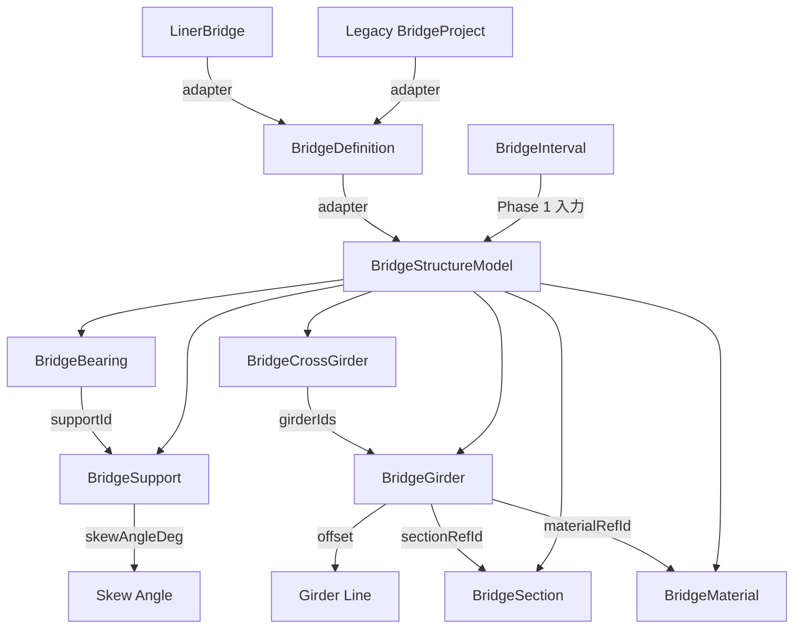
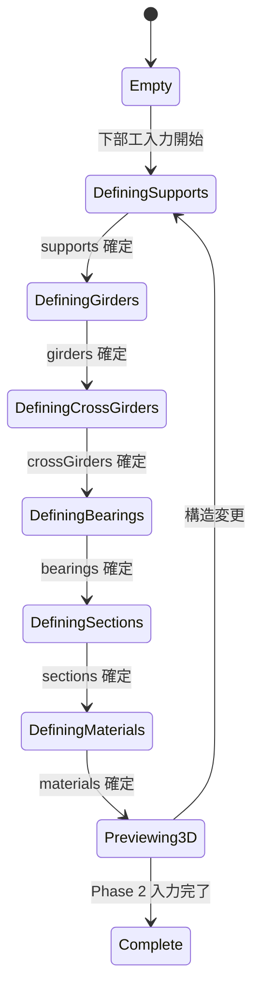

# 03 — Phase 2: Bridge Structure

Date: 2026-07-14  
Status: 設計文書（監督決定に基づく）  
Authority: `_supervisor_decisions.md` — ADR-BMV2-003, 004, 014  
Scope constraint: 測点下部工・斜角・桁線・横桁・支承・断面材料。FEM詳細は対象外  
Reference: 型・ID パターンは [14_implementation_contract_catalog.md](14_implementation_contract_catalog.md) を正とする

---

## 1. 目的

Phase 2 は `BridgeStructureModel` を構築する。Phase 1 の interval 上に、下部工（supports）、ガーダー（girders）、横桁（cross girders）、支承（bearings）、断面（sections）、材料（materials）を定義する。Legacy BridgeDefinition より富かな構造モデルを提供し、Phase 3 の FEM 生成への入力となる。

## 2. 対象範囲

| 対象 | 説明 |
| --- | --- |
| Supports (A1/P/A2 stations) | 下部工の配置。斜角対応 |
| Skew angle | 斜角の入力 |
| Girder lines | ガーダー線・オフセット |
| Cross girders | 横桁の配置 |
| Bearings | 支承の種別・配置 |
| Sections / Materials | 断面・材料の定義 |
| 3D structure preview | 構造の 3D プレビュー |

## 3. 対象外

| 対象外 | 根拠 |
| --- | --- |
| Full FEM mesh | Phase 3 |
| Traffic load zones | Phase 4 |
| Formal DXF | Phase 5 |
| Moving load engine | Phase 4 のみ |

## 4. 現行実装（証拠パス）

| 項目 | 状態 | 証拠パス |
| --- | --- | --- |
| Legacy: Span 定義 | **CONFIRMED** | `frontend/src/bridge/types.ts:10-14` — `Span { index, length, offset }` |
| Legacy: CrossSection | **CONFIRMED** | `frontend/src/bridge/types.ts:2-8` — lane_count, lane_width 等 |
| Legacy: Supports 入力 | **PARTIAL** | `frontend/src/bridge/steps/Step2SpanSetting.tsx` — span のみ。support 種別・斜角なし |
| Legacy: Girder 定義 | **ABSENT** | Legacy には明示的 girder 定義なし。y_positions で自動計算 (`backend/engine/bridge_fem_generator.py:35`) |
| Legacy: Cross girder | **ABSENT** | 証拠なし |
| Legacy: Bearings | **ABSENT** | 証拠なし |
| BridgeDefinition: Support | **CONFIRMED** | `frontend/src/bridgeDefinition/types.ts:79-87` — kind, substructureKind, skewAngleDeg |
| BridgeDefinition: Girder | **CONFIRMED** | `frontend/src/bridgeDefinition/types.ts:103-112` — role, offset, spanIds |
| BridgeDefinition: CrossBeam | **CONFIRMED** | `frontend/src/bridgeDefinition/types.ts:114-119` — station, girderIds |
| BridgeDefinition: Bearing | **CONFIRMED** | `frontend/src/bridgeDefinition/types.ts:121-125` — supportId, type |
| BridgeDefinition: Superstructure | **CONFIRMED** | `frontend/src/bridgeDefinition/types.ts:96-101` — kind, params |
| BridgeDefinition → StructuralModel | **CONFIRMED** | `frontend/src/bridgeDefinition/generator/structuralModelGenerator.ts` |
| BridgeProject → BridgeDefinition adapter | **CONFIRMED** | `frontend/src/bridgeDefinition/adapters/fromBridgeProject.ts:82` |
| LinerBridge → BridgeDefinition adapter | **CONFIRMED** | `frontend/src/bridgeDefinition/adapters/fromLinerBridge.ts:87` |

## 5. 再利用資産

| 資産 | 再利用方法 | 根拠 |
| --- | --- | --- |
| `BridgeDefinition` 型群 | Phase 2 の型設計の参考 | `frontend/src/bridgeDefinition/types.ts:79-132` |
| `BridgeDefinitionSupport` | Support 構造の参考 | `frontend/src/bridgeDefinition/types.ts:79-87` |
| `BridgeDefinitionGirder` | Girder 構造の参考 | `frontend/src/bridgeDefinition/types.ts:103-112` |
| `BridgeDefinitionCrossBeam` | CrossBeam 構造の参考 | `frontend/src/bridgeDefinition/types.ts:114-119` |
| `BridgeDefinitionBearing` | Bearing 構造の参考 | `frontend/src/bridgeDefinition/types.ts:121-125` |
| `BridgeThreeViewer` | 3D preview の基盤 | `frontend/src/bridge/viewer/BridgeThreeViewer.tsx` |
| BridgeDefinition adapter パターン | Legacy/LINER からの import | `frontend/src/bridgeDefinition/adapters/` |

## 6. 新規責務

| 新規型/モジュール | 責務 |
| --- | --- |
| `BridgeStructureModel` | supports, girders, crossGirders, bearings, sections, materials |
| `BridgeSupport` | 下部工。station, kind, skewAngleDeg, substructureKind |
| `BridgeGirder` | ガーダー線。role, offset, spanIds, sectionRefId |
| `BridgeCrossGirder` | 横桁。station, girderIds |
| `BridgeBearing` | 支承。supportId, type |
| `BridgeSection` | 断面定義。shape, dimensions |
| `BridgeMaterial` | 材料定義。kind, properties |
| Skew angle editor | 斜角入力 UI |
| Girder line editor | ガーダー線の配置 UI |
| Structure 3D preview | BridgeStructureModel の 3D 表示 |

## 7. データモデル

### BridgeStructureModel

```typescript
type BridgeStructureModel = {
  supports: BridgeSupport[];
  girders: BridgeGirder[];
  crossGirders: BridgeCrossGirder[];
  bearings: BridgeBearing[];
  sections: BridgeSection[];
  materials: BridgeMaterial[];
};
```

### BridgeSupport

```typescript
type BridgeSupport = {
  id: string;                  // deterministic stable ID: "sup:A1", "sup:P1", "sup:A2"
  station: number;
  kind: "fixed" | "pinned" | "roller" | "custom";
  substructureKind: "abutment" | "pier" | "virtual_pier";
  skewAngleDeg: number;        // 斜角
  transversePosition?: "centre" | "edge" | number;
};
```

### BridgeGirder

```typescript
type BridgeGirder = {
  id: string;                  // deterministic stable ID: "gir:G1", "gir:G2"
  label: string;
  role: "main" | "edge" | "barrier" | "custom";
  offset: number;              // alignment centre からの横断方向オフセット (m)
  spanIds: string[];
  offsetControlPoints: { stationM: number; offsetM: number }[];  // piecewise-linear 制御点（最低2点）
  sectionRefId?: string;
  materialRefId?: string;
};
```

### BridgeCrossGirder

```typescript
type BridgeCrossGirder = {
  id: string;                  // deterministic stable ID: "xgir:1"
  station: number;
  girderIds: string[];
  sectionRefId?: string;
};
```

### BridgeBearing

```typescript
type BridgeBearing = {
  id: string;                  // deterministic stable ID: "brg:A1-1"
  supportId: string;
  type: "elastomeric" | "pot" | "fixed" | "custom";
};
```

### BridgeSection

```typescript
type BridgeSection = {
  id: string;
  name: string;
  shape: "I" | "box" | "T" | "composite" | "custom";
  dimensions: Record<string, number>;  // shape に応じた寸法
};
```

### BridgeMaterial

```typescript
type BridgeMaterial = {
  id: string;
  name: string;
  kind: "steel" | "concrete" | "prestressed_concrete" | "composite";
  properties: Record<string, number>;  // E, fy, fc 等
};
```

## 8. 型の概念図（Mermaid）



## 9. 状態遷移



## 10. UI 構成

| コンポーネント | 責務 |
| --- | --- |
| `SupportEditor` | 下部工の一覧・追加・編集・削除 |
| `SkewAngleInput` | 斜角の入力 |
| `GirderLineEditor` | ガーダー線の配置・オフセット入力 |
| `CrossGirderEditor` | 横桁の配置 |
| `BearingEditor` | 支承の種別選択・配置 |
| `SectionEditor` | 断面定義 |
| `MaterialEditor` | 材料定義 |
| `Structure3DPreview` | BridgeStructureModel の 3D 表示 |
| `Phase2Panel` | 上記コンポーネントの統合パネル |

## 11. Application Use Case

```
UC-P2-01: Supports 定義
  Actor: ユーザー
  Precondition: BridgeInterval が定義済み
  Main Flow:
    1. SupportEditor で下部工を追加
    2. station, kind, skewAngleDeg を入力
    3. BridgeSupport が生成される
  Postcondition: BridgeStructureModel.supports に追加される

UC-P2-02: Girder Line 定義
  Actor: ユーザー
  Precondition: Supports が定義済み
  Main Flow:
    1. GirderLineEditor でガーダー線を追加
    2. role, offset, spanIds を入力
    3. BridgeGirder が生成される
  Postcondition: BridgeStructureModel.girders に追加される

UC-P2-03: Structure 3D Preview
  Actor: ユーザー
  Precondition: BridgeStructureModel が部分的に定義済み
  Main Flow:
    1. Structure3DPreview で構造を確認
    2. 必要に応じて編集に戻る
  Postcondition: 構造が視覚的に確認できる
```

## 12. Adapter 境界

```
Legacy Path:
  BridgeProject (0.1.0) ──adapter──→ BridgeDefinition (1.0.0) ──adapter──→ BridgeStructureModel
  - fromBridgeProject.ts:82
  - fromLinerBridge.ts:87

LINER Path:
  LinerBridge ──adapter──→ BridgeDefinition (1.0.0) ──adapter──→ BridgeStructureModel

V2 Native Path:
  BridgeStructureModel (direct authoring)
  - Phase 2 の UI から直接入力
```

## 13. API

Phase 2 では Frontend のみ。Backend API は追加しない。

| 操作 | 実現方法 |
| --- | --- |
| Structure 入力 | Frontend state で管理 |
| 3D preview | Three.js で Frontend 描画 |
| Legacy import | BridgeDefinition adapter を使用 |

## 14. 永続化

| 項目 | 方法 | 根拠 |
| --- | --- | --- |
| BridgeStructureModel | BridgeModelerV2Document 内に保存 | ADR-BMV2-008 |
| Autosave | App project の autosave パターン | ADR-BMV2-008 |

## 15. Validation

| バリデーション | 条件 | エラーコード |
| --- | --- | --- |
| Supports 最低数 | supports.length >= 2 | `BMV2_P2_MIN_SUPPORTS` |
| Station 重複 | 同一 station に複数 supports | `BMV2_P2_DUPLICATE_SUPPORT_STATION` |
| Girder span 参照 | spanIds が BridgeInterval 内 | `BMV2_P2_INVALID_GIRDER_SPAN` |
| Bearing support 参照 | supportId が存在する supports | `BMV2_P2_INVALID_BEARING_SUPPORT` |
| Section reference | sectionRefId が存在する sections | `BMV2_P2_INVALID_SECTION_REF` |
| Material reference | materialRefId が存在する materials | `BMV2_P2_INVALID_MATERIAL_REF` |

## 16. Diagnostics

```typescript
type Phase2Diagnostic = {
  severity: "info" | "warning" | "error";
  code: string;        // prefix: "BMV2_P2_"
  message: string;
  path?: string;
  entityIds?: string[];
};
```

- Fatal errors: supports 不足（`BMV2_P2_MIN_SUPPORTS`）
- Warnings: 斜角の妥当性、girder offset の範囲外

## 17. エラー処理

| エラー | 処理 |
| --- | --- |
| Supports 不足 | エラーメッセージ表示、Phase 1 に戻る |
| Reference が存在しない | 該当フィールドを null にし warning 表示 |
| 3D preview 描画失敗 | プレビュー非表示、他 UI は動作継続 |

## 18. Stable ID

ADR-BMV2-004 に従い、セマンティックキーから ID を生成する。

| エンティティ | ID パターン | 例 |
| --- | --- | --- |
| Support | `sup:{label}` | `sup:A1`, `sup:P1`, `sup:A2` |
| Girder | `gir:{label}` | `gir:G1`, `gir:G2` |
| CrossGirder | `xgir:{leftGirId}:{rightGirId}:{stationMm}` | `xgir:G1:G2:020000` |
| Bearing | `brg:{supportId}-{index}` | `brg:A1-1`, `brg:P1-1` |
| Section | `sec:{name}` | `sec:I300x500` |
| Material | `mat:{name}` | `mat:STEEL-S355` |

## 19. Revision

Phase 2 の state 変更は `sourceRevision` に影響しない。Phase 1 の `sourceRevision` は LINER alignment のみに依存。

## 20. Undo/Redo

ADR-BMV2-012 に従い、command stack を実装する。section-editor パターンを参考にする。

| 操作 | Undo 可否 | 方法 |
| --- | --- | --- |
| Support 追加/削除/編集 | Yes | command stack |
| Girder 追加/削除/編集 | Yes | command stack |
| CrossGirder 追加/削除/編集 | Yes | command stack |
| Bearing 追加/削除/編集 | Yes | command stack |
| Section/Material 追加/削除/編集 | Yes | command stack |

## 21. テスト方針

| テスト種別 | 内容 |
| --- | --- |
| Unit | 各型の生成、stable ID 生成、validation |
| Integration | BridgeDefinition adapter からの変換 |
| Visual | 3D preview の表示確認 |

### テスト証拠

- `frontend/src/bridgeDefinition/adapters/fromBridgeProject.test.ts` — adapter パターン参考
- `frontend/src/bridgeDefinition/adapters/fromLinerBridge.test.ts` — adapter パターン参考
- `frontend/src/bridgeDefinition/generator/structuralModelGenerator.test.ts` — generator パターン参考

## 22. 完了条件

1. `BridgeStructureModel` が supports, girders, crossGirders, bearings, sections, materials を保持できる
2. 各エンティティに Deterministic stable ID が割り当てられる
3.斜角（skewAngleDeg）が入力できる
4. 3D preview で構造を確認できる
5. BridgeDefinition adapter からの import が動作する
6. Legacy BridgeWizard が変更されない

## 23. 後続 Phase 引渡し

| 引渡し物 | 受取先 | 内容 |
| --- | --- | --- |
| `BridgeStructureModel` | Phase 3 | FEM 生成の入力 |
| `BridgeStructureModel` | Phase 5 | 描図の入力 |
| `BridgeSection[]`, `BridgeMaterial[]` | Phase 3 | 断面・材料の FEM マッピング |
| `BridgeSupport[]` | Phase 3 | supports の FEM マッピング |

## 24. 未決事項

| ID | 内容 | 影響 | Status |
| --- | --- | --- | --- |
| OD-01 | Exact host project JSON key | 永続化方法 | **RESOLVED** → [13 §OD-01](13_open_decisions_resolution.md#od-01--adr-bmv2-015) |
| OD-03 | Girder "follow widening" の MVP1 方式 | ガーダー配置アルゴリズム | **RESOLVED** → [13 §OD-03](13_open_decisions_resolution.md#od-03--adr-bmv2-017) |
