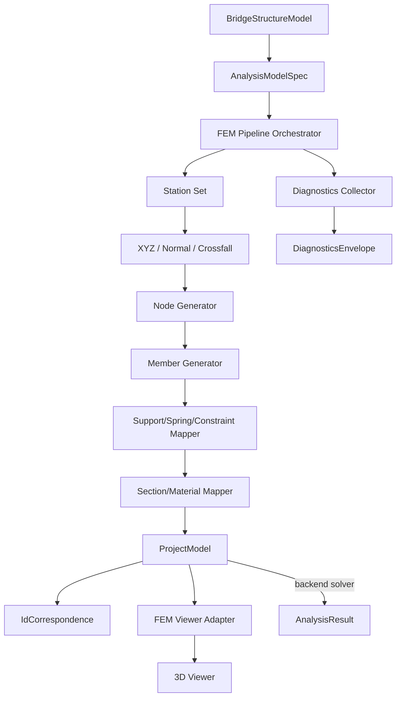

# 04 — Phase 3: FEM Generation

Date: 2026-07-14  
Status: 設計文書（監督決定に基づく）  
Authority: `_supervisor_decisions.md` — ADR-BMV2-004, 007, 013  
Scope constraint: 段階的 FEM パイプライン・診断一覧・IdCorrespondence・ProjectModel・Viewer 接続  
Reference: 型・ID パターン・FEM 15段階は [14_implementation_contract_catalog.md](14_implementation_contract_catalog.md) を正とする

---

## 1. 目的

Phase 3 は段階的 FEM パイプラインを実装する。`BridgeStructureModel` から stations → XYZ/normal/crossfall → nodes → longitudinal members → cross members → bearings/springs/constraints → section/material 割り当て → `ProjectModel` + `IdCorrespondence` + `Diagnostics[]` を生成する。一括生成ではなく、各ステップで診断情報を持つ（ADR-BMV2-007）。

## 2. 対象範囲

| 対象 | 説明 |
| --- | --- |
| Station set | BridgeInterval からの station 生成 |
| XYZ / normal / crossfall 評価 | LINER alignment からの 3D 座標評価 |
| Node generation | Deterministic stable ID での node 生成 |
| Longitudinal members | ガーダーに沿った縦方向メンバー |
| Cross members | 横桁・横断方向メンバー |
| Bearings / springs / constraints | 支承条件の FEM マッピング |
| Section / material assignment | 断面・材料の FEM 割り当て |
| ProjectModel 生成 | 既存型の FEM 出力 |
| IdCorrespondence | V2 ID → ProjectModel ID 対応表 |
| Diagnostics | 各ステップの診断情報 |
| Viewer hookup | 生成結果の 3D 表示 |
| Solve (optional) | 既存 solver での解析実行 |

## 3. 対象外

| 対象外 | 根拠 |
| --- | --- |
| Moving load engine | Phase 4 |
| Formal drawings | Phase 5 |
| Full report PDF | Phase 5 以降 |

## 4. 現行実装（証拠パス）

| 項目 | 状態 | 証拠パス |
| --- | --- | --- |
| Legacy FEM 生成 | **CONFIRMED** | `backend/engine/bridge_fem_generator.py:136` — `generate_fem_model` |
| z=0 フラットグリッド | **CONFIRMED** | `backend/engine/bridge_fem_generator.py:167` — `"z": 0.0` |
| インデックスベース ID | **CONFIRMED** | `backend/engine/bridge_fem_generator.py:162` — `nid = f"N{counter}"` |
| `POST /api/fem/generate` | **CONFIRMED** | `backend/app/main.py:1017` |
| BridgeProject → FEM 直結 | **CONFIRMED** | `backend/app/main.py:1043` — `generate_fem_model(project)` |
| `BridgeFemResponse.diagnostics` | **CONFIRMED** | `frontend/src/bridge/types.ts:85-90` — 型のみ、実質的なステージングなし |
| BridgeDefinition → StructuralModel | **CONFIRMED** | `frontend/src/bridgeDefinition/generator/structuralModelGenerator.ts` |
| BridgeThreeViewer | **CONFIRMED** | `frontend/src/bridge/viewer/BridgeThreeViewer.tsx` |
| Viewer3D (App) | **CONFIRMED** | `frontend/src/viewer/Viewer3D.tsx` |
| LINER ViewerAdapter | **CONFIRMED** | `frontend/src/liner/adapters/linerViewerAdapter.ts` |
| Bridge Viewer endpoint | **CONFIRMED** | `backend/app/main.py:1065` — `GET /api/viewer/bridge/{bridge_id}` |
| Staged pipeline | **ABSENT** | 一括 `generate_fem_model` のみ。ステージングなし |
| IdCorrespondence | **ABSENT** | V2 ID → ProjectModel ID 対応表なし |
| Diagnostics envelope | **PARTIAL** | `BridgeFemResponse.diagnostics` 型のみ。実質的なステージング診断なし |

## 5. 再利用資産

| 資産 | 再利用方法 | 根拠 |
| --- | --- | --- |
| `ProjectModel` | FEM 出力型として再利用 | `frontend/src/types.ts:1-40` |
| `NodeItem`, `Member` | FEM node/member 型として再利用 | `frontend/src/types.ts` |
| Backend solver | `POST /api/fem/generate` での解析実行 | `backend/app/main.py:1017` |
| `structuralModelGenerator` | BridgeDefinition → ProjectModel 変換の参考 | `frontend/src/bridgeDefinition/generator/structuralModelGenerator.ts` |
| BridgeThreeViewer | 3D 表示の基盤 | `frontend/src/bridge/viewer/BridgeThreeViewer.tsx` |
| LINER ViewerAdapter | Viewer adapter パターン | `frontend/src/liner/adapters/linerViewerAdapter.ts` |
| `sourceRevisionFor` | revision tracking | `frontend/src/liner/core/pipeline/sourceRevision.ts:18` |

## 6. 新規責務

| 新規型/モジュール | 責務 |
| --- | --- |
| `AnalysisModelSpec` | FEM 生成の入力仕様 |
| `IdCorrespondence` | V2 ID → ProjectModel ID 対応 |
| FEM pipeline orchestrator | 段階的 FEM 生成のオーケストレーション |
| Node generator | Deterministic stable ID での node 生成 |
| Member generator | 縦・横方向メンバーの生成 |
| Support/spring/constraint mapper | 支承条件の FEM マッピング |
| Section/material mapper | 断面・材料の FEM 割り当て |
| Diagnostics collector | 各ステップの診断情報収集 |
| FEM Viewer adapter | ProjectModel → 3D 表示アダプタ |

## 7. データモデル

### AnalysisModelSpec

```typescript
type AnalysisModelSpec = {
  stationSet: number[];           // BridgeInterval から生成
  includeDeadLoad: boolean;
  includeLiveLoad: boolean;
  meshDensity: "coarse" | "standard" | "fine";
};
```

### IdCorrespondence

```typescript
type IdCorrespondence = {
  v2Id: string;                   // V2 の deterministic stable ID
  projectModelId: string;         // ProjectModel の ID
  kind: "node" | "member" | "support";
};
```

### GeneratedFemOutput

```typescript
type GeneratedFemOutput = {
  projectModel: ProjectModel;           // 既存型を再利用
  idCorrespondence: IdCorrespondence[]; // V2 ID → ProjectModel ID
  diagnostics: DiagnosticsEnvelope[];
  pipelineSteps: PipelineStepStatus[];
};
```

### PipelineStepStatus

```typescript
type PipelineStepStatus = {
  step: string;                   // "station_set" | "xyz_eval" | "nodes" | "members" | ...
  status: "pending" | "running" | "completed" | "failed";
  diagnostics: DiagnosticsEnvelope[];
};
```

## 8. 型の概念図（Mermaid）



## 9. FEM Pipeline 15段階

14 §8 と同一。順序は以下。各 stage に in/out/pure?/fail/blocking/warning を記載。

| Stage | Name | In | Out | Pure? | Fail | Blocking Diag | Warning Diag |
| --- | --- | --- | --- | --- | --- | --- | --- |
| 1 | Input validation | user inputs | validated spec | Yes | invalid input | BMV2_P3_INVALID_INPUT | — |
| 2 | GenerationStationSet collect | intervals + alignment | number[] | Yes | empty station set | BMV2_P3_EMPTY_STATION_SET | — |
| 3 | Station duplicate merge | stationSet | merged number[] | Yes | — | — | BMV2_P3_STATION_DUP_MERGED |
| 4 | LINER XYZ eval | stationSet + alignment | Vec3[] | Yes | eval failed | BMV2_P3_XYZ_EVAL_FAILED | BMV2_P3_STATION_OUT_OF_RANGE |
| 5 | SupportLine×Girder intersection | supports + girders + alignment | intersection points | Yes | no intersection | BMV2_P3_NO_INTERSECTION | — |
| 6 | Girder node gen | intersections + stationSet | NodeItem[] | Yes | insufficient nodes | BMV2_P3_INSUFFICIENT_NODES | — |
| 7 | Longitudinal member gen | nodes + girders | Member[] | Yes | insufficient members | BMV2_P3_INSUFFICIENT_MEMBERS | — |
| 8 | Cross girder gen | nodes + crossGirders | Member[] | Yes | — | — | — |
| 9 | Bearing node gen | supports + bearings | BearingNodeItem[] | Yes | support not mapped | BMV2_P3_SUPPORT_NOT_MAPPED | — |
| 10 | Spring/constraint gen | bearings + nodes | SpringItem[] + ConstraintItem[] | Yes | — | — | — |
| 11 | Section/material assign | members + sections + materials | Member[] (section/material attached) | Yes | missing section or material | BMV2_P3_MISSING_SECTION | BMV2_P3_MISSING_MATERIAL |
| 12 | Local axis gen | nodes + members | LocalAxis[] | Yes | — | — | — |
| 13 | ProjectModel convert | all above | ProjectModel | Yes | emit failed | BMV2_P3_EMIT_FAILED | — |
| 14 | Diagnostics collect | all stage diags | DiagnosticsEnvelope[] | Yes | — | — | — |
| 15 | IdCorrespondence emit | V2 IDs + ProjectModel IDs | IdCorrespondence[] | Yes | — | — | — |

### Full Regeneration (OD-04)

Full structure regeneration を採用する（[13 §OD-04](13_open_decisions_resolution.md#od-04--adr-bmv2-018)）。入力変更時は全段階を再実行する。

Dirty dependency 表（[13 §3](13_open_decisions_resolution.md#3-dirty-dependency-表od-04-由来)）に従い、変更対象が正しく無効化されることを確認する。

## 10. UI 構成

| コンポーネント | 責務 |
| --- | --- |
| `FemPipelinePanel` | 段階的パイプラインの進行状況表示 |
| `PipelineStepIndicator` | 各ステップの状態表示 |
| `DiagnosticsList` | 診断情報の一覧表示 |
| `FemViewerPanel` | ProjectModel の 3D 表示 |
| `IdCorrespondenceTable` | V2 ID → ProjectModel ID の対応表 |
| `Phase3Panel` | 上記コンポーネントの統合パネル |

## 11. Application Use Case

```
UC-P3-01: FEM Generation (段階的)
  Actor: ユーザー
  Precondition: BridgeStructureModel が定義済み
  Main Flow:
    1. ユーザーが FEM Generation を開始
    2. Station Set が生成される
    3. XYZ / normal / crossfall が評価される
    4. Nodes が生成される
    5. Members が生成される
    6. Supports / springs / constraints がマッピングされる
    7. Section / material が割り当てられる
    8. ProjectModel が発行される
    9. IdCorrespondence が生成される
    10. Diagnostics が収集される
  Postcondition: GeneratedFemOutput が state に保存される

UC-P3-02: Diagnostics 確認
  Actor: ユーザー
  Precondition: FEM Generation が完了または失敗
  Main Flow:
    1. DiagnosticsList で診断情報を確認
    2. Warnings の確認
    3. Errors の修正
  Postcondition: 診断情報が確認される

UC-P3-03: Viewer での結果確認
  Actor: ユーザー
  Precondition: ProjectModel が生成済み
  Main Flow:
    1. FemViewerPanel で 3D 表示
    2. nodes, members, supports を確認
  Postcondition: FEM 結果が視覚的に確認される
```

## 12. Adapter 境界

```
BridgeStructureModel ──FEM pipeline──→ ProjectModel
  - Station set → XYZ → Nodes → Members → Supports → Sections → ProjectModel
  - 各ステップで Diagnostics を収集

ProjectModel ──adapter──→ 3D Viewer
  - FEM Viewer adapter で変換

ProjectModel ──adapter──→ Backend Solver
  - 生成済み ProjectModel を `/api/analysis/run` に送信（V2 経路で `/api/fem/generate` は使用禁止）
```

## 13. API

Phase 3 では既存 Backend solver を使用する。V2 専用 API は追加しない。

| 操作 | 実現方法 |
| --- | --- |
| FEM generation | Frontend で段階的パイプライン実行 |
| Analysis run | 生成済み ProjectModel を `POST /api/analysis/run` に送信（`/api/fem/generate` は V2 経路で使用禁止） |
| 3D viewer | Frontend Three.js で描画 |

## 14. 永続化

| 項目 | 方法 | 根拠 |
| --- | --- | --- |
| GeneratedFemOutput | BridgeModelerV2Document 内に保存 | ADR-BMV2-008 |
| ProjectModel | 既存 FEM パスで保存 | ADR-BMV2-003 |

## 15. Validation

| バリデーション | 条件 | エラーコード |
| --- | --- | --- |
| Station set 空でない | stationSet.length > 0 | `BMV2_P3_EMPTY_STATION_SET` |
| XYZ 評価成功 | 全 stations で XYZ が計算できる | `BMV2_P3_XYZ_EVAL_FAILED` |
| Node 最低数 | nodes.length >= 4 | `BMV2_P3_INSUFFICIENT_NODES` |
| Member 最低数 | members.length >= 1 | `BMV2_P3_INSUFFICIENT_MEMBERS` |
| Section reference | 全 members に section が割り当てられる | `BMV2_P3_MISSING_SECTION` |
| Material reference | 全 members に material が割り当てられる | `BMV2_P3_MISSING_MATERIAL` |
| Support mapping | 全 supports が FEM node にマッピングされる | `BMV2_P3_SUPPORT_NOT_MAPPED` |

## 16. Diagnostics

```typescript
type DiagnosticsEnvelope = {
  severity: "info" | "warning" | "error";
  code: string;        // prefix: "BMV2_P3_"
  message: string;
  path?: string;
  entityIds?: string[];
};
```

- Fatal errors: FEM emit を block（`BMV2_P3_*` の error）
- Warnings: emit 許可 + banner 表示

## 17. エラー処理

| エラー | 処理 |
| --- | --- |
| Station set 生成失敗 | エラーメッセージ表示、Phase 2 に戻る |
| XYZ 評価失敗 | 該当 station をスキップ、warning 診断 |
| Node 生成失敗 | エラーメッセージ表示、パイプライン中断 |
| Backend solver 失敗 | エラーメッセージ表示、ProjectModel 発行を延期 |

## 18. Stable ID

ADR-BMV2-004 に従い、セマンティックキーから ID を生成する。

| エンティティ | ID パターン | 例 |
| --- | --- | --- |
| Node | `node:{stationMm}:{offsetMm}:{role}` | `node:012500:0000:girder` |
| Member | `mem:{kind}:{startNodeId}:{endNodeId}` | `mem:long:node012500:0000:girder:node012500:0300:girder` |
| Spring | `spr:{bearingId}` | `spr:A1-1` |
| Constraint | `cstr:{kind}:{nodeId}` | `cstr:fixed:node010000:0000:girder` |
| Support | `sup:{label}` | `sup:A1` (Phase 2 から継続) |

- Legacy との違い: `backend/engine/bridge_fem_generator.py:162` — `nid = f"N{counter}"`
- V2: セマンティックキーで再生成時に ID を保持

## 19. Revision

- `sourceRevision` は Phase 1 から引き継ぎ
- FEM pipeline の実行は `sourceRevision` に依存しない
- `sourceRevision` 変化時は stale detection でユーザーに通知

## 20. Undo/Redo

ADR-BMV2-012 に従い、FEM `ProjectModel` の再生成は undo の対象外。undo は structure inputs を revert し、analysis を dirty-flag する。

| 操作 | Undo 可否 | 方法 |
| --- | --- | --- |
| Structure inputs 変更 | Yes | command stack |
| FEM generation | No | dirty flag で再生成要求 |

## 21. テスト方針

| テスト種別 | 内容 |
| --- | --- |
| Unit | 各 pipeline step の生成ロジック |
| Integration | BridgeStructureModel → ProjectModel 変換 |
| Golden | Deterministic stable ID の一致検証 |
| Diagnostics | 診断情報の正確性 |

### テスト証拠

- `frontend/src/bridgeDefinition/generator/structuralModelGenerator.test.ts` — generator パターン参考
- `backend/tests/test_bridge_fem_generator.py` — FEM generation パターン参考
- `frontend/src/bridgeDefinition/__golden__/` — golden test パターン参考

## 22. 完了条件

1. 段階的 FEM パイプラインが各ステップで実行される
2. `ProjectModel` が Deterministic stable ID で生成される
3. `IdCorrespondence` が V2 ID → ProjectModel ID を保持する
4. `DiagnosticsEnvelope` が各ステップの診断情報を収集する
5. Fatal errors が FEM emit を block する
6. Viewer で ProjectModel が 3D 表示される
7. 既存 solver が動作する

## 23. 後続 Phase 引渡し

| 引渡し物 | 受取先 | 内容 |
| --- | --- | --- |
| `ProjectModel` | Phase 4 | load mapping の FEM target |
| `IdCorrespondence` | Phase 4, 5 | V2 ID → FEM ID 対応 |
| `DiagnosticsEnvelope[]` | Phase 5 | 描図での表示 |
| FEM pipeline steps | Phase 4 | load 分配の基盤 |

## 24. 未決事項

| ID | 内容 | 影響 | Status |
| --- | --- | --- | --- |
| OD-04 | Partial regeneration granularity (span-local vs full structure) | 再生成の粒度 | **RESOLVED** → [13 §OD-04](13_open_decisions_resolution.md#od-04--adr-bmv2-018)（full structure regen 採用） |
