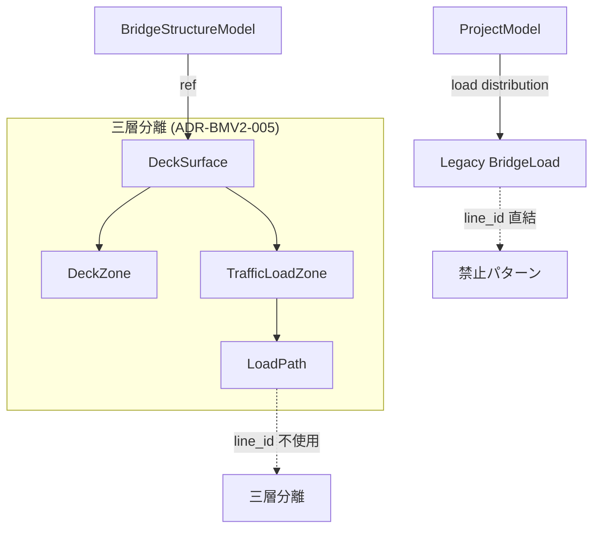
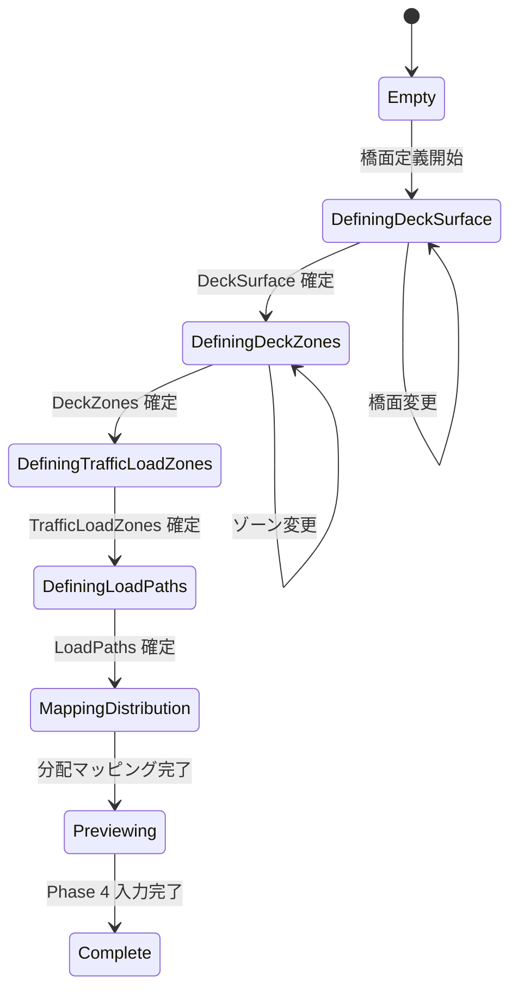

# 05 — Phase 4: Load Surface

Date: 2026-07-14  
Status: 設計文書（監督決定に基づく）  
Authority: `_supervisor_decisions.md` — ADR-BMV2-005  
Scope constraint: 橋面/載荷面/FEM三層分離。line_id 直結を禁止する設計  
Reference: 型・ID パターンは [14_implementation_contract_catalog.md](14_implementation_contract_catalog.md) を正とする。DeadLoadSpec は [14 §3.17](14_implementation_contract_catalog.md#317-deadloadspec)、ImpactFactorConfig は [14 §3.18](14_implementation_contract_catalog.md#318-impactfactorconfig) を参照

---

## 1. 目的

Phase 4 は荷重面（load surface）のアーキテクチャを実装する。Legacy の `line_id` ベース荷重を、`DeckSurface` → `TrafficLoadZone` → `LoadPath` の三層分離に置き換える。橋面（deck）、載荷面（load surface）、FEM の三層を明確に分離し、Legacy Step 5 の `line_id` 直結パターンを禁止する（ADR-BMV2-005）。

## 2. 対象範囲

| 対象 | 説明 |
| --- | --- |
| Deck zones | 橋面のゾーン定義 |
| TrafficLoadZone | 載荷面の定義 |
| Load paths | 荷重経路の定義 |
| Dead loads | 自重荷重 |
| Impact factor relocation | 衝撃係数の配置 |
| Distribution mapping | 荷重分配マッピング |

## 3. 対象外

| 対象外 | 根拠 |
| --- | --- |
| Full influence-line product UX | extension hooks のみ |
| Moving load engine | 既存 solver を使用 |
| Drawing/DXF | Phase 5 |

## 4. 現行実装（証拠パス）

| 項目 | 状態 | 証拠パス |
| --- | --- | --- |
| Legacy: BridgeLoad | **CONFIRMED** | `frontend/src/bridge/types.ts:31-39` — `line_id?` で直接参照 |
| Legacy: Step5 LoadSetting | **CONFIRMED** | `frontend/src/bridge/steps/Step5LoadSetting.tsx` — line_id ベース |
| Legacy: line_id 直結 | **CONFIRMED** | `frontend/src/bridge/types.ts:37` — `line_id?: string` |
| BridgeDefinition: Load | **CONFIRMED** | `frontend/src/bridgeDefinition/types.ts:140-148` — `target: { kind, refId }` |
| BridgeDefinition: LoadTarget | **CONFIRMED** | `frontend/src/bridgeDefinition/types.ts:134-138` — `girder`, `deck`, `node`, `line` |
| BridgeDefinition: Deck | **CONFIRMED** | `frontend/src/bridgeDefinition/types.ts:127-132` — `width`, `thickness`, `kind` |
| BridgeLine (Legacy) | **CONFIRMED** | `frontend/src/bridge/types.ts:24-29` — traffic/load/reference |
| DeckSurface | **ABSENT** | 新規作成対象 |
| TrafficLoadZone | **ABSENT** | 新規作成対象 |
| LoadPath | **ABSENT** | 新規作成対象 |
| Distribution mapping | **ABSENT** | 新規作成対象 |
| line_id 直結の禁止設計 | **ABSENT** | 新規作成対象 |

## 5. 再利用資産

| 資産 | 再利用方法 | 根拠 |
| --- | --- | --- |
| `BridgeDefinitionLoad` | Load 構造の参考 | `frontend/src/bridgeDefinition/types.ts:140-148` |
| `BridgeDefinitionLoadTarget` | Load target 構造の参考 | `frontend/src/bridgeDefinition/types.ts:134-138` |
| `BridgeDefinitionDeck` | Deck 構造の参考 | `frontend/src/bridgeDefinition/types.ts:127-132` |
| `BridgeLoad` (Legacy) | 何を避けるべきかの参考 | `frontend/src/bridge/types.ts:31-39` |
| Backend solver | 荷重適用の実行 | `backend/engine/bridge_fem_generator.py` |

## 6. 新規責務

| 新規型/モジュール | 責務 |
| --- | --- |
| `DeckSurface` | 橋面のゾーン定義 |
| `DeckZone` | 橋面内のゾーン |
| `TrafficLoadZone` | 載荷面の定義 |
| `LoadPath` | 荷重経路の定義 |
| `DeadLoadSpec` | 自重荷重（[14 §3.17](14_implementation_contract_catalog.md#317-deadloadspec)） |
| `ImpactFactorConfig` | 衝撃係数（[14 §3.18](14_implementation_contract_catalog.md#318-impactfactorconfig)） |
| Load surface editor UI | 橋面/載荷面の入力 UI |
| Distribution mapper | 荷重分配マッピング |
| Dead load calculator | 自重荷重の計算 |

## 7. データモデル

### DeckSurface

```typescript
type DeckSurface = {
  id: string;                  // deterministic stable ID: "deck:main"
  width: number;               // 橋面幅 (m)
  thickness?: number;          // 橋面板厚 (m)
  kind: "steel_composite" | "rc" | "orthotropic";
  zones: DeckZone[];
};
```

### DeckZone

```typescript
type DeckZone = {
  id: string;                  // deterministic stable ID: "dz:lane1"
  name: string;
  startStationM: number;
  endStationM: number;
  offsetLeft: number;          // alignment からの左側オフセット (m)
  offsetRight: number;         // alignment からの右側オフセット (m)
  laneOrdinal?: number;        // ユーザー付与ラベル。配列 index ではなく一意ラベル
};
```

### TrafficLoadZone

```typescript
type TrafficLoadZone = {
  id: string;                  // deterministic stable ID: "tlz:live-1"
  name: string;
  deckSurfaceRef: string;      // DeckSurface.id
  zoneRefs: string[];          // DeckZone.id[]
  loadType: "lane" | "vehicle" | "pedestrian";
  excludedZoneRefs?: string[]; // 除外ゾーン
  designLoad?: number;         // 設計荷重 (kN/m or kN)
};
```

### LoadPath

```typescript
type LoadPath = {
  id: string;                  // deterministic stable ID: "lp:lane-1"
  name: string;
  trafficLoadZoneRef: string;  // TrafficLoadZone.id
  laneOrdinal: number;         // ユーザー付与ラベル。配列 index ではなく一意ラベル
};
```

### LoadFmeTarget

```typescript
type LoadFmeTarget = {
  kind: "node" | "member" | "support";
  refId: string;
  distributionFactor: number;
};
```

### Phase4State

```typescript
type Phase4State = {
  deckSurface: DeckSurface | null;
  trafficLoadZones: TrafficLoadZone[];
  loadPaths: LoadPath[];
  deadLoadSpecs: DeadLoadSpec[];          // 14 §3.17 参照
  impactFactorConfig: ImpactFactorConfig; // 14 §3.18 参照
};
```

> `DeadLoadSpec` と `ImpactFactorConfig` の定義は [14 §3.17-3.18](14_implementation_contract_catalog.md) に準拠。line_id 直結は禁止。

## 8. 型の概念図（Mermaid）



## 9. 状態遷移



## 10. UI 構成

| コンポーネント | 責務 |
| --- | --- |
| `DeckSurfaceEditor` | 橋面の定義・編集 |
| `DeckZoneEditor` | ゾーンの追加・編集・削除 |
| `TrafficLoadZoneEditor` | 載荷面の定義 |
| `LoadPathEditor` | 荷重経路の定義 |
| `DistributionMapper` | 分配マッピング UI |
| `LoadPreview` | 荷重配置のプレビュー |
| `Phase4Panel` | 上記コンポーネントの統合パネル |

## 11. Application Use Case

```
UC-P4-01: Deck Surface 定義
  Actor: ユーザー
  Precondition: BridgeStructureModel が定義済み
  Main Flow:
    1. DeckSurfaceEditor で橋面を定義
    2. width, thickness, kind を入力
    3. DeckZone を追加
  Postcondition: DeckSurface が state に保存される

UC-P4-02: Traffic Load Zone 定義
  Actor: ユーザー
  Precondition: DeckSurface が定義済み
  Main Flow:
    1. TrafficLoadZoneEditor で載荷面を定義
    2. deckSurfaceRef, zoneRefs, loadType を入力
  Postcondition: TrafficLoadZone が state に保存される

UC-P4-03: Load Path 定義
  Actor: ユーザー
  Precondition: TrafficLoadZone が定義済み
  Main Flow:
    1. LoadPathEditor で荷重経路を定義
    2. distributionMethod, fmeTargets を入力
  Postcondition: LoadPath が state に保存される
```

## 12. Adapter 境界

```
DeckSurface ──adapter──→ FEM Load Application
  - LoadPath から FEM targets への分配

Legacy BridgeLoad ──adapter──→ (禁止)
  - line_id 直結は使用しない
  - BridgeDefinition adapter を経由する場合のみ

TrafficLoadZone ──adapter──→ Backend Solver
  - 既存 solver の荷重入力形式に変換
```

## 13. API

Phase 4 では Frontend のみ。Backend API は追加しない。

| 操作 | 実現方法 |
| --- | --- |
| Deck surface 定義 | Frontend state で管理 |
| Load path 定義 | Frontend state で管理 |
| Distribution mapping | Frontend で計算 |
| FEM load application | 既存 solver を呼び出し |

## 14. 永続化

| 項目 | 方法 | 根拠 |
| --- | --- | --- |
| Phase4State | BridgeModelerV2Document 内に保存 | ADR-BMV2-008 |
| DeckSurface | BridgeModelerV2Document 内に保存 | ADR-BMV2-005 |

## 15. Validation

| バリデーション | 条件 | エラーコード |
| --- | --- | --- |
| Deck surface 幅 | width > 0 | `BMV2_P4_INVALID_DECK_WIDTH` |
| Deck zone 範囲 | startStationM < endStationM | `BMV2_P4_INVALID_ZONE_RANGE` |
| Deck zone offset | offsetLeft < offsetRight | `BMV2_P4_INVALID_ZONE_OFFSET` |
| Traffic load zone refs | deckSurfaceRef が存在する | `BMV2_P4_INVALID_DECK_REF` |
| Load path refs | trafficLoadZoneRef が存在する | `BMV2_P4_INVALID_TLZ_REF` |
| FEM target refs | refId が ProjectModel に存在する | `BMV2_P4_INVALID_FEM_TARGET` |

## 16. Diagnostics

```typescript
type Phase4Diagnostic = {
  severity: "info" | "warning" | "error";
  code: string;        // prefix: "BMV2_P4_"
  message: string;
  path?: string;
  entityIds?: string[];
};
```

- Fatal errors: deck surface 未定義（`BMV2_P4_NO_DECK_SURFACE`）
- Warnings: distribution factor の合計が 1.0 でない

## 17. エラー処理

| エラー | 処理 |
| --- | --- |
| Deck surface 未定義 | エラーメッセージ表示、Phase 3 に戻る |
| FEM target 存在しない | 該当 load path を無効化、warning 診断 |
| Distribution factor 不正 | 自動正規化またはエラー表示 |

## 18. Stable ID

| エンティティ | ID パターン | 例 |
| --- | --- | --- |
| DeckSurface | `deck:{kind}` | `deck:main` |
| DeckZone | `dz:{zoneKind}:{laneOrdinal}` | `dz:lane1` |
| TrafficLoadZone | `tlz:{laneOrdinal}` | `tlz:live-1` |
| LoadPath | `lp:{laneOrdinal}` | `lp:lane-1` |

> 配列 index を seed にしない（[14 §7.2](14_implementation_contract_catalog.md#72-禁止ルール)）。`laneOrdinal` はユーザー付与ラベル。

## 19. Revision

Phase 4 の state 変更は `sourceRevision` に影響しない。荷重定義は LINER alignment に依存しない。

## 20. Undo/Redo

ADR-BMV2-012 に従い、command stack を実装する。

| 操作 | Undo 可否 | 方法 |
| --- | --- | --- |
| Deck surface 追加/削除/編集 | Yes | command stack |
| Deck zone 追加/削除/編集 | Yes | command stack |
| Traffic load zone 追加/削除/編集 | Yes | command stack |
| Load path 追加/削除/編集 | Yes | command stack |
| Distribution mapping 変更 | Yes | command stack |

## 21. テスト方針

| テスト種別 | 内容 |
| --- | --- |
| Unit | 各型の生成、validation、distribution 計算 |
| Integration | DeckSurface → LoadPath → FEM target 変換 |
| Regression | line_id 直結パターンが使用されていないことの検証 |

### テスト証拠

- `frontend/src/bridgeDefinition/semanticParity/__tests__/loadParity.test.ts` — load parity パターン参考
- `frontend/src/bridge/bridgeValidation.test.ts` — validation パターン参考

## 22. 完了条件

1. `DeckSurface` が橋面を定義できる
2. `TrafficLoadZone` が載荷面を定義できる
3. `LoadPath` が荷重経路を定義できる
4. Distribution mapping が FEM targets に分配できる
5. `line_id` 直結が使用されていないことの検証
6. Legacy BridgeWizard が変更されない

## 23. 後続 Phase 引渡し

| 引渡し物 | 受取先 | 内容 |
| --- | --- | --- |
| `Phase4State` | Phase 5 | 描図での荷重表示 |
| `LoadPath[]` | Phase 5 | 荷重マーキング |
| `DeckSurface` | Phase 5 | 橋面描図 |
| FEM load application | Backend solver | 荷重適用 |

## 24. 未決事項

| ID | 内容 | 影響 |
| --- | --- | --- |
| (なし) | Phase 4 の未決事項は監督指示に従い OD のみ | — |
