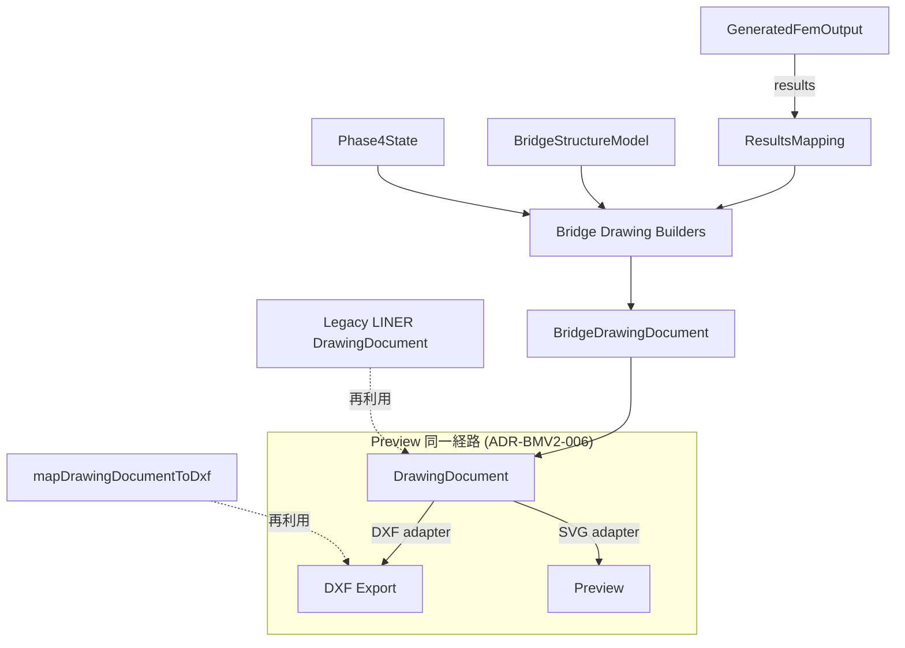
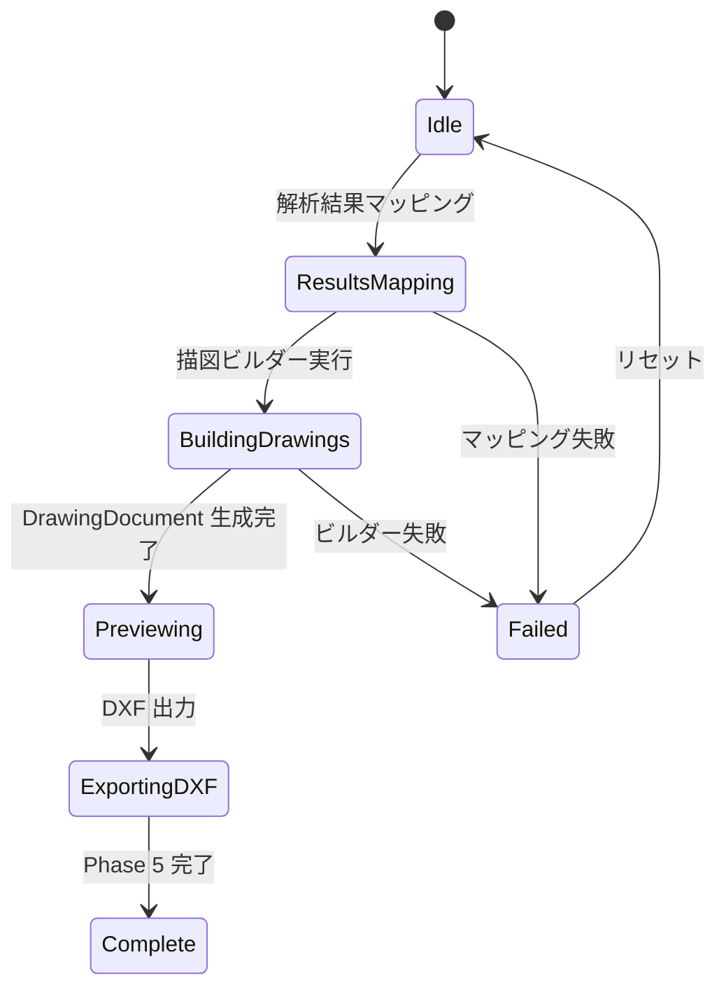

# 06 — Phase 5: Results, Drawing, DXF

Date: 2026-07-14  
Status: 設計文書（監督決定に基づく）  
Authority: `_supervisor_decisions.md` — ADR-BMV2-006  
Scope constraint: Results mapping・DrawingDocument・DXF・preview 同一経路  
Reference: 型・ID パターンは [14_implementation_contract_catalog.md](14_implementation_contract_catalog.md) を正とする

---

## 1. 目的

Phase 5 は解析結果のマッピング、描図 IR（DrawingDocument）の生成、DXF 出力、プレビューを実装する。LINER の `DrawingDocument` を橋梁描図に再利用し（ADR-BMV2-006）、DXF とプレビューが同一の document を共有する。

## 2. 対象範囲

| 対象 | 説明 |
| --- | --- |
| Results mapping | FEM 結果のマッピング |
| FEM grid drawing | FEM グリッドの描図 |
| Support/girder plans | 下部工・ガーダー平面図 |
| Section composition | 断面構成図 |
| Load marking | 荷重マーキング |
| Plan/profile generals | 平面・縦断一般図 |
| DrawingDocument | 描図 IR |
| DXF kinds | DXF 出力種別 |
| Preview parity | プレビューと DXF の一致 |

## 3. 対象外

| 対象外 | 根拠 |
| --- | --- |
| Full report PDF productization | 以降の PR |
| Moving load engine | 既存 solver |

## 4. 現行実装（証拠パス）

| 項目 | 状態 | 証拠パス |
| --- | --- | --- |
| DrawingDocument 型 | **CONFIRMED** | `frontend/src/liner/drawing/model/document.ts:38-43` |
| DrawingSheet | **CONFIRMED** | `frontend/src/liner/drawing/model/document.ts:31-36` |
| DrawingViewport | **CONFIRMED** | `frontend/src/liner/drawing/model/document.ts:21-29` |
| DrawingLayer | **CONFIRMED** | `frontend/src/liner/drawing/model/document.ts:12-19` |
| DrawingDiagnostic | **CONFIRMED** | `frontend/src/liner/drawing/model/diagnostics.ts:1-8` |
| DXF Mapper | **CONFIRMED** | `frontend/src/liner/dxf/mapper/mapDrawingDocumentToDxf.ts` |
| DXF Serializer | **CONFIRMED** | `frontend/src/liner/dxf/serializer/` |
| DXF validation | **CONFIRMED** | `frontend/src/liner/dxf/validation/validateDxfDocument.ts` |
| DXF presets | **CONFIRMED** | `frontend/src/liner/dxf/presets/cadLayerPresets.ts` |
| Formal drawing builders | **CONFIRMED** | `frontend/src/liner/drawing/builders/formalDrawingBuilders.ts` |
| DrawingDocument SVG | **CONFIRMED** | `frontend/src/liner/drawing/rendering/DrawingDocumentSvg.tsx` |
| Bridge Drawing との接続 | **ABSENT** | Bridge wizard → DrawingDocument の接続は未実装 |
| Bridge DXF export | **ABSENT** | Bridge 描図の DXF 出力は未実装 |
| Results mapping | **ABSENT** | FEM 結果の描図マッピングは未実装 |

## 5. 再利用資産

| 資産 | 再利用方法 | 根拠 |
| --- | --- | --- |
| `DrawingDocument` | 描図 IR として再利用 | `frontend/src/liner/drawing/model/document.ts:38` |
| `DrawingSheet` | シート定義として再利用 | `frontend/src/liner/drawing/model/document.ts:31` |
| `DrawingViewport` | ビューポートとして再利用 | `frontend/src/liner/drawing/model/document.ts:21` |
| `DrawingLayer` | レイヤーとして再利用 | `frontend/src/liner/drawing/model/document.ts:12` |
| `mapDrawingDocumentToDxf` | DXF 変換として再利用 | `frontend/src/liner/dxf/mapper/mapDrawingDocumentToDxf.ts` |
| `serializeDxfDocument` | DXF シリアライズとして再利用 | `frontend/src/liner/dxf/serializer/serializeDxfDocument.ts` |
| `DrawingDocumentSvg` | SVG プレビューとして再利用 | `frontend/src/liner/drawing/rendering/DrawingDocumentSvg.tsx` |
| `formalDrawingBuilders` | 描図ビルダーパターン参考 | `frontend/src/liner/drawing/builders/formalDrawingBuilders.ts` |
| `cadLayerPresets` | DXF レイヤープリセット | `frontend/src/liner/dxf/presets/cadLayerPresets.ts` |

## 6. 新規責務

| 新規型/モジュール | 責務 |
| --- | --- |
| Bridge drawing builders | 橋梁描図の DrawingDocument ビルダー |
| Results mapper | FEM 結果 → DrawingDocument マッピング |
| Bridge DXF adapter | DrawingDocument → DXF 変換 |
| Bridge preview adapter | DrawingDocument → SVG プレビュー |
| Drawing kinds | 描図種別（FEM grid, support plan, girder plan, section, load marking, general） |

## 7. データモデル

### DrawingDocument（既存型再利用）

```typescript
// frontend/src/liner/drawing/model/document.ts:38
type DrawingDocument = {
  version: string;
  sheets: DrawingSheet[];
  diagnostics: DrawingDiagnostic[];
  stationAxes: StationAxis[];
};
```

### Bridge Drawing Kinds

```typescript
type BridgeDrawingKind =
  | "fem_grid"           // FEM グリッド描図
  | "support_plan"       // 下部工平面図
  | "girder_plan"        // ガーダー平面図
  | "section_composition" // 断面構成図
  | "load_marking"       // 荷重マーキング
  | "plan_general"       // 平面一般図
  | "profile_general";   // 縦断一般図
```

### BridgeDrawingDocument

```typescript
type BridgeDrawingDocument = {
  drawingDocument: DrawingDocument;  // LINER の型を再利用
  bridgeKind: BridgeDrawingKind;
  sourcePhases: number[];            // C-06: 複数 Phase の変更を追跡。単数 sourcePhase 禁止
  drawingRevision: string;           // hash(structureRev + analysisRev + settings)
};
```

### ResultsMapping

```typescript
type ResultsMapping = {
  nodeId: string;
  displacement?: { x: number; y: number; z: number };
  reaction?: { x: number; y: number; z: number };
  memberForce?: { axial: number; shear: number; moment: number };
};
```

## 8. 型の概念図（Mermaid）



## 9. 状態遷移



## 10. UI 構成

| コンポーネント | 責務 |
| --- | --- |
| `ResultsMappingPanel` | FEM 結果のマッピング表示 |
| `DrawingBuilderPanel` | 描図ビルダーの実行・設定 |
| `DrawingPreview` | DrawingDocument の SVG プレビュー |
| `DxfExportButton` | DXF 出力ボタン |
| `DrawingKindSelector` | 描図種別選択 |
| `Phase5Panel` | 上記コンポーネントの統合パネル |

## 11. Application Use Case

```
UC-P5-01: Results Mapping
  Actor: ユーザー
  Precondition: ProjectModel が生成済み
  Main Flow:
    1. ResultsMappingPanel で解析結果を確認
    2. displacement, reaction, memberForce を表示
  Postcondition: ResultsMapping が state に保存される

UC-P5-02: Drawing Generation
  Actor: ユーザー
  Precondition: BridgeDrawingDocument が生成済み
  Main Flow:
    1. DrawingKindSelector で描図種別を選択
    2. DrawingBuilderPanel で描図を生成
    3. DrawingPreview で確認
  Postcondition: DrawingDocument が生成される

UC-P5-03: DXF Export
  Actor: ユーザー
  Precondition: DrawingDocument が生成済み
  Main Flow:
    1. DxfExportButton をクリック
    2. DXF ファイルが生成される
  Postcondition: DXF ファイルがダウンロードされる
```

## 12. Adapter 境界

```
GeneratedFemOutput ──adapter──→ ResultsMapping
  - ProjectModel の結果をマッピング

ResultsMapping + BridgeStructureModel ──builder──→ BridgeDrawingDocument
  - DrawingDocument を LINER パターンで構築

BridgeDrawingDocument ──adapter──→ DXF Export
  - mapDrawingDocumentToDxf を再利用

BridgeDrawingDocument ──adapter──→ Preview
  - DrawingDocumentSvg を再利用
```

## 13. API

Phase 5 では Frontend のみ。Backend API は追加しない。

| 操作 | 実現方法 |
| --- | --- |
| Results mapping | Frontend で計算 |
| Drawing generation | Frontend で DrawingDocument を構築 |
| DXF export | LINER DXF mapper/serializer を再利用 |
| Preview | LINER DrawingDocumentSvg を再利用 |

## 14. 永続化

| 項目 | 方法 | 根拠 |
| --- | --- | --- |
| BridgeDrawingDocument | BridgeModelerV2Document 内に保存 | ADR-BMV2-008 |
| DXF ファイル | ダウンロードのみ。永続化なし | ADR-BMV2-006 |

## 15. Validation

| バリデーション | 条件 | エラーコード |
| --- | --- | --- |
| DrawingDocument 有効 | version, sheets が存在 | `BMV2_P5_INVALID_DRAWING_DOCUMENT` |
| DXF 有効 | validateDxfDocument 通過 | `BMV2_P5_INVALID_DXF` |
| Preview 一致 | DrawingDocument と DXF が同一 | `BMV2_P5_PREVIEW_MISMATCH` |
| Results mapping | 全 nodes に結果がある | `BMV2_P5_INCOMPLETE_RESULTS` |

## 16. Diagnostics

```typescript
type Phase5Diagnostic = {
  severity: "info" | "warning" | "error";
  code: string;        // prefix: "BMV2_P5_"
  message: string;
  path?: string;
  entityIds?: string[];
};
```

- Fatal errors: DrawingDocument 生成失敗（`BMV2_P5_INVALID_DRAWING_DOCUMENT`）
- Warnings: DXF のレイヤー名切り捨て

## 17. エラー処理

| エラー | 処理 |
| --- | --- |
| DrawingDocument 生成失敗 | エラーメッセージ表示、Phase 4 に戻る |
| DXF 生成失敗 | エラーメッセージ表示、preview は動作継続 |
| Preview 描画失敗 | プレビュー非表示、DXF は動作継続 |

## 18. Stable ID

| エンティティ | ID パターン | 例 |
| --- | --- | --- |
| DrawingDocument | 既存 LINER パターン | version + sheets |
| Sheet | `sheet:{kind}` | `sheet:fem_grid`, `sheet:support_plan` |
| Viewport | `vp:{sheetId}:{kind}` | `vp:sheet:fem_grid:plan` |
| Layer | `lyr:{sheetId}:{name}` | `lyr:sheet:fem_grid:nodes` |

## 19. Revision

Phase 5 の描図は `sourceRevision` に依存しない。描図は FEM 結果に依存する。

## 20. Undo/Redo

Phase 5 の描図生成は undo の対象外。描図は FEM 結果から再生成される。

| 操作 | Undo 可否 | 方法 |
| --- | --- | --- |
| Drawing generation | No | 再生成 |
| Results mapping | No | 再計算 |

## 21. テスト方針

| テスト種別 | 内容 |
| --- | --- |
| Unit | DrawingDocument ビルダー、Results mapper |
| Integration | DrawingDocument → DXF 変換 |
| Golden | DrawingDocument の snapshot テスト |
| Parity | Preview と DXF の一致検証 |

### テスト証拠

- `frontend/src/liner/dxf/__tests__/formalExport.test.ts` — DXF export パターン参考
- `frontend/src/liner/drawing/__tests__/formalBuilders.test.ts` — builder パターン参考
- `frontend/src/liner/drawing/__tests__/foundation.test.ts` — drawing パターン参考
- `frontend/src/liner/dxf/__tests__/roundtrip.test.ts` — roundtrip パターン参考

## 22. 完了条件

1. `DrawingDocument` が橋梁描図を生成できる
2. DXF 出力が LINER の adapter を介して動作する
3. Preview が DrawingDocument と同一経路で表示される
4. Results mapping が FEM 結果をマッピングできる
5. 描図種別（FEM grid, support plan, girder plan, section, load marking, general）が選択できる
6. Legacy BridgeWizard が変更されない

## 23. 後続 Phase 引渡し

| 引渡し物 | 受取先 | 内容 |
| --- | --- | --- |
| BridgeDrawingDocument | 以降の PR | 描図の永続化 |
| DXF ファイル | ユーザー | DXF エクスポート |
| DrawingDocument | Phase 5+ | 描図の拡張 |

## 24. 未決事項

| ID | 内容 | 影響 |
| --- | --- | --- |
| (なし) | Phase 5 の未決事項は監督指示に従い OD のみ | — |
