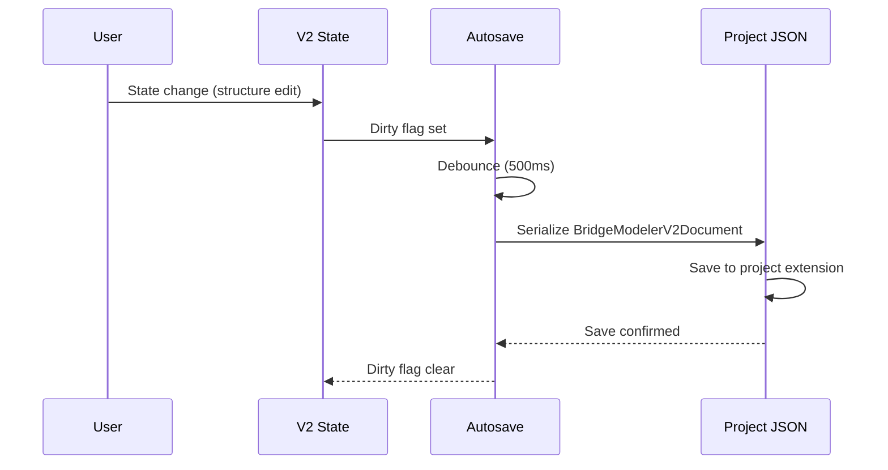
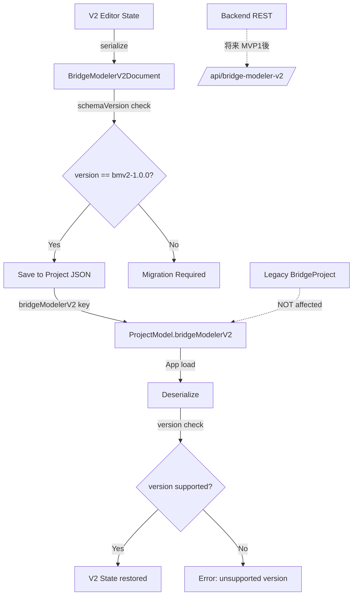

# 07 — Persistence, Versioning, Migration

Date: 2026-07-14  
Status: 計画文書（監督決定に基づく）  
Authority: `_supervisor_decisions.md` — ADR-BMV2-008  
Scope constraint: 永続化方針、スキーマバージョニング、Legacy 共存、autosave、将来 API

---

## 1. 目的

Bridge Modeler V2 の永続化方針を定義する。`BridgeModelerV2Document` のスキーマバージョニング、Legacy bridge JSON との共存、autosave パターン、移行方針を規定する。MVP1 では自動移行を実装せず、side-by-side coexistence とする（ADR-BMV2-008）。

## 2. 対象範囲

| 対象 | 説明 |
| --- | --- |
| Schema version | `bmv2-1.0.0` — 文字列リテラル |
| Persistence target | V2 document の保存先: `ProjectModel.bridgeModelerV2` |
| Autosave | App project の autosave パターンに従う |
| Legacy coexistence | `bridge-*.json` との side-by-side |
| Legacy BridgeProject | schema `0.1.0` は変更しない |
| Backend REST | 将来オプション（MVP1 後の PR） |
| OD-01 | **RESOLVED** — key: `bridgeModelerV2` (ADR-BMV2-015) |
| OD-02 | **RESOLVED** — Frontend-only persistence (ADR-BMV2-016) |

## 3. 対象外

| 対象外 | 根拠 |
| --- | --- |
| 自動移行（Legacy → V2） | MVP1 では実装しない（ADR-BMV2-008） |
| Backend API の実装 | MVP1 後の PR（ADR-BMV2-010） |
| Legacy `bridge-*.json` の変更 | 非対象（ADR-BMV2-001） |
| package.json の変更 | 非対象 |

## 4. スキーマバージョニング

### 4.1 V2 Document Schema

| 項目 | 値 |
| --- | --- |
| schemaVersion | `bmv2-1.0.0` |
| 形式 | string literal in design |
| パース | JSON parse 時に version チェック |
| 互換性 | Major version bump で breaking change |

### 4.2 Legacy Schema（比較）

| 項目 | Legacy BridgeProject | V2 Document |
| --- | --- | --- |
| schemaVersion | `"0.1.0"` | `"bmv2-1.0.0"` |
| 保存形式 | `bridge-*.json` (ファイルダウンロード) | Project JSON 内埋め込み or sibling key |
| 永続化方法 | ファイルシステム直接保存 | App project の autosave |

### 4.3 Versioning Policy

```
バージョン形式: <major>-<minor>.<patch>
Major: 互換性のない構造変更
Minor: 後方互換のある追加
Patch: バグ修正・ドキュメント更新

例: bmv2-1.0.0 → bmv2-1.1.0 → bmv2-2.0.0
```

## 5. 永続化方針

### 5.1 MVP1: Frontend-only Persistence (OD-02 RESOLVED)

| 項目 | 方針 | 根拠 |
| --- | --- | --- |
| 保存先 | `ProjectModel.bridgeModelerV2` に埋め込み | OD-01 RESOLVED (ADR-BMV2-015) |
| Key 名 | `bridgeModelerV2` | camelCase 拡張スロット。既存 `liner`/`linerTrace` と同型 |
| 型 | `ProjectModel.bridgeModelerV2?: BridgeModelerV2Document` | ADR-BMV2-015 |
| Autosave | App project の autosave パターンに従う | ADR-BMV2-008 |
| 保存形式 | JSON (Application/JSON) | 既存パターンに従う |
| 読み込み | App project load 時に `bridgeModelerV2` キーを検出 | — |
| FEM 生成 | Frontend 段階パイプライン。`/api/fem/generate` は使用禁止 | ADR-BMV2-016, C-05 |
| 解析実行 | `POST /api/analysis/run` に ProjectModel を送信 | C-05 確定 |

### 5.2 将来: Backend API（MVP1 後）

| 項目 | 設計 | 根拠 |
| --- | --- | --- |
| API パス | `/api/bridge-modeler-v2/...` | ADR-BMV2-010 |
| 端点設計 | CRUD pattern（既存 bridge API 参照） | 既存パターンに従う |
| 実装 | 別途 PR | 監督指示 |
| adapter 境界 | 同一 BridgeModelerV2Document 形状を返す | ADR-BMV2-016 |

### 5.3 保存先 — 確定 (OD-01 RESOLVED)

| 項目 | 値 |
| --- | --- |
| Key | `bridgeModelerV2` |
| 型 | `ProjectModel.bridgeModelerV2?: BridgeModelerV2Document` |
| Rejected: `bridge` | Legacy API payload と衝突（main.py:1019） |
| Rejected: `BridgeProject` 内ネスト | 既存型と不整合 |
| Rejected: `generatedFem` 流用 | 意図が異なる（分析結果専用） |

## 6. Legacy 共存

### 6.1 共存方針

```
Legacy:  bridge-*.json (schema 0.1.0)  ──── 変更なし
V2:     Project JSON bridgeModelerV2    ──── 新規（MVP1）
将来:   /api/bridge-modeler-v2/...      ──── MVP1 後の PR
```

### 6.2 共存ルール

| ルール | 内容 |
| --- | --- |
| Legacy 未変更 | BridgeProject 0.1.0 は変更しない |
| V2 は独立 | V2 document は Legacy とは別途保存 |
| 移行なし | 自動移行は MVP1 では実装しない |
| 双方並存 | Legacy Wizard と V2 が同時に動作可能 |
| Legacy 非推奨化 | 明示的な deprecation PR まで実施しない（ADR-BMV2-001） |

### 6.3 Import Adapter（P2 以降）

| パス | 内容 |
| --- | --- |
| Legacy BridgeProject → V2 | Optional one-way import（P2） |
| BridgeDefinition → V2 | Adapter で BridgeStructureModel に変換（ADR-BMV2-014） |
| LinerBridge → V2 | BridgeDefinition adapter を経由 |

## 7. Autosave

### 7.1 方針

| 項目 | 方針 |
| --- | --- |
| パターン | App project の autosave パターンに従う |
| トリガー | V2 document の state 変更時 |
| 遅延 | App の debounce パターンに従う |
| 保存先 | `ProjectModel.bridgeModelerV2` (OD-01 RESOLVED) |

### 7.2 保存対象

| 項目 | 保存内容 |
| --- | --- |
| RoadAlignmentReference | LINER alignment 参照 |
| BridgeInterval[] | 橋梁区間 |
| BridgeStructureModel | 構造モデル |
| AnalysisModelSpec | FEM 入力仕様 |
| GeneratedFemOutput | 生成結果（任意） |
| DeckSurface, TrafficLoadZone | Phase 4 入力（将来） |
| BridgeDrawingDocument | Phase 5 描図（将来） |

### 7.3 保存フロー



## 8. バージョン移行

### 8.1 MVP1: 移行なし

MVP1 では `bmv2-1.0.0` のみ。バージョン移行ロジックは存在しない。

### 8.2 将来: 移行方針（bmv2-2.0.0 以降）

| 項目 | 方針 |
| --- | --- |
| 方向 | 一方向（古い → 新しい） |
| 戻り | 旧バージョンへの復元は非対象 |
| 方法 | Reader + Transformer パターン |
| 検証 | 移行後 validation + diagnostics |

## 9. データフロー



## 10. Validation

| バリデーション | 条件 | エラーコード |
| --- | --- | --- |
| schemaVersion | `bmv2-1.0.0` であること | `BMV2_PERSIST_UNSUPPORTED_VERSION` |
| JSON 妥当性 | 有効な JSON であること | `BMV2_PERSIST_INVALID_JSON` |
| Document 完全性 | schemaVersion, intervals, structure が存在 | `BMV2_PERSIST_INCOMPLETE_DOCUMENT` |
| Key 存在 | `bridgeModelerV2` が ProjectModel に存在 | `BMV2_PERSIST_MISSING_KEY` |

## 11. Diagnostics

```typescript
type PersistenceDiagnostic = {
  severity: "info" | "warning" | "error";
  code: string;        // prefix: "BMV2_PERSIST_"
  message: string;
  path?: string;
  entityIds?: string[];
};
```

| Diagnostic | Severity | 内容 |
| --- | --- | --- |
| Unsupported version | error | スキーマバージョンが未対応 |
| Incomplete document | warning | 必須フィールドが不足 |
| Save failed | error | 保存失敗 |
| Load failed | error | 読み込み失敗 |
| Legacy coexistence | info | Legacy と V2 が共存中 |

## 12. エラー処理

| エラー | 処理 |
| --- | --- |
| Unsupported version | エラーメッセージ表示、保存不可 |
| Save failed | ユーザーに通知、再試行可能 |
| Load failed | 空の V2 document を初期化 |
| JSON parse error | エラーメッセージ表示、修復不能 |

## 13. Stable ID

永続化時の Stable ID は Phase 2-3 の生成ロジックに従う。保存・読み込み時に ID は変更しない。

## 14. Revision

| 項目 | 内容 |
| --- | --- |
| sourceRevision | 保存時に RoadAlignmentReference 内に保持 |
| Stale detection | 読み込み時に sourceRevision を LINER と照合 |
| Stale 処理 | ユーザーに通知、LINER 再評価を要求 |

## 15. Undo/Redo

| 操作 | Undo 可否 | 方法 |
| --- | --- | --- |
| V2 document 保存 | No | 永続化は undo の対象外 |
| V2 document 読み込み | No | 状態復元は undo の対象外 |

## 16. テスト方針

| テスト種別 | 内容 |
| --- | --- |
| Unit | JSON シリアライズ/デシリアライズ、version check |
| Integration | App project save/load との連携 |
| Regression | Legacy bridge-*.json が変更されないこと |

### テスト証拠

- `frontend/src/bridge/api.ts` — Legacy CRUD API パターン参考
- `frontend/src/bridge/BridgeWizard.tsx:104-113` — Legacy save パターン参考

## 17. 完了条件

1. `BridgeModelerV2Document` が `bmv2-1.0.0` でシリアライズ/デシリアライズできる
2. `ProjectModel.bridgeModelerV2` に保存できる（OD-01 RESOLVED）
3. Autosave が App のパターンに従って動作する
4. Legacy bridge-*.json が変更されない
5. バージョンチェックが動作する
6. Frontend のみで永続化が完結する（OD-02 RESOLVED）
7. `/api/fem/generate` が V2 経路から除外される（C-05）

## 18. 後続 PR 引渡し

| 引渡し物 | 受取先 | 内容 |
| --- | --- | --- |
| V2 document schema | MVP1 後の PR | Backend API での永続化 |
| autosave パターン | MVP1 後の PR | Backend での永続化 |
| version check | MVP1 後の PR | migration ロジック |

## 19. 未決事項

（なし — OD-01/02 は RESOLVED）

### 確定済み OD

| ID | 内容 | ADR | Status |
| --- | --- | --- | --- |
| OD-01 | ProjectModel 拡張キー `bridgeModelerV2` | ADR-BMV2-015 | **RESOLVED** |
| OD-02 | Phase1〜5連続実装の正は Frontend ドメイン | ADR-BMV2-016 | **RESOLVED** |

---

## ADR 転記

| ID | タイトル | 本文書との関連 |
| --- | --- | --- |
| ADR-BMV2-008 | Schema & persistence | §4, §5, §6 |
| ADR-BMV2-010 | Frontend/backend split | §5.2 |
| ADR-BMV2-015 | ProjectModel host key (OD-01) | §5.1, §5.3 |
| ADR-BMV2-016 | Frontend domain persistence (OD-02) | §5.1 |
