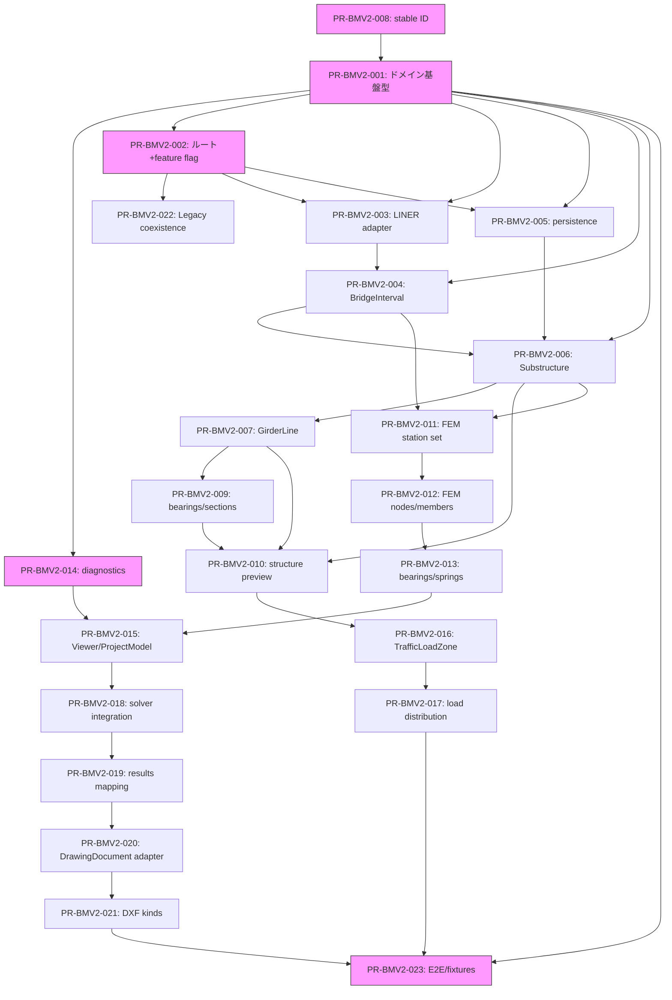

# 10 — Implementation Roadmap and PR Plan

Date: 2026-07-14  
Status: 計画文書（監督決定に基づく）  
Authority: `_supervisor_decisions.md`  
Scope constraint: PR 分割計画、Phase 依存、仮 ID、実行順序

---

## 1. 目的

Bridge Modeler V2 の実装を独立 PR に分割し、依存関係と実行順序を明確にする。各 PR に Phase、目的、変更予定ファイル、新規型、新規 API、既存影響、前提 PR、後続 PR、テスト観点、rollback 方針を定義する。

## 2. PR 分割方針

| ルール | 内容 |
| --- | --- |
| 独立性 | 各 PR が独立して merge 可能 |
| 依存順序 | 前提 PR が先に merge される |
| 体积 | 大きすぎず、小さすぎない（1 PR = 1 概念） |
| feature flag | `VITE_BRIDGE_MODELER_V2` で段階的に有効化 |
| 非破壊 | 既存機能に影響しない |

## 3. PR 一覧

### PR-BMV2-001: ドメイン基盤型

| 項目 | 内容 |
| --- | --- |
| **Phase** | P0 (基盤) |
| **目的** | V2 のドメイン型を定義し、既存コードと分離する |
| **変更予定ファイル** | `frontend/src/bridgeModelerV2/types/` (新規), `frontend/src/bridgeModelerV2/types/index.ts` |
| **新規型** | `BridgeModelerV2Document`, `RoadAlignmentReference`, `BridgeInterval`, `BridgeStructureModel`, `BridgeSupport`, `BridgeGirder`, `BridgeCrossGirder`, `BridgeBearing`, `BridgeSection`, `BridgeMaterial`, `DiagnosticsEnvelope`, `IdCorrespondence` |
| **新規 API** | なし |
| **既存影響** | なし（新規モジュールのみ） |
| **前提 PR** | PR-BMV2-008 |
| **後続 PR** | PR-BMV2-002, PR-BMV2-004, PR-BMV2-005, PR-BMV2-006 |
| **非対象** | Legacy 既存型、BridgeDefinition 型 |
| **Unit** | 型の型チェック、stable ID ユーティリティ |
| **Integration** | なし |
| **E2E** | なし |
| **手動確認** | TypeScript コンパイル成功 |
| **rollback** | ファイル削除のみ（新規モジュール） |
| **完了条件** | 全型が定義され、`tsc` が通る |

---

### PR-BMV2-002: ルート・画面シェル + feature flag

| 項目 | 内容 |
| --- | --- |
| **Phase** | P0 (基盤) |
| **目的** | V2 ルートを登録し、feature flag で制御する |
| **変更予定ファイル** | `frontend/src/bridgeModelerV2/routes/` (新規), `frontend/src/App.tsx` (route 追加), `frontend/src/bridgeModelerV2/featureFlags.ts` (新規) |
| **新規型** | `VITE_BRIDGE_MODELER_V2` feature flag |
| **新規 API** | なし |
| **既存影響** | `App.tsx` に condition 付き route 追加。Legacy 影響なし |
| **前提 PR** | PR-BMV2-001 |
| **後続 PR** | PR-BMV2-003 |
| **非対象** | Legacy BridgeWizard, Toolbar |
| **Unit** | feature flag の on/off |
| **Integration** | なし |
| **E2E** | E2E-05: feature flag off 時にルート非表示 |
| **手動確認** | `/pro/bridge-modeler-v2` に遷移できること |
| **rollback** | route 登録削除、feature flag 削除 |
| **完了条件** | `VITE_BRIDGE_MODELER_V2=true` 時にのみルート表示 |

---

### PR-BMV2-003: LINER 参照 adapter

| 項目 | 内容 |
| --- | --- |
| **Phase** | P1 |
| **目的** | LINER alignment 参照を V2 の RoadAlignmentReference に変換する adapter を作成 |
| **変更予定ファイル** | `frontend/src/bridgeModelerV2/adapters/fromLinerAlignment.ts` (新規), `frontend/src/bridgeModelerV2/adapters/fromLinerAlignment.test.ts` (新規) |
| **新規型** | なし（PR-BMV2-001 の型を使用） |
| **新規 API** | なし |
| **既存影響** | なし（新規 adapter のみ） |
| **前提 PR** | PR-BMV2-001, PR-BMV2-002 |
| **後続 PR** | PR-BMV2-004 |
| **非対象** | LINER pipeline の変更 |
| **Unit** | adapter の変換ロジック、sourceRevision 計算 |
| **Integration** | LINER pipeline mock → adapter |
| **E2E** | なし |
| **手動確認** | LINER alignment 選択 → RoadAlignmentReference 生成 |
| **rollback** | adapter ファイル削除 |
| **完了条件** | adapter が正常に変換し、テストが通る |

---

### PR-BMV2-004: BridgeInterval

| 項目 | 内容 |
| --- | --- |
| **Phase** | P1 |
| **目的** | BridgeInterval の入力 UI と validation を実装 |
| **変更予定ファイル** | `frontend/src/bridgeModelerV2/components/IntervalEditor.tsx` (新規), `frontend/src/bridgeModelerV2/validation/intervalValidation.ts` (新規), テスト |
| **新規型** | なし |
| **新規 API** | なし |
| **既存影響** | なし |
| **前提 PR** | PR-BMV2-001, PR-BMV2-003 |
| **後続 PR** | PR-BMV2-005, PR-BMV2-006 |
| **非対象** | Legacy station 関連 |
| **Unit** | station range validation, interval 生成 |
| **Integration** | adapter → interval |
| **E2E** | E2E-01: alignment → interval フロー |
| **手動確認** | start/end station 入力、preview |
| **rollback** | コンポーネント削除 |
| **完了条件** | interval 入力 validation が通る |

---

### PR-BMV2-005: persistence/schema 埋め込み

| 項目 | 内容 |
| --- | --- |
| **Phase** | P1 |
| **目的** | BridgeModelerV2Document の serialization/deserialization を実装 |
| **変更予定ファイル** | `frontend/src/bridgeModelerV2/persistence/` (新規), `frontend/src/bridgeModelerV2/persistence/serialize.test.ts` (新規) |
| **新規型** | `DocumentMetadata` |
| **新規 API** | なし |
| **既存影響** | OD-01 決定後に project JSON key に保存 |
| **前提 PR** | PR-BMV2-001, PR-BMV2-002 |
| **後続 PR** | PR-BMV2-006, PR-BMV2-007 |
| **非対象** | Backend API, Legacy persistence |
| **Unit** | serialize/deserialize, schemaVersion check |
| **Integration** | App project save/load |
| **E2E** | なし |
| **手動確認** | V2 document の保存・読み込み |
| **rollback** | persistence モジュール削除 |
| **完了条件** | bmv2-1.0.0 で serialize/deserialize 通る |

---

### PR-BMV2-006: Substructure/SupportLine

| 項目 | 内容 |
| --- | --- |
| **Phase** | P2 |
| **目的** | BridgeSupport の入力 UI と validation を実装 |
| **変更予定ファイル** | `frontend/src/bridgeModelerV2/components/SupportEditor.tsx` (新規), `frontend/src/bridgeModelerV2/validation/supportValidation.ts` (新規), テスト |
| **新規型** | なし |
| **新規 API** | なし |
| **既存影響** | なし |
| **前提 PR** | PR-BMV2-001, PR-BMV2-004, PR-BMV2-005, PR-BMV2-008 |
| **後続 PR** | PR-BMV2-007, PR-BMV2-009 |
| **非対象** | Legacy supports |
| **Unit** | stable ID 生成 (`sup:*`), validation |
| **Integration** | interval → support |
| **E2E** | E2E-01: structure 入力フロー |
| **手動確認** | supports 入力、3D preview |
| **rollback** | コンポーネント削除 |
| **完了条件** | supports >= 2 validation が通る |

---

### PR-BMV2-007: GirderLine/CrossGirder

| 項目 | 内容 |
| --- | --- |
| **Phase** | P2 |
| **目的** | BridgeGirder, BridgeCrossGirder の入力 UI と validation を実装 |
| **変更予定ファイル** | `frontend/src/bridgeModelerV2/components/GirderEditor.tsx` (新規), `frontend/src/bridgeModelerV2/components/CrossGirderEditor.tsx` (新規), テスト |
| **新規型** | なし |
| **新規 API** | なし |
| **既存影響** | なし |
| **前提 PR** | PR-BMV2-006 |
| **後続 PR** | PR-BMV2-009 |
| **非対象** | Legacy girder (y_positions) |
| **Unit** | stable ID 生成 (`gir:*`, `xgir:*`), validation |
| **Integration** | support → girder |
| **E2E** | E2E-01: girder 入力 |
| **手動確認** | girder line 入力、3D preview |
| **rollback** | コンポーネント削除 |
| **完了条件** | girder/crossGirder 入力 validation が通る |

---

### PR-BMV2-008: stable ID ユーティリティ

| 項目 | 内容 |
| --- | --- |
| **Phase** | P0 (基盤) |
| **目的** | Deterministic stable ID のユーティリティ関数を実装 |
| **変更予定ファイル** | `frontend/src/bridgeModelerV2/utils/stableId.ts` (新規), `frontend/src/bridgeModelerV2/utils/stableId.test.ts` (新規) |
| **新規型** | `StableIdGenerator` |
| **新規 API** | なし |
| **既存影響** | なし |
| **前提 PR** | なし（理想的には PR-BMV2-001 と同時期。実行順では PR-BMV2-008 をドメイン型の直前または直後に置く） |
| **後続 PR** | PR-BMV2-006, PR-BMV2-007, PR-BMV2-009, PR-BMV2-012 |
| **非対象** | Legacy ID (`N{counter}`) |
| **Unit** | ID 生成、一意性、衝突回避、再生成時 ID 保持 |
| **Integration** | なし |
| **E2E** | なし |
| **手動確認** | ID 生成の確認 |
| **rollback** | ユーティリティ削除 |
| **完了条件** | 全 ID パターンが生成され、テストが通る |

---

### PR-BMV2-009: bearings/sections/materials

| 項目 | 内容 |
| --- | --- |
| **Phase** | P2 |
| **目的** | BridgeBearing, BridgeSection, BridgeMaterial の入力 UI と validation を実装 |
| **変更予定ファイル** | `frontend/src/bridgeModelerV2/components/BearingEditor.tsx` (新規), `frontend/src/bridgeModelerV2/components/SectionEditor.tsx` (新規), `frontend/src/bridgeModelerV2/components/MaterialEditor.tsx` (新規), テスト |
| **新規型** | なし |
| **新規 API** | なし |
| **既存影響** | なし |
| **前提 PR** | PR-BMV2-006, PR-BMV2-007 |
| **後続 PR** | PR-BMV2-010 |
| **非対象** | Legacy sections/materials |
| **Unit** | stable ID 生成 (`brg:*`, `sec:*`, `mat:*`), validation |
| **Integration** | support → bearing, girder → section/material |
| **E2E** | E2E-01: structure 入力フロー完了 |
| **手動確認** | bearing/section/material 入力 |
| **rollback** | コンポーネント削除 |
| **完了条件** | 全入力 validation が通る |

---

### PR-BMV2-010: structure preview

| 項目 | 内容 |
| --- | --- |
| **Phase** | P2 |
| **目的** | BridgeStructureModel の 3D プレビューを実装 |
| **変更予定ファイル** | `frontend/src/bridgeModelerV2/components/Structure3DPreview.tsx` (新規), `frontend/src/bridgeModelerV2/viewer/bridgeStructureViewerAdapter.ts` (新規) |
| **新規型** | なし |
| **新規 API** | なし |
| **既存影響** | BridgeThreeViewer を再利用 |
| **前提 PR** | PR-BMV2-006, PR-BMV2-007, PR-BMV2-009 |
| **後続 PR** | PR-BMV2-011 |
| **非対象** | Legacy viewer |
| **Unit** | viewer adapter の変換 |
| **Integration** | structure → viewer |
| **E2E** | E2E-01: 3D preview 確認 |
| **手動確認** | 3D preview 表示確認 |
| **rollback** | viewer コンポーネント削除 |
| **完了条件** | supports, girders, crossGirders が 3D 表示される |

---

### PR-BMV2-011: FEM station set

| 項目 | 内容 |
| --- | --- |
| **Phase** | P3 |
| **目的** | FEM pipeline の最初のステップ（station set 生成）を実装 |
| **変更予定ファイル** | `frontend/src/bridgeModelerV2/fem/stationSetGenerator.ts` (新規), テスト |
| **新規型** | `PipelineStepStatus` |
| **新規 API** | なし |
| **既存影響** | なし |
| **前提 PR** | PR-BMV2-004, PR-BMV2-006 |
| **後続 PR** | PR-BMV2-012 |
| **非対象** | Legacy station set |
| **Unit** | station set 生成ロジック |
| **Integration** | interval → station set |
| **E2E** | なし |
| **手動確認** | station set 生成確認 |
| **rollback** | station set generator 削除 |
| **完了条件** | station set が正しく生成される |

---

### PR-BMV2-012: FEM nodes/members

| 項目 | 内容 |
| --- | --- |
| **Phase** | P3 |
| **目的** | FEM pipeline の node 生成と member 生成を実装 |
| **変更予定ファイル** | `frontend/src/bridgeModelerV2/fem/nodeGenerator.ts` (新規), `frontend/src/bridgeModelerV2/fem/memberGenerator.ts` (新規), テスト |
| **新規型** | `IdCorrespondence` |
| **新規 API** | なし |
| **既存影響** | なし |
| **前提 PR** | PR-BMV2-011 |
| **後続 PR** | PR-BMV2-013 |
| **非対象** | Legacy node/member 生成 (`N{counter}`) |
| **Unit** | stable ID 生成 (`node:*`, `mem:*`), member 方向 |
| **Integration** | station set → nodes → members |
| **E2E** | なし |
| **手動確認** | nodes, members 生成確認 |
| **rollback** | generator 削除 |
| **完了条件** | nodes >= 4, members >= 1 |

---

### PR-BMV2-013: bearings/springs/constraints 生成

| 項目 | 内容 |
| --- | --- |
| **Phase** | P3 |
| **目的** | FEM pipeline の support/spring/constraint マッピングを実装 |
| **変更予定ファイル** | `frontend/src/bridgeModelerV2/fem/supportMapper.ts` (新規), テスト |
| **新規型** | なし |
| **新規 API** | なし |
| **既存影響** | なし |
| **前提 PR** | PR-BMV2-012 |
| **後続 PR** | PR-BMV2-015 |
| **非対象** | Legacy support mapping |
| **Unit** | support → FEM node マッピング |
| **Integration** | nodes → support mapping |
| **E2E** | なし |
| **手動確認** | support mapping 確認 |
| **rollback** | mapper 削除 |
| **完了条件** | 全 supports が FEM node にマッピングされる |

---

### PR-BMV2-014: diagnostics

| 項目 | 内容 |
| --- | --- |
| **Phase** | P0 (基盤) |
| **目的** | DiagnosticsEnvelope と DiagnosticsCollector を実装 |
| **変更予定ファイル** | `frontend/src/bridgeModelerV2/diagnostics/DiagnosticsCollector.ts` (新規), `frontend/src/bridgeModelerV2/diagnostics/DiagnosticsCollector.test.ts` (新規) |
| **新規型** | なし（PR-BMV2-001 の型を使用） |
| **新規 API** | なし |
| **既存影響** | なし |
| **前提 PR** | PR-BMV2-001 |
| **後続 PR** | PR-BMV2-011, PR-BMV2-012, PR-BMV2-013, PR-BMV2-015 |
| **非対象** | Legacy diagnostics |
| **Unit** | Collector の追加/取得/フィルタ |
| **Integration** | なし |
| **E2E** | なし |
| **手動確認** | diagnostics 表示確認 |
| **rollback** | collector 削除 |
| **完了条件** | Collector が動作し、テストが通る |

---

### PR-BMV2-015: Viewer/ProjectModel 接続

| 項目 | 内容 |
| --- | --- |
| **Phase** | P3 |
| **目的** | FEM pipeline の出力（ProjectModel）を Viewer に接続 |
| **変更予定ファイル** | `frontend/src/bridgeModelerV2/viewer/femViewerAdapter.ts` (新規), `frontend/src/bridgeModelerV2/components/FemViewerPanel.tsx` (新規) |
| **新規型** | `GeneratedFemOutput` |
| **新規 API** | なし |
| **既存影響** | 既存 solver (`POST /api/fem/generate`) を利用 |
| **前提 PR** | PR-BMV2-013, PR-BMV2-014 |
| **後続 PR** | PR-BMV2-016 |
| **非対象** | Backend solver の変更 |
| **Unit** | viewer adapter 変換 |
| **Integration** | ProjectModel → viewer |
| **E2E** | E2E-02: FEM generation フロー |
| **手動確認** | FEM 結果の 3D 表示 |
| **rollback** | viewer adapter 削除 |
| **完了条件** | ProjectModel が 3D 表示される |

---

### PR-BMV2-016: TrafficLoadZone

| 項目 | 内容 |
| --- | --- |
| **Phase** | P4 |
| **目的** | DeckSurface, DeckZone, TrafficLoadZone の入力 UI を実装 |
| **変更予定ファイル** | `frontend/src/bridgeModelerV2/components/DeckSurfaceEditor.tsx` (新規), `frontend/src/bridgeModelerV2/components/TrafficLoadZoneEditor.tsx` (新規), テスト |
| **新規型** | `DeckSurface`, `DeckZone`, `TrafficLoadZone` |
| **新規 API** | なし |
| **既存影響** | なし |
| **前提 PR** | PR-BMV2-010 |
| **後続 PR** | PR-BMV2-017 |
| **非対象** | Legacy `line_id` ベース荷重 |
| **Unit** | 型生成、validation |
| **Integration** | structure → deck surface |
| **E2E** | E2E-03: load 設定フロー |
| **手動確認** | deck surface 入力 |
| **rollback** | コンポーネント削除 |
| **完了条件** | deck surface, traffic load zone 入力 validation が通る |

---

### PR-BMV2-017: load distribution

| 項目 | 内容 |
| --- | --- |
| **Phase** | P4 |
| **目的** | LoadPath の入力 UI と distribution mapping を実装 |
| **変更予定ファイル** | `frontend/src/bridgeModelerV2/components/LoadPathEditor.tsx` (新規), `frontend/src/bridgeModelerV2/load/distributionMapper.ts` (新規), テスト |
| **新規型** | `LoadPath`, `LoadFmeTarget` |
| **新規 API** | なし |
| **既存影響** | なし |
| **前提 PR** | PR-BMV2-016 |
| **後続 PR** | PR-BMV2-018 |
| **非対象** | Legacy line_id |
| **Unit** | distribution factor 計算、target 参照 |
| **Integration** | deck zone → load path → FEM target |
| **E2E** | E2E-03: load 設定フロー完了 |
| **手動確認** | distribution mapping 確認 |
| **rollback** | コンポーネント削除 |
| **完了条件** | distribution factor 合計 = 1.0 validation が通る |

---

### PR-BMV2-018: solver integration

| 項目 | 内容 |
| --- | --- |
| **Phase** | P3 |
| **目的** | FEM pipeline の最後のステップ（solver 呼び出し）を実装 |
| **変更予定ファイル** | `frontend/src/bridgeModelerV2/fem/solverAdapter.ts` (新規), テスト |
| **新規型** | なし |
| **新規 API** | なし（既存 `POST /api/fem/generate` を利用） |
| **既存影響** | 既存 solver を呼び出す |
| **前提 PR** | PR-BMV2-015 |
| **後続 PR** | PR-BMV2-019 |
| **非対象** | Backend solver の変更 |
| **Unit** | solver adapter 変換 |
| **Integration** | ProjectModel → solver → result |
| **E2E** | E2E-02: FEM generation フロー完了 |
| **手動確認** | solver 実行結果確認 |
| **rollback** | adapter 削除 |
| **完了条件** | solver が正常に実行される |

---

### PR-BMV2-019: results mapping

| 項目 | 内容 |
| --- | --- |
| **Phase** | P5 |
| **目的** | FEM 結果のマッピングを実装 |
| **変更予定ファイル** | `frontend/src/bridgeModelerV2/results/resultsMapper.ts` (新規), テスト |
| **新規型** | `ResultsMapping` |
| **新規 API** | なし |
| **既存影響** | なし |
| **前提 PR** | PR-BMV2-018 |
| **後続 PR** | PR-BMV2-020 |
| **非対象** | Legacy results |
| **Unit** | results mapper ロジック |
| **Integration** | solver result → results mapping |
| **E2E** | なし |
| **手動確認** | results 確認 |
| **rollback** | mapper 削除 |
| **完了条件** | 全 nodes に結果がある |

---

### PR-BMV2-020: DrawingDocument adapter

| 項目 | 内容 |
| --- | --- |
| **Phase** | P5 |
| **目的** | DrawingDocument → Bridge 描図への adapter を実装 |
| **変更予定ファイル** | `frontend/src/bridgeModelerV2/drawing/bridgeDrawingAdapter.ts` (新規), テスト |
| **新規型** | `BridgeDrawingDocument`, `BridgeDrawingKind` |
| **新規 API** | なし |
| **既存影響** | LINER DrawingDocument を再利用 |
| **前提 PR** | PR-BMV2-019 |
| **後続 PR** | PR-BMV2-021, PR-BMV2-022 |
| **非対象** | LINER DrawingDocument の変更 |
| **Unit** | adapter 変換ロジック |
| **Integration** | results → DrawingDocument |
| **E2E** | E2E-03: 描図生成フロー |
| **手動確認** | DrawingDocument preview |
| **rollback** | adapter 削除 |
| **完了条件** | DrawingDocument が生成される |

---

### PR-BMV2-021: DXF kinds

| 項目 | 内容 |
| --- | --- |
| **Phase** | P5 |
| **目的** | Bridge 描図の DXF 種別（fem_grid, support_plan, girder_plan 等）を実装 |
| **変更予定ファイル** | `frontend/src/bridgeModelerV2/drawing/builders/` (新規), テスト |
| **新規型** | なし |
| **新規 API** | なし |
| **既存影響** | LINER DXF mapper/serializer を再利用 |
| **前提 PR** | PR-BMV2-020 |
| **後続 PR** | PR-BMV2-022 |
| **非対象** | LINER DXF の変更 |
| **Unit** | 各 builder の DrawingDocument 生成 |
| **Integration** | builder → DXF |
| **E2E** | E2E-04: DXF export フロー |
| **手動確認** | DXF ファイルの LibreCAD 読み込み |
| **rollback** | builder 削除 |
| **完了条件** | 全描図種別の DXF が生成される |

---

### PR-BMV2-022: Legacy coexistence docs/flag

| 項目 | 内容 |
| --- | --- |
| **Phase** | P0 (基盤) |
| **目的** | Legacy 共存のドキュメントと feature flag の最終確認 |
| **変更予定ファイル** | `frontend/src/bridgeModelerV2/README.md` (新規), `docs/bridge-modeler-v2/` (既存) |
| **新規型** | なし |
| **新規 API** | なし |
| **既存影響** | Legacy への影響なし |
| **前提 PR** | PR-BMV2-002 |
| **後続 PR** | PR-BMV2-023 |
| **非対象** | Legacy code |
| **Unit** | なし |
| **Integration** | なし |
| **E2E** | E2E-05: feature flag off 時にルート非表示 |
| **手動確認** | Legacy Wizard が動作すること |
| **rollback** | ドキュメント削除 |
| **完了条件** | 共存ドキュメントが完成し、Legacy が動作すること |

---

### PR-BMV2-023: E2E/fixtures

| 項目 | 内容 |
| --- | --- |
| **Phase** | 全 Phase |
| **目的** | E2E テストと fixture を整備 |
| **変更予定ファイル** | `frontend/src/bridgeModelerV2/__fixtures__/` (新規), E2E テスト (新規) |
| **新規型** | なし |
| **新規 API** | なし |
| **既存影響** | なし |
| **前提 PR** | PR-BMV2-001 〜 PR-BMV2-022 |
| **後続 PR** | なし |
| **非対象** | Legacy テスト |
| **Unit** | fixture の有効性 |
| **Integration** | adapter → fixture |
| **E2E** | E2E-01 〜 E2E-05 |
| **手動確認** | 全 E2E テスト通過 |
| **rollback** | fixture/テスト削除 |
| **完了条件** | 全 E2E テストが通る |

## 4. 実行順序テーブル

| 順序 | PR ID | Phase | タイトル | 前提 PR |
| --- | --- | --- | --- | --- |
| 1 | PR-BMV2-008 | P0 | stable ID ユーティリティ | なし |
| 2 | PR-BMV2-001 | P0 | ドメイン基盤型 | PR-BMV2-008 |
| 3 | PR-BMV2-014 | P0 | diagnostics | PR-BMV2-001 |
| 4 | PR-BMV2-002 | P0 | ルート・画面シェル+feature flag | PR-BMV2-001 |
| 5 | PR-BMV2-022 | P0 | Legacy coexistence docs/flag | PR-BMV2-002 |
| 6 | PR-BMV2-003 | P1 | LINER 参照 adapter | PR-BMV2-001, PR-BMV2-002 |
| 7 | PR-BMV2-004 | P1 | BridgeInterval | PR-BMV2-001, PR-BMV2-003 |
| 8 | PR-BMV2-005 | P1 | persistence/schema 埋め込み | PR-BMV2-001, PR-BMV2-002 |
| 9 | PR-BMV2-006 | P2 | Substructure/SupportLine | PR-BMV2-001, PR-BMV2-004, PR-BMV2-005, PR-BMV2-008 |
| 10 | PR-BMV2-007 | P2 | GirderLine/CrossGirder | PR-BMV2-006 |
| 11 | PR-BMV2-009 | P2 | bearings/sections/materials | PR-BMV2-006, PR-BMV2-007 |
| 12 | PR-BMV2-010 | P2 | structure preview | PR-BMV2-006, PR-BMV2-007, PR-BMV2-009 |
| 13 | PR-BMV2-011 | P3 | FEM station set | PR-BMV2-004, PR-BMV2-006 |
| 14 | PR-BMV2-012 | P3 | FEM nodes/members | PR-BMV2-011 |
| 15 | PR-BMV2-013 | P3 | bearings/springs/constraints 生成 | PR-BMV2-012 |
| 16 | PR-BMV2-015 | P3 | Viewer/ProjectModel 接続 | PR-BMV2-013, PR-BMV2-014 |
| 17 | PR-BMV2-018 | P3 | solver integration | PR-BMV2-015 |
| 18 | PR-BMV2-016 | P4 | TrafficLoadZone | PR-BMV2-010 |
| 19 | PR-BMV2-017 | P4 | load distribution | PR-BMV2-016 |
| 20 | PR-BMV2-019 | P5 | results mapping | PR-BMV2-018 |
| 21 | PR-BMV2-020 | P5 | DrawingDocument adapter | PR-BMV2-019 |
| 22 | PR-BMV2-021 | P5 | DXF kinds | PR-BMV2-020 |
| 23 | PR-BMV2-023 | 全 | E2E/fixtures | PR-BMV2-001 〜 PR-BMV2-022 |

## 5. Mermaid 依存図

## 6. Phase マッピング

| Phase | PR ID | PR タイトル |
| --- | --- | --- |
| P0 (基盤) | PR-BMV2-008, PR-BMV2-001, PR-BMV2-014, PR-BMV2-002, PR-BMV2-022 | stable ID, ドメイン型, diagnostics, ルート, coexistence |
| P1 (Interval) | PR-BMV2-003, PR-BMV2-004, PR-BMV2-005 | LINER adapter, interval, persistence |
| P2 (Structure) | PR-BMV2-006, PR-BMV2-007, PR-BMV2-009, PR-BMV2-010 | supports, girders, bearings, preview |
| P3 (FEM) | PR-BMV2-011, PR-BMV2-012, PR-BMV2-013, PR-BMV2-015, PR-BMV2-018 | station set, nodes, supports, viewer, solver |
| P4 (Load) | PR-BMV2-016, PR-BMV2-017 | deck surface, load path |
| P5 (Drawing) | PR-BMV2-019, PR-BMV2-020, PR-BMV2-021 | results, DrawingDocument, DXF |
| 全 Phase | PR-BMV2-023 | E2E/fixtures |

## 7. 完了条件

1. 23 の PR が全て定義される
2. 各 PR に Phase、目的、変更予定ファイル、新規型、新規 API、既存影響、前提/後続 PR が記載される
3. 実行順序テーブルが存在する
4. Mermaid 依存図が存在する
5. 全 PR が独立して merge 可能（前提 PR が先に merge されている）

## 8. 未決事項

| ID | 内容 | 影響 | Status |
| --- | --- | --- | --- |
| OD-01 | Exact host project JSON key | PR-BMV2-005 の保存先 | → [13 §OD-01](13_open_decisions_resolution.md) |
| OD-02 | Backend REST vs frontend-only | PR-BMV2-005 の保存方法 | → [13 §OD-02](13_open_decisions_resolution.md) |
| OD-03 | Girder "follow widening" 方式 | PR-BMV2-007 のアルゴリズム | → [13 §OD-03](13_open_decisions_resolution.md) |
| OD-04 | Partial regeneration granularity | PR-BMV2-012 の再生成粒度 | **RESOLVED** → [13 §OD-04](13_open_decisions_resolution.md) |
| OD-05 | Coexistence end criteria | PR-BMV2-022 の Legacy 非推奨化 | → [15 §Release Gate](15_integrated_execution_and_release_plan.md) |
