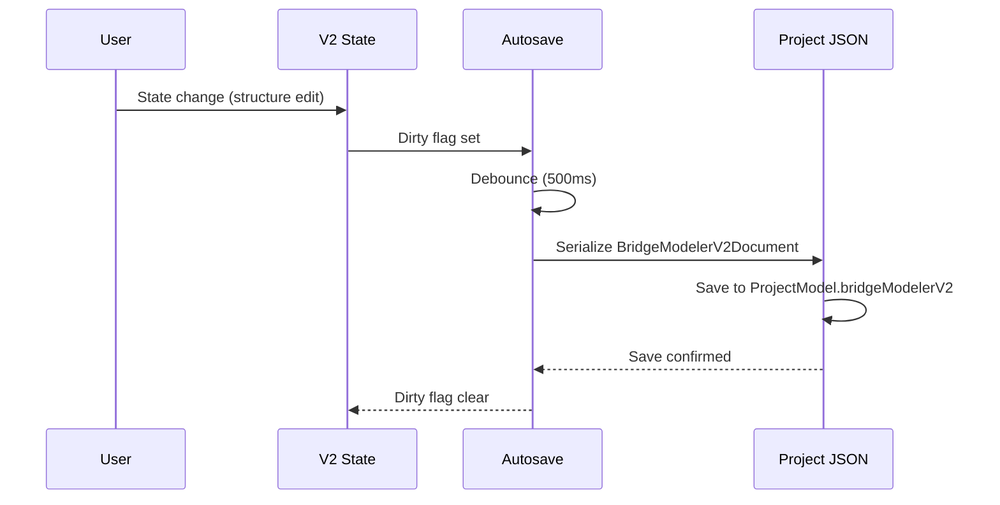
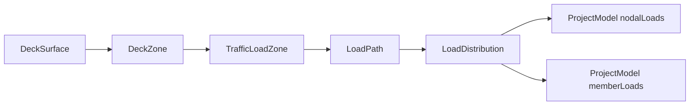

# 14 — Implementation Contract Catalog

Date: 2026-07-14  
Status: **LOCKED** (Grok supervisor確認済み)  
Authority: `_supervisor_decisions.md` + 各ADR  
Scope: 型カタログ、persistence契約、LINER adapter、座標/単位/許容誤差、stable ID、FEM pipeline stages、load distribution、IdCorrespondence、Drawing/DXF、FE/BE責務

---

## 1. Naming Lock

ADR-BMV2-004, ADR-BMV2-015 に従い、以下の命名規則を厳守する。

| Concept | Official V2 name | Forbidden / Legacy |
| --- | --- | --- |
| V2 root aggregate | `BridgeModelerV2Document` | never call it `BridgeProject` |
| Road reference | `RoadAlignmentReference` | do not copy LINER geometry into V2 store |
| Bridge interval | `BridgeInterval` | — |
| Structure | `BridgeStructureModel` | distinct from `BridgeDefinition` |
| Analysis | `AnalysisModelSpec` → generates `ProjectModel` | `ProjectModel` remains FEM persistence shape |
| Host key | `ProjectModel.bridgeModelerV2` | `bridge`, `BridgeProject` 内ネスト, `generatedFem` |
| Drawing IR | `DrawingDocument` | — |
| Package root | `frontend/src/bridgeModelerV2/` | — |
| Route | `/pro/bridge-modeler-v2` | — |
| Feature flag | `VITE_BRIDGE_MODELER_V2=true` | — |

---

## 2. BridgeModelerV2Document JSON Example (最小完全例)

```json
{
  "schemaVersion": "bmv2-1.0.0",
  "id": "bmv2-a1b2c3d4-e5f6-7890-abcd-ef1234567890",
  "name": "Sample Bridge",
  "metadata": {
    "createdAt": "2026-07-14T00:00:00.000Z",
    "updatedAt": "2026-07-14T00:00:00.000Z",
    "createdBy": "engineer-01",
    "label": "Prototype"
  },
  "roadAlignment": {
    "linerProjectId": "proj-liner-001",
    "linerModelId": "model-001",
    "alignmentId": "aln-main",
    "sourceRevision": "sha256-abc123...",
    "startStationM": 100.0,
    "endStationM": 500.0,
    "localOriginPolicy": "liner-canonical"
  },
  "intervals": [
    {
      "id": "intv:span1",
      "startStationM": 100.0,
      "endStationM": 300.0,
      "deckClassificationRef": "dz:lane1"
    },
    {
      "id": "intv:span2",
      "startStationM": 300.0,
      "endStationM": 500.0,
      "deckClassificationRef": "dz:lane1"
    }
  ],
  "structure": {
    "supports": [
      { "id": "sup:A1", "station": 100.0, "kind": "fixed", "substructureKind": "abutment", "skewAngleDeg": 0 },
      { "id": "sup:P1", "station": 300.0, "kind": "pinned", "substructureKind": "pier", "skewAngleDeg": 15 },
      { "id": "sup:A2", "station": 500.0, "kind": "roller", "substructureKind": "abutment", "skewAngleDeg": 0 }
    ],
    "girders": [
      {
        "id": "gir:G1",
        "label": "Girder 1",
        "role": "main",
        "offset": -3.5,
        "spanIds": ["intv:span1", "intv:span2"],
        "sectionRefId": "sec:main-girder",
        "materialRefId": "mat:steel-q345",
        "offsetControlPoints": [
          { "stationM": 100.0, "offsetM": -3.5 },
          { "stationM": 500.0, "offsetM": -3.5 }
        ]
      },
      {
        "id": "gir:G2",
        "label": "Girder 2",
        "role": "main",
        "offset": 3.5,
        "spanIds": ["intv:span1", "intv:span2"],
        "sectionRefId": "sec:main-girder",
        "materialRefId": "mat:steel-q345",
        "offsetControlPoints": [
          { "stationM": 100.0, "offsetM": 3.5 },
          { "stationM": 500.0, "offsetM": 3.5 }
        ]
      }
    ],
    "crossGirders": [
      { "id": "xgir:G1:G2:020000", "station": 200.0, "girderIds": ["gir:G1", "gir:G2"], "sectionRefId": "sec:cross-girder" },
      { "id": "xgir:G1:G2:040000", "station": 400.0, "girderIds": ["gir:G1", "gir:G2"], "sectionRefId": "sec:cross-girder" }
    ],
    "bearings": [
      { "id": "brg:A1-1", "supportId": "sup:A1", "type": "elastomeric" },
      { "id": "brg:A2-1", "supportId": "sup:A2", "type": "pot" }
    ],
    "sections": [
      { "id": "sec:main-girder", "name": "Main Girder", "shape": "I", "dimensions": { "depth": 1.2, "width": 0.4 } },
      { "id": "sec:cross-girder", "name": "Cross Girder", "shape": "I", "dimensions": { "depth": 0.6, "width": 0.3 } }
    ],
    "materials": [
      { "id": "mat:steel-q345", "name": "Q345 Steel", "kind": "steel", "elasticModulus": 206000, "density": 7850 }
    ]
  },
  "deckSurface": {
    "id": "dz:main",
    "width": 10.0,
    "thickness": 0.25,
    "kind": "steel_composite",
    "zones": [
      { "id": "dz:lane1", "name": "Lane 1", "startStationM": 100.0, "endStationM": 500.0, "offsetLeft": -5.0, "offsetRight": 5.0, "laneOrdinal": 1 }
    ]
  },
  "trafficLoadZones": [
    { "id": "tlz:live-1", "name": "Live Load Zone 1", "deckSurfaceRef": "dz:main", "zoneRefs": ["dz:lane1"], "loadType": "lane", "excludedZoneRefs": [] }
  ],
  "loadPaths": [
    { "id": "lp:lane-1", "name": "Lane Load Path 1", "trafficLoadZoneRef": "tlz:live-1", "laneOrdinal": 1 }
  ],
  "loadCaseSpecs": [
    { "id": "lc:dead", "name": "Dead Load", "kind": "dead" },
    { "id": "lc:live", "name": "Live Load", "kind": "live" }
  ],
  "deadLoadSpecs": [
    { "id": "dl:self", "name": "Self Weight", "autoCalculate": true, "deckThicknessM": 0.25, "concreteDensity": 2400 }
  ],
  "impactFactorConfig": {
    "mode": "manual",
    "value": 1.2
  },
  "analysisSpec": {
    "id": "aspec:default",
    "stationSet": [100.0, 150.0, 200.0, 250.0, 300.0, 350.0, 400.0, 450.0, 500.0],
    "generationStationSet": { "id": "gen:stations-1", "stationSet": [100.0, 150.0, 200.0, 250.0, 300.0, 350.0, 400.0, 450.0, 500.0] }
  },
  "generated": {
    "projectModel": {},
    "idCorrespondence": [],
    "diagnostics": []
  }
}
```

---

## 3. Type Catalog

### 3.1 BridgeModelerV2Document

| 項目 | 詳細 |
| --- | --- |
| 正式名 | `BridgeModelerV2Document` |
| 責務 | V2 のルート集約体。全 Phase の入出力を保持 |
| 必須フィールド | `schemaVersion`, `id`, `name`, `roadAlignment`, `intervals`, `structure`, `metadata` |
| 任意フィールド | `analysisSpec`, `generated`, `deckSurface`, `trafficLoadZones`, `loadPaths`, `loadCaseSpecs`, `deadLoadSpecs`, `impactFactorConfig`, `drawings` |
| ID | ドキュメント固有UUID: `bmv2-{crypto.randomUUID()}` |
| 単位 | — |
| enum | `schemaVersion` = `"bmv2-1.0.0"` (string literal) |
| default | — |
| validation | schemaVersion 一致必須。intervals.length >= 1, supports.length >= 2 |
| persist | document本体（永続化対象） |
| derived | — |

### 3.2 DocumentMetadata

| 項目 | 詳細 |
| --- | --- |
| 正式名 | `DocumentMetadata` |
| 責務 | ドキュメントの作成・更新情報 |
| 必須フィールド | `createdAt: ISO8601`, `updatedAt: ISO8601` |
| 任意フィールド | `createdBy?: string`, `label?: string` |
| ID | — |
| 単位 | — |
| enum | — |
| default | createdAt/updatedAt = Date.now() |
| validation | — |
| persist | document本体に埋め込み |
| derived | — |

### 3.3 RoadAlignmentReference

| 項目 | 詳細 |
| --- | --- |
| 正式名 | `RoadAlignmentReference` |
| 責務 | LINER alignment を参照するが geometry を fork しない（ADR-BMV2-002） |
| 必須フィールド | `linerModelId`, `alignmentId`, `sourceRevision`, `startStationM`, `endStationM`, `localOriginPolicy` |
| 任意フィールド | `linerProjectId?: string` |
| ID | 配列要素。stable ID なし（親要素に含まれる） |
| 単位 | station: m (physical distance) |
| enum | `localOriginPolicy`: `"liner-canonical"` \| `"local-drawing-origin"` |
| default | localOriginPolicy = `"liner-canonical"` |
| validation | startStationM < endStationM |
| persist | document本体に埋め込み |
| derived | — |

### 3.4 BridgeInterval

| 項目 | 詳細 |
| --- | --- |
| 正式名 | `BridgeInterval` |
| 責務 | 橋梁の区間定義 |
| 必須フィールド | `id`, `startStationM`, `endStationM` |
| 任意フィールド | `deckClassificationRef?: string` |
| ID | `intv:{stableLabelOrUuid}` (ADR-BMV2-004) |
| 単位 | station: m |
| enum | — |
| default | — |
| validation | startStationM < endStationM |
| persist | document本体に埋め込み |
| derived | — |

### 3.5 DeckSurface

| 項目 | 詳細 |
| --- | --- |
| 正式名 | `DeckSurface` |
| 責務 | 橋面のゾーン定義 |
| 必須フィールド | `id`, `width`, `kind`, `zones` |
| 任意フィールド | `thickness?: number` |
| ID | `deck:{kind}` |
| 単位 | width/thickness: m |
| enum | `kind`: `"steel_composite"` \| `"rc"` \| `"orthotropic"` |
| default | — |
| validation | width > 0 |
| persist | document本体に埋め込み |
| derived | — |

### 3.6 DeckZone

| 項目 | 詳細 |
| --- | --- |
| 正式名 | `DeckZone` |
| 責務 | 橋面内のゾーン。TrafficLoadZone の参照先 |
| 必須フィールド | `id`, `name`, `startStationM`, `endStationM`, `offsetLeft`, `offsetRight` |
| 任意フィールド | `laneOrdinal?: number` (ユーザー付与ラベル。配列 index ではなく一意ラベル) |
| ID | `dz:{zoneKind}:{laneOrdinal}` (laneOrdinal は配列 index 再採番なし) |
| 単位 | station: m, offset: m |
| enum | — |
| default | — |
| validation | startStationM < endStationM, offsetLeft < offsetRight |
| persist | document本体に埋め込み |
| derived | — |

### 3.7 BridgeStructureModel

| 項目 | 詳細 |
| --- | --- |
| 正式名 | `BridgeStructureModel` |
| 責務 | supports, girders, crossGirders, bearings, sections, materials を保持 |
| 必須フィールド | `supports`, `girders`, `sections`, `materials` |
| 任意フィールド | `crossGirders`, `bearings` |
| ID | 集約体。個別 ID なし |
| 単位 | — |
| enum | — |
| default | 各配列は空 |
| validation | supports.length >= 2 |
| persist | document本体に埋め込み |
| derived | — |

### 3.8 BridgeSupport (= SupportLine 概念)

| 項目 | 詳細 |
| --- | --- |
| 正式名 | `BridgeSupport` |
| 責務 | 下部工。SupportLine 概念を包含 |
| 必須フィールド | `id`, `station`, `kind`, `substructureKind`, `skewAngleDeg` |
| 任意フィールド | `transversePosition?: "centre" \| "edge" \| number` |
| ID | `sup:{label}` (例: `sup:A1`, `sup:P1`, `sup:A2`) |
| 単位 | station: m, skewAngleDeg: degree |
| enum | `kind`: `"fixed"` \| `"pinned"` \| `"roller"` \| `"custom"`, `substructureKind`: `"abutment"` \| `"pier"` \| `"virtual_pier"` |
| default | skewAngleDeg = 0 |
| validation | — |
| persist | document本体に埋め込み |
| derived | — |

### 3.9 Bearing

| 項目 | 詳細 |
| --- | --- |
| 正式名 | `Bearing` (BridgeBearing) |
| 責務 | 支承の種別・配置 |
| 必須フィールド | `id`, `supportId`, `type` |
| 任意フィールド | — |
| ID | `brg:{supportId}-{ordinal}` |
| 単位 | — |
| enum | `type`: `"elastomeric"` \| `"pot"` \| `"fixed"` \| `"custom"` |
| default | — |
| validation | supportId が supports に存在する |
| persist | document本体に埋め込み |
| derived | — |

### 3.10 GirderLine

| 項目 | 詳細 |
| --- | --- |
| 正式名 | `GirderLine` (BridgeGirder) |
| 責務 | ガーダー線。piecewise-linear offset（ADR-BMV2-017） |
| 必須フィールド | `id`, `label`, `role`, `offset`, `spanIds`, `offsetControlPoints` |
| 任意フィールド | `sectionRefId?: string`, `materialRefId?: string` |
| ID | `gir:{label}` (例: `gir:G1`)。offset 変更でも ID 維持 |
| 単位 | offset/offsetM: m, stationM: m |
| enum | `role`: `"main"` \| `"edge"` \| `"barrier"` \| `"custom"` |
| default | offsetControlPoints = [{stationM, offset}] の minimum 2 点 |
| validation | offsetControlPoints.length >= 2, 同一 station に複数点不可 |
| persist | document本体に埋め込み |
| derived | — |

### 3.11 CrossGirder

| 項目 | 詳細 |
| --- | --- |
| 正式名 | `CrossGirder` (BridgeCrossGirder) |
| 責務 | 横桁 |
| 必須フィールド | `id`, `station`, `girderIds` |
| 任意フィールド | `sectionRefId?: string` |
| ID | `xgir:{leftGirId}:{rightGirId}:{stationMm}` |
| 単位 | station: m |
| enum | — |
| default | — |
| validation | girderIds.length >= 2 |
| persist | document本体に埋め込み |
| derived | — |

### 3.12 SectionAssignment (BridgeSection)

| 項目 | 詳細 |
| --- | --- |
| 正式名 | `BridgeSection` |
| 責務 | 断面定義 |
| 必須フィールド | `id`, `name`, `shape`, `dimensions` |
| 任意フィールド | — |
| ID | `sec:{name}` |
| 単位 | dimensions: m |
| enum | `shape`: `"I"` \| `"box"` \| `"T"` \| `"composite"` \| `"custom"` |
| default | — |
| validation | — |
| persist | document本体に埋め込み |
| derived | — |

### 3.13 MaterialAssignment (BridgeMaterial)

| 項目 | 詳細 |
| --- | --- |
| 正式名 | `BridgeMaterial` |
| 責務 | 材料定義 |
| 必須フィールド | `id`, `name`, `kind`, `elasticModulus`, `density` |
| 任意フィールド | — |
| ID | `mat:{name}` |
| 単位 | elasticModulus: MPa, density: kg/m³ |
| enum | `kind`: `"steel"` \| `"concrete"` \| `"timber"` \| `"custom"` |
| default | — |
| validation | elasticModulus > 0, density > 0 |
| persist | document本体に埋め込み |
| derived | — |

### 3.14 TrafficLoadZone

| 項目 | 詳細 |
| --- | --- |
| 正式名 | `TrafficLoadZone` |
| 責務 | 載荷面の定義。DeckZone を参照 |
| 必須フィールド | `id`, `name`, `deckSurfaceRef`, `zoneRefs`, `loadType` |
| 任意フィールド | `excludedZoneRefs?: string[]`, `designLoad?: number` |
| ID | `tlz:{laneOrdinal}` (laneOrdinal は配列 index 再採番なし) |
| 単位 | designLoad: kN/m or kN |
| enum | `loadType`: `"lane"` \| `"vehicle"` \| `"pedestrian"` |
| default | excludedZoneRefs = [] |
| validation | deckSurfaceRef が存在する, zoneRefs が存在する |
| persist | document本体に埋め込み |
| derived | — |

### 3.15 LoadPath

| 項目 | 詳細 |
| --- | --- |
| 正式名 | `LoadPath` |
| 責務 | 荷重経路の定義 |
| 必須フィールド | `id`, `name`, `trafficLoadZoneRef`, `laneOrdinal` |
| 任意フィールド | — |
| ID | `lp:{laneOrdinal}` (laneOrdinal は配列 index 再採番なし) |
| 単位 | — |
| enum | — |
| default | — |
| validation | trafficLoadZoneRef が存在する |
| persist | document本体に埋め込み |
| derived | — |

### 3.16 LoadCaseSpec

| 項目 | 詳細 |
| --- | --- |
| 正式名 | `LoadCaseSpec` |
| 責務 | 荷重ケース定義 |
| 必須フィールド | `id`, `name`, `kind` |
| 任意フィールド | — |
| ID | `lc:{kind}` |
| 単位 | — |
| enum | `kind`: `"dead"` \| `"live"` \| `"seismic"` \| `"temperature"` \| `"custom"` |
| default | — |
| validation | — |
| persist | document本体に埋め込み |
| derived | — |

### 3.17 DeadLoadSpec

| 項目 | 詳細 |
| --- | --- |
| 正式名 | `DeadLoadSpec` |
| 責務 | 自重荷重 |
| 必須フィールド | `id`, `name`, `autoCalculate` |
| 任意フィールド | `deckThicknessM?: number`, `concreteDensity?: number`, `customLoads?: {name: string, value: number, unit: string}[]` |
| ID | `dl:{name}` |
| 単位 | deckThicknessM: m, concreteDensity: kg/m³, value: kN/m² |
| enum | — |
| default | autoCalculate = true |
| validation | — |
| persist | document本体に埋め込み |
| derived | — |

### 3.18 ImpactFactorConfig

| 項目 | 詳細 |
| --- | --- |
| 正式名 | `ImpactFactorConfig` |
| 責務 | 衝撃係数の設定（Legacy 互換フィールド） |
| 必須フィールド | `mode`, `value` |
| 任意フィールド | `formula?: string` |
| ID | 配列要素。ID なし |
| 単位 | value: 無次元 |
| enum | `mode`: `"manual"` \| `"auto"` |
| default | mode = "manual", value = 1.0 |
| validation | value >= 1.0 |
| persist | document本体に埋め込み |
| derived | — |

### 3.19 GenerationStationSet

| 項目 | 詳細 |
| --- | --- |
| 正式名 | `GenerationStationSet` |
| 責務 | FEM 生成に使用する station のセット |
| 必須フィールド | `id`, `stationSet` |
| 任意フィールド | — |
| ID | `gen:{label}` |
| 単位 | station: m |
| enum | — |
| default | — |
| validation | stationSet.length >= 1 |
| persist | document本体に埋め込み |
| derived | — |

### 3.20 AnalysisModelSpec

| 項目 | 詳細 |
| --- | --- |
| 正式名 | `AnalysisModelSpec` |
| 責務 | FEM 生成の入力仕様。04 と同内容 |
| 必須フィールド | `id`, `stationSet` |
| 任意フィールド | `generationStationSet?: GenerationStationSet`, `includeDeadLoad?: boolean`, `includeLiveLoad?: boolean`, `meshDensity?: "coarse" \| "standard" \| "fine"` |
| ID | `aspec:{label}` |
| 単位 | station: m |
| enum | `meshDensity`: `"coarse"` \| `"standard"` \| `"fine"` |
| default | includeDeadLoad = true, includeLiveLoad = true, meshDensity = "standard" |
| validation | stationSet.length >= 1 |
| persist | document本体に埋め込み |
| derived | — |

### 3.21 GeneratedFemOutput

| 項目 | 詳細 |
| --- | --- |
| 正式名 | `GeneratedFemOutput` |
| 責務 | FEM 生成結果 |
| 必須フィールド | `projectModel`, `idCorrespondence`, `diagnostics` |
| 任意フィールド | `pipelineSteps?: PipelineStepStatus[]` |
| ID | — |
| 単位 | — |
| enum | — |
| default | — |
| validation | — |
| persist | derived（既定は非永続化） |
| derived | true |

### 3.22 IdCorrespondence

| 項目 | 詳細 |
| --- | --- |
| 正式名 | `IdCorrespondence` |
| 責務 | V2 ID → ProjectModel ID 対応表 |
| 必須フィールド | `v2Id`, `projectModelId`, `kind` |
| 任意フィールド | — |
| ID | 配列要素。ID なし |
| 単位 | — |
| enum | `kind`: `"node"` \| `"member"` \| `"support"` \| `"spring"` \| `"constraint"` |
| default | — |
| validation | v2Id と projectModelId が存在する |
| persist | derived（既定は非永続化） |
| derived | true |

### 3.23 Diagnostic

| 項目 | 詳細 |
| --- | --- |
| 正式名 | `Diagnostic` (DiagnosticsEnvelope) |
| 責務 | 統一診断 envelope（ADR-BMV2-013） |
| 必須フィールド | `severity`, `code`, `message` |
| 任意フィールド | `path?: string`, `entityIds?: string[]` |
| ID | 配列要素。ID なし |
| 単位 | — |
| enum | `severity`: `"info"` \| `"warning"` \| `"error"` |
| default | — |
| validation | code が `BMV2_` で始まる |
| persist | generated 内に埋め込み |
| derived | true |

### 3.24 DrawingRevision

| 項目 | 詳細 |
| --- | --- |
| 正式名 | `DrawingRevision` |
| 責務 | 描図リビジョン。structureRev + analysisRev + settings の hash |
| 必須フィールド | `hash` |
| 任意フィールド | — |
| ID | hash 値自体が一意識別子 |
| 単位 | — |
| enum | — |
| default | — |
| validation | — |
| persist | document本体に埋め込み |
| derived | — |

### 3.25 ResultMapping

| 項目 | 詳細 |
| --- | --- |
| 正式名 | `ResultMapping` |
| 責務 | FEM 結果のマッピング |
| 必須フィールド | `nodeId` |
| 任意フィールド | `displacement?: {x, y, z}`, `reaction?: {x, y, z}`, `memberForce?: {axial, shear, moment}` |
| ID | nodeId が一意 |
| 単位 | displacement/reaction: m, memberForce: kN/kN·m |
| enum | — |
| default | — |
| validation | nodeId が ProjectModel に存在する |
| persist | derived（既定は非永続化） |
| derived | true |

### 3.26 BridgeDrawingDocument

| 項目 | 詳細 |
| --- | --- |
| 正式名 | `BridgeDrawingDocument` |
| 責務 | 橋梁描図 IR。DrawingDocument を再利用 |
| 必須フィールド | `drawingDocument`, `bridgeKind`, `drawingRevision` |
| 任意フィールド | `sourcePhases?: number[]` |
| ID | drawingRevision が一意 |
| 単位 | — |
| enum | `bridgeKind`: `"plan_general"` \| `"profile_general"` \| `"cross_section"` \| `"fem_grid"` \| `"support_layout"` \| `"girder_layout"` \| `"load_layout"` \| `"result_displacement"` \| `"result_member_force"` \| `"result_reaction"` |
| default | sourcePhases = [] |
| validation | drawingDocument が有効 |
| persist | document本体に埋め込み |
| derived | — |

---

## 4. Persistence Contract

ADR-BMV2-008, ADR-BMV2-015, ADR-BMV2-016 に従う。

| 項目 | 値 |
| --- | --- |
| キー | `bridgeModelerV2` (ProjectModel 拡張スロット) |
| schema | `bmv2-1.0.0` (string literal) |
| autosave 対象 | document本体（UI一時状態除外） |
| derived 既定 | 非永続化（generated 内の projectModel, idCorrespondence, diagnostics） |
| 保存先 | ProjectModel JSON 内埋め込み |
| 保存方法 | 既存 `/api/projects/save\|load\|autosave` |
| 読み込み | App project load 時に `bridgeModelerV2` キーを検出 |
| unknown fields | 読み込み時保持（forward-compat）、書き込み時 strip しない |
| 破損 | schemaVersion 不一致は fatal diagnostic、ロード拒否して UI で修復導線 |
| Legacy 共存 | BridgeProject (0.1.0) は別経路。同一 ProjectModel に共存可だが相互参照なし |

### Persistence Flow



---

## 5. LINER Adapter Interface

TypeScript 風疑似コード。evidence の public 関数にマッピングしたメソッド一覧。

```typescript
interface LinerBridgeModelerV2Adapter {
  // Alignment reference
  selectAlignment(linerProjectId: string, linerModelId: string, alignmentId: string): RoadAlignmentReference;
  getSourceRevision(ref: RoadAlignmentReference): string;

  // Station evaluation
  evaluateStationAtDistance(ref: RoadAlignmentReference, distance: number): AlignmentSamplePoint;
  evaluateXYZ(ref: RoadAlignmentReference, stationM: number, offsetM: number): Vec3;
  evaluateNormal(ref: RoadAlignmentReference, stationM: number): LocalFrame;
  evaluateCrossfall(ref: RoadAlignmentReference, stationM: number): CrossSlopeDraft;

  // Station formatting
  formatStationNoPlus(meters: number): string;
  formatStationDisplay(meters: number): string;
  formatStationPlanNotation(meters: number): string;
  parseStationInput(text: string): number | null;

  // Drawing / DXF
  buildDrawingDocument(sheet: DrawingSheet, settings: DrawingSettings): DrawingDocument;
  exportDrawingDxf(kind: BridgeDrawingKind, document: DrawingDocument): FormalDrawingDxfExportResult;
  canExportDxf(document: DrawingDocument): boolean;
  downloadDxf(result: FormalDrawingDxfExportResult): void;

  // Geometry helpers
  computeOffsetLineElevation(offset: number, slopePercent: number): number;
  resolveCrossfallOffset(distance: number, intervals: CrossSlopeIntervalDraft[]): number;

  // Validation
  validateCrossSlopeIntervals(intervals: CrossSlopeIntervalDraft[]): Diagnostic[];
  validateAlignment(ref: RoadAlignmentReference): Diagnostic[];
}
```

### Error Codes — BMV2_LINER_*

| Code | Severity | 内容 |
| --- | --- | --- |
| `BMV2_LINER_ALIGNMENT_NOT_FOUND` | error | LINER alignment が見つからない |
| `BMV2_LINER_REVISION_MISMATCH` | warning | sourceRevision が不一致（stale） |
| `BMV2_LINER_EVAL_FAILED` | error | XYZ/normal 評価に失敗 |
| `BMV2_LINER_STATION_OUT_OF_RANGE` | warning | station が alignment 範囲外 |
| `BMV2_LINER_CROSSFALL_INVALID` | error | 横断勾配が無効 |
| `BMV2_LINER_DRAWING_BUILD_FAILED` | error | DrawingDocument ビルド失敗 |
| `BMV2_LINER_DXF_EXPORT_FAILED` | error | DXF エクスポート失敗 |

---

## 6. 座標・単位・許容誤差

LINER `DEFAULT_TOLERANCES` を V2 既定に採用。一意表として以下を規定する。

### 6.1 座標系

| 項目 | 値 |
| --- | --- |
| 右正 | 橋軸進行方向に対し右が正 |
| Z up | Z 軸は上向き |
| 橋軸 X | 橋軸は X 方向。X 増加 = station 増加 |
| CoordinateSystemMarker | `{ handedness: "right", lengthUnit: "m", angleUnit: "rad" }` |

### 6.2 単位

| 物理量 | 単位 |
| --- | --- |
| 長さ (length) | m |
| 力 (force) | kN |
| モーメント (moment) | kN·m |
| 応力 (stress) | MPa |
| 密度 (density) | kg/m³ |
| 弾性係数 (elasticModulus) | MPa |
| 角度 (angle) | rad (内部) / degree (入力表示) |

### 6.3 許容誤差（DEFAULT_TOLERANCES 採用）

| パラメータ | 値 | 出典 |
| --- | --- | --- |
| `length` | `1e-6` | `liner/core/tolerances.ts:7` |
| `coordinate` | `0.001` | `tolerances.ts:8` |
| `clothoidCoordinate` | `1e-3` | `tolerances.ts:9` |
| `azimuth` | `0.001 * (π/180)` ≈ `1.745e-5 rad` | `tolerances.ts:4,10` |
| `elevation` | `1e-6` | `tolerances.ts:11` |
| `station` | `1e-6` | `tolerances.ts:12` |
| `offset` | `1e-4` | `tolerances.ts:13` |

### 6.4 Duplicate Node Merge

Legacy FEM 証拠: `bridge_fem_generator.py:82` — `round(v, 6)` による重複ノード判定。

V2: `stationMm` / `offsetMm` 量子化後 ID で重複判定。round 6 decimals。

### 6.5 Zero-Length Member

Legacy: `if i == j: raise BridgeFemGenerationError("zero-length member")` (`bridge_fem_generator.py:474-476`)

V2: `length < 1e-6` OR same node id

### 6.6 Support-Line Intersection Tolerance

`coordinate 0.001 m`

---

## 7. Stable ID Pseudocode and Examples

### 7.1 Namespace Prefixes

| Prefix | Entity |
| --- | --- |
| `intv` | BridgeInterval |
| `alnref` | RoadAlignmentReference |
| `sup` | BridgeSupport |
| `gir` | GirderLine |
| `xgir` | CrossGirder |
| `brg` | Bearing |
| `sec` | BridgeSection |
| `mat` | BridgeMaterial |
| `dz` | DeckZone |
| `tlz` | TrafficLoadZone |
| `lp` | LoadPath |
| `lc` | LoadCaseSpec |
| `node` | FEM Node |
| `mem` | FEM Member |
| `spr` | FEM Spring |
| `cstr` | FEM Constraint |
| `draw` | BridgeDrawingDocument |
| `res` | ResultMapping |

### 7.2 禁止ルール

- **配列 index を seed にしない**
- `node`/`mem` は上記決定的 ID を ProjectModel.id に使用（`N{counter}` 禁止 in V2）

### 7.3 Pseudocode

```typescript
function id(prefix: string, parts: string[]): string {
  const slug = parts
    .map(p => String(p).replace(/[^A-Za-z0-9_-]/g, '_'))
    .join(':');
  return `${prefix}:${slug}`;
}

// 衝突時
function resolveCollision(base: string, existing: Set<string>): string {
  let n = 2;
  let candidate = `${base}~${n}`;
  while (existing.has(candidate)) {
    n++;
    candidate = `${base}~${n}`;
  }
  return candidate;
}
```

### 7.4 Examples

| Entity | ID Pattern | Example |
| --- | --- | --- |
| Support | `sup:{label}` | `sup:A1`, `sup:P1`, `sup:A2` |
| Girder | `gir:{label}` | `gir:G1`, `gir:G2` |
| Cross Girder | `xgir:{leftGirId}:{rightGirId}:{stationMm}` | `xgir:G1:G2:020000` |
| Bearing | `brg:{supportId}-{ordinal}` | `brg:A1-1` |
| Section | `sec:{name}` | `sec:main-girder` |
| Material | `mat:{name}` | `mat:steel-q345` |
| DeckZone | `dz:{zoneKind}:{laneOrdinal}` | `dz:lane1` |
| TrafficLoadZone | `tlz:{laneOrdinal}` | `tlz:live-1` |
| LoadPath | `lp:{laneOrdinal}` | `lp:lane-1` |
| LoadCase | `lc:{kind}` | `lc:dead`, `lc:live` |
| FEM Node | `node:{stationMm}:{offsetMm}:{role}` | `node:012500:03500:girder` |
| FEM Member | `mem:{kind}:{startNodeId}:{endNodeId}` | `mem:long:node012500:03500:girder:node015000:03500:girder` |
| Drawing | `draw:{bridgeKind}` | `draw:fem_grid` |
| Result | `res:{nodeId}` | `res:node012500:03500:girder` |

### 7.5 ID Stability Rules

- `gir:G1` は offset 変更でも維持（offset は属性）。station 変更で `node:{stationMm}:{offsetMm}:{role}` は変わり得るが `gir` は維持。
- `xgir:{leftGirId}:{rightGirId}:{stationMm}`: station 変更で ID 変化。
- `dz:{zoneKind}:{laneOrdinal}`: `laneOrdinal` はユーザー付与ラベル。配列 index 再採番なし。削除後再追加は新 ordinal ポリシー: 最大+1、欠番再利用しない。

---

## 8. FEM Pipeline 15 Stages

各 stage: in/out/pure?/fail/blocking diag/warning/deterministic/test。

順序はユーザー指定 1-15 どおり。解析 API は `/api/analysis/run`。`/api/fem/generate` は V2 経路で使用禁止。

| Stage | Name | In | Out | Pure? | Fail | Blocking Diag | Warning Diag | Deterministic | Test |
| --- | --- | --- | --- | --- | --- | --- | --- | --- | --- |
| 1 | Input validation | user inputs | validated spec | Yes | invalid input | BMV2_P3_INVALID_INPUT | — | Yes | Unit |
| 2 | GenerationStationSet collect | intervals + alignment | number[] | Yes | empty station set | BMV2_P3_EMPTY_STATION_SET | — | Yes | Unit |
| 3 | Station duplicate merge | stationSet | merged number[] | Yes | — | — | BMV2_P3_STATION_DUP_MERGED | Yes | Unit |
| 4 | LINER XYZ eval | stationSet + alignment | Vec3[] | Yes | eval failed | BMV2_P3_XYZ_EVAL_FAILED | BMV2_P3_STATION_OUT_OF_RANGE | Yes | Unit |
| 5 | SupportLine×Girder intersection | supports + girders + alignment | intersection points | Yes | no intersection | BMV2_P3_NO_INTERSECTION | — | Yes | Unit |
| 6 | Girder node gen | intersections + stationSet | NodeItem[] | Yes | insufficient nodes | BMV2_P3_INSUFFICIENT_NODES | — | Yes | Golden |
| 7 | Longitudinal member gen | nodes + girders | Member[] | Yes | insufficient members | BMV2_P3_INSUFFICIENT_MEMBERS | — | Yes | Golden |
| 8 | Cross girder gen | nodes + crossGirders | Member[] | Yes | — | — | — | Yes | Golden |
| 9 | Bearing node gen | supports + bearings | BearingNodeItem[] | Yes | support not mapped | BMV2_P3_SUPPORT_NOT_MAPPED | — | Yes | Unit |
| 10 | Spring/constraint gen | bearings + nodes | SpringItem[] + ConstraintItem[] | Yes | — | — | — | Yes | Unit |
| 11 | Section/material assign | members + sections + materials | Member[] (section/material attached) | Yes | missing section or material | BMV2_P3_MISSING_SECTION | BMV2_P3_MISSING_MATERIAL | Yes | Unit |
| 12 | Local axis gen | nodes + members | LocalAxis[] | Yes | — | — | — | Yes | Unit |
| 13 | ProjectModel convert | all above | ProjectModel | Yes | emit failed | BMV2_P3_EMIT_FAILED | — | Yes | Integration |
| 14 | Diagnostics collect | all stage diags | DiagnosticsEnvelope[] | Yes | — | — | — | Yes | Unit |
| 15 | IdCorrespondence emit | V2 IDs + ProjectModel IDs | IdCorrespondence[] | Yes | — | — | — | Yes | Unit |

---

## 9. Load Distribution Contract

DeckSurface → DeckZone → TrafficLoadZone (+excluded) → LoadPath → LoadDistribution → ProjectModel nodal/member loads。

### 9.1 分配ルール

- 対象 member は girder members whose station range overlaps load path projection
- factors sum = 1 per load path slice
- excluded zone refs は TrafficLoadZone 内で除外

### 9.2 Impact Factor

```typescript
type ImpactFactorConfig = {
  mode: 'manual' | 'auto';
  value: number;
  formula?: string;  // Legacy 互換フィールド
};
```

- `manual`: value をそのまま適用
- `auto`: formula に基づき station ごとに計算

### 9.3 Distribution Flow



---

## 10. IdCorrespondence JSON Example

```json
{
  "idCorrespondence": [
    { "v2Id": "sup:A1", "projectModelId": "S1", "kind": "support" },
    { "v2Id": "sup:P1", "projectModelId": "S2", "kind": "support" },
    { "v2Id": "sup:A2", "projectModelId": "S3", "kind": "support" },
    { "v2Id": "node:010000:03500:girder", "projectModelId": "N1", "kind": "node" },
    { "v2Id": "node:010000:03500:girder", "projectModelId": "N1", "kind": "node" },
    { "v2Id": "node:015000:03500:girder", "projectModelId": "N2", "kind": "node" },
    { "v2Id": "node:015000:03500:girder", "projectModelId": "N2", "kind": "node" },
    { "v2Id": "mem:long:node010000:03500:girder:node015000:03500:girder", "projectModelId": "M1", "kind": "member" },
    { "v2Id": "spr:A1-1", "projectModelId": "SP1", "kind": "spring" }
  ]
}
```

---

## 11. Drawing/DXF Builder Interface

### 11.1 Drawing Kinds

| Kind | 説明 |
| --- | --- |
| `plan_general` | 平面一般図 |
| `profile_general` | 縦断一般図 |
| `cross_section` | 断面図 |
| `fem_grid` | FEM グリッド描図 |
| `support_layout` | 下部工配置図 |
| `girder_layout` | ガーダー配置図 |
| `load_layout` | 荷重配置図 |
| `result_displacement` | 変位結果図 |
| `result_member_force` | 部材力結果図 |
| `result_reaction` | 反力結果図 |

### 11.2 Layers

| Layer Prefix | 説明 |
| --- | --- |
| `BMV2_STRUCTURE` | 構造線 |
| `BMV2_SUPPORT` | 下部工 |
| `BMV2_GIRDER` | ガーダー |
| `BMV2_CROSS_GIRDER` | 横桁 |
| `BMV2_LOAD` | 荷重 |
| `BMV2_RESULT` | 結果 |
| `BMV2_DIMENSION` | 寸法 |
| `BMV2_TEXT` | テキスト |
| `BMV2_CENTERLINE` | 中心線 |
| `BMV2_STATION` | 測点 |

### 11.3 Builder Interface

```typescript
interface BridgeDrawingBuilder {
  buildFemGridDrawing(projectModel: ProjectModel, settings: DrawingSettings): BridgeDrawingDocument;
  buildSupportLayoutDrawing(structure: BridgeStructureModel, settings: DrawingSettings): BridgeDrawingDocument;
  buildGirderLayoutDrawing(structure: BridgeStructureModel, settings: DrawingSettings): BridgeDrawingDocument;
  buildLoadLayoutDrawing(loadPaths: LoadPath[], settings: DrawingSettings): BridgeDrawingDocument;
  buildResultDisplacementDrawing(results: ResultMapping[], settings: DrawingSettings): BridgeDrawingDocument;
  buildResultMemberForceDrawing(results: ResultMapping[], settings: DrawingSettings): BridgeDrawingDocument;
  buildResultReactionDrawing(results: ResultMapping[], settings: DrawingSettings): BridgeDrawingDocument;
  buildCrossSectionDrawing(section: BridgeSection, settings: DrawingSettings): BridgeDrawingDocument;
  buildPlanGeneralDrawing(structure: BridgeStructureModel, settings: DrawingSettings): BridgeDrawingDocument;
  buildProfileGeneralDrawing(structure: BridgeStructureModel, settings: DrawingSettings): BridgeDrawingDocument;
}
```

### 11.4 Preview/DXF Same Document

preview/DXF は同一の `DrawingDocument` を共有。preview は SVG 描画、DXF は LINER mapper を使用。

### 11.5 DrawingRevision

```typescript
drawingRevision = hash(structureRev + analysisRev + settings)
```

### 11.6 sourcePhases

```typescript
sourcePhases: number[]  // C-06 解消: 単数 sourcePhase 禁止。複数 Phase の変更を追跡
```

---

## 12. FE/BE Responsibility Table (OD-02)

ADR-BMV2-016 に従い、Phase1〜5 の責務分担を規定する。

| Function | Frontend (TypeScript) | Backend (Python) |
| --- | --- | --- |
| V2 Document management | **PRIMARY** — 全 Phase の state 管理 | — |
| LINER alignment reference | **PRIMARY** — adapter call | — |
| BridgeInterval 定義 | **PRIMARY** | — |
| BridgeStructureModel 定義 | **PRIMARY** | — |
| FEM pipeline (stages 1-14) | **PRIMARY** —段階的パイプライン | — |
| ProjectModel 生成 | **PRIMARY** — emit | — |
| IdCorrespondence 生成 | **PRIMARY** | — |
| Diagnostics 収集 | **PRIMARY** | — |
| DeckSurface / TrafficLoadZone / LoadPath | **PRIMARY** | — |
| Load distribution | **PRIMARY** | — |
| DrawingDocument ビルド | **PRIMARY** | — |
| DXF export | **PRIMARY** — LINER adapter 経由 | — |
| Solver execution | — | **PRIMARY** — `/api/analysis/run` |
| Persistence (MVP1) | **PRIMARY** — ProjectModel JSON | **SUPPORT** — `/api/projects/save\|load\|autosave` |
| Persistence (将来) | — | **PRIMARY** — `/api/bridge-modeler-v2/...` (将来 PR) |
| Legacy FEM generation | — | **LEGACY** — `/api/fem/generate` (V2 経路で使用禁止) |
| Viewer 3D | **PRIMARY** — Three.js | — |

### API Boundary

| API | Direction | V2 Use |
| --- | --- | --- |
| `/api/analysis/run` | FE → BE | **V2 はこれを使用** |
| `/api/fem/generate` | FE → BE | **V2 経路で使用禁止** |
| `/api/projects/save\|load\|autosave` | FE → BE | **V2 document の保存に使用** |
| `/api/bridge-modeler-v2/*` | FE → BE | 将来（MVP1 後） |
