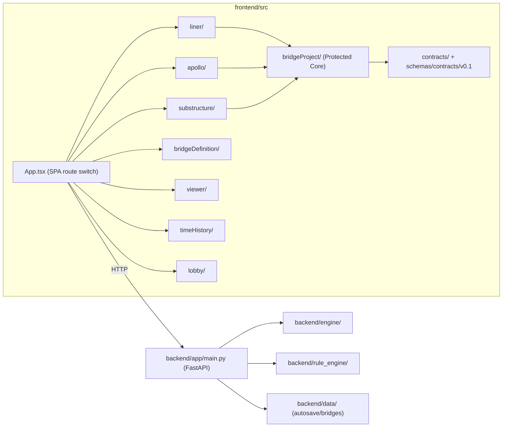
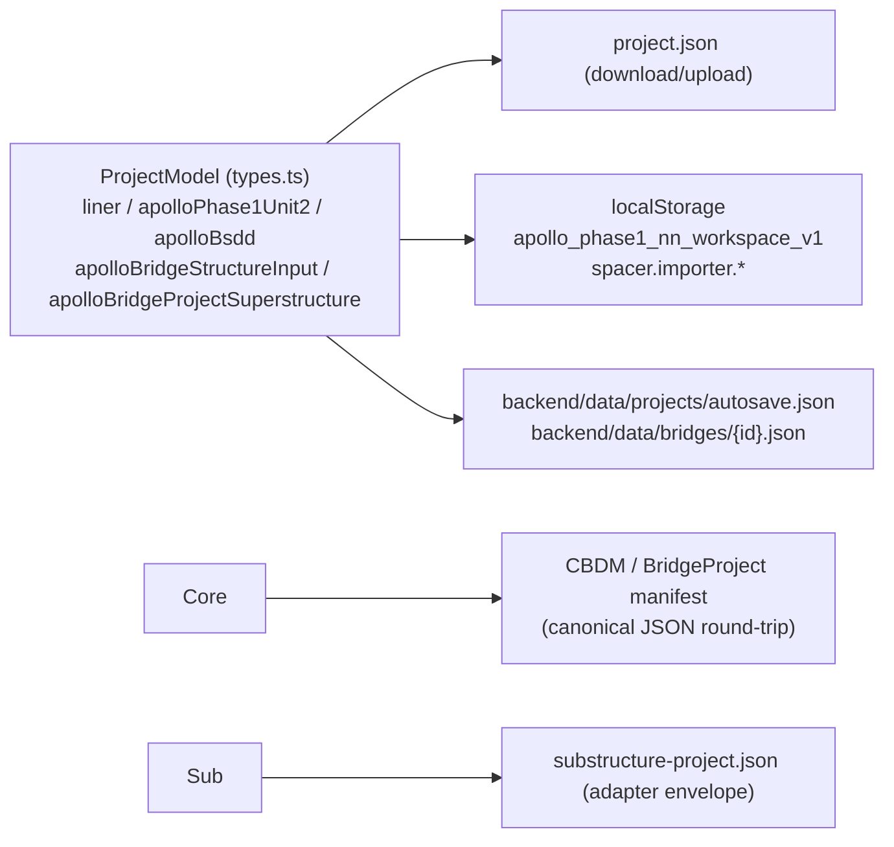

# Phase 4 / Step 4-0 現状棚卸し（Current-State Inventory）

> **Authority:** Phase 4 Step 4-0 調査（Protected Core 保護・Rebuildable Shell 確定）
> **Baseline:** origin/main `d30592ee28916efefdadfa159f13e97506f56122`
> **Branch:** `research/phase4-step4-0-inventory`
> **方針:** 大規模実装・リファクタ・削除は行わない（調査・分類のみ）。

## 1. Stable Baseline（実測）

| 検証 | 結果 |
|------|------|
| origin/main | `d30592ee`（Phase 3-9 完了） |
| open PR | 0 |
| bridgeProject suite（CASE A/B・reconstruction・scene） | 106 tests PASS |
| e2e（mountain-main3d / mountain-sample-workflow） | 5 PASS |
| frontend vitest full / backend pytest / typecheck | 確認済み（Phase 3-9 closeout 時） |

Phase 3-9 の CASE A / CASE B / Save/Load/Replay / Main3D は安定 baseline として固定。

## 2. 画面・導線（Screens / Routes）

```mermaid
flowchart TD
  subgraph Lobby["/ (LobbyHome) mode-picker"]
    Learn["/learn"] 
    Level0["/level0"]
    Pro["/pro"]
  end
  Pro --> Toolbar["Toolbar + Pro FEM shell<br/>(Viewer3D/Results/BridgeWizard/TimeHistory)"]
  Pro --> Compare["/pro/compare ModelComparison"]
  Pro --> Apollo["/pro/apollo ApolloRouteHost→ApolloPhase1Shell<br/>WF-01..WF-15"]
  Pro --> LinerLauncher["/pro/linear-coordinate LinerLauncher"]
  Pro --> Importer["/pro/importer ImporterProjectList"]
  Pro --> Liner["/pro/liner LinerList"]
  Liner --> Setup["/pro/liner/setup LinerEditPage<br/>line/station/height/vertical/crossSection/utilities/review"]
  Liner --> Preview["/pro/liner/preview"]
  Liner --> Main3D["/pro/liner/main3d LinerMain3DPage<br/>(山岳500m unified viewer)"]
  Liner --> Drawings["/pro/liner/drawings/{plan,profile,cross-section}"]
  Liner --> Mapping["/pro/liner/mapping-review"]
  Liner --> Substruct["/pro/liner/substructure SubstructurePlanningHost<br/>(3-pane CAD)"]
  Importer --> LMaster["/pro/importer/:pid/line-master/:bid"]
  Importer --> Sections["/pro/importer/:pid/sections/:bid"]
  Importer --> Export["/pro/importer/:pid/export/:bid"]
```

### 主な導線

| 起点 | 導線 | 補足 |
|------|------|------|
| Toolbar | New / Open / Save / CSV / PDF / JSON / Plan DXF / Profile DXF / Frame STL / BridgeWizard / LINER / Apollo / TimeHistory / Compare | `components/Toolbar.tsx` |
| LinerLauncher | GUI直接入力 / PDF Importer / 山岳500m sample | `LinerLauncherPage.tsx` |
| Apollo | workspace save/load / sample 200m / SuperstructurePipelinePanel（Geometry→3D→Analysis→Design→Replay→Output） | `ApolloPhase1Shell.tsx` |
| Substructure | Save `substructure-project.json` / Load / Design CSV・JSON | `SubstructurePlanningHost.tsx` |

## 3. システム構成（System Structure）

- frontend: 経路ベースSPA（react-router不使用）。`main.tsx` で `/pro/*` → `<App/>`、他 → `<LobbyApp>`。
- backend: FastAPI。解析（linear/eigen/response/time-history/influence/moving-load）・grillage（NOT_AUTHORIZED gate）・bridge CRUD・IF3。
- contract layer: `contracts/` + `schemas/contracts/v0.1`（25 JSON schema、documentKind 15種）。

## 4. データ・保存経路（Data / Storage）

| 保存先 | 内容 | 正本 |
|--------|------|------|
| ProjectModel（in-memory + project.json） | FEM + liner + apollo sidecars + superstructure sidecar | ①/②/③の source |
| localStorage（apollo workspace / importer） | Apollo プロジェクト・importer プロジェクト | ②/①の補助 |
| backend/data | autosave / bridges | 永続補助 |
| substructure-project.json | ③ SubstructureProject + AdapterEnvelope | ③ |
| CBDM / manifest（canonical JSON） | BridgeProject 共有モデル（derived・再生成可） | 共通契約 |

### 散在出力ファイル

`displacements.csv / reactions.csv / member_section_forces.csv / eigen_modes.csv / influence_lines.csv / result.json / <pid>-report.pdf / liner_plan.dxf / liner_profile.dxf / liner_frame.stl / road *.csv / *results.csv / quantity_*.csv / *.stl+.apollo.json / apollo-development-report_*.json/html / apollo-calculation-results_*.csv / substructure-design-sheet.csv / substructure-design-result.json`

## 5. Protected Core（再構築で壊してはならない）

| 領域 | 根拠（ファイル） |
|------|------------------|
| CASE A / CASE B | `bridgeProject/__tests__/caseA.e2e.test.ts` / `caseB.e2e.test.ts` |
| ①→BridgeProject→②→BridgeProject→③ | `bridgeProject/{alignmentAdapter,bridgeGeometryGenerator,superstructureBinding,substructureBinding}.ts` |
| Alignment / BridgeGeometry / Superstructure / Substructure binding | 同上 + `cbdmDocument.ts`（CBDM/manifest） |
| provenance / status / revision / cycle guard | `bridgeProject/alignmentReconstruction.ts`（cycle guard）、`contracts/bridgeProject.ts` |
| NOT_AUTHORIZED / fail-closed | `bridgeProject/validation.ts`、`superstructureAdapter.ts` |
| Save/Load/Replay | `cbdmDocument.ts`（canonical round-trip）、各 adapter serialize/parse |
| Main3D | `integratedScene3d.ts` + `viewer.tsx` |
| Calculation Adapter | `substructure/design/calculationAdapter.ts`（A-01） |

## 6. Rebuildable Shell（変更可能候補）

起動画面 / Design Platform Home（**未存在 → NEW**） / 業務一覧 / 業務Workspace / navigation / クイック解析 / Project管理UI / 保存UI / 最近使用したデータ / Import・Export導線。

## 7. KEEP / WRAP / MOVE / NEW / DEPRECATE_CANDIDATE 分類

（詳細は rebuildable-shell.csv / screens-inventory.csv 参照）

## 8. Step 4-1 への引き継ぎ

- **GO**: Protected Core 確定・Shell 候補確定・分類済み。
- **設計判断待ち**: Design Platform Home の配置（Lobby を包むか / 新設か）、業務一覧の粒度。
- **技術 blocker**: deck/cross-beam の bridge-local 3D origin 正規化（統合シーンは girder/bearing のみ）、INFERRED/MISSING のユーザー確認 UI。
