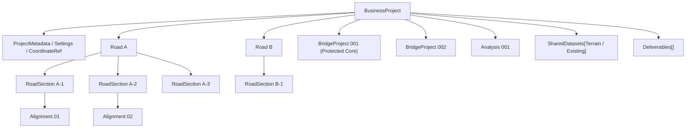

# 04 関係モデル（親子と参照の分離）

> Phase 4 / Step 4-2（P2・P8）

## 1. 原則

- **親子関係（所有）**：BusinessProject が子 Entity を「所有」する。削除・複製・権限の単位。
- **関連参照（reference）**：橋梁→線形、解析→対象、成果物→設計対象、地形→共有。**安定 ID で参照**し、所有とは独立。

両者を混同しない。

## 2. 概念図（所属）



## 3. 参照（association）概念図

```mermaid
flowchart LR
  B1["BridgeProject 001"] -->|alignmentRef| AL1["Road A / Alignment 01"]
  B2["BridgeProject 002"] -->|alignmentRefs[]| AL2["Road B / Alignment 02"]
  B2 -->|alignmentRefs[]| AL3["Road B / Alignment 03"]
  A1["Analysis 001"] -->|subjectRef| B1
  A2["Quick Analysis"] -->|subjectRef| AL1
  SD["TerrainDataset"] -.shared by.-> B1
  SD -.shared by.-> B2
  D1["Deliverable"] -->|sourceRefs[]| B1
  D1 -->|sourceRefs[]| A1
```

## 4. 表現すべき関係

| 関係 | 表現 |
|------|------|
| 1 道路 → 複数橋梁 | Road が区間・線形を持ち、複数 BridgeProject が alignmentRef で参照 |
| 1 橋梁 → 1 道路線形 | BridgeProject.alignmentRef = {roadId, sectionId?, alignmentId} |
| 1 橋梁 → 複数道路線形 | BridgeProject.alignmentRefs[]（将来分岐/Y字/JCT） |
| 1 橋梁 → 線形なし | alignmentRefs 空（道路線形と独立した橋梁） |
| 1 路線 → 複数離れ区間 | Road → RoadSections[]（非連続可・station は区間内） |
| 1 区間 → 複数橋梁 | 複数 BridgeProject が同一 section の alignment を参照 |
| 橋梁間の関連 | bridgeRelation（任意・将来） |
| 解析 → 道路/橋梁/部材 | Analysis.subjectRef = {kind: road|bridge|member, id} |
| Terrain → 複数対象から共有 | TerrainDataset を SharedDatasets に置き複数から terrainRef |
| Deliverable → 複数対象 | Deliverable.sourceRefs[] |

## 5. 安定 ID / Reference 方針

- **human-readable ID（件番・名称）と internal stable ID（UUID 等）を分離。** 件番を primary key にしない。
- rename しても reference が壊れない（ID は不変・表示名は別）。
- copy 時は ID 再発行（内部 reference は新しい ID に張り替え）。
- external import 時の ID 衝突は、import 時に namespace 分離 or 再発行。
- deleted reference 検知：参照先存在チェック（dangling reference 防止）。
- revision とは分離：ID は identity、revision は内容の版。
