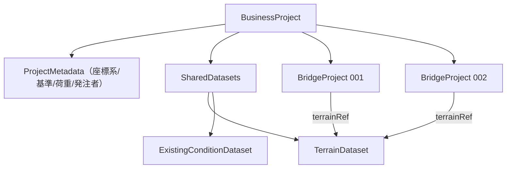

# 07 共有データの Ownership

> Phase 4 / Step 4-2（P7）

## 1. 方針

**共有される可能性が高いデータを複製して持つ構造は避ける。**
Terrain・現況・基準・設定等は **SharedDatasets に独立 Entity として置き、参照（terrainRef 等）で共有**する。

## 2. 置き場所の比較

| データ | BusinessProject 直下 | Road/Section | BridgeProject | Analysis | 独立 SharedDataset（参照） | 推奨 |
|--------|----------------------|--------------|---------------|----------|---------------------------|------|
| Terrain | × | × | × | × | ○ | **独立（terrainDatasetId・複数参照）** |
| Existing structures / 河川 / 鉄道 / 地下埋設物 | × | × | × | × | ○ | **独立（existingConditionId）** |
| 座標系 | ○（CoordinateReference） | override 可 | override 可 | — | — | **ProjectMetadata 直下 + 子 override** |
| 基準点 | ○ | — | — | — | — | BusinessProject 直下 |
| 設計基準 | ○ | — | — | — | — | BusinessProject 直下（共通設定） |
| 共通荷重条件 | ○ | — | — | — | — | BusinessProject 直下（共通設定） |
| 発注者情報 / Project metadata | ○ | — | — | — | — | ProjectMetadata |
| Source documents | ○ | — | — | — | — | BusinessProject 直下（Attachment） |

## 3. 概念図

## 4. Ownership 規則

- SharedDataset は **BusinessProject が所有**し、子（BridgeProject / Analysis）が **参照**。
- 参照中の Dataset は**単独削除不可**（参照残があれば fail-closed or 確認）。
- 複製時は Dataset を共有（コピーしない）か、明示的に複製（ID 再発行）かを選択。
