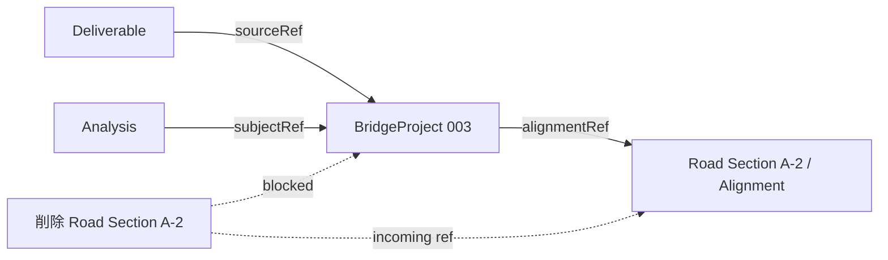

# 08 変更・複製・削除時の影響（Lifecycle / Reference 規則）

> Phase 4 / Step 4-2（P9）

## 1. ユースケース別規則

| Case | 操作 | 規則 |
|------|------|------|
| 1 | Road A の Alignment 変更 | BridgeProject は alignmentRef で参照 → **stale 検知**（参照先の revision と自身の参照 revision を比較）。整合確認は user confirmation。CASE A/B の cycle guard を尊重 |
| 2 | Bridge 002 だけ複製 | alignmentRef/terrainRef は **同じ参照を引き継ぐ（複製しない）** か、明示的に新参照へ。analysisRef は ID 再発行 |
| 3 | Road Section A-2 削除 | 参照中の Bridge 003 があれば **fail-closed（削除不可）** or 参照解除を確認 |
| 4 | BridgeProject 削除 | Analysis / Deliverable が参照中なら **dependency check**。参照残があれば確認・fail-closed |
| 5 | 業務 Project 全体の複製 | 全子 Entity を複製（ID 再発行・internal ref 張り替え）。SharedDataset は共有 or 複製を選択 |
| 6 | 離れた区間を別業務へ移す/複製 | RoadSection 単位で move/copy。参照（橋梁・線形）の再束縛を確認 |
| 7 | クイック解析を業務へ取り込み | 独立 AnalysisProject → BusinessProject.Analyses[] に copy（subjectRef 設定） |
| 8 | 業務解析を単独解析としてコピー | Analysis → 独立 AnalysisProject（ID 再発行） |

## 2. 共通規則

- **reference validation**：参照先の存在・kind・revision を検証。
- **dependency check**：削除/複製前に参照元（incoming reference）を列挙。
- **fail-closed**：参照残がある削除・整合不能な変更はブロック（黙って切り離さない）。
- **confirmation**：影響範囲がある操作はユーザー確認。

## 3. 概念図（削除時の dependency）

## 4. Protected Core との関係

- 削除・複製・変更ルールは **BridgeProject Core の外側（BusinessProject 層）** で扱う。
- BridgeProject 内部の status/provenance/revision/cycle guard は不変。
