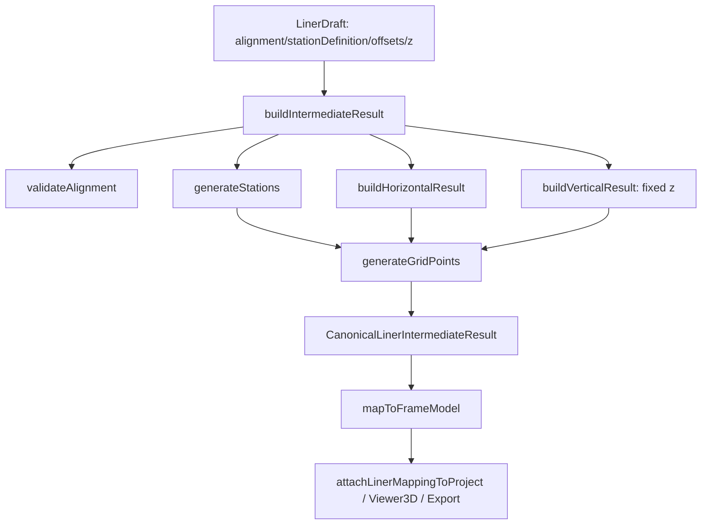
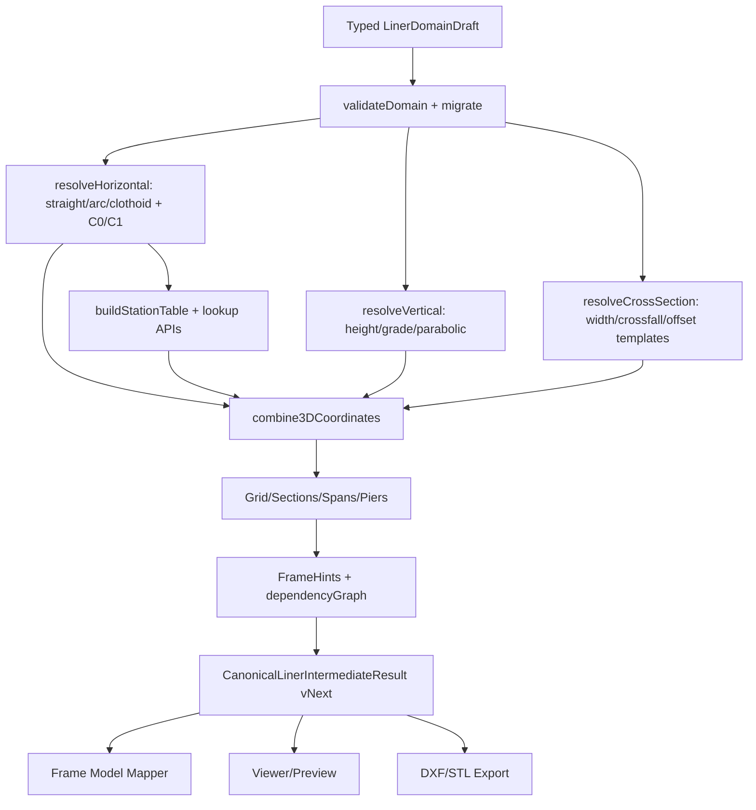

# Phase3.5-0 Investigation Report

## 1. 現在実装済み機能一覧

### Geometry Core

- 直線評価: `frontend/src/liner/core/geometry/line.ts` の `evaluateStraightElement()`。始点、方位角、延長から `point / azimuth / curvature=0` を返す。
- 円曲線評価: `frontend/src/liner/core/geometry/arc.ts` の `evaluateCircularArcElement()` と `signedArcCurvature()`。左右方向と半径から円弧上の座標、方位角、符号付き曲率を返す。
- クロソイド評価: `frontend/src/liner/core/geometry/clothoid.ts` の `evaluateClothoidElement()`、`clothoidCurvatureAt()`。Simpson積分によるPhase 0近似で、有限半径遷移も曲率線形補間で扱う。
- 統一水平評価API: `frontend/src/liner/core/geometry/horizontal.ts` の `evaluateElementAtDistance()`、`evaluateAlignmentAtDistance()`、`totalAlignmentLength()`。station/physical distanceから要素を選択し、`AlignmentEvaluation` に `localFrame` を付与する。
- 接線・法線・binormal: `frontend/src/liner/core/vector.ts` の `angleToTangent()`、`angleToNormal()`、`localFrameFromAzimuth()`、`offsetPoint()`。
- 測点生成: `frontend/src/liner/core/station/stationRules.ts` の `displayedStationAtPhysicalDistance()`、`generateStations()`。起点測点、一定間隔、明示測点、測点方程式を扱う。
- 縦断評価関数: `frontend/src/liner/core/geometry/vertical.ts` の `evaluateVerticalElement()`。勾配直線と放物線縦断曲線の評価関数はあるが、現行pipelineには未接続。
- Grid生成: `frontend/src/liner/core/grid/gridGeneration.ts` の `generateGridPoints()`。生成済みstationとoffset配列から、水平線形上の3D格点を生成する。
- 中間結果生成: `frontend/src/liner/core/pipeline/pipeline.ts` の `buildIntermediateResult()`。水平、測点、固定Z縦断、grid、dependencyGraphを組み立てる。

現状の不足:

- C0/C1連続性検証は未実装。`validateAlignment()` は長さ、円弧半径、クロソイドパラメータの基本検証のみ。
- 逆投影 `stationAtPoint(x,y)`、displayed stationからの逆引きAPIは未実装。
- 縦断geometry型はあるが、Draft/Pipeline/UI/Schemaから使われていない。
- 横断勾配、幅員、superelevation、section depth、girder eccentricityの実計算は未実装。`zProvenance` はすべて0埋め。
- クロソイドは `isPhase0ClothoidApproximation()` が示す通りPhase 0近似。設計書のFresnel/精度Gateとは未整合。

設計書との差異:

| 設計書 | 実装との差異 |
|---|---|
| `docs/liner/geometry_core.md` | 設計は直線・円弧・クロソイド、縦断、逆投影、C0/C1/G2、任意station評価を要求。実装は前方評価中心で、接続検証と逆投影が不足。 |
| `docs/liner/intermediate_result_model.md` | `grid/spans/piers/frameHints/sections` の器は実装済みだが、`spans/piers/sections` は空配列、縦断と横断は実質固定値。 |
| `docs/liner/profile_rules.md` | profile/crossfall/structural offset分離方針はあるが、pipelineでは `z` 固定のみ。 |
| `docs/liner/station_rules.md` | station equationと重複処理の一部は実装済み。displayed station逆引き、区間曖昧性解決APIは未実装。 |
| `docs/liner/test_plan_geometry.md` | GC-08以降相当の精密クロソイド、逆投影、縦断、横断のgolden testは未実装。 |

### UI

- ルート/パネル準備: `frontend/src/liner/uiPreparation.ts`。`liner.list / liner.setup / liner.preview / liner.mappingReview`、panel/workflow id、state boundaryを定義。
- ライン一覧UI: `frontend/src/liner/pages/LinerListPage.tsx`。現在projectに付与済みの `project.liner` メタデータを1件表示する。
- 編集UI: `frontend/src/liner/pages/LinerEditPage.tsx`。メタデータ、線形要素表、直線要素の編集、preview/mapping reviewへの導線。
- 測点・高さ・offset UI: `frontend/src/liner/components/LinerStationProfilePanel.tsx`。起点測点、測点間隔、sample interval、固定Z、明示測点、測点方程式、offset配列を編集。
- 平面preview: `frontend/src/liner/components/LinerGridPreview.tsx` と `frontend/src/liner/pages/LinerPreviewPage.tsx`。SVGでaxis polyline、grid line、grid pointを表示。
- Viewer連携確認UI: `frontend/src/liner/pages/LinerMappingReviewPage.tsx`。DraftからFrame Modelを生成し、既存 `Viewer3D` に渡して確認・確定できる。
- 入力値検証: UI側は `parseNumericInput()` で非数値を0に丸める程度。実検証は `buildIntermediateResult()`、`generateStations()`、`buildLinerPreviewFromDraft()`、`buildLinerViewerReviewFromDraft()` のdiagnosticsに寄っている。

不足UI一覧:

| コンポーネント名 | 配置予定場所 | 優先度 | 不足内容 |
|---|---|---:|---|
| HorizontalElementEditor | `frontend/src/liner/pages/LinerEditPage.tsx` 配下 | P0 | 円曲線、クロソイド、要素接続補助、PI入力、左右方向、半径/A値入力。 |
| LineDataPage/Panel | `liner.setup` | P0 | JIP-LINERの「ラインデータ」に相当する複数線形/要素一覧。現状は単一alignment前提。 |
| StationSettingPanel | `LinerStationProfilePanel.tsx` 拡張または分割 | P0 | 測点設定は一部あるが、表示測点逆引き、重複測点の明示、JIP-LINER風の専用表が不足。 |
| HeightDataPanel | `liner.setup` | P0 | 測点ごとの高さ入力、既知点高さ、標高テーブル。現状は固定Zのみ。 |
| VerticalGradePanel | `liner.setup` | P0 | 縦断勾配、PVI/PVC/PVT、放物線縦断曲線入力。 |
| CrossfallPanel | `liner.setup` | P0 | 左右横断勾配、superelevation、幅員、左右offsetテンプレート。 |
| CrossSectionTemplatePanel | `liner.setup` | P1 | 幅員、構造基準面、桁偏心、断面深さ、role割当。 |
| ContinuityDiagnosticsPanel | `liner.preview` | P1 | C0/C1/G2接続エラー、曲線端点の差分表示。 |
| CurveSamplingControl | `liner.preview` / export settings | P1 | 曲線表示・DXF近似・Frame分割のsample intervalを用途別に調整。 |
| PropertyPanelIntegration | `frontend/src/components/PropertyPanel.tsx` | P2 | 既存Property Panelにliner entity選択を連携。現状は専用linerページ中心。 |

### Data Model（Draft Schema）

- Draft型: `frontend/src/liner/adapters/linerUiAdapter.ts` の `LinerDraft = BuildIntermediateInput`。`alignment / stationDefinition / offsets / sampleInterval / z` を保持。
- Alignment型: `frontend/src/liner/core/types.ts` の `LinearAlignment`、`AlignmentElement`。直線、円弧、クロソイド型は定義済み。
- Project永続メタデータ: `frontend/src/liner/schema/types.ts` の `ProjectLinerMetadata`。`schemaVersion=0.1.0`、`sourceRevision`、`linerModelId`、`coordinatePolicyId`、`intermediateSchemaVersion=0.2.0`、任意 `draft`。
- Project JSON Schema: `schemas/project.schema.json` の `projectLinerMetadata`、`linerTraceEntry`。`liner.draft` は `additionalProperties: true` の自由形式。
- Migration: `frontend/src/liner/schema/projectLinerMigration.ts` の `migrateProjectLinerExtension()` と `ensureProjectLinerTraceArray()`。旧projectに `linerTrace` を補う程度。
- Validation: `frontend/src/liner/schema/validateProjectLinerExtension.ts`。metadataとtraceの最低限検証。
- Draft保存adapter: `frontend/src/liner/adapters/linerProjectDraft.ts`。`project.liner.draft` にDraftを出し入れする。

現Schemaから拡張後Schemaの差分案:

| 領域 | 現Schema | 拡張後案 | 変更種別 |
|---|---|---|---|
| `liner.draft` | 自由形式object | `linerDomainSchemaVersion`, `alignment`, `stationDefinition`, `verticalAlignment`, `crossSections`, `gridDefinitions`, `generationSettings` を型付き定義 | 追加/型厳格化 |
| `alignment.elements[]` | TS型のみ。JSON Schemaなし | `straight/arc/clothoid` discriminated unionをJSON Schema化 | 追加 |
| `vertical` | `z` 固定値のみ | `verticalAlignment.elements[]` に `grade/parabolic`、PVI/PVC/PVT関連field | 追加 |
| `crossSection` | `offsets: number[]` のみ | `crossSections[]`、左右幅員、横断勾配、structuralReferenceOffset、sectionDepthOffset、role | 追加 |
| `gridDefinition` | 暗黙の `GRID-{linerModelId}-default` | station範囲、longitudinal interval、transverse offsets/template参照、mesh division | 追加 |
| `spans/piers` | intermediateでは空配列、draftに無し | draft側に `spans[]`, `piers[]`, skew, support line, bearing offsets | 追加 |
| `schemaVersion` | `ProjectLinerMetadata.schemaVersion=0.1.0` | domain draft versionを別field化。例: `liner.domainSchemaVersion=0.2.0` | 追加 |
| Migration | `linerTrace` array補完のみ | v0.1固定Z/offset Draftから v0.2 vertical/crossSection へ非破壊migration | 追加 |

### Calculation Pipeline

現状フロー:

拡張後フロー案:

差し替え/追加が必要なステップ:

- `frontend/src/liner/core/pipeline/pipeline.ts`: `BuildIntermediateInput` を型付きDomain Draftへ拡張し、固定Zの `buildVerticalResult()` を縦断入力ベースに差し替える。
- `frontend/src/liner/core/grid/gridGeneration.ts`: `z` 固定と `offsets` 配列を、縦断評価 + 横断勾配 + cross section templateの合成へ変更する。
- `frontend/src/liner/core/geometry/horizontal.ts`: C0/C1連続性検証、曲線端点検証、逆投影APIを追加する。
- `frontend/src/liner/core/pipeline/sourceRevision.ts`: domain schema versionと新規domain fieldを含めたrevision規則を固定する。
- キャッシュ: 現状は `sourceRevision` と `dependencyGraph` はあるが、部分計算キャッシュは実装されていない。UIは毎回 `useMemo` 内でpipelineを再実行する。

### Viewer

- 既存Viewer本体: `frontend/src/viewer/Viewer3D.tsx`、`frontend/src/viewer/ThreeViewport.tsx`、`frontend/src/viewer/SceneBuilder.ts`。
- Renderer: `frontend/src/viewer/renderers/NodeRenderer.ts`、`MemberRenderer.ts`、`SupportRenderer.ts`、`LoadRenderer.ts`、`ResultDiagramRenderer.ts`、`DeformedShapeRenderer.ts`。
- 描画対象: Node sphere、Member line/arrow、Support glyph、Load arrow、result diagram、label、grid helper、axes、deformed shape。
- Fallback 2D: `frontend/src/viewer/Fallback2DViewport.tsx`。node/memberをSVG line/circleで表示。
- Liner preview: `frontend/src/liner/components/LinerGridPreview.tsx`。SVG polyline/circleでaxis/gridを描画。

曲線対応時の影響箇所:

| ファイル/関数 | 直線前提/影響 | 修正方針 |
|---|---|---|
| `frontend/src/liner/core/grid/gridGeneration.ts` `generateGridPoints()` | nodeはstationごとに生成。曲線の見栄えはstation密度依存。 | 曲線用mesh divisionとsample intervalを分離し、円弧/クロソイドで最大弦長・角度誤差制御を追加。 |
| `frontend/src/liner/mapper/frameModelMapper.ts` `mapToFrameModel()` | memberは隣接grid point間の直線部材。曲線memberは折線近似になる。 | Frame Modelは直線member群として扱う前提を明文化し、分割密度を設計値にする。 |
| `frontend/src/liner/components/LinerGridPreview.tsx` | SVG polyline表示。曲線はsampledPoints密度依存。 | `horizontal.sampledPoints` の密度を用途別設定にし、曲率に応じたadaptive samplingを検討。 |
| `frontend/src/viewer/renderers/MemberRenderer.ts` | `createLine([start,end])` で直線部材表示。 | FEM memberが直線でよいなら修正不要。曲線中心線レイヤを出すなら別renderer追加。 |
| `frontend/src/viewer/Fallback2DViewport.tsx` | memberをSVG lineで投影。 | 同上。曲線自体を見せる場合はlinerTrace/source grid layerが必要。 |

### Export

- 2D DXF: `frontend/src/liner/exports/linerPlanDxf.ts` の `buildLinerPlanDxf()`。Maker.jsのline pathで中心線とlongitudinal offset lineを出力。
- Vertical DXF: `frontend/src/liner/exports/linerProfileDxf.ts` の `buildLinerProfileDxf()`。固定Zのdesign polylineとground lineをline pathで出力。
- STL: `frontend/src/liner/exports/linerFrameStl.ts` の `buildLinerFrameStl()`。ProjectModelのmemberごとにJSCAD cylinderを生成。
- DXF基盤確認: `frontend/src/liner/exports/makerDxfSpike.ts`。Maker.js DXF出力とheader確認。

Exporterごとの直線前提と戦略:

| Exporter | 直線前提箇所 | 曲線対応戦略案 |
|---|---|---|
| 2D DXF | `addPolylineSegments()` がlineのみ。円弧/クロソイド情報をDXF entityとして保持しない。 | Phase3.5-5初期はポリライン近似が現実的。Human DecisionでDXF ARC対応の必要性を判定。円弧のみARC、クロソイドはpolylineの混在も選択肢。 |
| Vertical DXF | 縦断は `vertical.sampledPoints` のline列。現状は固定Zで実質水平線。 | 縦断曲線実装後もpolyline近似で十分実装可能。PVI/PVC/PVTラベル追加は別タスク。 |
| STL | member端点間の直線円柱。曲線線形は分割済みmemberに依存。 | Frame分割密度で近似。真の曲線tubeはFEM memberと乖離するため非推奨。 |

### Test

- Geometry: `frontend/src/liner/core/__tests__/geometry.test.ts`、`clothoid.test.ts`、`station.test.ts`、`pipeline.test.ts`。
- Mapper/Frame: `frontend/src/liner/mapper/__tests__/frameModelMapper.test.ts`、`frameIds.test.ts`、`frontend/src/liner/headless/__tests__/createHeadlessLinerFrameProject.test.ts`。
- UI: `frontend/src/liner/pages/*.test.tsx`、`components/*.test.tsx`、`adapters/*.test.ts`、`__tests__/uiPreparation.test.ts`。
- Schema/Migration: `frontend/src/liner/schema/__tests__/projectLinerExtension.test.ts`、`frontend/src/liner/adapters/linerProjectDraft.test.ts`。
- Export: `frontend/src/liner/exports/linerPlanDxf.test.ts`、`linerProfileDxf.test.ts`、`linerFrameStl.test.ts`、`makerDxfSpike.test.ts`。
- Viewer: 汎用viewer testは `frontend/src/viewer/*.test.tsx` と `frontend/src/viewer/renderers/*.test.ts` にあるが、曲線liner専用viewer testはない。

追加が必要なテスト一覧:

| カテゴリ | テスト名案 | 目的 |
|---|---|---|
| Geometry | `horizontal.continuity.test.ts` | 要素接続点のC0/C1/G2診断を検証。 |
| Geometry | `arc.golden.test.ts` | 左右円曲線の端点、方位角、曲率、境界値を検証。 |
| Geometry | `clothoid.golden.test.ts` | 設計書GC-08〜10相当の精度検証。 |
| Geometry | `stationInverse.test.ts` | `stationAtPoint`、offset、displayed station逆引きの境界値を検証。 |
| Vertical | `verticalAlignment.test.ts` | 勾配直線、PVI/PVC/PVT、放物線曲線の高さ・勾配検証。 |
| Cross Section | `crossfallGrid.test.ts` | 左右横断勾配、幅員、offset別Z合成、zProvenanceを検証。 |
| Pipeline | `pipeline.curved3d.test.ts` | Horizontal+Vertical+CrossSectionからgrid 3D座標を生成する統合test。 |
| Schema | `linerDomainDraftMigration.test.ts` | v0.1固定Z/offset DraftからvNext domain draftへのmigration。 |
| UI | `LinerCurveElementEditor.test.tsx` | 円弧/クロソイド入力とvalidation表示。 |
| UI | `VerticalGradePanel.test.tsx` | 高さデータ/縦断勾配入力。 |
| UI | `CrossfallPanel.test.tsx` | 横断勾配/幅員入力。 |
| Viewer | `LinerMappingReviewPage.curve.test.tsx` | 曲線線形から生成された折線memberがViewerで破綻しないこと。 |
| Export | `linerPlanDxf.curve.test.ts` | 曲線のpolyline/ARC出力方針を固定。 |
| Export | `linerProfileDxf.verticalCurve.test.ts` | 縦断曲線のDXF出力を検証。 |
| E2E | `liner-curved-alignment.spec.ts` | JIP-LINER風入力からPreview、Mapping、Exportまでの主要導線。 |

### Design Documents（`docs/liner`）

- 実装と概ね対応済み: `calculation_pipeline.md`、`intermediate_result_model.md`、`integration_with_frame_model.md`、`schema_migration_policy.md`、`ui_preparation.md`、`ui_list_page.md`、`ui_edit_page.md`、`ui_grid_preview.md`、`ui_mapping_review.md`。
- 更新が必要: `geometry_core.md`、`domain_model.md`、`project_file_format.md`、`profile_rules.md`、`validation_rules.md`、`cad_output_spec.md`、`rendering_strategy.md`、`test_plan_geometry.md`、`test_plan_cad_report.md`。
- 新規が必要: Phase3.5向けの「Horizontal Curve Completion Design」「Vertical Alignment Design」「Cross Section/Superelevation Design」「3D Coordinate Integration Design」「DXF/STL Curve Export Strategy」「Typed Liner Draft Schema vNext」。

## 2. 不足機能一覧

| 優先度 | 不足機能 | 対象Phase | 現状 |
|---:|---|---|---|
| P0 | 円曲線/クロソイドの編集UI | 3.5-1 | Core型と評価はあるがUIは読み取り表示のみ。 |
| P0 | 水平要素接続C0/C1検証 | 3.5-1 | 設計書に診断コードあり。実装未接続。 |
| P0 | 曲線向けadaptive sampling | 3.5-1/3.5-4/3.5-5 | sampleInterval固定。曲率誤差制御なし。 |
| P0 | 縦断入力domain/UI/pipeline接続 | 3.5-2 | `vertical.ts` はあるが固定Z pipeline。 |
| P0 | 横断勾配・幅員・左右offset domain/UI/core | 3.5-3 | `offsets` 配列のみ。crossfallは0。 |
| P0 | Horizontal + Vertical + CrossSectionの3D座標合成 | 3.5-4 | `z` 固定、`zProvenance` は0埋め。 |
| P0 | Draftの型付き保存とmigration | 3.5-1〜3.5-4 | `liner.draft` は自由形式。migrationは最小限。 |
| P1 | 逆投影・displayed station lookup | 3.5-1 | 未実装。設計書にはAPIあり。 |
| P1 | Span/Pier/SectionSlice生成 | 3.5-3/3.5-4 | 型はあるが空配列。 |
| P1 | Export曲線方針確定 | 3.5-5 | 現状line segment DXFのみ。 |
| P2 | Property Panel統合 | 3.5-1〜3.5-3 | 専用liner画面に閉じている。 |
| P2 | Backend/API側liner validation | 3.5-4/3.5-5 | TS frontend中心。backendはProjectModel validation中心。 |

## 3. 影響範囲一覧

| カテゴリ | 影響ファイル/モジュール | 修正概要 | Phase |
|---|---|---|---|
| コード | `frontend/src/liner/core/geometry/horizontal.ts` | C0/C1検証、逆投影、曲線sampling制御を追加。 | 3.5-1 |
| コード | `frontend/src/liner/core/geometry/clothoid.ts` | Phase 0近似の精度Gate、標準/有限半径クロソイドの仕様固定。 | 3.5-1 |
| コード | `frontend/src/liner/core/geometry/vertical.ts` | domain/pipelineから呼べる縦断alignment APIに拡張。 | 3.5-2 |
| コード | `frontend/src/liner/core/grid/gridGeneration.ts` | fixed z/offset配列から、縦断+横断合成の3D格点生成へ変更。 | 3.5-3/3.5-4 |
| コード | `frontend/src/liner/core/pipeline/pipeline.ts` | Domain Draft vNext、vertical/cross section/spans/piers/sections stageを追加。 | 3.5-1〜3.5-4 |
| コード | `frontend/src/liner/mapper/frameModelMapper.ts` | 曲線近似member密度、local frame/orientation、support/skew対応。 | 3.5-4 |
| 設計書 | `docs/liner/geometry_core.md` | 実装完了範囲、C0/C1、クロソイド精度、逆投影のGate条件を更新。 | 3.5-1 |
| 設計書 | `docs/liner/profile_rules.md` | 縦断/横断/高さデータの入力仕様とZ合成規則を確定。 | 3.5-2/3.5-3 |
| 設計書 | `docs/liner/project_file_format.md` | 型付きDraft Schemaとmigration方針を追加。 | 3.5-1 |
| 設計書 | `docs/liner/cad_output_spec.md` | DXF ARC vs polyline、STL近似方針を決定。 | 3.5-5 |
| UI | `frontend/src/liner/pages/LinerEditPage.tsx` | 直線専用表を水平線形要素editorへ拡張。 | 3.5-1 |
| UI | `frontend/src/liner/components/LinerStationProfilePanel.tsx` | 測点、高さ、縦断、横断を分割/再編。 | 3.5-2/3.5-3 |
| UI | `frontend/src/liner/pages/LinerPreviewPage.tsx` | 曲線・縦断・横断diagnosticsとpreview切替。 | 3.5-1〜3.5-4 |
| Viewer | `frontend/src/liner/components/LinerGridPreview.tsx` | 曲線adaptive polyline表示と横断Z/offset可視化。 | 3.5-1/3.5-4 |
| Viewer | `frontend/src/viewer/renderers/MemberRenderer.ts` | 曲線由来の分割member表示方針を確認。必要ならliner centerline layer追加。 | 3.5-4 |
| Export | `frontend/src/liner/exports/linerPlanDxf.ts` | 曲線中心線/offset線のpolylineまたはARC対応。 | 3.5-5 |
| Export | `frontend/src/liner/exports/linerProfileDxf.ts` | 縦断勾配/縦断曲線の出力。 | 3.5-5 |
| Export | `frontend/src/liner/exports/linerFrameStl.ts` | 曲線近似member分割後のSTL出力確認。 | 3.5-5 |
| Test | `frontend/src/liner/core/__tests__/*` | 曲線、縦断、横断、3D合成、migration testを追加。 | 3.5-1〜3.5-4 |
| Test | `frontend/src/liner/exports/*.test.ts` | 曲線/縦断DXF、STL近似の回帰test追加。 | 3.5-5 |
| Schema | `schemas/project.schema.json` | `liner.draft` の型付きschema化、domain schema version追加。 | 3.5-1 |
| Schema | `frontend/src/liner/schema/*` | v0.1 metadata/draftからvNext typed draftへのmigration。 | 3.5-1〜3.5-3 |

## 4. 推奨実装順

| SubPhase | 内容 | 前提条件 | 成果物 | 工数感 |
|---|---|---|---|---|
| 3.5-1a | Horizontal Domain/Draft Schema vNext | 本レポート承認、DXF方針は未決でも可 | 型付き `straight/arc/clothoid` Draft、migration案 | M |
| 3.5-1b | 水平曲線Core completion | 3.5-1a | C0/C1検証、曲線sampling、golden test、逆投影最小API | L |
| 3.5-1c | 水平曲線UI | 3.5-1a/1b | 円曲線・クロソイド入力UI、diagnostics表示 | M |
| 3.5-2a | 縦断Domain/Schema/UI | 3.5-1a | 高さデータ、縦断勾配、縦断曲線入力 | M |
| 3.5-2b | 縦断Core/Pipeline | 3.5-2a | `vertical.sampledPoints` 実計算、gradeBreaks、test | M |
| 3.5-3a | 横断Domain/UI | 3.5-1a | 幅員、左右offset、横断勾配、template入力 | M |
| 3.5-3b | 横断Z合成Core | 3.5-2b/3a | `zProvenance` 実値、section slices、crossfall test | L |
| 3.5-4a | 3D座標統合Pipeline | 3.5-1〜3.5-3 | Horizontal+Vertical+CrossSection統合grid、spans/piers最小対応 | L |
| 3.5-4b | Frame Mapper/Viewer調整 | 3.5-4a | 曲線由来member分割、Viewer review、trace安定化 | M |
| 3.5-5a | DXF戦略実装 | Human Decision: ARC/polyline | Plan/Profile DXF曲線・縦断対応 | M |
| 3.5-5b | STL/Export regression | 3.5-4b | STL近似確認、export test、E2E | S |

## 5. Phase3.5全体で必要となる設計書一覧

| 設計書 | 新規/修正 | 想定章立て | 担当Phase |
|---|---|---|---|
| Horizontal Curve Completion Design | 新規 | 対象要素、入力方式、C0/C1、sampling、逆投影、test cases | 3.5-1 |
| Typed Liner Draft Schema vNext | 新規 | schemaVersion、水平/縦断/横断domain、migration、compatibility | 3.5-1 |
| `geometry_core.md` | 修正 | 実装済みAPI、精度基準、クロソイドGate、未実装項目の解消条件 | 3.5-1 |
| `validation_rules.md` | 修正 | 水平/縦断/横断別validation、diagnostic code mapping | 3.5-1〜3.5-3 |
| Vertical Alignment Design | 新規 | 高さデータ、縦断勾配、縦断曲線、station境界、UI/Schema/Pipeline | 3.5-2 |
| `profile_rules.md` | 修正 | profile elevation、crossfall、structural offsetの責務分離 | 3.5-2/3.5-3 |
| Cross Section and Superelevation Design | 新規 | 幅員、左右offset、横断勾配、template、Z合成 | 3.5-3 |
| 3D Coordinate Integration Design | 新規 | 統合式、zProvenance、grid/spans/piers/sections、trace | 3.5-4 |
| `calculation_pipeline.md` | 修正 | vNext stage order、cache/invalidation、public API | 3.5-4 |
| `rendering_strategy.md` | 修正 | 曲線preview、Frame Viewer、sampling policy | 3.5-4 |
| DXF/STL Curve Export Strategy | 新規 | polyline vs ARC、profile labels、STL分割、test policy | 3.5-5 |
| `cad_output_spec.md` | 修正 | DXF実装現実方針、layer/entity、近似許容誤差 | 3.5-5 |
| `test_plan_geometry.md` | 修正 | GC-08以降、縦断/横断/統合golden追加 | 3.5-1〜3.5-4 |
| `test_plan_cad_report.md` | 修正 | 曲線DXF、縦断DXF、STL、E2E export test | 3.5-5 |

## 6. Human Decision 事項

- DXF曲線出力をポリライン近似で統一するか、円曲線のみDXF ARC entityに対応するか。
- クロソイドの実装精度基準を、現行Simpson積分の改良で満たすか、Fresnel級数/専用数値実装に置き換えるか。
- JIP-LINER構成へどこまで寄せるか。特に「ラインデータ」「測点設定」「高さデータ」「縦断勾配」「横断勾配」を別ページ/別タブ/単一編集画面のどれにするか。
- Draft migrationで旧 `liner.draft` 自由形式を完全サポートするか、v0.1固定Z/offsetだけを非破壊migration対象にするか。
- Project保存時にliner domain draftを必須保存するか、Frame生成後の `linerTrace` とメタデータだけを正式互換対象にするか。
- Frame Model上で曲線を細分化直線memberとして扱う方針を正式化するか。真の曲線member概念は現行FEM/Viewer/Exportと不整合が大きい。
- 横断勾配の符号、左右offsetのUI表記、superelevation回転をlocalFrameに反映する時期。
- 複数alignmentをPhase3.5で扱うか、単一alignmentを継続するか。
- 曲線samplingの既定値。表示用、DXF用、Frame member分割用を分けるか。

## 7. リスク・依存関係

- Phase依存: 3.5-4の3D座標統合は、3.5-1水平曲線、3.5-2縦断、3.5-3横断のdomain/schema/coreが揃うことが前提。
- Export依存: 3.5-5は `LinerIntermediateResult` の曲線sample、縦断sample、grid/sectionsの安定化が前提。
- Schemaリスク: 現在 `liner.draft` が自由形式のため、型付きschema化時に既存Draftとの互換方針を誤ると保存/読込が壊れる。
- 数値精度リスク: クロソイド、接続点連続性、逆投影は許容誤差を先に固定しないとtestが不安定になる。
- パフォーマンスリスク: 曲線adaptive samplingと細分化memberによりgrid点数/member数が増える。Viewer/Export/STL生成の負荷確認が必要。
- UIリスク: 既存 `LinerEditPage` は直線中心の表構造。JIP-LINER風に再編する場合、単純なフィールド追加では使いにくくなる。
- Viewerリスク: 既存ViewerはFrame Modelの直線member表示。曲線中心線とFEM member折線の見た目差をどう説明/表示するか決める必要がある。
- Exportリスク: DXF ARC対応は円弧だけなら可能だが、クロソイドやoffset曲線の厳密表現は難しい。ポリライン近似の許容誤差を仕様化する方が実装リスクは低い。
- 技術的負債: `validateAlignment()` が接続検証をしないため、複数要素alignmentで見た目だけ成立しても物理的に不連続な線形が通る。
- 技術的負債: `vertical.ts` がpipelineと分離しており、今後の縦断実装時に既存固定Zロジックを置き換える必要がある。
- 技術的負債: `spans/piers/sections` の型はあるが空配列運用。Phase3.5-4で生成責務と入力UIを同時に決めると手戻りが大きい。
