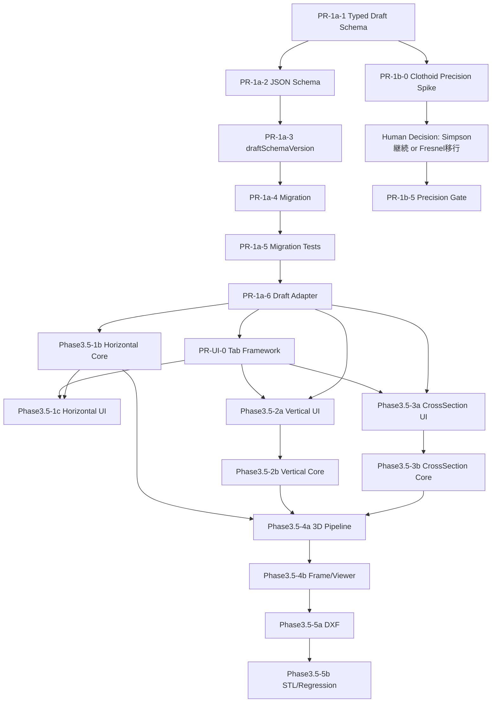

# Phase3.5 Implementation Priority and PR Breakdown

## 0. 位置づけ

- 設計書完成後、Phase3.5-1〜5の実装をPR単位まで分割した実行計画書。
- N1〜N6の設計書がすべて承認されたことを前提とする。
- 1PR = レビュー可能な最小単位。目安は差分500〜1500行、レビュー1〜2時間で完了する規模。

## 1. PR分割の原則

### 1.1 PR単位の基本方針

- **1PR = 1責務**: domain追加、UI追加、pipeline接続、test追加などを混在させない。
- **PR間の依存関係を明示**: 「PR-A完了後にPR-Bを着手」のフローを明示する。
- **各PRにDone条件を明記**: マージ可能と判断するチェックリストを置く。
- **rollback容易性**: 可能な限り独立revert可能な単位に切る。
- **CI green前提**: 型check、lint、既存testが通ることをDone条件に含める。

### 1.2 PR命名規則

- `[Phase3.5-Xy-N] <概要>` 形式。
- Xy: SubPhase記号。例: 1a, 1b, 1c, 2a, 2b, 3a, 3b, 4a, 4b, 5a, 5b。
- N: PR単位の連番。

### 1.3 PRサイズの目安

- S: 差分300行以下 / レビュー30分以内。
- M: 差分300〜800行 / レビュー1時間以内。
- L: 差分800〜1500行 / レビュー1〜2時間以内。
- L超は原則禁止。分割困難な場合は理由を明記する。

## 2. SubPhase別 PR分割計画

### Phase3.5-1: 水平曲線

#### Phase3.5-1a: Horizontal Domain / Draft Schema vNext

- PR-1a-1: Typed Draft Schema 型定義追加。
- PR-1a-2: JSON Schema追加。
- PR-1a-3: schemaVersion管理機構。
- PR-1a-4: v0.1 -> vNext migration実装。
- PR-1a-5: migration test追加。
- PR-1a-6: 既存Draft adapter対応。

#### Phase3.5-1b: 水平曲線Core completion
- PR-1b-0: Clothoid Precision Spike (prerequisite for PR-1b-5; parallel with PR-1b-1).

- PR-1b-1: `validateAlignment()` のC0連続性検証追加。
- PR-1b-2: `validateAlignment()` のC1連続性検証追加。
- PR-1b-3: 曲線sampling 3系統分離。
- PR-1b-4: 逆投影API `stationAtPoint(x,y)` 実装。
- PR-1b-5: クロソイド精度Gate実装。
- PR-1b-6: golden test追加。

#### Phase3.5-1c: 水平曲線UI

- PR-1c-1: HorizontalElementEditor 円曲線入力。
- PR-1c-2: HorizontalElementEditor クロソイド入力。
- PR-1c-3: ContinuityDiagnosticsPanel追加。
- PR-1c-4: CurveSamplingControl追加。
- PR-1c-5: UIテスト追加。

### Phase3.5-2: 縦断線形

#### Phase3.5-2a: 縦断Domain/Schema/UI

- PR-2a-1: Vertical Draft Schema型定義追加。
- PR-2a-2: JSON Schema追加。
- PR-2a-3: HeightDataPanel追加。
- PR-2a-4: VerticalGradePanel追加。
- PR-2a-5: UIテスト追加。

#### Phase3.5-2b: 縦断Core/Pipeline

- PR-2b-1: `vertical.ts` API拡張。
- PR-2b-2: `buildVerticalResult()` 差し替え。
- PR-2b-3: gradeBreaks / sampledPoints実装。
- PR-2b-4: vertical golden test追加。
- PR-2b-5: pipeline統合test追加。

### Phase3.5-3: 横断線形

#### Phase3.5-3a: 横断Domain/UI

- PR-3a-1: CrossSection Draft Schema型定義追加。
- PR-3a-2: JSON Schema追加。
- PR-3a-3: CrossfallPanel追加。
- PR-3a-4: CrossSectionTemplatePanel追加。
- PR-3a-5: UIテスト追加。

#### Phase3.5-3b: 横断Z合成Core

- PR-3b-1: 横断Z合成ロジック実装。
- PR-3b-2: section slices生成。
- PR-3b-3: crossfall test追加。
- PR-3b-4: 符号規約regression test。

### Phase3.5-4: 3D座標統合

#### Phase3.5-4a: 3D座標統合Pipeline

- PR-4a-1: pipeline stage order再編。
- PR-4a-2: `combine3DCoordinates()` 実装。
- PR-4a-3: spans/piers最小生成。
- PR-4a-4: localFrame反映。
- PR-4a-5: pipeline.curved3d test追加。

#### Phase3.5-4b: Frame Mapper/Viewer調整

- PR-4b-1: `frameModelMapper.ts` 曲線member分割対応。
- PR-4b-2: LinerGridPreview adaptive sampling対応。
- PR-4b-3: Viewer trace安定化。
- PR-4b-4: LinerMappingReviewPage curve test追加。

### Phase3.5-5: Export再対応

#### Phase3.5-5a: DXF戦略実装

- PR-5a-1: `linerPlanDxf.ts` polyline近似対応。
- PR-5a-2: `linerProfileDxf.ts` 縦断対応。
- PR-5a-3: DXF許容誤差設定集約。
- PR-5a-4: linerPlanDxf curve test追加。
- PR-5a-5: linerProfileDxf vertical curve test追加。

#### Phase3.5-5b: STL/Export regression

- PR-5b-1: STL曲線近似member確認・微調整。
- PR-5b-2: Export回帰test整備。
- PR-5b-3: E2E test追加。
- PR-5b-4: ドキュメント最終整備。

## 3. PR間依存関係グラフ

Phase3.5-0.6補遺で PR-UI-0 と PR-1b-0 を追加した後の依存関係は以下とする。



```text
PR-1a-1 -> PR-1a-2 -> PR-1a-3 -> PR-1a-4 -> PR-1a-5 -> PR-1a-6 -> PR-UI-0
                                                              |             |
                                                              |             -> PR-1c-1, PR-2a-3, PR-3a-3 並列開始可能
                                                              -> PR-1b-1..4/6
PR-1a-1 -> PR-1b-0 -> Human Decision -> PR-1b-5

Phase3.5-1b + 2b + 3b -> Phase3.5-4a -> Phase3.5-4b -> Phase3.5-5a -> Phase3.5-5b
```

## 4. 各PRの詳細仕様

### PR-1a-1: Typed Draft Schema 型定義追加

| 項目 | 内容 |
|---|---|
| サイズ | M |
| 依存PR | なし |
| ブロックするPR | PR-1a-2, PR-1a-4, PR-2a-1, PR-3a-1 |
| 関連設計書 | N2, U4 |
| 工数目安 | 1d |

**変更対象ファイル**:
- `frontend/src/liner/schema/types.ts`
- `frontend/src/liner/core/types.ts`

**変更内容サマリ**:
- `LinerDomainDraftVNext` と水平/縦断/横断domain interfaceを追加。
- `liner.draftSchemaVersion` の型を追加。

**Done条件（チェックリスト）**:
- [ ] 型定義のみでruntime挙動を変えない
- [ ] 型check green
- [ ] 既存test green
- [ ] N2との整合性確認済み

**レビュー観点**:
- union discriminatorが安定しているか。
- 既存 `ProjectLinerMetadata` との責務分離が明確か。

### PR-1a-2: JSON Schema追加

| 項目 | 内容 |
|---|---|
| サイズ | M |
| 依存PR | PR-1a-1 |
| ブロックするPR | PR-1a-5 |
| 関連設計書 | N2, U4 |
| 工数目安 | 1d |

**変更対象ファイル**:
- `schemas/project.schema.json`

**変更内容サマリ**:
- `liner.draftSchemaVersion` と `liner.domainDraft` schemaを追加。
- 水平要素をdiscriminated unionとして定義。

**Done条件（チェックリスト）**:
- [ ] JSON Schemaがvalid
- [ ] 既存project fixtureが通る
- [ ] 新規vNext fixtureが通る
- [ ] N2 field一覧と一致

**レビュー観点**:
- 既存 `liner.schemaVersion` と混同していないか。
- additive変更として後方互換を保てるか。

### PR-1a-3: schemaVersion管理機構

| 項目 | 内容 |
|---|---|
| サイズ | S |
| 依存PR | PR-1a-1 |
| ブロックするPR | PR-1a-4, PR-1a-6 |
| 関連設計書 | N2 |
| 工数目安 | 0.5d |

**変更対象ファイル**:
- `frontend/src/liner/schema/types.ts`
- `frontend/src/liner/schema/index.ts`

**変更内容サマリ**:
- `PROJECT_LINER_DOMAIN_SCHEMA_VERSION` constantを追加。
- integration metadata versionとdomain versionを別exportにする。

**Done条件（チェックリスト）**:
- [ ] version constantが単一source
- [ ] import循環なし
- [ ] 型check green
- [ ] 既存test green

**レビュー観点**:
- migration codeが参照しやすい命名か。

### PR-1a-4: v0.1 -> vNext migration実装

| 項目 | 内容 |
|---|---|
| サイズ | M |
| 依存PR | PR-1a-1, PR-1a-3 |
| ブロックするPR | PR-1a-5, PR-1a-6 |
| 関連設計書 | N2 |
| 工数目安 | 1d |

**変更対象ファイル**:
- `frontend/src/liner/schema/projectLinerMigration.ts`
- `frontend/src/liner/adapters/linerProjectDraft.ts`

**変更内容サマリ**:
- fixed-z/offset draftをvNextへ変換。
- arbitrary free-form draftは対象外diagnosticにする。

**Done条件（チェックリスト）**:
- [ ] 元projectを破壊しない
- [ ] fixed-z/offset draftがvNextへ変換される
- [ ] unsupported draftが明示診断になる
- [ ] 既存test green

**レビュー観点**:
- migration対象外の扱いがDecision #4通りか。

### PR-1a-5: migration test追加

| 項目 | 内容 |
|---|---|
| サイズ | M |
| 依存PR | PR-1a-2, PR-1a-4 |
| ブロックするPR | なし |
| 関連設計書 | N2, U8 |
| 工数目安 | 1d |

**変更対象ファイル**:
- `frontend/src/liner/schema/__tests__/linerDomainDraftMigration.test.ts`

**変更内容サマリ**:
- fixed-z/offset migration、unsupported free-form、schema validationを検証。

**Done条件（チェックリスト）**:
- [ ] success/failure双方を検証
- [ ] 既存fixture互換を検証
- [ ] test green
- [ ] N2 migration章と一致

**レビュー観点**:
- migration失敗時にユーザーの既存projectを壊さないか。

**Phase3.5-0.6追加Done条件**:
- [ ] success/failure双方を検証
- [ ] 既存fixture互換を検証
- [ ] **Round-trip Test 1**: v0.1 fixed-z draft -> migrate -> save -> load -> deep equal一致
- [ ] **Round-trip Test 2**: v0.2 draft -> edit -> save -> load -> deep equal一致
- [ ] **Round-trip Test 3**: v0.1 -> migrate -> save -> load -> re-save -> load -> 初回migration結果と一致（冪等性）
- [ ] test green
- [ ] N2 migration章と一致

### PR-1a-6: 既存Draft adapter対応

| 項目 | 内容 |
|---|---|
| サイズ | M |
| 依存PR | PR-1a-4 |
| ブロックするPR | PR-1c-1, PR-2a-3, PR-3a-3 |
| 関連設計書 | N2 |
| 工数目安 | 1d |

**変更対象ファイル**:
- `frontend/src/liner/adapters/linerProjectDraft.ts`
- `frontend/src/liner/adapters/linerUiAdapter.ts`

**変更内容サマリ**:
- adapterをvNext draft中心に変更。
- 旧draft fallbackを読み込み専用にする。

**Done条件（チェックリスト）**:
- [ ] new save pathが `liner.domainDraft`
- [ ] old read pathがmigrationを通る
- [ ] 既存UIが壊れない
- [ ] adapter tests green

**レビュー観点**:
- 新旧Draftの境界が曖昧になっていないか。

### PR-UI-0: Liner Setup Tab Framework

| 項目 | 内容 |
|---|---|
| サイズ | S |
| 依存PR | PR-1a-6 |
| ブロックするPR | PR-1c-1, PR-1c-3, PR-1c-4, PR-2a-3, PR-2a-4, PR-3a-3, PR-3a-4 |
| 関連設計書 | N1, N3, N4, N5（UI章） |
| 工数目安 | 0.5d |

**変更対象ファイル**:
- `frontend/src/liner/pages/LinerSetupTabs.tsx`（新規）
- `frontend/src/liner/pages/LinerEditPage.tsx`（タブ親への組み込み）
- `frontend/src/liner/uiPreparation.ts`（タブID/labelの定義）

**変更内容サマリ**:
- `liner.setup` ルートにタブ親コンポーネントを追加する。
- タブは ライン / 測点 / 高さ / 縦断 / 横断 / 確認図 の6つとする。
- 各タブの中身は空または既存パネルのstub組み込みのみとする。
- JIP-LINER準拠の表示順を固定する。

**Done条件（チェックリスト）**:
- [ ] 6タブが表示される
- [ ] タブ切替えが動作する
- [ ] 既存 LinerEditPage の表示が壊れない
- [ ] 既存test green
- [ ] 設計書（N1/N3/N4 のUI章）の配置と一致

**レビュー観点**:
- タブIDの命名がuiPreparationと一致しているか
- 各タブ stub が将来のpanel追加で破壊されないか

### PR-1b-0: Clothoid Precision Spike

| 項目 | 内容 |
|---|---|
| サイズ | S |
| 依存PR | PR-1a-1 |
| ブロックするPR | PR-1b-5 |
| 関連設計書 | N1, U1 |
| 工数目安 | 0.5d |

**変更対象ファイル**:
- `frontend/src/liner/core/geometry/__experiments__/clothoidPrecisionSpike.ts`（新規、experimental扱い）
- `docs/liner/phase3.5/spikes/clothoid_precision_measurement.md`（新規、測定結果レポート）

**変更内容サマリ**:
- 現行 Simpson 128分割の実装で GC-08, GC-09, GC-10 のクロソイドendpoint誤差を実測する。
- 各 L, A の組合せで誤差をログ出力する。
- パフォーマンス（評価時間/sample）も記録する。
- 測定結果を Markdown レポートにまとめる。
- spike code は実装本体に統合しない（実験用ディレクトリに隔離）。

**Done条件（チェックリスト）**:
- [ ] GC-08/09/10 の実測誤差が Markdown レポートに記録されている
- [ ] sample/sec の実測値も記録されている
- [ ] Target Accuracy (1e-3 m) との比較結果が明示されている
- [ ] Human Decision 用の推奨アクション（Simpson継続 or Fresnel移行）が含まれている
- [ ] spike code が本体ロジックに影響していない

**レビュー観点**:
- 測定方法の再現性
- 実測結果の解釈が客観的か

### PR-1b-1: C0連続性検証追加

| 項目 | 内容 |
|---|---|
| サイズ | S |
| 依存PR | PR-1a-1 |
| ブロックするPR | PR-1b-2, PR-1c-3 |
| 関連設計書 | N1, U1, U2 |
| 工数目安 | 0.5d |

**変更対象ファイル**:
- `frontend/src/liner/core/geometry/horizontal.ts`
- `frontend/src/liner/core/diagnostics.ts`

**変更内容サマリ**:
- 隣接要素終点/始点の座標gapを検証。
- `LINER_GEOM_POSITION_DISCONTINUITY` を返す。

**Done条件（チェックリスト）**:
- [ ] C0 errorが再現する
- [ ] 正常連続caseは診断なし
- [ ] geometry tests green
- [ ] N1 toleranceと一致

**レビュー観点**:
- toleranceとclampingが過剰でないか。

### PR-1b-2: C1連続性検証追加

| 項目 | 内容 |
|---|---|
| サイズ | S |
| 依存PR | PR-1b-1 |
| ブロックするPR | PR-1c-3 |
| 関連設計書 | N1, U1, U2 |
| 工数目安 | 0.5d |

**変更対象ファイル**:
- `frontend/src/liner/core/geometry/horizontal.ts`

**変更内容サマリ**:
- 隣接要素の方位角gapを正規化して検証。
- `LINER_GEOM_AZIMUTH_DISCONTINUITY` を返す。

**Done条件（チェックリスト）**:
- [ ] C1 errorが再現する
- [ ] 2π跨ぎで誤検知しない
- [ ] test green
- [ ] U2 code mappingと一致

**レビュー観点**:
- `normalizeAngle()` の利用が正しいか。

### PR-1b-3: 曲線sampling 3系統分離

| 項目 | 内容 |
|---|---|
| サイズ | L |
| 依存PR | PR-1a-1 |
| ブロックするPR | PR-4a-1, PR-5a-1 |
| 関連設計書 | N1, N2, U6, U7 |
| 工数目安 | 2d |

**変更対象ファイル**:
- `frontend/src/liner/core/pipeline/pipeline.ts`
- `frontend/src/liner/core/geometry/horizontal.ts`
- `frontend/src/liner/core/types.ts`

**変更内容サマリ**:
- display/dxf/frame sampling設定を分離。
- sagitta制約を満たすsample生成を追加。

**Done条件（チェックリスト）**:
- [ ] 3系統で異なる点数を生成可能
- [ ] 既存previewはdisplay samplingを使用
- [ ] test green
- [ ] N1 default値と一致

**レビュー観点**:
- downstreamがdomainを直接resampleしていないか。

### PR-1b-4: 逆投影API実装

| 項目 | 内容 |
|---|---|
| サイズ | L |
| 依存PR | PR-1b-3 |
| ブロックするPR | PR-1b-6 |
| 関連設計書 | N1 |
| 工数目安 | 2d |

**変更対象ファイル**:
- `frontend/src/liner/core/geometry/horizontal.ts`
- `frontend/src/liner/core/station/stationRules.ts`

**変更内容サマリ**:
- `stationAtPoint(x,y)` APIを追加。
- line/arc/clothoid projectionを実装。

**Done条件（チェックリスト）**:
- [ ] on-alignment点のoffsetが0
- [ ] 左offsetが正
- [ ] 範囲外点が最近端点にclampされる
- [ ] stationInverse test green

**レビュー観点**:
- clothoid局所探索の収束性。

### PR-1b-5: クロソイド精度Gate実装

| 項目 | 内容 |
|---|---|
| サイズ | M |
| 依存PR | PR-1b-3 |
| ブロックするPR | PR-1b-6 |
| 関連設計書 | N1, U1 |
| 工数目安 | 1d |

**変更対象ファイル**:
- `frontend/src/liner/core/geometry/clothoid.ts`
- `frontend/src/liner/core/diagnostics.ts`

**変更内容サマリ**:
- Simpson分割数と許容誤差をconstant化。
- 精度Gate diagnosticを追加。

**Done条件（チェックリスト）**:
- [ ] 128分割が既定
- [ ] GC-08〜10が許容差内
- [ ] performance劣化なし
- [ ] N1 Fresnel置換Gateと一致

**レビュー観点**:
- 近似の過剰な複雑化を避けているか。

**Phase3.5-0.6追加前提**:
- PR-1b-5 は PR-1b-0完了後にスコープ最終確定する。
- Spike結果が Target Accuracy を満たす場合は Simpson継続のGate実装とする。
- Spike結果が Target Accuracy を満たさない場合は、PR-1b-5 のスコープ拡張または Fresnel置換に切り替える。

### PR-1b-6: 水平曲線golden test追加

| 項目 | 内容 |
|---|---|
| サイズ | L |
| 依存PR | PR-1b-1, PR-1b-2, PR-1b-4, PR-1b-5 |
| ブロックするPR | なし |
| 関連設計書 | N1, U8 |
| 工数目安 | 2d |

**変更対象ファイル**:
- `frontend/src/liner/core/__tests__/arc.golden.test.ts`
- `frontend/src/liner/core/__tests__/clothoid.golden.test.ts`
- `frontend/src/liner/core/__tests__/stationInverse.test.ts`
- `frontend/src/liner/core/__tests__/horizontal.continuity.test.ts`

**変更内容サマリ**:
- GC-01〜04、GC-08〜10、C0/C1、逆投影を追加。

**Done条件（チェックリスト）**:
- [ ] golden tests green
- [ ] tolerance tableと一致
- [ ] 既存test green
- [ ] fixturesがレビュー可能

**レビュー観点**:
- 期待値が実装のコピーではなく独立根拠を持つか。

### PR-1c-1: HorizontalElementEditor 円曲線入力

| 項目 | 内容 |
|---|---|
| サイズ | M |
| 依存PR | PR-1a-6 |
| ブロックするPR | PR-1c-2 |
| 関連設計書 | N1 |
| 工数目安 | 1d |

**変更対象ファイル**:
- `frontend/src/liner/pages/LinerEditPage.tsx`
- `frontend/src/liner/components/HorizontalElementEditor.tsx`
- `frontend/src/liner/adapters/linerUiAdapter.ts`

**変更内容サマリ**:
- arc要素の追加/編集UIを追加。
- radius/turn/length入力をdraftへ反映。

**Done条件（チェックリスト）**:
- [ ] arc行を追加できる
- [ ] previewに反映される
- [ ] 既存straight編集が壊れない
- [ ] UI test green

**レビュー観点**:
- straight専用ロジックを拡張しすぎていないか。

### PR-1c-2: HorizontalElementEditor クロソイド入力

| 項目 | 内容 |
|---|---|
| サイズ | M |
| 依存PR | PR-1c-1 |
| ブロックするPR | PR-1c-5 |
| 関連設計書 | N1 |
| 工数目安 | 1d |

**変更対象ファイル**:
- `frontend/src/liner/components/HorizontalElementEditor.tsx`
- `frontend/src/liner/adapters/linerUiAdapter.ts`

**変更内容サマリ**:
- clothoidParameter、startRadius/endRadius、turn入力を追加。

**Done条件（チェックリスト）**:
- [ ] clothoid行を追加/編集できる
- [ ] invalid Aがdiagnosticになる
- [ ] previewに反映される
- [ ] test green

**レビュー観点**:
- null radiusとfinite radiusの扱いが明確か。

### PR-1c-3: ContinuityDiagnosticsPanel追加

| 項目 | 内容 |
|---|---|
| サイズ | M |
| 依存PR | PR-1b-2 |
| ブロックするPR | PR-1c-5 |
| 関連設計書 | N1, U2 |
| 工数目安 | 1d |

**変更対象ファイル**:
- `frontend/src/liner/components/ContinuityDiagnosticsPanel.tsx`
- `frontend/src/liner/pages/LinerPreviewPage.tsx`

**変更内容サマリ**:
- C0/C1/G2 diagnosticsを一覧表示。
- 該当要素IDとseverityを表示。

**Done条件（チェックリスト）**:
- [ ] diagnosticsが表示される
- [ ] error/warningの見分けがつく
- [ ] empty stateあり
- [ ] test green

**レビュー観点**:
- 診断の出所がpipelineに限定されているか。

### PR-1c-4: CurveSamplingControl追加

| 項目 | 内容 |
|---|---|
| サイズ | M |
| 依存PR | PR-1b-3 |
| ブロックするPR | PR-1c-5 |
| 関連設計書 | N1, N2, U6 |
| 工数目安 | 1d |

**変更対象ファイル**:
- `frontend/src/liner/components/CurveSamplingControl.tsx`
- `frontend/src/liner/adapters/linerUiAdapter.ts`

**変更内容サマリ**:
- display/dxf/frame sampling fieldを編集可能にする。

**Done条件（チェックリスト）**:
- [ ] 3系統を独立編集できる
- [ ] 0以下はdiagnostic
- [ ] previewはdisplayのみ反映
- [ ] test green

**レビュー観点**:
- UIがsampling用途を混同させないか。

### PR-1c-5: 水平曲線UIテスト追加

| 項目 | 内容 |
|---|---|
| サイズ | M |
| 依存PR | PR-1c-2, PR-1c-3, PR-1c-4 |
| ブロックするPR | なし |
| 関連設計書 | N1 |
| 工数目安 | 1d |

**変更対象ファイル**:
- `frontend/src/liner/components/HorizontalElementEditor.test.tsx`
- `frontend/src/liner/components/CurveSamplingControl.test.tsx`

**変更内容サマリ**:
- arc/clothoid入力、diagnostics、sampling controlを検証。

**Done条件（チェックリスト）**:
- [ ] UI tests green
- [ ] 既存liner page tests green
- [ ] 操作がdraftへ反映される
- [ ] N1 UI章と一致

**レビュー観点**:
- testが実装詳細に密結合していないか。

### PR-2a-1: Vertical Draft Schema 型定義追加

| 項目 | 内容 |
|---|---|
| サイズ | M |
| 依存PR | PR-1a-1 |
| ブロックするPR | PR-2a-2, PR-2b-1 |
| 関連設計書 | N3 |
| 工数目安 | 1d |

**変更対象ファイル**:
- `frontend/src/liner/schema/types.ts`
- `frontend/src/liner/core/types.ts`

**変更内容サマリ**:
- `VerticalAlignmentDraft`, `HeightPointDraft`, `VerticalElementDraft` を追加。

**Done条件（チェックリスト）**:
- [ ] grade/parabolic unionが定義される
- [ ] fixed-z migrationと型整合
- [ ] typecheck green
- [ ] N3 field一覧と一致

**レビュー観点**:
- PVI/PVC/PVTの必須/任意が妥当か。

### PR-2a-2: Vertical JSON Schema追加

| 項目 | 内容 |
|---|---|
| サイズ | M |
| 依存PR | PR-2a-1 |
| ブロックするPR | なし |
| 関連設計書 | N3, N2 |
| 工数目安 | 1d |

**変更対象ファイル**:
- `schemas/project.schema.json`

**変更内容サマリ**:
- `verticalAlignment` schemaを追加。

**Done条件（チェックリスト）**:
- [ ] valid grade/parabolicを受け入れる
- [ ] invalid unionを拒否
- [ ] existing fixtures green
- [ ] schema docsと一致

**レビュー観点**:
- additive変更として安全か。

### PR-2a-3: HeightDataPanel追加

| 項目 | 内容 |
|---|---|
| サイズ | M |
| 依存PR | PR-1a-6, PR-2a-1 |
| ブロックするPR | PR-2a-5 |
| 関連設計書 | N3 |
| 工数目安 | 1d |

**変更対象ファイル**:
- `frontend/src/liner/components/HeightDataPanel.tsx`
- `frontend/src/liner/pages/LinerEditPage.tsx`

**変更内容サマリ**:
- 高さ点テーブルを追加。

**Done条件（チェックリスト）**:
- [ ] 高さ点を追加/編集/削除できる
- [ ] station範囲外がdiagnostic
- [ ] draftへ保存される
- [ ] test green

**レビュー観点**:
- 測点タブとの責務が重複していないか。

### PR-2a-4: VerticalGradePanel追加

| 項目 | 内容 |
|---|---|
| サイズ | L |
| 依存PR | PR-2a-1 |
| ブロックするPR | PR-2a-5, PR-2b-2 |
| 関連設計書 | N3 |
| 工数目安 | 2d |

**変更対象ファイル**:
- `frontend/src/liner/components/VerticalGradePanel.tsx`
- `frontend/src/liner/adapters/linerUiAdapter.ts`

**変更内容サマリ**:
- grade/parabolic/PVI/PVC/PVT入力を追加。

**Done条件（チェックリスト）**:
- [ ] gradeとparabolicを追加できる
- [ ] PVI/PVC/PVTが表示される
- [ ] invalid range診断
- [ ] test green

**レビュー観点**:
- 入力UIが縦断domainに忠実か。

### PR-2a-5: Vertical UIテスト追加

| 項目 | 内容 |
|---|---|
| サイズ | M |
| 依存PR | PR-2a-3, PR-2a-4 |
| ブロックするPR | なし |
| 関連設計書 | N3 |
| 工数目安 | 1d |

**変更対象ファイル**:
- `frontend/src/liner/components/VerticalGradePanel.test.tsx`
- `frontend/src/liner/components/HeightDataPanel.test.tsx`

**変更内容サマリ**:
- 高さ点、勾配、縦断曲線入力を検証。

**Done条件（チェックリスト）**:
- [ ] UI tests green
- [ ] accessibility queryで検証
- [ ] draft反映を検証
- [ ] existing tests green

**レビュー観点**:
- 複雑な計算をUI testに持ち込んでいないか。

### PR-2b-1: vertical.ts API拡張

| 項目 | 内容 |
|---|---|
| サイズ | M |
| 依存PR | PR-2a-1 |
| ブロックするPR | PR-2b-2 |
| 関連設計書 | N3 |
| 工数目安 | 1d |

**変更対象ファイル**:
- `frontend/src/liner/core/geometry/vertical.ts`

**変更内容サマリ**:
- `evaluateVerticalAlignmentAtDistance()` を追加。
- coverage/overlap診断を返す。

**Done条件（チェックリスト）**:
- [ ] grade/parabolic評価が可能
- [ ] coverage gapを検出
- [ ] unit tests green
- [ ] N3式と一致

**レビュー観点**:
- 既存 `evaluateVerticalElement()` を壊していないか。

### PR-2b-2: buildVerticalResult差し替え

| 項目 | 内容 |
|---|---|
| サイズ | M |
| 依存PR | PR-2b-1, PR-2a-4 |
| ブロックするPR | PR-2b-3, PR-4a-1 |
| 関連設計書 | N3, U5 |
| 工数目安 | 1d |

**変更対象ファイル**:
- `frontend/src/liner/core/pipeline/pipeline.ts`

**変更内容サマリ**:
- fixed `z` pipelineをvertical alignment評価に置換。

**Done条件（チェックリスト）**:
- [ ] fixed-z migration結果も同じZになる
- [ ] vertical.sampledPointsが実値
- [ ] pipeline tests green
- [ ] 既存previewが壊れない

**レビュー観点**:
- 破壊的変更の影響がadapterで吸収されているか。

### PR-2b-3: gradeBreaks / sampledPoints実装

| 項目 | 内容 |
|---|---|
| サイズ | M |
| 依存PR | PR-2b-2 |
| ブロックするPR | PR-2b-4 |
| 関連設計書 | N3 |
| 工数目安 | 1d |

**変更対象ファイル**:
- `frontend/src/liner/core/pipeline/pipeline.ts`
- `frontend/src/liner/core/types.ts`

**変更内容サマリ**:
- PVC/PVI/PVT、gradeBreaks、profile sampled pointsを出力。

**Done条件（チェックリスト）**:
- [ ] gradeBreaksが期待通り
- [ ] sampledPointsがstation順
- [ ] test green
- [ ] N3出力仕様と一致

**レビュー観点**:
- displayedStationとの対応が正しいか。

### PR-2b-4: vertical golden test追加

| 項目 | 内容 |
|---|---|
| サイズ | M |
| 依存PR | PR-2b-3 |
| ブロックするPR | なし |
| 関連設計書 | N3, U8 |
| 工数目安 | 1d |

**変更対象ファイル**:
- `frontend/src/liner/core/__tests__/verticalAlignment.test.ts`

**変更内容サマリ**:
- GC-05とGC-11を検証。

**Done条件（チェックリスト）**:
- [ ] parabolic expected values一致
- [ ] migration fixed-z case検証
- [ ] test green
- [ ] tolerance明示

**レビュー観点**:
- 期待値の丸めが過剰でないか。

### PR-2b-5: pipeline統合test追加

| 項目 | 内容 |
|---|---|
| サイズ | M |
| 依存PR | PR-2b-2 |
| ブロックするPR | PR-4a-1 |
| 関連設計書 | N3, U8 |
| 工数目安 | 1d |

**変更対象ファイル**:
- `frontend/src/liner/core/__tests__/pipeline.vertical.test.ts`

**変更内容サマリ**:
- pipelineがvertical domainを通してintermediateを生成することを検証。

**Done条件（チェックリスト）**:
- [ ] vertical diagnosticsが統合される
- [ ] grid Zの基礎値がprofile由来
- [ ] test green
- [ ] existing tests green

**レビュー観点**:
- PipelineがUI draftに依存していないか。

### PR-3a-1: CrossSection Draft Schema 型定義追加

| 項目 | 内容 |
|---|---|
| サイズ | M |
| 依存PR | PR-1a-1 |
| ブロックするPR | PR-3a-2, PR-3b-1 |
| 関連設計書 | N4 |
| 工数目安 | 1d |

**変更対象ファイル**:
- `frontend/src/liner/schema/types.ts`
- `frontend/src/liner/core/types.ts`

**変更内容サマリ**:
- crossSection template、offset line、superelevation rule型を追加。

**Done条件（チェックリスト）**:
- [ ] offset left-positiveをコメント/命名で明確化
- [ ] typecheck green
- [ ] N4 field一覧と一致
- [ ] existing tests green

**レビュー観点**:
- 横断とgridDefinitionの責務分離。

### PR-3a-2: CrossSection JSON Schema追加

| 項目 | 内容 |
|---|---|
| サイズ | M |
| 依存PR | PR-3a-1 |
| ブロックするPR | なし |
| 関連設計書 | N4 |
| 工数目安 | 1d |

**変更対象ファイル**:
- `schemas/project.schema.json`

**変更内容サマリ**:
- crossSections/gridDefinitions schemaを追加。

**Done条件（チェックリスト）**:
- [ ] valid templateを受け入れる
- [ ] invalid offset lineを拒否
- [ ] existing fixtures green
- [ ] N4と一致

**レビュー観点**:
- schemaが過度に緩くないか。

### PR-3a-3: CrossfallPanel追加

| 項目 | 内容 |
|---|---|
| サイズ | M |
| 依存PR | PR-1a-6, PR-3a-1 |
| ブロックするPR | PR-3a-5 |
| 関連設計書 | N4 |
| 工数目安 | 1d |

**変更対象ファイル**:
- `frontend/src/liner/components/CrossfallPanel.tsx`
- `frontend/src/liner/pages/LinerEditPage.tsx`

**変更内容サマリ**:
- defaultCrossfallとsuperelevation rules入力を追加。

**Done条件（チェックリスト）**:
- [ ] 左上がり正を扱える
- [ ] rule追加/編集/削除
- [ ] invalid value診断
- [ ] test green

**レビュー観点**:
- UI表記と内部decimalの変換。

### PR-3a-4: CrossSectionTemplatePanel追加

| 項目 | 内容 |
|---|---|
| サイズ | L |
| 依存PR | PR-3a-1 |
| ブロックするPR | PR-3a-5, PR-3b-1 |
| 関連設計書 | N4 |
| 工数目安 | 2d |

**変更対象ファイル**:
- `frontend/src/liner/components/CrossSectionTemplatePanel.tsx`
- `frontend/src/liner/adapters/linerUiAdapter.ts`

**変更内容サマリ**:
- offset line、role、structural/depth/eccentricityを編集可能にする。

**Done条件（チェックリスト）**:
- [ ] offset linesを編集できる
- [ ] 少なくとも1 templateを維持
- [ ] v0.1 offsets migration表示
- [ ] test green

**レビュー観点**:
- role enumとFrame mappingの将来整合。

### PR-3a-5: CrossSection UIテスト追加

| 項目 | 内容 |
|---|---|
| サイズ | M |
| 依存PR | PR-3a-3, PR-3a-4 |
| ブロックするPR | なし |
| 関連設計書 | N4 |
| 工数目安 | 1d |

**変更対象ファイル**:
- `frontend/src/liner/components/CrossfallPanel.test.tsx`
- `frontend/src/liner/components/CrossSectionTemplatePanel.test.tsx`

**変更内容サマリ**:
- 横断勾配、offset line、template編集を検証。

**Done条件（チェックリスト）**:
- [ ] UI tests green
- [ ] draft反映を検証
- [ ] invalid inputを検証
- [ ] existing tests green

**レビュー観点**:
- testが符号規約を固定しているか。

### PR-3b-1: 横断Z合成ロジック実装

| 項目 | 内容 |
|---|---|
| サイズ | L |
| 依存PR | PR-3a-1, PR-2b-2 |
| ブロックするPR | PR-3b-2, PR-4a-1 |
| 関連設計書 | N4, N5 |
| 工数目安 | 2d |

**変更対象ファイル**:
- `frontend/src/liner/core/grid/gridGeneration.ts`
- `frontend/src/liner/core/pipeline/pipeline.ts`

**変更内容サマリ**:
- `Z = profile + crossfall + structural + depth + eccentricity` を実装。
- `zProvenance` を実値化。

**Done条件（チェックリスト）**:
- [ ] left-positive符号がN4通り
- [ ] zProvenance全fieldが埋まる
- [ ] fixed-z migration case維持
- [ ] test green

**レビュー観点**:
- Z合成責務がgridGenerationに閉じているか。

### PR-3b-2: section slices生成

| 項目 | 内容 |
|---|---|
| サイズ | M |
| 依存PR | PR-3b-1 |
| ブロックするPR | PR-4a-1 |
| 関連設計書 | N4, N5 |
| 工数目安 | 1d |

**変更対象ファイル**:
- `frontend/src/liner/core/pipeline/pipeline.ts`
- `frontend/src/liner/core/types.ts`

**変更内容サマリ**:
- stationごとの `SectionSliceResult` を生成。

**Done条件（チェックリスト）**:
- [ ] left/right edgeが出る
- [ ] templateIdが保持される
- [ ] empty sections運用を置換
- [ ] test green

**レビュー観点**:
- section slicesがExport/Reportで使える粒度か。

### PR-3b-3: crossfall test追加

| 項目 | 内容 |
|---|---|
| サイズ | M |
| 依存PR | PR-3b-1 |
| ブロックするPR | なし |
| 関連設計書 | N4, U8 |
| 工数目安 | 1d |

**変更対象ファイル**:
- `frontend/src/liner/core/__tests__/crossfallGrid.test.ts`

**変更内容サマリ**:
- GC-12を検証。

**Done条件（チェックリスト）**:
- [ ] offsets -5/0/+5のZ差を検証
- [ ] zProvenanceを検証
- [ ] test green
- [ ] N4符号規約と一致

**レビュー観点**:
- 期待値が符号を明確に固定しているか。

### PR-3b-4: 符号規約regression test

| 項目 | 内容 |
|---|---|
| サイズ | S |
| 依存PR | PR-3b-3 |
| ブロックするPR | なし |
| 関連設計書 | N4 |
| 工数目安 | 0.5d |

**変更対象ファイル**:
- `frontend/src/liner/core/__tests__/crossfallSignConvention.test.ts`

**変更内容サマリ**:
- 左正offset、左上がりcrossfallを明示的に回帰test化。

**Done条件（チェックリスト）**:
- [ ] sign conventionが失われる変更を検出
- [ ] test green
- [ ] 既存test green
- [ ] N4と一致

**レビュー観点**:
- コメントではなくtestで規約が固定されているか。

### PR-4a-1: pipeline stage order再編

| 項目 | 内容 |
|---|---|
| サイズ | L |
| 依存PR | PR-1b-3, PR-2b-5, PR-3b-2 |
| ブロックするPR | PR-4a-2 |
| 関連設計書 | N5, U5 |
| 工数目安 | 2d |

**変更対象ファイル**:
- `frontend/src/liner/core/pipeline/pipeline.ts`

**変更内容サマリ**:
- vNext stage orderへ再編。
- horizontal/vertical/crossSection/gridの依存を明示。

**Done条件（チェックリスト）**:
- [ ] 既存default draftが通る
- [ ] diagnostics集約が維持
- [ ] dependencyGraph更新
- [ ] pipeline tests green

**レビュー観点**:
- 一度にロジック変更を抱えすぎていないか。

### PR-4a-2: combine3DCoordinates実装

| 項目 | 内容 |
|---|---|
| サイズ | L |
| 依存PR | PR-4a-1 |
| ブロックするPR | PR-4a-5, PR-4b-1 |
| 関連設計書 | N5 |
| 工数目安 | 2d |

**変更対象ファイル**:
- `frontend/src/liner/core/grid/gridGeneration.ts`
- `frontend/src/liner/core/pipeline/pipeline.ts`

**変更内容サマリ**:
- horizontal+vertical+crossSection統合で3D gridを作る。

**Done条件（チェックリスト）**:
- [ ] XYは水平曲線に従う
- [ ] Zは縦断+横断に従う
- [ ] localFrameを保持
- [ ] test green

**レビュー観点**:
- 計算式がN5と一致するか。

### PR-4a-3: spans/piers最小生成

| 項目 | 内容 |
|---|---|
| サイズ | M |
| 依存PR | PR-4a-2 |
| ブロックするPR | PR-4b-1 |
| 関連設計書 | N5 |
| 工数目安 | 1d |

**変更対象ファイル**:
- `frontend/src/liner/core/pipeline/pipeline.ts`
- `frontend/src/liner/core/types.ts`

**変更内容サマリ**:
- domain spans/piersからintermediateを生成。

**Done条件（チェックリスト）**:
- [ ] empty配列固定を解消
- [ ] pier supportLinePointIdsが生成される
- [ ] invalid range diagnostic
- [ ] test green

**レビュー観点**:
- 最小生成に留めて過剰UI要件を入れていないか。

### PR-4a-4: localFrame反映

| 項目 | 内容 |
|---|---|
| サイズ | M |
| 依存PR | PR-4a-2 |
| ブロックするPR | PR-4a-5 |
| 関連設計書 | N4, N5 |
| 工数目安 | 1d |

**変更対象ファイル**:
- `frontend/src/liner/core/vector.ts`
- `frontend/src/liner/core/grid/gridGeneration.ts`

**変更内容サマリ**:
- superelevation/crossfall angleをgrid point localFrameへ反映。

**Done条件（チェックリスト）**:
- [ ] tangentは維持
- [ ] normal/binormalが回転
- [ ] frameは正規化
- [ ] test green

**レビュー観点**:
- 解析orientationへの影響が意図通りか。

### PR-4a-5: pipeline.curved3d test追加

| 項目 | 内容 |
|---|---|
| サイズ | L |
| 依存PR | PR-4a-2, PR-4a-4 |
| ブロックするPR | なし |
| 関連設計書 | N5, U8 |
| 工数目安 | 2d |

**変更対象ファイル**:
- `frontend/src/liner/core/__tests__/pipeline.curved3d.test.ts`

**変更内容サマリ**:
- GC-13を検証。

**Done条件（チェックリスト）**:
- [ ] curved XY + vertical Z + crossfall Zを検証
- [ ] localFrameを検証
- [ ] test green
- [ ] fixtures review済み

**レビュー観点**:
- 統合testが大きすぎないか。

### PR-4b-1: frameModelMapper曲線member分割対応

| 項目 | 内容 |
|---|---|
| サイズ | L |
| 依存PR | PR-4a-2, PR-4a-3 |
| ブロックするPR | PR-4b-3, PR-5b-1 |
| 関連設計書 | N5 |
| 工数目安 | 2d |

**変更対象ファイル**:
- `frontend/src/liner/mapper/frameModelMapper.ts`
- `frontend/src/liner/mapper/frameIds.ts`

**変更内容サマリ**:
- frame samplingで追加されたgrid点を直線member群へmap。
- traceにsource station/curve segmentを保持。

**Done条件（チェックリスト）**:
- [ ] 曲線は直線member群になる
- [ ] zero-length memberなし
- [ ] linerTraceが安定
- [ ] mapper tests green

**レビュー観点**:
- 真の曲線memberを導入していないか。

### PR-4b-2: LinerGridPreview adaptive sampling対応

| 項目 | 内容 |
|---|---|
| サイズ | M |
| 依存PR | PR-1b-3 |
| ブロックするPR | PR-4b-4 |
| 関連設計書 | N1, N5, U6 |
| 工数目安 | 1d |

**変更対象ファイル**:
- `frontend/src/liner/adapters/linerPreviewAdapter.ts`
- `frontend/src/liner/components/LinerGridPreview.tsx`

**変更内容サマリ**:
- display sampling結果をpreviewに反映。

**Done条件（チェックリスト）**:
- [ ] curved axisが十分滑らか
- [ ] previewがdomainを直接resampleしない
- [ ] test green
- [ ] performance問題なし

**レビュー観点**:
- projection boundsが曲線で崩れないか。

### PR-4b-3: Viewer trace安定化

| 項目 | 内容 |
|---|---|
| サイズ | M |
| 依存PR | PR-4b-1 |
| ブロックするPR | PR-4b-4 |
| 関連設計書 | N5 |
| 工数目安 | 1d |

**変更対象ファイル**:
- `frontend/src/liner/schema/attachLinerMappingToProject.ts`
- `frontend/src/liner/headless/createHeadlessLinerFrameProject.ts`

**変更内容サマリ**:
- 曲線分割後のtrace、sourceRevision、gridPointIdsを安定化。

**Done条件（チェックリスト）**:
- [ ] repeated runでtraceが安定
- [ ] schema validation green
- [ ] headless tests green
- [ ] N5 trace仕様と一致

**レビュー観点**:
- traceが過剰に巨大化していないか。

### PR-4b-4: LinerMappingReviewPage curve test追加

| 項目 | 内容 |
|---|---|
| サイズ | M |
| 依存PR | PR-4b-2, PR-4b-3 |
| ブロックするPR | なし |
| 関連設計書 | N5, U6 |
| 工数目安 | 1d |

**変更対象ファイル**:
- `frontend/src/liner/pages/LinerMappingReviewPage.curve.test.tsx`

**変更内容サマリ**:
- 曲線draftからViewer projectを作り、mapping reviewが表示できることを検証。

**Done条件（チェックリスト）**:
- [ ] viewerProjectがnullにならない
- [ ] node/member countが期待値
- [ ] diagnosticsが想定内
- [ ] test green

**レビュー観点**:
- Three.js実装詳細に依存しすぎないか。

### PR-5a-1: linerPlanDxf polyline近似対応

| 項目 | 内容 |
|---|---|
| サイズ | L |
| 依存PR | PR-4b-1, PR-1b-3 |
| ブロックするPR | PR-5a-4 |
| 関連設計書 | N6, U7 |
| 工数目安 | 2d |

**変更対象ファイル**:
- `frontend/src/liner/exports/linerPlanDxf.ts`

**変更内容サマリ**:
- DXF sampling profileで中心線/offset線をpolyline出力。

**Done条件（チェックリスト）**:
- [ ] arc/clothoidがline/polylineで出る
- [ ] ARC entityを使わない
- [ ] DXF parserで読める
- [ ] test green

**レビュー観点**:
- export moduleがgeometryを直接resampleしていないか。

### PR-5a-2: linerProfileDxf 縦断対応

| 項目 | 内容 |
|---|---|
| サイズ | M |
| 依存PR | PR-2b-3 |
| ブロックするPR | PR-5a-5 |
| 関連設計書 | N6 |
| 工数目安 | 1d |

**変更対象ファイル**:
- `frontend/src/liner/exports/linerProfileDxf.ts`

**変更内容サマリ**:
- `vertical.sampledPoints` の実縦断をDXF出力。

**Done条件（チェックリスト）**:
- [ ] parabolic profileがpolyline出力される
- [ ] fixed-z case互換
- [ ] DXF parser green
- [ ] test green

**レビュー観点**:
- profile表示とnode Zを混同していないか。

### PR-5a-3: DXF許容誤差設定集約

| 項目 | 内容 |
|---|---|
| サイズ | S |
| 依存PR | PR-5a-1 |
| ブロックするPR | PR-5a-4 |
| 関連設計書 | N6, U7 |
| 工数目安 | 0.5d |

**変更対象ファイル**:
- `frontend/src/liner/exports/exportSettings.ts`
- `frontend/src/liner/core/tolerances.ts`

**変更内容サマリ**:
- DXF max chord/sagitta既定値を集約。

**Done条件（チェックリスト）**:
- [ ] magic numberが減る
- [ ] N6既定値と一致
- [ ] tests green
- [ ] docs参照可能

**レビュー観点**:
- core toleranceとexport settingを混同していないか。

### PR-5a-4: linerPlanDxf curve test追加

| 項目 | 内容 |
|---|---|
| サイズ | M |
| 依存PR | PR-5a-1, PR-5a-3 |
| ブロックするPR | なし |
| 関連設計書 | N6 |
| 工数目安 | 1d |

**変更対象ファイル**:
- `frontend/src/liner/exports/linerPlanDxf.curve.test.ts`

**変更内容サマリ**:
- arc/clothoid DXF polylineを検証。

**Done条件（チェックリスト）**:
- [ ] DXF parser green
- [ ] layer名維持
- [ ] ARC entityなしを検証
- [ ] test green

**レビュー観点**:
- testがpolyline方針を明示しているか。

### PR-5a-5: linerProfileDxf vertical curve test追加

| 項目 | 内容 |
|---|---|
| サイズ | M |
| 依存PR | PR-5a-2 |
| ブロックするPR | なし |
| 関連設計書 | N6 |
| 工数目安 | 1d |

**変更対象ファイル**:
- `frontend/src/liner/exports/linerProfileDxf.verticalCurve.test.ts`

**変更内容サマリ**:
- parabolic縦断DXFを検証。

**Done条件（チェックリスト）**:
- [ ] profile layerが出る
- [ ] vertical curveがline列になる
- [ ] fixed-z regression維持
- [ ] test green

**レビュー観点**:
- 期待値が過剰にDXF内部表現へ依存していないか。

### PR-5b-1: STL曲線近似member確認・微調整

| 項目 | 内容 |
|---|---|
| サイズ | S |
| 依存PR | PR-4b-1 |
| ブロックするPR | PR-5b-2 |
| 関連設計書 | N6 |
| 工数目安 | 0.5d |

**変更対象ファイル**:
- `frontend/src/liner/exports/linerFrameStl.ts`

**変更内容サマリ**:
- 曲線分割member projectでSTL生成を確認し、必要最小限のguardを追加。

**Done条件（チェックリスト）**:
- [ ] STLはmember円柱のまま
- [ ] true curve tubeを導入しない
- [ ] tests green
- [ ] N6方針と一致

**レビュー観点**:
- ExportがFrame Model以上の幾何を推測していないか。

### PR-5b-2: Export回帰test整備

| 項目 | 内容 |
|---|---|
| サイズ | M |
| 依存PR | PR-5a-4, PR-5a-5, PR-5b-1 |
| ブロックするPR | PR-5b-3 |
| 関連設計書 | N6 |
| 工数目安 | 1d |

**変更対象ファイル**:
- `frontend/src/liner/exports/*.test.ts`

**変更内容サマリ**:
- Plan/Profile/STLの曲線回帰セットを整備。

**Done条件（チェックリスト）**:
- [ ] export tests green
- [ ] 既存DXF/STL test維持
- [ ] regression fixtureが小さい
- [ ] N6テスト方針と一致

**レビュー観点**:
- test fixtureが巨大化していないか。

### PR-5b-3: E2E test追加

| 項目 | 内容 |
|---|---|
| サイズ | L |
| 依存PR | PR-5b-2, PR-4b-4 |
| ブロックするPR | なし |
| 関連設計書 | N1〜N6 |
| 工数目安 | 2d |

**変更対象ファイル**:
- `frontend/tests/e2e/liner-curved-alignment.spec.ts`

**変更内容サマリ**:
- 曲線入力からPreview、Mapping、Exportまでの主要導線を検証。

**Done条件（チェックリスト）**:
- [ ] E2E green
- [ ] flake対策済み
- [ ] CI時間が許容範囲
- [ ] user-facing導線を検証

**レビュー観点**:
- E2Eで単体test済みの詳細を重複しすぎていないか。

### PR-5b-4: ドキュメント最終整備

| 項目 | 内容 |
|---|---|
| サイズ | S |
| 依存PR | PR-5b-3 |
| ブロックするPR | なし |
| 関連設計書 | N7, U1〜U8 |
| 工数目安 | 0.5d |

**変更対象ファイル**:
- `docs/liner/*.md`
- `docs/liner/phase3.5/*.md`

**変更内容サマリ**:
- 実装後の差分を既存設計書へ正式反映する。

**Done条件（チェックリスト）**:
- [ ] design packと実装差分がない
- [ ] updates/の内容が本体docsへ反映済み
- [ ] links valid
- [ ] docs review完了

**レビュー観点**:
- 実装と設計の乖離が残っていないか。

## 5. クリティカルパス

Phase3.5-0.6反映後の最短完了経路は以下とする。

```text
1a-1 -> 1a-2 -> 1a-3 -> 1a-4 -> 1a-5 -> 1a-6 -> PR-UI-0
     -> 1b-1 -> 1b-3 -> 2a-1 -> 2b-2 -> 3a-1 -> 3b-1
     -> 4a-2 -> 4b-1 -> 5a-1 -> 5b-2
```

Clothoid precision は以下の別Gateを持つ。

```text
1a-1 -> PR-1b-0 -> Human Decision -> PR-1b-5
```

PR-1b-5 がFrame/DXFに影響する場合は、Phase3.5-4aまたは5a着手前に完了していることを必須とする。

## 6. 並行実行可能PR

- PR-1b-0 は PR-1a-1 完了後、PR-1b-1 と並行可能。ただし PR-1b-5 は PR-1b-0 完了後に着手する。
- PR-UI-0 は PR-1a-6 完了後に実施し、PR-1c-1, PR-2a-3, PR-3a-3 の前提とする。
- Phase3.5-1c（UI）と Phase3.5-2a（Vertical Schema/UI）は、PR-UI-0 完了後に並行可能。
- Phase3.5-2a/2b と Phase3.5-3a/3b は並行可能。ただし Phase3.5-4a で合流する。
- Export系（5a/5b）は Phase3.5-4b 完了後に開始する。

## 7. リリース戦略

Phase3.5は社内プロダクトの一気通貫実装である。途中リリース・段階的有効化を行わないため Feature Flag機構は導入しない。代わりに Branch運用で各SubPhaseを隔離する。

| 完了時点 | リリース可能機能 | Branch運用 |
|---|---|---|
| 3.5-1 | 水平曲線preview | `feature/phase3.5-1` -> `main` |
| 3.5-2 | 縦断 profile | `feature/phase3.5-2` -> `main` |
| 3.5-3 | 横断Z preview | `feature/phase3.5-3` -> `main` |
| 3.5-4 | Frame Model | `feature/phase3.5-4` -> `main` |
| 3.5-5 | Export完成 | `feature/phase3.5-5` -> `main` |

各SubPhaseの親ブランチ配下でPRを積み、SubPhase単位でレビュー完了後に `main` へ統合する。Feature Flagに依存するuser-facingな条件分岐は実装しない。

## 8. リスク管理

| リスク | 該当PR | 対策 |
|---|---|---|
| Schema migration破壊 | PR-1a-4 | shadow read期間を設け、元projectを破壊しないtestを必須化。 |
| 既存Draftの読込失敗 | PR-1a-6 | fallback path保持、unsupported free-formは診断化。 |
| C0/C1で既存fixtureがerror化 | PR-1b-1, PR-1b-2 | migration/default fixtureを先に確認し、必要ならfixture修正PRを分離。 |
| パフォーマンス劣化 | PR-1b-3, PR-4b-2 | 点数上限とperformance smokeをDone条件に追加。 |
| Z符号の誤実装 | PR-3b-1 | sign convention regression testを別PRで固定。 |
| Viewer表示が折線で粗い | PR-4b-1, PR-4b-2 | frame samplingとdisplay samplingを個別調整。 |
| DXF出力過大 | PR-5a-1 | DXF sampling上限warningと設定集約。 |

## 9. 中止・延期判断基準

- Schema vNextが既存project互換を壊す場合: Phase3.5-1aを停止し、N2へHuman Decision差し戻し。
- SimpsonクロソイドがGC-08〜10許容誤差を満たせない場合: Fresnel置換をPhase3.5-1b内に前倒しするかHuman Decisionへ差し戻し。
- Frame分割member数が実用上限を超える場合: sampling既定値を見直し、Phase3.5-4aを停止。
- DXF polylineがファイルサイズ/性能上許容できない場合: ARC entity前倒しではなく、まずsampling上限とwarningを調整する。

## 10. 参照

- N1: `horizontal_curve_completion.md`
- N2: `typed_liner_draft_schema_vnext.md`
- N3: `vertical_alignment_design.md`
- N4: `cross_section_superelevation_design.md`
- N5: `coordinate_integration_3d_design.md`
- N6: `dxf_stl_curve_export_strategy.md`
- U1〜U8: `updates/*.md`
- Phase3.5-0調査レポート: `docs/liner/phase3.5-0_investigation_report.md`

### Phase3.5-0.6 Additional Stop/Defer Criteria

- If PR-1b-0 shows that Clothoid Target Accuracy is not met, return to Human Decision before starting PR-1b-5.
- If Simpson cannot satisfy Frame/DXF sampling quality, switch to Fresnel or an equivalent-accuracy alternative within Phase3.5-1b.
- If an implementation proposal depends on Feature Flags, reject that approach and use branch operation instead.
