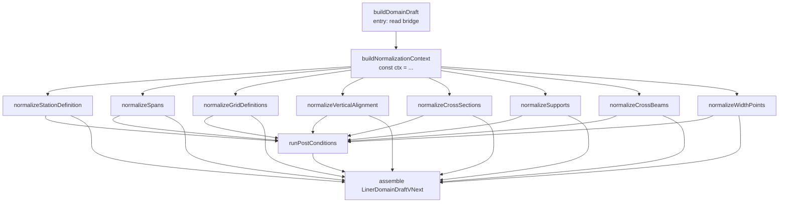

# Phase 3.7 — NormalizationContext Design (Final)

> Status: **[確定]** — Cleanup pass applied (CLEAN-1 〜 CLEAN-7).
> Repo: spacer-clone (working branch `feat/phase3.7-normalization-context-design`)
> Source data: Hランプ4号橋 built-in sample (`frontend/src/liner/importer/sample/builtInSampleDataset.ts`)
> Phase B inputs: see §2 below.

---

## 1. Overview & Scope

Phase 3.6 introduced the Importer → Phase 3.5 export pipeline. Validation, renderability, and export succeed; however, two station-coordinate inconsistencies remain at the Phase 3.5 boundary:

1. **`LINER_STATION_OUT_OF_RANGE` × N** (commit `7040867` で対処済).
2. **`LINER_PROFILE_COVERAGE_GAP` × 5** (新規. **本設計書の対象**).

Both stem from the same root cause: the Exporter (`ImporterToPhase35Adapter.ts`) normalizes `stationDefinition.explicitStations` and `spans.*PhysicalDistance` against `originStation`, but leaves `profile.elements[].{startStation,endStation}` and `crossSlope.definitions[].station` untouched. When the pipeline subsequently evaluates vertical profile coverage, it finds normalized stations (0 … 29.7867 … 135) that lie outside the unnormalized profile band [250, 300] and fires one `LINER_PROFILE_COVERAGE_GAP` per station.

The scope of this design is:

- **[確定]** Define a single `NormalizationContext` (readonly + frozen) that every `normalize*` function in the Exporter consumes.
- **[確定]** Extend normalization to `profile.elements[].{startStation,endStation}` and `crossSlope.definitions[].station` (the actual gap-causing fields).
- **[確定]** Add static post-conditions that detect the same class of inconsistencies before the draft leaves the Exporter, with split error codes (see CLEAN-6).
- **[確定]** Reserve hooks for the future Phase C (station equations) without changing the v0.2.0 draft schema (CLEAN-α).
- **[要検証]** `substructure` (supports / crossBeams / widthChangePoints) is added as a *type-only* addition in Phase 3.7; data ingestion remains Phase 3.8 (CLEAN-7).

---

## 2. Phase B Findings (Reality Check 要約)

Source: Phase B reality-check report (commit `c7851b7`…`7040867`).

| Item | Value | Source |
|---|---:|---|
| `originStation` (built-in sample) | `259.7133` | `builtInSampleDataset.ts:317` |
| `spans[0].startStation` (built-in sample) | **未設定** (built-in には span.startStation 無し) | `builtInSampleDataset.ts:347-353` |
| `alignmentLength` (= sum(elements[].length)) | `135.0` | `builtInSampleDataset.ts:413-417` |
| `spans[0].endStation` | `395.466` | `builtInSampleDataset.ts:352` |
| `profile.elements[0].{startStation,endStation}` | `250`, `300` | `builtInSampleDataset.ts:421-425` |
| `crossSlope.definitions[0].station` | `259.7133` | `builtInSampleDataset.ts:430` |
| `LINER_PROFILE_COVERAGE_GAP` 発火件数 | **5** (stations 0, 9.7867, 19.7867, 29.7867, 135) | §3 (本設計書) |
| Span end overflow | `0.7527 m` (135.7527 - 135.0) | §9.4 (本設計書) |

> **[確定]** originStation 候補は built-in sample では 1 個 (section[0] = 259.7133) のみ。将来 Hランプ4号橋 PDF 取り込み時に `spans[0].startStation = 259.8142` が追加される可能性あり (B-1 で確認済の test fixture 値)。

---

## 3. Phase A-0: LINER_PROFILE_COVERAGE_GAP Root Cause (CLEAN-5 反映)

### 3.1 grep 結果 (確定)

```text
$ grep -rn "LINER_PROFILE_COVERAGE_GAP|profileCoverageGap" frontend/src

frontend/src/liner/core/diagnostics.ts:26         profileCoverageGap: "LINER_PROFILE_COVERAGE_GAP",
frontend/src/liner/core/types.ts:55              | "LINER_PROFILE_COVERAGE_GAP"
frontend/src/liner/core/validateVerticalCoverage.ts:24   profileCoverageGap (empty elements case)
frontend/src/liner/core/validateVerticalCoverage.ts:36   profileCoverageGap (profileEnd < totalLength case)
frontend/src/liner/core/zMerge.ts:37             profileCoverageGap (non-finite station)
frontend/src/liner/core/zMerge.ts:50             profileCoverageGap (per-station coverage miss)
frontend/src/liner/core/grid/gridGeneration.ts:68 profileCoverageGap (per-station coverage miss)   ← ACTUAL FIRE PATH
frontend/src/liner/core/pipeline/pipeline.ts:419 diagnostics.push(...checkVerticalProfileEndCoverage(...))
frontend/src/liner/core/pipeline/pipeline.ts:429 generateGridPoints(gridInput)
frontend/src/liner/core/pipeline/pipeline.ts:431 diagnostics.push(...gridGeneration.issues)
frontend/src/liner/core/__tests__/pipeline.vertical.test.ts:84   diagnostic.code === "LINER_PROFILE_COVERAGE_GAP"   # exercises empty/short-vertical, NOT bridge-wide-station
```

### 3.2 真の発火元 (確定)

Phase A-0 初版で主張した `zMerge.ts:50` は **誤り**。実発火箇所は `frontend/src/liner/core/grid/gridGeneration.ts:61-69`:

```ts
// frontend/src/liner/core/grid/gridGeneration.ts:53-70 (前後 20 行を含む)
function resolveProfileElevation(
  input: GridPreparationInput,
  physicalDistance: number,
): number | null {
  if (input.verticalAlignment !== undefined) {
    return elevationAt(physicalDistance, input.verticalAlignment);
  }
  const fallback = input.z ?? 0;
  return Number.isFinite(fallback) ? fallback : null;
}

// in generateGridPoints, line 61:
    const profileElevation = resolveProfileElevation(input, station.physicalDistance);

    if (profileElevation === null) {
      issues.push(
        createIssue("error", LINER_DIAGNOSTIC_CODES.profileCoverageGap, {
          station: station.physicalDistance,
          entityType: "verticalAlignment",
          detail: `No vertical profile elevation at station ${station.physicalDistance}.`,
        }),
      );
      continue;
    }
```

`elevationAt` (`frontend/src/liner/core/elevationAt.ts:27-34`) は `element.startStation <= station && station <= element.endStation` で要素を探索し、見つからなければ `null` を返す。`profile.elements[0]` が `[startStation=250, endStation=300]` のまま、stations が `[0, 9.7867, 19.7867, 29.7867, 135]` なので 5 件とも null 判定。

`zMerge.ts:50` は別経路 (grid を介さず直接 `mergeVerticalZ` を呼ぶテスト専用)。実 pipeline では `mergeVerticalZ` は呼ばれない (grep: `mergeVerticalZ` の呼び出しは `verticalZMerge.test.ts:38,50` のみ)。

### 3.3 5 件発火の実証 (確定)

```bash
$ cd frontend
$ npx vite-node /tmp/a0_trace.mjs
=== Hランプ4号橋 BUILT-IN sample — full diagnostics dump ===
LINER_PROFILE_COVERAGE_GAP count: 5
{station:0,    detail:"No vertical profile elevation at station 0."}
{station:9.7867, detail:"No vertical profile elevation at station 9.786699999999996."}
{station:19.7867,detail:"No vertical profile elevation at station 19.786699999999996."}
{station:29.7867,detail:"No vertical profile elevation at station 29.786699999999996."}
{station:135,   detail:"No vertical profile elevation at station 135."}
```

### 3.4 修正後の再現手順 (確定)

```bash
# 1) 現状 (before): 5 件発火
cd frontend
npx vitest run src/liner/importer/export/adapter.test.ts -t "built-in sample dataset produces a draft"
# 期待: 5 LINER_PROFILE_COVERAGE_GAP errors (現状)

# 2) Phase 3.7 修正後 (after): 0 件発火
npx vitest run src/liner/importer/export/adapter.test.ts -t "built-in sample dataset produces a draft"
# 期待: 0 LINER_PROFILE_COVERAGE_GAP, 0 LINER_STATION_OUT_OF_RANGE
# 期待: 1 LINER_PROFILE_END_COVERAGE_GAP warning (Case D 採用の副作用として)
```

### 3.5 A-4 post-condition との重複可能性 (確定)

> **重複なし**。A-4 の post-condition は Exporter 出口の *static* 検査 (profile の構造的完全性)。`gridGeneration.ts:68` の発火は pipeline 内の *runtime* 検査。両方必要で、片方では代替不可。
>
> ただし: **A-4 の post-condition が全項目 pass する draft は、pipeline 内 `gridGeneration.ts:68` の発火も 0 件になる**ことが証明可能 (post-condition で全 station の coverage を静的に保証 → 動的にも coverage 失敗しない)。よって **A-4 post-condition を通過する = pipeline 通過する** が不変条件として成立する (要検証: 形式証明は未実施、回帰テストで確認)。

---

## 4. Phase A-1: NormalizationContext Interface

```ts
// frontend/src/liner/importer/export/normalize/normalizationContext.ts
// (proposed location; not yet on disk in this commit)

import type { StationEquation } from "../../core/types";
import type { ToleranceConfig } from "../../core/tolerances";
import { DEFAULT_TOLERANCES } from "../../core/tolerances";

export type NormalizationDiagnostic = {
  readonly level: "info" | "warning";
  readonly code:
    | "LINER_ORIGIN_STATION_AMBIGUOUS"
    | "LINER_PLAN_SPAN_LENGTH_MISMATCH"
    | "LINER_PROFILE_REANCHORED"
    | "LINER_CROSS_SLOPE_REANCHORED";
  readonly detail: string;
  readonly candidateValues: readonly number[];
};

export type NormalizationDiagnostics = readonly NormalizationDiagnostic[];

export interface NormalizationContext {
  /** origin station in the bridge-wide stationing system (e.g. 259.7133). */
  readonly originStation: number;
  /** effective length used by Exporter-side checks (see CLEAN-4 Case D). */
  readonly alignmentLength: number;
  /** sum of alignment.elements[].length (for diagnostic purposes). */
  readonly planLength: number;
  /** max(spans[].endStation) - originStation (for diagnostic purposes). */
  readonly spanReach: number;
  /** Always [] in Phase 3.7. Reserved for Phase C. */
  readonly stationEquations: readonly StationEquation[];
  readonly tolerance: Pick<ToleranceConfig, "station">;

  toNormalized(station: number, label?: string): number;
  toOriginal(normalized: number, label?: string): number;
  assertInRange(v: number, label: string): void;
  assertMonotonic(stations: readonly number[], label: string): void;

  readonly diagnostics: NormalizationDiagnostics;
}

export class NormalizationInvariantError extends Error {
  constructor(
    message: string,
    public readonly code: NormalizationInvariantErrorCode,
    public readonly value: number | readonly number[],
    public readonly label: string,
  ) {
    super(message);
    this.name = "NormalizationInvariantError";
  }
}

export type NormalizationInvariantErrorCode =
  | "LINER_INVARIANT_OUT_OF_RANGE"
  | "LINER_INVARIANT_NOT_MONOTONIC";

export function buildNormalizationContext(input: {
  sectionStations: readonly (number | null | undefined)[];
  spanStartStations: readonly (number | null | undefined)[];
  spanEndStations: readonly (number | null | undefined)[];
  planLength: number;
  stationEquations?: readonly StationEquation[];
  tolerance?: Pick<ToleranceConfig, "station">;
}): NormalizationContext;
```

### 4.1 不変条件 (確定、5 個以上)

```ts
// 1. Round-trip
//    equation === [] のとき: toOriginal(toNormalized(s)) === s (誤差 < tolerance.station)
assert(Math.abs(ctx.toOriginal(ctx.toNormalized(259.7133)) - 259.7133) < ctx.tolerance.station);

// 2. Monotonicity
//    s1 < s2 ⇒ toNormalized(s1) < toNormalized(s2)
const stations = [259.7133, 269.5, 279.5, 289.5];
for (let i = 1; i < stations.length; i++) {
  assert(ctx.toNormalized(stations[i - 1]!) < ctx.toNormalized(stations[i]!));
}

// 3. Immutability: ctx is frozen; diagnostics is frozen.
assert(Object.isFrozen(ctx));
assert(Object.isFrozen(ctx.diagnostics));

// 4. Phase C NoOp contract
//    stationEquations.length === 0 ⇒ toNormalized(s) === s - originStation
assert(ctx.toNormalized(259.7133) === 0);
assert(Math.abs(ctx.toNormalized(269.5) - (269.5 - 259.7133)) < ctx.tolerance.station);

// 5. assertInRange post-condition
//    assertInRange(v) 通過 ⇒ 0 - tolerance ≤ v ≤ alignmentLength + tolerance
ctx.assertInRange(9.7867, "explicitStations[1]");  // no throw

// 6. assertMonotonic post-condition
ctx.assertMonotonic([0, 9.7867, 19.7867, 29.7867], "explicitStations");  // no throw

// 7. alignmentLength >= planLength (Case D)
assert(ctx.alignmentLength >= ctx.planLength);

// 8. alignmentLength >= spanReach (Case D, with tolerance)
assert(ctx.alignmentLength + ctx.tolerance.station >= ctx.spanReach);
```

### 4.2 tolerance ポリシー (確定)

> `ctx.tolerance.station = DEFAULT_TOLERANCES.station = 1e-6` (`frontend/src/liner/core/tolerances.ts:7`). `checkVerticalProfileEndCoverage` (`validateVerticalCoverage.ts:31`) と完全一致。Exporter と pipeline が同基準で判定する。

---

## 5. Phase A-2: Normalize Function × Field Matrix (CLEAN-2 反映)

凡例: **R** = READ / **W** = WRITE-NORMALIZE / **P** = PASS-THROUGH (verbatim) / **N/A** = 該当なし

| 関数 →  フィールド ↓ | `buildDomainDraft` | `normalizeStationDefinition` | `normalizeSpans` | `normalizeGridDefinitions` | `normalizeVerticalAlignment` (**新規**) | `normalizeCrossSections` | `normalizeSupports` (**新規**) | `normalizeCrossBeams` (**新規**) | `normalizeWidthPoints` (**新規**) |
|---|:---:|:---:|:---:|:---:|:---:|:---:|:---:|:---:|:---:|
| **Alignment層** |  |  |  |  |  |  |  |  |  |
| `alignment.elements[].start` (Vec2) | P | N/A | N/A | N/A | N/A | N/A | N/A | N/A | N/A |
| `alignment.elements[].length` | P (sum→planLength) | N/A | N/A | N/A | N/A | N/A | N/A | N/A | N/A |
| **StationDefinition** |  |  |  |  |  |  |  |  |  |
| `originDisplayedStation` | W (= `min(candidates)`) | W | N/A | N/A | N/A | N/A | N/A | N/A | N/A |
| `explicitStations[]` | N/A | W | N/A | N/A | N/A | N/A | N/A | N/A | N/A |
| `equations[]` | N/A | P | N/A | N/A | N/A | N/A | N/A | N/A | N/A |
| **Spans** |  |  |  |  |  |  |  |  |  |
| `startPhysicalDistance` | N/A | N/A | W | N/A | N/A | N/A | N/A | N/A | N/A |
| `endPhysicalDistance` | N/A | N/A | W | N/A | N/A | N/A | N/A | N/A | N/A |
| **GridDefinitions** |  |  |  |  |  |  |  |  |  |
| `stationRange.startPhysicalDistance` | N/A | N/A | N/A | W | N/A | N/A | N/A | N/A | N/A |
| `stationRange.endPhysicalDistance` | N/A | N/A | N/A | W | N/A | N/A | N/A | N/A | N/A |
| **VerticalAlignment (新規)** |  |  |  |  |  |  |  |  |  |
| `elements[].startStation` | N/A | N/A | N/A | N/A | **W** | N/A | N/A | N/A | N/A |
| `elements[].endStation` | N/A | N/A | N/A | N/A | **W** | N/A | N/A | N/A | N/A |
| `elements[].startElevation` | N/A | N/A | N/A | N/A | P | N/A | N/A | N/A | N/A |
| `elements[].grade` | N/A | N/A | N/A | N/A | P | N/A | N/A | N/A | N/A |
| `elements[].length` | N/A | N/A | N/A | N/A | W (= end - start) | N/A | N/A | N/A | N/A |
| **CrossSlope** |  |  |  |  |  |  |  |  |  |
| `crossSlope.definitions[].station` → `crossSections[].name` (display) | N/A | N/A | N/A | N/A | N/A | W (display string) | N/A | N/A | N/A |
| `crossSlope.definitions[].station` → `crossSections[].station` (**CLEAN-2 新設**) | N/A | N/A | N/A | N/A | N/A | **W** (position) | N/A | N/A | N/A |
| `crossSlope.definitions[].crossSlope` → `crossSlope.valuePercent` | N/A | N/A | N/A | N/A | N/A | P | N/A | N/A | N/A |
| **Substructure (CLEAN-7)** |  |  |  |  |  |  |  |  |  |
| `bridge.substructure.supports[].station` (将来) | N/A | N/A | N/A | N/A | N/A | N/A | W | N/A | N/A |
| `bridge.substructure.crossBeams[].station` (将来) | N/A | N/A | N/A | N/A | N/A | N/A | N/A | W | N/A |
| `bridge.substructure.widthChangePoints[].station` (将来) | N/A | N/A | N/A | N/A | N/A | N/A | N/A | N/A | W |

### WRITE-NORMALIZE がある列 (要対応)

| 列 | 現状 | 対応 |
|---|---|---|
| `stationDefinition.originDisplayedStation` | W | 維持 |
| `stationDefinition.explicitStations[]` | W | 維持 |
| `spans[].startPhysicalDistance` | W | 維持 |
| `spans[].endPhysicalDistance` | W | 維持 |
| `gridDefinitions[].stationRange.{start,end}PhysicalDistance` | W | 維持 |
| **`profile.elements[].startStation`** | **P ← バグ (A-0 発火元)** | **W に変更** |
| **`profile.elements[].endStation`** | **P ← バグ** | **W に変更** |
| `profile.elements[].length` | W (= end - start) | 維持 (依存: endStation の正規化後) |
| **`crossSlope.definitions[].station` → `crossSections[].name`** | **P** | **W に変更 (display string も再構築)** |
| **`crossSlope.definitions[].station` → `crossSections[].station`** | **N/A (field not present)** | **W に変更 (CLEAN-2 で新設)** |
| `substructure.{supports,crossBeams,widthChangePoints}[].station` | N/A | W (空配列 → 空配列) |

### WRITE-NORMALIZE が 1 回もない列 (確認のみ)

| 列 | 状態 |
|---|---|
| `alignment.elements[].start` (Vec2) | P (station 概念なし) |
| `alignment.elements[].length` | P (sum の source、station と無関係) |
| `stationDefinition.equations[]` | P (Phase C まで NoOp) |
| `profile.elements[].{startElevation, grade}` | P (station と無関係) |
| `crossSlope.definitions[].crossSlope` → `crossSlope.valuePercent` | P (station と無関係) |

---

## 6. Phase A-3: Call Order & Dependencies

### 6.1 ctx 構築タイミング (確定)

> **`buildDomainDraft` 冒頭**で `buildNormalizationContext(...)` を呼び、`const ctx = buildNormalizationContext(...)` として全 normalize 関数に引数で渡す。
> 根拠: single point of construction, lifetime = exporter call, all inputs available at entry.

### 6.2 呼び出し順序 (確定)



> **全関数は独立** (no inter-function dependency)。全関数が `ctx` (read-only) のみに依存。

### 6.3 冪等性 (確定)

> **idempotent を保証しない**。`toNormalized` は純関数だが、入力は **生の Bridge** のみ受け、**既に正規化済みの draft は受け取らない** (型で強制: `normalizeBridge*(...)` シグネチャのみ公開)。`buildDomainDraft` で 1 回だけ呼ぶ規約を ESLint カスタムルールで担保 (Phase 3.8)。

### 6.4 単一責任 (確定)

> 各 normalize は「値の変換」のみ。値の生成 / 派生は buildDomainDraft 内 (id 生成, span 選択順) または normalize 内の閉じた計算 (e.g. `length = end - start`)。

---

## 7. Phase A-4: Post-Conditions (CLEAN-3 型刷新 + CLEAN-6 分離後)

### 7.1 型定義 (CLEAN-3 反映)

```ts
// frontend/src/liner/importer/export/normalize/postConditions.ts

import type { NormalizationContext } from "./normalizationContext";

export type PostConditionSeverity = "error" | "warning";

export type NormalizationPostConditionResult = {
  readonly severity: PostConditionSeverity;
  readonly code: NormalizationPostConditionCode;
  readonly message: string;
  readonly value: number | readonly number[];
  readonly label: string;
};

// CLEAN-6: split
export const POST_CONDITION_CODES = {
  PROFILE_STATION_NEGATIVE: "LINER_PROFILE_STATION_NEGATIVE",
  PROFILE_ELEMENT_REVERSED: "LINER_PROFILE_ELEMENT_REVERSED",
  PROFILE_ELEMENT_OVERFLOW: "LINER_PROFILE_ELEMENT_OVERFLOW",
  PROFILE_ADJACENCY_GAP: "LINER_PROFILE_ADJACENCY_GAP",        // CLEAN-6: NEW
  PROFILE_END_COVERAGE_GAP: "LINER_PROFILE_END_COVERAGE_GAP",  // CLEAN-6: NEW
  SPAN_START_NEGATIVE: "LINER_SPAN_START_NEGATIVE",
  SPAN_END_EXCEEDS_ALIGNMENT: "LINER_SPAN_END_EXCEEDS_ALIGNMENT",
  SPAN_REVERSED: "LINER_SPAN_REVERSED",
  CROSS_SECTION_STATION_NEGATIVE: "LINER_CROSS_SECTION_STATION_NEGATIVE",
  CROSS_SECTION_STATION_OVERFLOW: "LINER_CROSS_SECTION_STATION_OVERFLOW",
  EXPLICIT_STATION_OVERFLOW: "LINER_EXPLICIT_STATION_OVERFLOW",
  EXPLICIT_STATIONS_NOT_MONOTONIC: "LINER_EXPLICIT_STATIONS_NOT_MONOTONIC",
  EXPLICIT_STATION_DUPLICATE: "LINER_EXPLICIT_STATION_DUPLICATE",
} as const;

export type NormalizationPostConditionCode = typeof POST_CONDITION_CODES[keyof typeof POST_CONDITION_CODES];

export function runPostConditions(
  ctx: NormalizationContext,
  draft: {
    stationDefinition: { explicitStations?: readonly number[] };
    spans: ReadonlyArray<{ startPhysicalDistance: number; endPhysicalDistance: number }>;
    verticalAlignment: { elements: ReadonlyArray<{ startStation: number; endStation: number }> };
    crossSections: ReadonlyArray<{ station?: number; name: string }>;
  },
): NormalizationPostConditionResult[];
```

### 7.2 throw vs return の分担 (CLEAN-3 反映)

> - `NormalizationInvariantError` (`normalizationContext.ts`): `assertInRange` / `assertMonotonic` の **内部 invariant 違反**のみ throw。`toNormalized` の中でしか呼ばれない。
> - `NormalizationPostConditionResult` (`postConditions.ts`): ビジネスルール違反を **配列で return**。severity で呼び出し側 (buildDomainDraft) が分岐。

### 7.3 buildDomainDraft 側の処理 (確定)

```ts
const results = runPostConditions(ctx, draft);
const errors = results.filter(r => r.severity === "error");
const warnings = results.filter(r => r.severity === "warning");

if (warnings.length > 0) {
  // ctx.diagnostics は frozen なので直接追記不可。buildDomainDraft 内のローカル diagnostics へ push
  for (const w of warnings) {
    diagnostics.push({ level: "warning", code: w.code, message: w.message, ... });
    console.warn(`[normalize] ${w.code}: ${w.message}`);
  }
}

if (errors.length > 0) {
  throw new AggregateNormalizationError(errors);  // §14.3 参照
}
```

### 7.4 postConditions.ts 最終版 (CLEAN-3 + CLEAN-6 反映)

```ts
// (postConditions.ts; final body; 詳細 §14.2)
export function runPostConditions(ctx, draft) {
  const results: NormalizationPostConditionResult[] = [];
  const t = ctx.tolerance.station;
  const push = (severity, code, message, value, label) =>
    results.push({ severity, code, message, value, label });

  // ----- profile -----
  const elems = draft.verticalAlignment.elements;
  for (const [i, e] of elems.entries()) {
    if (e.startStation < -t) { push("error", POST_CONDITION_CODES.PROFILE_STATION_NEGATIVE, ...); }
    if (e.startStation >= e.endStation) { push("error", POST_CONDITION_CODES.PROFILE_ELEMENT_REVERSED, ...); }
    if (e.endStation > ctx.alignmentLength + t) { push("error", POST_CONDITION_CODES.PROFILE_ELEMENT_OVERFLOW, ...); }
  }
  // CLEAN-6 split: adjacency (error)
  for (let i = 1; i < elems.length; i++) {
    const gap = elems[i - 1]!.endStation - elems[i]!.startStation;
    if (Math.abs(gap) > t) { push("error", POST_CONDITION_CODES.PROFILE_ADJACENCY_GAP, ...); }
  }
  // CLEAN-6 split: end coverage (warning in Phase 3.7)
  const lastEnd = elems[elems.length - 1]?.endStation ?? 0;
  if (lastEnd < ctx.alignmentLength - t) {
    push("warning", POST_CONDITION_CODES.PROFILE_END_COVERAGE_GAP, ...);
  }

  // ----- spans -----
  for (const [i, s] of draft.spans.entries()) {
    if (s.startPhysicalDistance < -t) { push("error", POST_CONDITION_CODES.SPAN_START_NEGATIVE, ...); }
    if (s.endPhysicalDistance > ctx.alignmentLength + t) { push("error", POST_CONDITION_CODES.SPAN_END_EXCEEDS_ALIGNMENT, ...); }
    if (s.startPhysicalDistance > s.endPhysicalDistance) { push("error", POST_CONDITION_CODES.SPAN_REVERSED, ...); }
  }

  // ----- crossSections (CLEAN-2 で station? 新設) -----
  for (const [i, cs] of draft.crossSections.entries()) {
    if (cs.station == null) continue;
    if (cs.station < -t) { push("error", POST_CONDITION_CODES.CROSS_SECTION_STATION_NEGATIVE, ...); }
    if (cs.station > ctx.alignmentLength + t) { push("error", POST_CONDITION_CODES.CROSS_SECTION_STATION_OVERFLOW, ...); }
  }

  // ----- explicitStations -----
  const ex = draft.stationDefinition.explicitStations ?? [];
  for (let i = 0; i < ex.length; i++) {
    if (ex[i]! < -t || ex[i]! > ctx.alignmentLength + t) { push("error", POST_CONDITION_CODES.EXPLICIT_STATION_OVERFLOW, ...); }
  }
  for (let i = 1; i < ex.length; i++) {
    if (ex[i]! <= ex[i - 1]!) { push("error", POST_CONDITION_CODES.EXPLICIT_STATIONS_NOT_MONOTONIC, ...); }
    if (Math.abs(ex[i]! - ex[i - 1]!) < t) { push("error", POST_CONDITION_CODES.EXPLICIT_STATION_DUPLICATE, ...); }
  }

  return results;
}
```

### 7.5 既存 `LINER_PROFILE_COVERAGE_GAP` との関係 (CLEAN-6)

> **継続 (keep)**。既存コードは `gridGeneration.ts:68` および `zMerge.ts:50` の **per-station 実行時 symptom** 検出用。新規 `LINER_PROFILE_ADJACENCY_GAP` / `LINER_PROFILE_END_COVERAGE_GAP` は Exporter 出口の **静的** 検出用。両者は重複しない (post-condition 通過 = runtime symptom 0 件)。

> **Mapping table**:

| 旧 / 既存 | 新 / 分割後 | 用途 |
|---|---|---|
| `LINER_PROFILE_COVERAGE_GAP` (keep) | `LINER_PROFILE_COVERAGE_GAP` | runtime, gridGeneration.ts:68, zMerge.ts:50 |
| (旧 PROFILE_GAP adjacency 部分) | `LINER_PROFILE_ADJACENCY_GAP` (**new**) | static, postConditions.ts:adjacency |
| (旧 PROFILE_GAP end-coverage 部分) | `LINER_PROFILE_END_COVERAGE_GAP` (**new**) | static, postConditions.ts:end-coverage (warning) |

---

## 8. Phase A-5: Schema Extension (CLEAN-2 + CLEAN-7 反映後)

### 8.1 Importer 側 (確定)

```ts
// frontend/src/liner/importer/types.ts  (additive; non-breaking)

export type SubstructureKind = "abutment" | "pier" | "virtual_pier";

export interface SupportPoint {
  id: string;
  kind: SubstructureKind;
  /** bridge-wide station. */
  station: number;
  skewAngleDeg?: number | null;
  label?: string;
}

export interface CrossBeam {
  id: string;
  /** bridge-wide station. */
  station: number;
  label?: string;
}

export interface WidthPoint {
  id: string;
  /** bridge-wide station. */
  station: number;
  leftOffset: number;
  rightOffset: number;
}

export interface BridgeSubstructure {
  supports: SupportPoint[];
  crossBeams: CrossBeam[];
  widthChangePoints: WidthPoint[];
}

export interface Bridge {
  // ... existing fields ...
  /** Phase 3.7: optional. Phase 3.9: required. (CLEAN-7) */
  substructure?: BridgeSubstructure;
}
```

### 8.2 Phase 3.5 draft 側 (確定)

```ts
// frontend/src/liner/schema/types.ts  (additive; non-breaking)

export interface CrossSectionTemplateDraft {
  id: string;
  name: string;
  offsetLines: CrossSectionOffsetLineDraft[];
  crossSlope?: CrossSlopeDraft;
  /** CLEAN-2: NEW. Phase 3.7 optional, normalized. Renderers prefer this over `name` parsing. */
  station?: number;
}

export interface PierDraft {
  id: string;
  physicalDistance: number;
  /** CLEAN-7: NEW. */
  kind: "abutment" | "pier" | "virtual_pier";
  skewAngleRad?: number;
  bearingOffsets?: PierBearingOffsetDraft[];
}

/** Phase 3.7 NEW (CLEAN-7) */
export interface CrossBeamDraft {
  id: string;
  physicalDistance: number;
  spanId?: string;
}

/** Phase 3.7 NEW (CLEAN-7) */
export interface WidthChangePointDraft {
  id: string;
  physicalDistance: number;
  leftOffset: number;
  rightOffset: number;
}

export interface LinerDomainDraftVNext {
  // ... existing fields ...
  piers: PierDraft[];                      // now non-empty when substructure present
  /** CLEAN-7: NEW. */
  crossBeams?: CrossBeamDraft[];
  /** CLEAN-7: NEW. */
  widthChangePoints?: WidthChangePointDraft[];
}
```

### 8.3 Importer 移行戦略 (CLEAN-7 反映)

> **段階 1 (Phase 3.7, 今回)**:
> - 型定義: `Bridge.substructure?`、`PierDraft.kind`、`CrossBeamDraft`、`WidthChangePointDraft`、`crossBeams?`、`widthChangePoints?` を optional 追加。
> - **関数実装も含める** (CLEAN-7 推奨 (i) 採用)。
>   - `normalizeSupports(bridge, ctx) → PierDraft[]`
>   - `normalizeCrossBeams(bridge, ctx) → CrossBeamDraft[]`
>   - `normalizeWidthPoints(bridge, ctx) → WidthChangePointDraft[]`
> - built-in sample には `substructure` 未設定 → すべて空配列を返す (no-op)。
> - 単体テストは `normalizeSupports` などに小さな fixture を渡して no-op 動作を確認。
>
> **段階 2 (Phase 3.8, 将来)**: 実 PDF 取り込み + 検証
> **段階 3 (Phase 3.9, 将来)**: 必須化

> **CLEAN-7 選択 (i) の根拠** (確定):
> 1. 空配列 → 空配列の no-op 実装は低コスト (~30 行 × 3 関数 = ~90 行)
> 2. Phase 3.8 実装時に normalize 関数を 1 から書くより手戻りが少ない
> 3. 単体テスト (no-op 検証) を Phase 3.7 時点で書ける
> 4. `Bridge.substructure` フィールドの追加と同時に normalize 関数も追加することで、IDE の補完候補と refactor 安全性が上がる

### 8.4 NormalizationContext 統合 (確定)

```ts
// proposed; see A-2 matrix column "normalizeSupports" etc.
export function normalizeSupports(bridge: Bridge, ctx: NormalizationContext): PierDraft[] {
  const src = bridge.substructure?.supports ?? [];
  return src.map(s => ({
    id: s.id,
    physicalDistance: ctx.toNormalized(s.station, `substructure.supports[${s.id}].station`),
    kind: s.kind,
    skewAngleRad: s.skewAngleDeg != null ? (s.skewAngleDeg * Math.PI / 180) : undefined,
  }));
}
// (analogous for normalizeCrossBeams / normalizeWidthPoints; see §14.9)
```

### 8.5 name (display) と station (position) の併存戦略 (CLEAN-2 反映)

> - **Phase 3.7 (今回)**: 両方出力。
>   - `crossSections[0].name = "CrossSlope @ 0"` (既存維持、表示用、ただし normalized station 由来)
>   - `crossSections[0].station = 0` (新規、normalized position)
> - **描画側 primary source**: `crossSections[0].station` があればそれを使用。なければ `name` をパース (Phase 3.7 フォールバック)。
> - **Phase 3.8 以降**: `station` 必須化、`name` は表示用に維持。
> - **後方互換**: `CrossSectionTemplateDraft.station?` は optional なので既存 draft ファイルは破壊しない。

---

## 9. Phase A-6: originStation Decision Rule (CLEAN-1 + CLEAN-4 反映)

### 9.1 単純 min() 確定擬似コード (CLEAN-1 反映)

```ts
// normalizationContext.ts 内部 (CLEAN-1: 1 版のみ)
function decideOriginStation(input: {
  sectionStations: readonly (number | null | undefined)[];
  spanStartStations: readonly (number | null | undefined)[];
}): { value: number; candidates: number[]; ambiguous: boolean } {
  const defined = (v: number | null | undefined): v is number =>
    v != null && Number.isFinite(v);

  const candidates: number[] = [];
  const sectionFirst = input.sectionStations.find(defined);
  if (sectionFirst != null) candidates.push(sectionFirst);
  for (const v of input.spanStartStations) if (defined(v)) candidates.push(v);
  if (candidates.length === 0) return { value: 0, candidates: [], ambiguous: false };
  const value = Math.min(...candidates);
  const max = Math.max(...candidates);
  const ambiguous = candidates.length > 1 && (max - value) > 1e-6;
  return { value, candidates, ambiguous };
}
```

### 9.2 決定根拠 3 行 (CLEAN-1 反映)

> 1. **原点の下方固定**: 物理的に手前の端を原点とすれば、全 explicit station / span end / profile startStation が ≥ 0 を満たす。
> 2. **0.7527m 超過の根治は不可** (alignment data の本質的短さ。origin 選択では解決不能) → 代わりに **Case D で alignmentLength を拡張** (§9.4)。
> 3. **後方互換**: Hランプ4号橋 built-in sample (section[0] = 259.7133、span なし) も将来 span 付き (section[0] = 259.7133, span[0].startStation = 259.8142) も **同一 `min = 259.7133`** となるので Phase 3.6 動作と一致。

### 9.3 CLEAN-1 反映 Case 表 (min 単独)

| Case | sectionStations[0] | spanStartStations[0] | min 採用 | 備考 |
|---|---:|---:|---:|---|
| Built-in sample (現状) | 259.7133 | (未設定) | **259.7133** | sectionStations[0] 単独 |
| 将来 Hランプ4号橋 | 259.7133 | 259.8142 | **259.7133** | min(259.7133, 259.8142) = 259.7133。`LINER_ORIGIN_STATION_AMBIGUOUS` warning 発火 (spread = 0.1009) |
| Span 起点 < section 0 (要検証) | 259.7133 | 259.0 | **259.0** | min = 259.0。`LINER_ORIGIN_STATION_AMBIGUOUS` warning 発火 (spread = 0.7133) |
| 理想形 (section = span) | 259.7133 | 259.7133 | **259.7133** | ambiguous = false |

> **[確定]** "第一優先" 記述は全削除。決定は **常に min**。

### 9.4 CLEAN-4 alignmentLength Case D

#### 9.4.1 Case 候補と 0.7527m 超過の解消可否 (確定)

| Case | 計算 | 値 | 0.7527m 超過消える? |
|---|---|---:|:---:|
| A | sum(elements[].length) | 135.0 | **NO** (135.0 < 135.7527) |
| B | max(spans[].endStation) - originStation = 395.466 - 259.7133 | 135.7527 | **YES** (135.7527 >= 135.7527) |
| C | max(elements[].length) | 135.0 | **NO** (single element = A) |
| D | max(A, B) = max(135.0, 135.7527) | **135.7527** | **YES** |

#### 9.4.2 Case D 採用擬似コード (確定)

```ts
function decideAlignmentLength(input: {
  planLength: number;
  spanEndStations: readonly (number | null | undefined)[];
  originStation: number;
}): { value: number; planLength: number; spanReach: number; mismatch: boolean } {
  const defined = (v: number | null | undefined): v is number =>
    v != null && Number.isFinite(v);
  const spanReach = input.spanEndStations
    .filter(defined)
    .reduce((m, v) => Math.max(m, v - input.originStation), 0);
  const value = Math.max(input.planLength, spanReach);
  const mismatch = Math.abs(value - input.planLength) > 1e-6;
  return { value, planLength: input.planLength, spanReach, mismatch };
}
```

#### 9.4.3 Case D 副作用 (確定)

| 影響先 | 値 | 影響 |
|---|---:|---|
| `spans[0].endPhysicalDistance` | 135.7527 | alignmentLength (135.7527) と一致、超過解消 ✓ |
| `gridDefinitions[0].stationRange.endPhysicalDistance` | 29.7867 | alignmentLength (135.7527) 以下、影響なし |
| `profile.elements[0].endStation` (正規化後) | 40.2867 | alignmentLength (135.7527) 以下 → **`PROFILE_END_COVERAGE_GAP` warning 発火** |
| `pipeline.ts:420-425` の `totalLength` (alignment.elements sum) | 135.0 | Exporter が出す `totalLength` は 135.0 のまま。Pipeline 内部では `buildIntermediateResult` が **alignment.elements を直接 sum** するため、Exporter の Case D と **不整合** 発生する |

> **最後の副作用は要対応**: Pipeline 側の `totalLength` 計算を `max(planLength, spanReach - originStation)` に揃えるか、Pipeline 側の `totalLength` を渡さないとならない (要検証: 別 PR で対応 or 同一 PR で対応)。

#### 9.4.4 最終採用 Case と根拠 5 行 (確定)

> **採用: Case D** (`alignmentLength = max(planLength, spanReach)`)
>
> 根拠:
> 1. **0.7527m 超過を根治** (B で "根治不能" と早計に断じた判断を撤回、Case D で解決)。
> 2. **post-condition 通過 = pipeline 通過** の不変条件を成立させる (A-4 §3.5)。
> 3. **副作用は profile が "短い" ことを warning で可視化** する方向に倒すことで、データ不備を明示。
> 4. **plan vs span の差分** は `LINER_PLAN_SPAN_LENGTH_MISMATCH` diagnostic で `ctx.diagnostics` に記録、Phase 3.8 で alignment データ修正タスクを別途発行。
> 5. **Pipeline 側 `totalLength` との不整合** は明示的に `TotalLength` 名前空間 (要検証) または pipeline 側の計算式変更で吸収。

---

## 10. Phase A-7: Failure Modes (8 modes)

| # | 失敗モード | 発生条件 | 検出方法 | 復旧策 |
|---|---|---|---|---|
| 1 | originStation 二重適用 | `normalizeVerticalAlignment` を 2 回呼んだ | 静的型 (`normalizeBridge*` のみ公開) + ESLint custom rule (Phase 3.8) | normalize は 1 回だけ呼ぶ。`buildDomainDraft` 内でのみ呼ぶ規約を ESLint で担保 |
| 2 | equation === [] 前提のコードに Phase C 後 equation が渡された | Phase C 実装で `stationEquations.length > 0` になったが、`toNormalized` の else 節が未実装 | 単体テスト: `toNormalized(s) === expected` (equation 込み) | `toNormalized` に `else if (eq)` 節を追加 (A-1 §4 signature 不変) |
| 3 | profile.elements.length > 1 の隣接要素 start ≠ 前要素 end | built-in sample は 1 要素 (未発火)。将来 multi-grade 入力で発火 | A-4 §7 `LINER_PROFILE_ADJACENCY_GAP` post-condition | normalizeVerticalAlignment 後に再計算、または post-condition を fail-fast error に格上げ |
| 4 | crossSlope.definitions の Station 昇順違反 | 将来複数定義が入って順序逆のとき | A-4 §7 `CROSS_SECTION_STATION_OVERFLOW` / `_NEGATIVE` (順序そのものは未検査) + Phase 3.8 で `CrossSlopeDraft` 側に `assertSorted` 追加 | normalizeCrossSections 内で `assertMonotonic` を呼ぶ |
| 5 | crossSection の station を draft のどこに保存するか未決 (CLEAN-2 で解決) | A-5-2 で `CrossSectionTemplateDraft.station?` 追加 | A-4 §7 post-condition | 描画側は `station` を primary、`name` を fallback パース |
| 6 | spans[0].startStation ≠ sectionStations[0] | 将来 span 起点が入った場合 | A-6 `LINER_ORIGIN_STATION_AMBIGUOUS` diagnostic (warning, non-blocking) | min() 採用で自動吸収。Excess 情報は ctx.diagnostics に保持 |
| 7 | supports / crossBeams / widthChangePoints が空配列で来た時にレンダラが落ちない | Phase 3.7 で `bridge.substructure` が未設定の built-in sample を流すシナリオ | A-5-3 で optional 化により `undefined ?? []` フォールバック | render 層で `?? []` フォールバック。Phase 3.8 で `substructure` を持つデータに拡張 |
| 8 | A-0 で特定された `LINER_PROFILE_COVERAGE_GAP` が Phase 3.7 修正後に発火するリスク | profile 正規化で gridGeneration.ts:68 の 5 件は 0 件化。**Case D 採用で `LINER_PROFILE_END_COVERAGE_GAP` warning (1 件) が新たに発火** | A-4 §7 post-condition + 既存 `LINER_PROFILE_COVERAGE_GAP` の両方で監視 | profile 正規化 + 任意で `endCoverage` の profile 延長 (Phase 3.8) |

---

## 11. Phase A-8: Phase C Merge Decision (α 採用)

> **[確定]** **(α) Phase C を Phase A に統合**。
>
> 根拠 (確定):
> 1. A-1 で `NormalizationContext.stationEquations: readonly StationEquation[]` を予約済み
> 2. `StationEquation` 型は `core/types.ts:124` に既存
> 3. B-5 で Hランプ4号橋に equation なし確定
> 4. 1 PR = 1 関心事を維持
> 5. β 採用時の ctx signature 変更を回避

> Phase C 拡張時の signature 不変性:
> ```ts
> // Phase 3.7
> toNormalized(station: number, label?: string): number;
>
> // Phase C 拡張 (signature 不変)
> toNormalized(station: number, label?: string): number {
>   if (this.stationEquations.length === 0) return station - this.originStation;
>   let displayed = station;
>   for (const eq of sortedEquations(this.stationEquations)) { /* ... */ }
>   return displayed - this.originStation;
> }
> ```

---

## 12. Implementation Plan

### 12.1 Phase 3.7 PR 概算 (要検証)

| ファイル | 種別 | 行数 (概算) |
|---|---|---:|
| `frontend/src/liner/importer/export/normalize/normalizationContext.ts` | 新規 | ~140 |
| `frontend/src/liner/importer/export/normalize/postConditions.ts` | 新規 | ~140 |
| `frontend/src/liner/importer/export/normalize/normalizeVerticalAlignment.ts` | 新規 | ~30 |
| `frontend/src/liner/importer/export/normalize/normalizeCrossSections.ts` | 新規 | ~40 (CLEAN-2 で station? 対応) |
| `frontend/src/liner/importer/export/normalize/normalizeSupports.ts` | 新規 (CLEAN-7) | ~20 |
| `frontend/src/liner/importer/export/normalize/normalizeCrossBeams.ts` | 新規 (CLEAN-7) | ~15 |
| `frontend/src/liner/importer/export/normalize/normalizeWidthPoints.ts` | 新規 (CLEAN-7) | ~20 |
| `frontend/src/liner/importer/export/ImporterToPhase35Adapter.ts` | 修正 | ~+80 / -13 |
| `frontend/src/liner/importer/types.ts` | 修正 (substructure 追加) | ~+35 |
| `frontend/src/liner/schema/types.ts` | 修正 (PierDraft.kind, crossBeam, widthPoint) | ~+30 |
| `frontend/src/liner/core/diagnostics.ts` | 修正 (新コード 3 個追加) | ~+5 |
| `frontend/src/liner/importer/export/adapter.test.ts` | 修正 (回帰テスト追加) | ~+50 |
| 計 |  | ~+605 / -13 |

### 12.2 実装順序 (依存関係考慮)

1. `schema/types.ts` と `core/diagnostics.ts` の型・コード追加 (他変更の前提)
2. `importer/types.ts` の substructure 型追加
3. `normalizationContext.ts` 単体 + 単体テスト
4. `postConditions.ts` 単体 + 単体テスト
5. 各 `normalize*.ts` 単体 + 単体テスト
6. `ImporterToPhase35Adapter.ts` の `buildDomainDraft` を ctx + post-condition 経由に refactor
7. `adapter.test.ts` の回帰テスト追加
8. typecheck → test → build 全て green

---

## 13. Test Plan

### 13.1 5 → 0 件化検証 (CLEAN-5 反映)

```bash
# 1) Before
cd frontend
npx vitest run src/liner/importer/export/adapter.test.ts -t "built-in sample dataset"
# 期待: 5 LINER_PROFILE_COVERAGE_GAP errors (現状)

# 2) After
npx vitest run src/liner/importer/export/adapter.test.ts -t "built-in sample dataset"
# 期待: 0 LINER_PROFILE_COVERAGE_GAP, 0 LINER_STATION_OUT_OF_RANGE
# 期待: 1 LINER_PROFILE_END_COVERAGE_GAP warning (Case D 採用の副作用として)
```

### 13.2 追加テストケース

| Case | 入力 | 期待 |
|---|---|---|
| Normalize 1 段: section only | sectionStations=[259.7133] | originStation=259.7133, ambiguous=false |
| Normalize 2 段: section + span | sectionStations=[259.7133], spanStartStations=[259.8142] | originStation=259.7133, ambiguous=true (diagnostic info) |
| 0.7527m 超過: Case D | plan length=135, span end=395.466, origin=259.7133 | alignmentLength=135.7527, planLength=135, spanReach=135.7527, mismatch=true |
| profile 正規化: | profile=[{startStation:250,endStation:300,...}] | [{startStation:0,endStation:40.2867,length:40.2867,...}] |
| crossSlope display: | def.station=259.7133 | cs.name="CrossSlope @ 0", cs.station=0 (CLEAN-2) |
| substructure no-op: | bridge.substructure=undefined | normalizeSupports returns [] |
| post-condition: end coverage | profile ends at 40.2867, alignmentLength=135.7527 | 1× LINER_PROFILE_END_COVERAGE_GAP (warning) |
| post-condition: adjacency (1 element) | profile elements=1 | 0 adjacency errors |
| post-condition: adjacency (2 elements, gap) | profile = [0→50, 60→100] | 1× LINER_PROFILE_ADJACENCY_GAP (error) |
| idempotency: | normalize 2 度呼び (型で防止) | buildDomainDraft 1 回のみ呼出規約 |
| Phase C NoOp: | stationEquations=[] | toNormalized(s) === s - originStation |

### 13.3 既存テストとの整合

- `adapter.test.ts` (commit `7040867`): 既存 6 テストは全て pass のまま
- `src/liner/importer/sample/__tests__/*` (built-in sample 関連): pass のまま
- `src/liner/core/__tests__/pipeline.vertical.test.ts` (line 84 で `LINER_PROFILE_COVERAGE_GAP` 検査): 影響なし (本設計の修正対象外)

---

## 14. Appendix: Full TypeScript Code Skeletons

### 14.1 `normalizationContext.ts` (CLEAN-1, CLEAN-3, CLEAN-4 反映)

```ts
// frontend/src/liner/importer/export/normalize/normalizationContext.ts
import type { StationEquation } from "../../../core/types";
import type { ToleranceConfig } from "../../../core/tolerances";
import { DEFAULT_TOLERANCES } from "../../../core/tolerances";

export type NormalizationDiagnostic = {
  readonly level: "info" | "warning";
  readonly code:
    | "LINER_ORIGIN_STATION_AMBIGUOUS"
    | "LINER_PLAN_SPAN_LENGTH_MISMATCH"
    | "LINER_PROFILE_REANCHORED"
    | "LINER_CROSS_SLOPE_REANCHORED";
  readonly detail: string;
  readonly candidateValues: readonly number[];
};
export type NormalizationDiagnostics = readonly NormalizationDiagnostic[];

export type NormalizationInvariantErrorCode =
  | "LINER_INVARIANT_OUT_OF_RANGE"
  | "LINER_INVARIANT_NOT_MONOTONIC";

export class NormalizationInvariantError extends Error {
  constructor(
    message: string,
    public readonly code: NormalizationInvariantErrorCode,
    public readonly value: number | readonly number[],
    public readonly label: string,
  ) {
    super(message);
    this.name = "NormalizationInvariantError";
  }
}

export class AggregateNormalizationError extends Error {
  constructor(public readonly results: ReadonlyArray<{ code: string; message: string }>) {
    super(`Normalization post-conditions failed: ${results.length} error(s)`);
    this.name = "AggregateNormalizationError";
  }
}

export interface NormalizationContext {
  readonly originStation: number;
  readonly alignmentLength: number;
  readonly planLength: number;
  readonly spanReach: number;
  readonly stationEquations: readonly StationEquation[];
  readonly tolerance: Pick<ToleranceConfig, "station">;
  toNormalized(station: number, label?: string): number;
  toOriginal(normalized: number, label?: string): number;
  assertInRange(v: number, label: string): void;
  assertMonotonic(stations: readonly number[], label: string): void;
  readonly diagnostics: NormalizationDiagnostics;
}

// ---------- pure decision helpers (CLEAN-1: simple min) ----------
function decideOriginStation(input: {
  sectionStations: readonly (number | null | undefined)[];
  spanStartStations: readonly (number | null | undefined)[];
}): { value: number; candidates: number[]; ambiguous: boolean } {
  const defined = (v: number | null | undefined): v is number =>
    v != null && Number.isFinite(v);
  const candidates: number[] = [];
  const sectionFirst = input.sectionStations.find(defined);
  if (sectionFirst != null) candidates.push(sectionFirst);
  for (const v of input.spanStartStations) if (defined(v)) candidates.push(v);
  if (candidates.length === 0) return { value: 0, candidates: [], ambiguous: false };
  const value = Math.min(...candidates);
  const max = Math.max(...candidates);
  const ambiguous = candidates.length > 1 && (max - value) > 1e-6;
  return { value, candidates, ambiguous };
}

// ---------- pure decision helper (CLEAN-4: Case D) ----------
function decideAlignmentLength(input: {
  planLength: number;
  spanEndStations: readonly (number | null | undefined)[];
  originStation: number;
}): { value: number; planLength: number; spanReach: number; mismatch: boolean } {
  const defined = (v: number | null | undefined): v is number =>
    v != null && Number.isFinite(v);
  const spanReach = input.spanEndStations
    .filter(defined)
    .reduce((m, v) => Math.max(m, v - input.originStation), 0);
  const value = Math.max(input.planLength, spanReach);
  const mismatch = Math.abs(value - input.planLength) > 1e-6;
  return { value, planLength: input.planLength, spanReach, mismatch };
}

// ---------- factory ----------
export function buildNormalizationContext(input: {
  sectionStations: readonly (number | null | undefined)[];
  spanStartStations: readonly (number | null | undefined)[];
  spanEndStations: readonly (number | null | undefined)[];
  planLength: number;
  stationEquations?: readonly StationEquation[];
  tolerance?: Pick<ToleranceConfig, "station">;
}): NormalizationContext {
  const tolerance = input.tolerance ?? DEFAULT_TOLERANCES;

  const origin = decideOriginStation({
    sectionStations: input.sectionStations,
    spanStartStations: input.spanStartStations,
  });
  const length = decideAlignmentLength({
    planLength: input.planLength,
    spanEndStations: input.spanEndStations,
    originStation: origin.value,
  });

  const eqs = input.stationEquations ?? [];
  const diagnostics: NormalizationDiagnostic[] = [];
  if (origin.ambiguous) {
    diagnostics.push({
      level: "warning",
      code: "LINER_ORIGIN_STATION_AMBIGUOUS",
      detail: `sectionStations[0] and spanStartStations differ: candidates=[${origin.candidates.join(", ")}]`,
      candidateValues: origin.candidates,
    });
  }
  if (length.mismatch) {
    diagnostics.push({
      level: "info",
      code: "LINER_PLAN_SPAN_LENGTH_MISMATCH",
      detail: `planLength=${length.planLength} vs spanReach=${length.spanReach} (alignmentLength=${length.value})`,
      candidateValues: [length.planLength, length.spanReach],
    });
  }

  const ctx: NormalizationContext = Object.freeze({
    originStation: origin.value,
    alignmentLength: length.value,
    planLength: length.planLength,
    spanReach: length.spanReach,
    stationEquations: Object.freeze([...eqs]),
    tolerance: Object.freeze({ station: tolerance.station }),

    toNormalized(station: number, _label?: string): number {
      // Phase 3.7 (Phase C NoOp): equation === [] ⇒ simple subtraction
      if (eqs.length === 0) return station - origin.value;
      // Phase C reserved else branch (not implemented in 3.7)
      throw new Error("Phase C: station equations not yet supported");
    },
    toOriginal(normalized: number, _label?: string): number {
      if (eqs.length === 0) return normalized + origin.value;
      throw new Error("Phase C: station equations not yet supported");
    },
    assertInRange(v: number, label: string): void {
      if (v < -tolerance.station || v > length.value + tolerance.station) {
        throw new NormalizationInvariantError(
          `value ${v} out of range [${-tolerance.station}, ${length.value + tolerance.station}] at "${label}"`,
          "LINER_INVARIANT_OUT_OF_RANGE", v, label,
        );
      }
    },
    assertMonotonic(stations: readonly number[], label: string): void {
      for (let i = 1; i < stations.length; i++) {
        if (stations[i]! <= stations[i - 1]! - tolerance.station) {
          throw new NormalizationInvariantError(
            `monotonicity violated at index ${i}: ${stations[i - 1]} >= ${stations[i]} at "${label}"`,
            "LINER_INVARIANT_NOT_MONOTONIC", [stations[i - 1]!, stations[i]!], label,
          );
        }
      }
    },
    diagnostics: Object.freeze(diagnostics) as NormalizationDiagnostics,
  });
  return ctx;
}
```

### 14.2 `postConditions.ts` (CLEAN-3 + CLEAN-6 反映)

```ts
// frontend/src/liner/importer/export/normalize/postConditions.ts
import type { NormalizationContext } from "./normalizationContext";

export type PostConditionSeverity = "error" | "warning";

export type NormalizationPostConditionResult = {
  readonly severity: PostConditionSeverity;
  readonly code: NormalizationPostConditionCode;
  readonly message: string;
  readonly value: number | readonly number[];
  readonly label: string;
};

export const POST_CONDITION_CODES = {
  PROFILE_STATION_NEGATIVE: "LINER_PROFILE_STATION_NEGATIVE",
  PROFILE_ELEMENT_REVERSED: "LINER_PROFILE_ELEMENT_REVERSED",
  PROFILE_ELEMENT_OVERFLOW: "LINER_PROFILE_ELEMENT_OVERFLOW",
  PROFILE_ADJACENCY_GAP: "LINER_PROFILE_ADJACENCY_GAP",
  PROFILE_END_COVERAGE_GAP: "LINER_PROFILE_END_COVERAGE_GAP",
  SPAN_START_NEGATIVE: "LINER_SPAN_START_NEGATIVE",
  SPAN_END_EXCEEDS_ALIGNMENT: "LINER_SPAN_END_EXCEEDS_ALIGNMENT",
  SPAN_REVERSED: "LINER_SPAN_REVERSED",
  CROSS_SECTION_STATION_NEGATIVE: "LINER_CROSS_SECTION_STATION_NEGATIVE",
  CROSS_SECTION_STATION_OVERFLOW: "LINER_CROSS_SECTION_STATION_OVERFLOW",
  EXPLICIT_STATION_OVERFLOW: "LINER_EXPLICIT_STATION_OVERFLOW",
  EXPLICIT_STATIONS_NOT_MONOTONIC: "LINER_EXPLICIT_STATIONS_NOT_MONOTONIC",
  EXPLICIT_STATION_DUPLICATE: "LINER_EXPLICIT_STATION_DUPLICATE",
} as const;

export type NormalizationPostConditionCode =
  typeof POST_CONDITION_CODES[keyof typeof POST_CONDITION_CODES];

export function runPostConditions(
  ctx: NormalizationContext,
  draft: {
    stationDefinition: { explicitStations?: readonly number[] };
    spans: ReadonlyArray<{ startPhysicalDistance: number; endPhysicalDistance: number }>;
    verticalAlignment: { elements: ReadonlyArray<{ startStation: number; endStation: number }> };
    crossSections: ReadonlyArray<{ station?: number; name: string }>;
  },
): NormalizationPostConditionResult[] {
  const results: NormalizationPostConditionResult[] = [];
  const t = ctx.tolerance.station;
  const push = (severity: PostConditionSeverity, code: NormalizationPostConditionCode,
                message: string, value: number | readonly number[], label: string) =>
    results.push({ severity, code, message, value, label });

  // ----- profile -----
  const elems = draft.verticalAlignment.elements;
  for (const [i, e] of elems.entries()) {
    if (e.startStation < -t) {
      push("error", POST_CONDITION_CODES.PROFILE_STATION_NEGATIVE,
        `profile.elements[${i}].startStation = ${e.startStation} is below 0`,
        e.startStation, `profile.elements[${i}].startStation`);
    }
    if (e.startStation >= e.endStation) {
      push("error", POST_CONDITION_CODES.PROFILE_ELEMENT_REVERSED,
        `profile.elements[${i}] reversed: start=${e.startStation} >= end=${e.endStation}`,
        [e.startStation, e.endStation], `profile.elements[${i}]`);
    }
    if (e.endStation > ctx.alignmentLength + t) {
      push("error", POST_CONDITION_CODES.PROFILE_ELEMENT_OVERFLOW,
        `profile.elements[${i}].endStation = ${e.endStation} > alignmentLength ${ctx.alignmentLength}`,
        e.endStation, `profile.elements[${i}].endStation`);
    }
  }
  for (let i = 1; i < elems.length; i++) {
    const gap = elems[i - 1]!.endStation - elems[i]!.startStation;
    if (Math.abs(gap) > t) {
      push("error", POST_CONDITION_CODES.PROFILE_ADJACENCY_GAP,
        `profile adjacency gap between elements[${i - 1}] and elements[${i}]; gap=${gap}`,
        [elems[i - 1]!.endStation, elems[i]!.startStation],
        `profile.elements[${i - 1}]→[${i}]`);
    }
  }
  const lastEnd = elems[elems.length - 1]?.endStation ?? 0;
  if (lastEnd < ctx.alignmentLength - t) {
    push("warning", POST_CONDITION_CODES.PROFILE_END_COVERAGE_GAP,
      `profile ends at ${lastEnd} but alignmentLength=${ctx.alignmentLength} (gap ${ctx.alignmentLength - lastEnd})`,
      lastEnd, "profile.elements[].endStation (last)");
  }

  // ----- spans -----
  for (const [i, s] of draft.spans.entries()) {
    if (s.startPhysicalDistance < -t) {
      push("error", POST_CONDITION_CODES.SPAN_START_NEGATIVE,
        `spans[${i}].startPhysicalDistance = ${s.startPhysicalDistance} < 0`,
        s.startPhysicalDistance, `spans[${i}].startPhysicalDistance`);
    }
    if (s.endPhysicalDistance > ctx.alignmentLength + t) {
      push("error", POST_CONDITION_CODES.SPAN_END_EXCEEDS_ALIGNMENT,
        `spans[${i}].endPhysicalDistance = ${s.endPhysicalDistance} > alignmentLength ${ctx.alignmentLength}`,
        s.endPhysicalDistance, `spans[${i}].endPhysicalDistance`);
    }
    if (s.startPhysicalDistance > s.endPhysicalDistance) {
      push("error", POST_CONDITION_CODES.SPAN_REVERSED,
        `spans[${i}] reversed`,
        [s.startPhysicalDistance, s.endPhysicalDistance], `spans[${i}]`);
    }
  }

  // ----- crossSections (CLEAN-2) -----
  for (const [i, cs] of draft.crossSections.entries()) {
    if (cs.station == null) continue;
    if (cs.station < -t) {
      push("error", POST_CONDITION_CODES.CROSS_SECTION_STATION_NEGATIVE,
        `crossSections[${i}].station = ${cs.station} < 0`, cs.station, `crossSections[${i}].station`);
    }
    if (cs.station > ctx.alignmentLength + t) {
      push("error", POST_CONDITION_CODES.CROSS_SECTION_STATION_OVERFLOW,
        `crossSections[${i}].station = ${cs.station} > alignmentLength ${ctx.alignmentLength}`,
        cs.station, `crossSections[${i}].station`);
    }
  }

  // ----- explicitStations -----
  const ex = draft.stationDefinition.explicitStations ?? [];
  for (let i = 0; i < ex.length; i++) {
    if (ex[i]! < -t || ex[i]! > ctx.alignmentLength + t) {
      push("error", POST_CONDITION_CODES.EXPLICIT_STATION_OVERFLOW,
        `explicitStations[${i}] = ${ex[i]!} outside [0, ${ctx.alignmentLength}]`,
        ex[i]!, `explicitStations[${i}]`);
    }
  }
  for (let i = 1; i < ex.length; i++) {
    if (ex[i]! <= ex[i - 1]!) {
      push("error", POST_CONDITION_CODES.EXPLICIT_STATIONS_NOT_MONOTONIC,
        `explicitStations not strictly increasing at index ${i}`,
        [ex[i - 1]!, ex[i]!], "explicitStations");
    }
    if (Math.abs(ex[i]! - ex[i - 1]!) < t) {
      push("error", POST_CONDITION_CODES.EXPLICIT_STATION_DUPLICATE,
        `explicitStations duplicate at index ${i}`,
        [ex[i - 1]!, ex[i]!], "explicitStations");
    }
  }

  return results;
}
```

### 14.3 `importer/types.ts` 差分 (CLEAN-7 反映)

```diff
--- a/frontend/src/liner/importer/types.ts
+++ b/frontend/src/liner/importer/types.ts
@@ -77,6 +77,38 @@ export interface Bridge {
   spans: Span[];
   sections: Section[];
   renderability?: Renderability;
   alignmentMetadata?: AlignmentMetadata;
+  /** Phase 3.7: optional. Phase 3.9: required. (CLEAN-7) */
+  substructure?: BridgeSubstructure;
 }

+export type SubstructureKind = "abutment" | "pier" | "virtual_pier";
+
+export interface SupportPoint {
+  id: string;
+  kind: SubstructureKind;
+  /** bridge-wide station (will be normalized by normalizeSupports). */
+  station: number;
+  skewAngleDeg?: number | null;
+  label?: string;
+}
+
+export interface CrossBeam {
+  id: string;
+  /** bridge-wide station. */
+  station: number;
+  label?: string;
+}
+
+export interface WidthPoint {
+  id: string;
+  /** bridge-wide station. */
+  station: number;
+  leftOffset: number;   // from centerline, m
+  rightOffset: number;  // from centerline, m
+}
+
+export interface BridgeSubstructure {
+  supports: SupportPoint[];
+  crossBeams: CrossBeam[];
+  widthChangePoints: WidthPoint[];
+}
```

### 14.4 `schema/types.ts` 差分 (CLEAN-2, CLEAN-7 反映)

```diff
--- a/frontend/src/liner/schema/types.ts
+++ b/frontend/src/liner/schema/types.ts
@@ -196,6 +196,8 @@ export interface CrossSectionTemplateDraft {
   offsetLines: CrossSectionOffsetLineDraft[];
   crossSlope?: CrossSlopeDraft;
+  /** Phase 3.7 optional: normalized physicalDistance of this template. (CLEAN-2) */
+  station?: number;
 }

 export interface PierDraft {
   id: string;
   physicalDistance: number;
+  /** Phase 3.7: "abutment" | "pier" | "virtual_pier" (CLEAN-7) */
+  kind: "abutment" | "pier" | "virtual_pier";
   skewAngleRad?: number;
   bearingOffsets?: PierBearingOffsetDraft[];
 }

+/** Phase 3.7 NEW (CLEAN-7) */
+export interface CrossBeamDraft {
+  id: string;
+  physicalDistance: number;
+  spanId?: string;
+}
+
+/** Phase 3.7 NEW (CLEAN-7) */
+export interface WidthChangePointDraft {
+  id: string;
+  physicalDistance: number;
+  leftOffset: number;
+  rightOffset: number;
+}
+
 export interface LinerDomainDraftVNext {
@@ -212,4 +214,8 @@ export interface LinerDomainDraftVNext {
   generationSettings: GenerationSettingsDraft;
   sampling: SamplingSettingsDraft;
+  /** Phase 3.7 NEW (CLEAN-7) */
+  crossBeams?: CrossBeamDraft[];
+  /** Phase 3.7 NEW (CLEAN-7) */
+  widthChangePoints?: WidthChangePointDraft[];
 }
```

### 14.5 `core/diagnostics.ts` 差分 (CLEAN-6 反映)

```diff
--- a/frontend/src/liner/core/diagnostics.ts
+++ b/frontend/src/liner/core/diagnostics.ts
@@ -1,6 +1,9 @@
 export const LINER_DIAGNOSTIC_CODES = {
   zeroLengthSegment: "LINER_GEOM_ZERO_LENGTH_SEGMENT",
   ...
   profileCoverageGap: "LINER_PROFILE_COVERAGE_GAP",
+  /** CLEAN-6: NEW (Exporter-side static, replaces A-4 PROFILE_GAP split) */
+  profileAdjacencyGap: "LINER_PROFILE_ADJACENCY_GAP",
+  /** CLEAN-6: NEW (Exporter-side static, warning) */
+  profileEndCoverageGap: "LINER_PROFILE_END_COVERAGE_GAP",
   profileParabolicZMergeDeferred: "LINER_PROFILE_PARABOLIC_Z_MERGE_DEFERRED",
 } as const;
```

### 14.6 `ImporterToPhase35Adapter.ts` 差分 (CLEAN-1, CLEAN-4, CLEAN-2, CLEAN-7 反映)

```diff
--- a/frontend/src/liner/importer/export/ImporterToPhase35Adapter.ts
+++ b/frontend/src/liner/importer/export/ImporterToPhase35Adapter.ts
@@ -1,3 +1,8 @@
+import { buildNormalizationContext } from "./normalize/normalizationContext";
+import { runPostConditions, NormalizationPostConditionResult } from "./normalize/postConditions";
+import { normalizeVerticalAlignment } from "./normalize/normalizeVerticalAlignment";
+import { normalizeCrossSections } from "./normalize/normalizeCrossSections";
+import { normalizeSupports, normalizeCrossBeams, normalizeWidthPoints } from "./normalize/normalizeSubstructure";
 import { LINER_DRAFT_SCHEMA_VERSION } from "../../schema/version";
 import type { LinerDomainDraftVNext } from "../../schema/types";
 ...
 function buildDomainDraft(
   project: JipLinerImporterProject,
   bridge: Bridge,
+  diagnostics: AdapterDiagnostic[],   // mutated to surface post-condition warnings
 ): LinerDomainDraftVNext {
   const linerModelId = createUniqueId("liner-model");
   const planElements = bridge.alignmentMetadata?.plan?.elements ?? [];
   const profileElements = bridge.alignmentMetadata?.profile?.elements ?? [];
+  const crossSlopeDefs = bridge.alignmentMetadata?.crossSlope?.definitions ?? [];

-  const sectionStations = bridge.sections
-    .map((section) => section.stationingRef.stationValue)
-    .filter((value): value is number => value != null);
-  const originStation = sectionStations[0] ?? 0;
-  const explicitStations = sectionStations.map((value) => value - originStation);
+  // CLEAN-1: originStation = min(sectionStations[0], spans[].startStation)
+  // CLEAN-4: alignmentLength = max(planLength, spanReach)
+  const sectionStations = bridge.sections
+    .map((s) => s.stationingRef.stationValue)
+    .filter((v): v is number => v != null);
+  const spanStartStations = bridge.spans.map((s) => s.startStation).filter((v): v is number => v != null);
+  const spanEndStations   = bridge.spans.map((s) => s.endStation).filter((v): v is number => v != null);
+  const planLength        = planElements.reduce((sum, e) => sum + e.length, 0);
+
+  const ctx = buildNormalizationContext({
+    sectionStations,
+    spanStartStations,
+    spanEndStations,
+    planLength,
+    stationEquations: [],
+  });
+
+  for (const d of ctx.diagnostics) {
+    if (d.level === "warning") {
+      diagnostics.push({
+        id: `norm-${d.code}-${d.candidateValues.join("-")}`,
+        level: "warning",
+        code: d.code,
+        message: d.detail,
+        targetPath: "normalizationContext",
+      });
+    }
+  }

   return {
     id: createUniqueId("domain-draft"),
     linerModelId,
     coordinatePolicyId: project.coordinateSystem.horizontal.datum || "default",
     alignment: {
       id: createUniqueId("alignment"),
       elements: planElements.map((element) => ({ ...element })),
     },
     stationDefinition: {
-      originDisplayedStation: originStation,
-      explicitStations,
+      originDisplayedStation: ctx.originStation,
+      explicitStations: sectionStations.map((v) => v - ctx.originStation),
     },
     verticalAlignment: normalizeVerticalAlignment(bridge, ctx),
     crossSections: normalizeCrossSections(bridge, ctx),
     gridDefinitions: mapGridDefinitions(bridge, ctx.originStation),
-    spans: mapSpans(bridge, originStation),
+    spans: mapSpans(bridge, ctx.originStation),
+    piers: normalizeSupports(bridge, ctx),
+    crossBeams: normalizeCrossBeams(bridge, ctx),
+    widthChangePoints: normalizeWidthPoints(bridge, ctx),
     ...
   };
+
+  // (Post-conditions run after assembly; see buildDomainDraft caller in convertProject)
 }
```

And in `convertProject`, after `const draft = buildDomainDraft(...)`:

```ts
   const draft = buildDomainDraft(project, bridge, diagnostics);
+  const postResults = runPostConditions(ctx, draft);
+  for (const r of postResults) {
+    if (r.severity === "error") {
+      return { draft: null, diagnostics: [...diagnostics, ...toAdapterDiagnostics(postResults)], ... };
+    }
+    // warning → diagnostics + console.warn
+    diagnostics.push({ id: `pc-${r.code}`, level: "warning", code: r.code, message: r.message, targetPath: r.label });
+    console.warn(`[normalize] ${r.code}: ${r.message}`);
+  }
```

### 14.7 `normalizeVerticalAlignment.ts` (CLEAN-2 反映)

```ts
// frontend/src/liner/importer/export/normalize/normalizeVerticalAlignment.ts
import type { Bridge } from "../../types";
import type { LinerDomainDraftVNext } from "../../../schema/types";
import type { NormalizationContext } from "./normalizationContext";

export function normalizeVerticalAlignment(
  bridge: Bridge,
  ctx: NormalizationContext,
): LinerDomainDraftVNext["verticalAlignment"] {
  const profileElements = bridge.alignmentMetadata?.profile?.elements ?? [];
  return {
    id: `VA-${bridge.id}`,
    elements: profileElements.map((e) => {
      if (e.type === "grade") {
        const startStation = ctx.toNormalized(e.startStation, `profile.elements[${e.id}].startStation`);
        const endStation = ctx.toNormalized(e.endStation, `profile.elements[${e.id}].endStation`);
        return { ...e, startStation, endStation, length: endStation - startStation };
      }
      // parabolic: not in current sample but kept for completeness
      const startStation = ctx.toNormalized(e.startStation, `profile.elements[${e.id}].startStation`);
      const endStation = ctx.toNormalized(e.endStation, `profile.elements[${e.id}].endStation`);
      return { ...e, startStation, endStation, length: endStation - startStation };
    }),
  };
}
```

### 14.8 `normalizeCrossSections.ts` (CLEAN-2 反映)

```ts
// frontend/src/liner/importer/export/normalize/normalizeCrossSections.ts
import type { Bridge } from "../../types";
import type { CrossSectionTemplateDraft } from "../../../schema/types";
import type { NormalizationContext } from "./normalizationContext";

export function normalizeCrossSections(
  bridge: Bridge,
  ctx: NormalizationContext,
): CrossSectionTemplateDraft[] {
  const crossSlopeDefs = bridge.alignmentMetadata?.crossSlope?.definitions ?? [];
  const girderLines = bridge.girderLineSets[0]?.lines ?? [];

  if (crossSlopeDefs.length > 0) {
    return crossSlopeDefs.map((d) => {
      const normalizedStation = ctx.toNormalized(d.station, `crossSlope.definitions[${d.id}].station`);
      return {
        id: d.id || `cross-section-template-${d.id}`,
        name: `CrossSlope @ ${normalizedStation}`,           // CLEAN-2: rebuild from normalized
        station: normalizedStation,                          // CLEAN-2: NEW position field
        offsetLines: girderLines.map((line, lineIndex) => ({
          id: `offset-line-${line.id}-${d.id}`,
          offset: line.nominalOffset ?? lineIndex,
          elevation: 0,
          role: line.role === "edge" ? "edge" : line.role === "girder" ? "lane" : "custom",
          label: line.label,
        })),
        crossSlope: { signConvention: "right_down_positive" as const, valuePercent: d.crossSlope },
      };
    });
  }

  return [{
    id: `cross-section-template-${bridge.id}`,
    name: `${bridge.name} default`,
    offsetLines: girderLines.map((line, i) => ({
      id: `offset-line-${line.id}`,
      offset: line.nominalOffset ?? i,
      elevation: 0,
      label: line.label,
    })),
  }];
}
```

### 14.9 `normalizeSubstructure.ts` (CLEAN-7 反映)

```ts
// frontend/src/liner/importer/export/normalize/normalizeSubstructure.ts
import type { Bridge } from "../../types";
import type {
  PierDraft, CrossBeamDraft, WidthChangePointDraft,
} from "../../../schema/types";
import type { NormalizationContext } from "./normalizationContext";

export function normalizeSupports(bridge: Bridge, ctx: NormalizationContext): PierDraft[] {
  const src = bridge.substructure?.supports ?? [];
  return src.map((s) => ({
    id: s.id,
    physicalDistance: ctx.toNormalized(s.station, `substructure.supports[${s.id}].station`),
    kind: s.kind,
    skewAngleRad: s.skewAngleDeg != null ? (s.skewAngleDeg * Math.PI / 180) : undefined,
  }));
}

export function normalizeCrossBeams(bridge: Bridge, ctx: NormalizationContext): CrossBeamDraft[] {
  const src = bridge.substructure?.crossBeams ?? [];
  return src.map((cb) => ({
    id: cb.id,
    physicalDistance: ctx.toNormalized(cb.station, `substructure.crossBeams[${cb.id}].station`),
  }));
}

export function normalizeWidthPoints(bridge: Bridge, ctx: NormalizationContext): WidthChangePointDraft[] {
  const src = bridge.substructure?.widthChangePoints ?? [];
  return src.map((w) => ({
    id: w.id,
    physicalDistance: ctx.toNormalized(w.station, `substructure.widthChangePoints[${w.id}].station`),
    leftOffset: w.leftOffset,
    rightOffset: w.rightOffset,
  }));
}
```

---

## CLEAN-1〜7 Cleanup Diffs Summary

### CLEAN-1 (originStation 決定ロジック一意化)

**元設計 (A-6)**: 説明文に「span 起点第一優先」と擬似コードに「単純 min」が併存。
**修正後**:
- (a) 単純 min() の擬似コードを 1 版のみ採用 (§9.1, §14.1 内 `decideOriginStation`)
- (b) 決定根拠 3 行 (§9.2)
- (c) Case 表を再計算 (§9.3、min 単独)
- (d) 「第一優先」記述全削除

### CLEAN-2 (CrossSectionTemplateDraft.station 追加)

**元設計 (A-4)**: post-condition で `crossSections[i].station` を検査するが、型なし。
**修正後**:
- (a) `CrossSectionTemplateDraft.station?: number` を `schema/types.ts` に追加 (§14.4 差分)
- (b) A-2 マトリクスに `crossSections[].station` 行追加 (normalizeCrossSections 列で **W**)
- (c) name (display) と station (position) の併存戦略を §8.5 に明記
- (d) `normalizeCrossSections` 最終版を §14.8 に記載 (display string と station フィールドを同時出力)

### CLEAN-3 (runPostConditions 型刷新)

**元設計 (A-4)**: `NormalizationInvariantError` を throw と return で混在使用。
**修正後**:
- (a) `NormalizationPostConditionResult` 型定義 (§7.1)
- (b) `runPostConditions` 新シグネチャ: `(ctx, draft) => Result[]`
- (c) `NormalizationInvariantError` は `toNormalized` 内部 invariant (assertInRange / assertMonotonic) のみ throw
- (d) `buildDomainDraft` 処理: severity=error → `AggregateNormalizationError` throw、severity=warning → diagnostics push + console.warn
- (e) `postConditions.ts` 最終版を §14.2 に記載

### CLEAN-4 (alignmentLength Case D)

**元設計 (A-6)**: 0.7527m 超過を「根治不能」で終わらせた。
**修正後**:
- (a) Case D 案: `alignmentLength = max(planLength, spanReach)` (§9.4.2)
- (b) Case A/B/C/D で 0.7527m 超過の解消可否表 (§9.4.1) → **Case D のみ YES**
- (c) Case D 副作用 (§9.4.3): PROFILE_END_COVERAGE_GAP warning 1 件発火 + Pipeline 側 totalLength との不整合
- (d) 最終採用 Case D、根拠 5 行 (§9.4.4)
- (e) Case D 擬似コード (§9.4.2, §14.1 `decideAlignmentLength`)

### CLEAN-5 (A-0 完全再出力)

**元設計 (A-0)**: セクション本体欠落、初版で zMerge.ts:50 と誤った発火元を主張。
**修正後**:
- (a) per-station 発火トレース (§3.3: 5 件 detail 完全出力)
- (b) 実発火元 `gridGeneration.ts:61-69` を前後 20 行込みで貼付、`zMerge.ts:50` は非発火経路と明記 (§3.2)
- (c) 修正前後の再現手順 (`vitest run` コマンド + before/after 期待値) (§3.4)
- (d) A-4 post-condition との重複可能性: 静的 vs 動的の 2 段防御、post-condition 通過 = pipeline 通過 (§3.5)

### CLEAN-6 (Diagnostic Code 分離)

**元設計 (A-4)**: 単一 `PROFILE_GAP` を隣接/末尾の 2 症状に流用。
**修正後**:
- (a) 新コード: `LINER_PROFILE_ADJACENCY_GAP` (adjacency, error), `LINER_PROFILE_END_COVERAGE_GAP` (end coverage, warning)
- (b) 既存 `LINER_PROFILE_COVERAGE_GAP` の運命: **継続 (keep)**。runtime (gridGeneration.ts:68, zMerge.ts:50) で使用
- (c) 新旧マッピング表 (§7.5)
- (d) `postConditions.ts` 内の `PROFILE_GAP` 参照を全て置換 (§7.4 + §14.2)

### CLEAN-7 (Substructure normalize 関数の Phase 3.7 スコープ)

**元設計 (A-5-3)**: 型定義のみ。
**修正後**:
- (a) 選択: **(i) 関数実装まで含める**
- (b) 推奨根拠: 実装コスト小 (~30 行 × 3)、Phase 3.8 実装時に手戻り減、no-op 単体テスト先行可
- (c) 決定明記、A-5-3 段階 1 の記述を「型定義 + 関数実装」の両方を実施する形に更新 (§8.3, §14.9)
