# Phase 4.5 Step 8.4-8.8 Final Rescope

## 1. Executive Decision

Phase 4.5 Step 8.4-8.8は、現在のspacer-clone上で連続実装可能。ただし「全機能を実装する」のではなく、現行ProjectModel/solver/UIに存在する意味領域だけを対象化し、未実装のspring/release/load combination/temperature/imposed displacement/non-uniform load等は明示的に非スコープ化する。

- 実装可能性: PASS。ただしStep 8.6のmember force I/J反転とresponse spectrum成分不足は仕様blockerとして隔離する。
- 一括完了の定義: adapter/golden、load/boundary parity、既存result parity、JSON/CLI、UI viewerを同一Report contractで完了させる。
- 推奨戦略: core contract freeze -> real adapter/golden -> load/boundary -> result fixture -> JSON/CLI -> UI。
- critical path: `NormalizedModel/ParityReport contract` -> `ProjectModel adapter` -> `Golden report serializer` -> `load/result comparison` -> `CLI/UI consumer`。
- 最大blocker: backend local member end forceとfrontend section-force表示の符号規約をparity用canonical conventionへ固定すること。
- 推奨PR数: 6。Step単位ではなくcontract/golden/result/CLI/UIの依存で分割する。

## 2. Evidence Quality

- MiMo initial: exit 0, 319 seconds, 48,419 bytes, 1,106 lines。
- MiMo followup: exit 0, 323 seconds, 32,645 bytes, 573 lines。
- quality review: PARTIAL。初回は25章を満たしたが、Step 8.4/8.5境界、CLI方式、member force規約に重大な不足があった。
- Codex限定確認: `semanticParity`, `bridgeDefinition` adapters/generator/golden tests, `App.tsx`, `ResultsPanel`, `types.ts`, `resultViewModel.ts`, backend solver/result/eigen/response files, `frontend/package.json`。
- 前回との差: 前回はMiMoがtimeoutで未完成。今回はMiMoが2回とも正常終了し、Step境界と具体ファイル根拠を再確認できた。
- 未確認事項: solver実行時のI/J反転fixture、near-repeated eigen mode入替、large report実測性能。

## 3. Confirmed Baseline

- Public API: `compareSemanticParity`, `compareNormalizedModels`, `normalizeProjectModelForSemanticParity` are exported from `frontend/src/bridgeDefinition/index.ts` and `semanticParity/index.ts`。
- Current `NormalizedModel`: nodes, members, supports, sections, materials, warnings, errors. Loads/results are not normalized yet。
- Current parity: geometry, topology, structural validation, support fixity, section/material/orientation properties。
- Current status: `equivalent | different | indeterminate | invalid`。
- Current tests: semantic parity unit tests, metric tests, support/property/topology/geometry/validation tests, BridgeDefinition golden regression tests。
- Current gap: no real-route parity golden, no load/result parity, no deterministic JSON envelope, no CLI, no UI report viewer。

## 4. Exact Architecture and Data Flow

```mermaid
flowchart LR
  BridgeProject --> FromBridgeProject[createBridgeDefinitionFromBridgeProject]
  LinerBridge --> FromLiner[createBridgeDefinitionFromLinerBridge]
  FromBridgeProject --> BridgeDefinition
  FromLiner --> BridgeDefinition
  BridgeDefinition --> Generator[createStructuralModelFromBridgeDefinition]
  BridgeProject --> Facade[generateStructuralModel]
  Facade --> Generator
  Generator --> ProjectModel
  BridgeProject --> LegacyPy[bridge_fem_generator.py]
  LegacyPy --> LegacyProject[legacy project dict]
  ProjectModel --> Semantic[normalizeProjectModelForSemanticParity]
  LegacyProject --> Semantic
  Semantic --> Compare[compareSemanticParity/compareNormalizedModels]
  Compare --> Report[ParityReport]
  ProjectModel --> AppState[App.tsx project state]
  AppState --> API[backend API]
  API --> Solver[run_analysis/run_eigen_analysis/run_response_spectrum_analysis]
  Solver --> AnalysisResult
  AnalysisResult --> ResultVM[resultViewModel.ts]
  ResultVM --> ResultsPanel
  AnalysisResult --> Viewer3D
```

Confirmed entry points:

- BridgeProject adapter: `frontend/src/bridgeDefinition/adapters/fromBridgeProject.ts`, `createBridgeDefinitionFromBridgeProject`。
- LINER adapter: `frontend/src/bridgeDefinition/adapters/fromLinerBridge.ts`, `createBridgeDefinitionFromLinerBridge`; currently returns empty loads.
- Structural generator: `frontend/src/bridgeDefinition/generator/structuralModelGenerator.ts`, `createStructuralModelFromBridgeDefinition`。
- Generator facade: `frontend/src/bridgeDefinition/generator/facade.ts`, `generateStructuralModel`, currently count-level comparison only。
- Legacy regression path: `frontend/src/bridgeDefinition/__tests__/regressionHelpers.ts`, `generateLegacyStructuralModel`, `compareStructuralModels`。
- Golden test: `frontend/src/bridgeDefinition/__tests__/regression.golden.test.ts` and `__golden__/*.json`。

## 5. Exact Project Import/Export and State Ownership

- State owner: `frontend/src/App.tsx`, `useState<ProjectModel>(() => createDefaultProject())`。
- Result owner: `frontend/src/App.tsx`, `useState<AnalysisResult | null>(null)`。
- Project import: `openFile(file)` parses JSON, calls `migrateProject`, then `commitProject`。
- Project export: `saveProject()` downloads `project.json` with `JSON.stringify(project, null, 2)`。
- Result export: `exportResultJson()` and `exportResultCsv()` use current API response/result state。
- Backend persistence: `frontend/src/api/client.ts` has `saveProject`, `loadProject`, `autosaveProject`; backend routes live in `backend/app/main.py`。
- Persistent analysis result in `ProjectModel`: only `analysisResults.timeHistory` in `frontend/src/types.ts`。
- Static/eigen/response/influence/moving-load results: API response and React state only.

## 6. Capability Matrix

| domain item | model/type | generator/import | persistence | solver | result | UI | parity readiness | evidence | gap |
| --- | --- | --- | --- | --- | --- | --- | --- | --- | --- |
| node/member/section/material | `NodeItem`, `Member`, `Section`, `Material` | implemented | project JSON | implemented | used | Viewer/Property | ready | `types.ts`, `normalize.ts` | none |
| orientation | `Member.orientationVector` | default z-up | project JSON | local axis | used by member force | partial | partial | `structuralModelGenerator.ts`, `element.py` | I/J reversal spec |
| support | `Support` booleans | implemented | project JSON | constrained DOF | reaction | Viewer/UI | ready | `supportParity.ts` | spring not supported |
| nodal load | `NodalLoad` | implemented | project JSON | load vector | displacement/reaction | UI/API | needs Step 8.5 | `types.ts`, `model.py` | no parity |
| uniform member load | `MemberLoad` | implemented | project JSON | local/global uniform | member force | partial | needs Step 8.5 | `types.ts`, `assembly.py` | no parity |
| self weight | BD load -> nodal loads | implemented | project JSON | as loads | static result | partial | needs Step 8.5 | `structuralModelGenerator.ts` | semantic total rule |
| load case | `LoadCase` static | implemented | project JSON | case loop | `loadCaseId` | UI tab | needs Step 8.5 | `types.ts` | case identity rule |
| load combination | none | none | none | none | none | none | not possible | no type found | non-scope |
| springs/releases | none | none | none | none | none | none | not possible | no type found | non-scope |
| temperature load | BD type only | warning/skip | not generated | none | none | none | not possible | BD type/generator diagnostic | non-scope |
| displacement/reaction/member end force | `AnalysisResult` | API response | state only | implemented | implemented | ResultsPanel/Viewer | needs Step 8.6 | `results.py`, `types.ts` | no parity |
| section force | response spectrum section result | API response | state only | partial | N/My/Mz only for RS | ResultsPanel | partial | `response_spectrum.py` | Qy/Qz/Mx absent |
| eigen/frequency/period/mode shape | `EigenResult` | API response | state only | implemented | implemented | ResultsPanel/Viewer | needs Step 8.6 | `eigen.py`, `types.ts` | MAC matching |
| response spectrum | `ResponseSpectrumResult` | API response | state only | implemented | implemented | ResultsPanel | partial | `response_spectrum.py` | limited force components |

## 7. Confirmed Semantic Decisions

- Node identity: coordinate key from `normalize.ts`; source ID ignored.
- Member identity: canonical endpoint key; I/J reversal treated as same for topology.
- Support identity: matched node key + fixity.
- Load case identity: final scope uses `(name,type)` first, with `id` as trace metadata, because generator paths may differ in IDs.
- Nodal load identity: matched node key + load case semantic key + nonzero DOF vector.
- Member load identity: matched member key + load case semantic key + coordinate basis + uniform vector.
- Absent vs zero: absent item is structurally different from explicit zero item; zero component inside an existing load is value zero.
- Result missing vs zero: missing result is indeterminate/invalid depending context; zero result is a comparable numeric value.
- Member force canonical convention: backend `memberEndForces` local element end force is canonical for parity. `resultViewModel.ts` I-end sign flip is UI section-force presentation and must not be applied blindly in core parity.

## 8. Decisions Still Required

- Member I/J reversal transform: needs a focused fixture to prove local axis and end-force sign mapping.
- Response spectrum parity coverage: compare only currently emitted N/My/Mz section force components, or defer response spectrum member force to future.
- CLI generated output directory: propose `frontend/.tmp/parity-cli` or `frontend/dist-parity-cli`; implementation must keep generated output out of commits.
- UI location: recommended ResultsPanel tab, but dedicated `/pro/compare` can be selected if large comparison workflow becomes primary.

## 9. Step 8.4 Final Scope

Objective: connect existing real data paths to semantic parity and freeze deterministic golden parity reports.

Included:

- BridgeProject -> BridgeDefinition -> ProjectModel adapter route.
- LINER -> BridgeDefinition route as structure-only parity, with loads explicitly marked absent because `fromLinerBridge` does not map loads.
- Legacy generator output vs BridgeDefinition generator output using semantic ID-independent comparison.
- Golden parity report snapshots for P0 fixtures.

Excluded:

- Load semantic expansion beyond fields already normalized for report metadata.
- Solver/result parity.
- LINER load mapping.
- Any generator behavior change not needed to expose current outputs.

Exact files/symbols:

- Existing: `fromBridgeProject.ts`, `fromLinerBridge.ts`, `structuralModelGenerator.ts`, `facade.ts`, `regressionHelpers.ts`, `regression.golden.test.ts`, `bridgeRegressionFixtures.ts`, `semanticParity/compare.ts`, `semanticParity/normalize.ts`。
- New: `semanticParity/serializer.ts`, `__golden__/semantic-parity/*.report.json` or equivalent fixture directory.
- Types/functions: `ParityReportEnvelope`, `serializeParityReport`, `normalizeParityReportForGolden`, `compareGeneratedProjectModels`.

Acceptance criteria and tests:

- Existing structural golden tests remain passing.
- New parity golden report is deterministic across repeated runs.
- Generated timestamps and non-semantic IDs are excluded or normalized.
- Equivalent ID/order/IJ-reversal fixtures are equivalent; intentional geometry/topology/support/property fixtures are different.

DoD: typecheck, unit tests, regression tests, deterministic golden stability, documented update policy.

## 10. Step 8.5 Final Scope

Objective: add semantic parity for implemented load and boundary condition domains.

Included:

- `LoadCase`, `NodalLoad`, `MemberLoad` with `type: "uniform"`, `coordinateSystem: "local" | "global"`, generated self-weight-as-load, support fixity.
- ID-independent matching using already matched node/member keys.
- Case ordering independence and load ordering independence.
- duplicate and ambiguous load handling.
- undefined/absent/zero distinction.

Excluded:

- nodal springs, coupled springs, member releases, member springs, local node coordinate systems, load combinations, temperature load, imposed displacement, non-uniform distributed load, body/inertia load parity.
- New ProjectModel schema fields.

Exact files/symbols:

- Existing: `frontend/src/types.ts`, `semanticParity/types.ts`, `semanticParity/normalize.ts`, `semanticParity/supportParity.ts`, `semanticParity/compare.ts`, `structuralModelGenerator.ts`, `backend/engine/model.py`, `backend/engine/assembly.py`。
- New: `semanticParity/loadParity.ts`, `semanticParity/__tests__/loadParity.test.ts`。
- Types/functions: `NormalizedLoadCase`, `NormalizedNodalLoad`, `NormalizedMemberLoad`, `normalizeLoadCases`, `normalizeNodalLoads`, `normalizeMemberLoads`, `compareLoadParity`.

Acceptance criteria and tests:

- load case set equality ignores ordering and non-semantic ID differences.
- nodal loads match via semantic node key.
- member loads match via semantic member endpoint key and coordinate basis.
- total applied load and per-target load differences produce stable mismatches.
- unsupported domains are reported as not implemented, not silently equivalent.

DoD: M015-M017 style metrics, load fixtures, no regression in current support/property parity.

## 11. Step 8.6 Final Scope

Objective: compare existing analysis result types without creating unsupported solver capabilities.

Included:

- static displacements, reactions, local member end forces.
- eigenvalue, circular frequency, frequency, period, mode shape, participation factors, effective mass fields present in `EigenResult`.
- response spectrum top-level scalar/vector result fields and currently emitted member section components only.
- missing/failed/NaN/Infinity handling.
- solver-free golden result fixture tests plus optional solver integration tests.

Excluded:

- stress parity, unsupported section force components, moving load/influence/time history parity unless explicitly added later.
- solver algorithm changes.

Exact files/symbols:

- Existing: `frontend/src/types.ts`, `backend/engine/results.py`, `backend/engine/eigen.py`, `backend/engine/response_spectrum.py`, `backend/engine/element.py`, `frontend/src/results/resultViewModel.ts`。
- New: `semanticParity/resultParity.ts`, `semanticParity/modeMatching.ts`, `semanticParity/__tests__/resultParity.test.ts`, result golden fixtures.
- Types/functions: `NormalizedStaticResult`, `NormalizedEigenResult`, `compareStaticResults`, `compareEigenResults`, `computeMac`, `compareResponseSpectrumResults`.

Acceptance criteria and tests:

- zero result differs from missing result.
- solver failure produces invalid/indeterminate result with diagnostics.
- mode shape sign inversion is equivalent using absolute MAC.
- near-repeated eigen modes are matched by MAC or marked indeterminate.
- member force comparison uses backend local end force convention; I/J transform fixture is required before treating reversed members as equivalent for forces.

DoD: static/eigen fixture tests, serializer stability for result metrics, documented unsupported response spectrum components.

## 12. Step 8.7 Final Scope

Objective: provide a versioned deterministic JSON contract and package-addition-free CLI.

JSON contract:

- `schemaVersion`, `toolVersion`, `generatedAt`, `sources`, `tolerance`, `status`, `summary`, `metrics`, `mismatches`, `ambiguities`, `warnings`, `errors`.
- stable sorting for arrays and object keys where practical.
- category/path grammar shared by CLI and UI.

CLI decision:

- Recommended implementation: TypeScript CLI compiled with a dedicated `frontend/tsconfig.parity-cli.json`, using existing `typescript` and `@types/node` dependencies, then executed by Node.
- Reason: avoids duplicating TypeScript parity logic in Python and avoids adding `tsx`/`ts-node`.
- New package script candidate: `npm run parity:build-cli` and `npm run parity:check -- left.json right.json --out report.json`.
- Spike: confirm emitted ESM import paths and output directory before broad implementation.

Exact files/symbols:

- Existing: `frontend/package.json`, `frontend/tsconfig.json`, `frontend/tsconfig.node.json`, `semanticParity/index.ts`。
- New: `frontend/tsconfig.parity-cli.json`, `frontend/scripts/semanticParityCheck.ts`, `semanticParity/serializer.ts`, `semanticParity/__tests__/serializer.test.ts`。

Exit codes:

- 0 equivalent.
- 1 different.
- 2 indeterminate.
- 3 invalid.
- 64 usage/input error.
- stderr for human errors, stdout for JSON unless `--out` is used.

DoD: deterministic JSON test, CLI integration test, invalid input test, CI command documented.

## 13. Step 8.8 Final Scope

Objective: expose parity reports in UI with minimal intrusion and shared JSON contract.

Recommended integration: ResultsPanel parity tab.

Rationale:

- `App.tsx` already owns current `project`, `result`, and `bottomTab`.
- `BottomTab` is a single union in `frontend/src/types.ts`.
- `ResultsPanel.tsx` already hosts result-focused tabular panels.
- `ModelComparisonWorkspace` exists but is a dedicated `/pro/compare` flow and would add more route/state complexity.

Included:

- `BottomTab` add `"parity"`.
- `ParityReportPanel` for report import/export, status, counts, filters, mismatch table, detail rows.
- Optional compare action for current project vs imported project.
- JSON export using Step 8.7 serializer.
- paging or simple virtualization threshold for large mismatch lists.
- accessible table controls and Japanese labels through existing i18n pattern.

Excluded:

- 3D highlight integration as a required feature; expose node/member keys first, then wire viewer selection later.
- Full route redesign.

Exact files:

- Existing: `frontend/src/types.ts`, `frontend/src/App.tsx`, `frontend/src/components/ResultsPanel.tsx`, `frontend/src/compare/ModelComparisonWorkspace.tsx`。
- New: `frontend/src/components/ParityReportPanel.tsx`, optional `frontend/src/bridgeDefinition/semanticParity/viewModel.ts`, UI tests.

DoD: parity tab renders imported report, filters work, JSON export works, existing tabs unaffected, UI tests pass.

## 14. Cross-Step Contracts

- `NormalizedModel` extension: add load cases and loads in Step 8.5; do not overload Step 8.4 adapter work.
- result normalized types: separate from model normalized types to preserve current Step 8.1-8.3 API compatibility.
- path grammar: `geometry.*`, `topology.*`, `support.*`, `property.*`, `load.*`, `result.static.*`, `result.eigen.*`, `result.responseSpectrum.*`.
- categories: extend `SemanticParityCategory` only through a reviewed central enum.
- mismatch structure: include `path`, `category`, `severity`, `left`, `right`, `delta`, `tolerance`, `trace`.
- status precedence: invalid > indeterminate > different > equivalent.
- tolerance profiles: model, load, static result, eigen, response spectrum.
- member sign transform: backend local end force canonical; UI section-force transform is presentation.
- mode matching: eigenvalue window + absolute MAC.
- report envelope and schema version frozen before CLI/UI.
- UI view model consumes the same report envelope as CLI.

## 15. Complete Task Breakdown

| ID | Step | task | existing files | new files | dependencies | parallel | size | acceptance | tests | blocker | PR |
| --- | --- | --- | --- | --- | --- | --- | --- | --- | --- | --- | --- |
| T8.4.1 | 8.4 | parity golden envelope | `semanticParity/types.ts` | `semanticParity/serializer.ts` | none | yes | M | stable envelope | serializer unit | none | PR1 |
| T8.4.2 | 8.4 | real-route parity helper | `regressionHelpers.ts`, `facade.ts` | none | T8.4.1 | no | M | legacy vs BD parity report | regression | legacy ID differences | PR1 |
| T8.4.3 | 8.4 | semantic golden fixtures | `bridgeRegressionFixtures.ts`, `regression.golden.test.ts` | `__golden__/semantic-parity/*` | T8.4.2 | no | M | deterministic reports | regression | golden update policy | PR1 |
| T8.5.1 | 8.5 | normalized load types | `semanticParity/types.ts`, `types.ts` | none | PR1 | yes | M | typecheck | unit | absent/zero rule | PR2 |
| T8.5.2 | 8.5 | load normalization | `normalize.ts` | none | T8.5.1 | no | M | stable semantic keys | unit | case identity | PR2 |
| T8.5.3 | 8.5 | load parity compare | `compare.ts` | `loadParity.ts` | T8.5.2 | no | L | load mismatches stable | unit/integration | local/global basis | PR2 |
| T8.5.4 | 8.5 | unsupported boundary diagnostics | `supportParity.ts`, `types.ts` | none | T8.5.1 | yes | S | springs/releases marked unsupported | unit | none | PR2 |
| T8.6.1 | 8.6 | result parity types | `types.ts`, `semanticParity/types.ts` | none | PR2 | yes | M | result contract frozen | unit | result persistence split | PR3 |
| T8.6.2 | 8.6 | static result parity | `resultViewModel.ts`, `results.py` refs | `resultParity.ts` | T8.6.1 | no | L | displacement/reaction/member force compare | unit/golden | I/J transform | PR3 |
| T8.6.3 | 8.6 | eigen/mode parity | `eigen.py`, `types.ts` | `modeMatching.ts` | T8.6.1 | yes | L | MAC matching | unit/golden | repeated modes | PR3 |
| T8.6.4 | 8.6 | response spectrum partial parity | `response_spectrum.py` | none | T8.6.2 | yes | M | supported components only | fixture | N/My/Mz only | PR3 |
| T8.7.1 | 8.7 | deterministic JSON serializer | `semanticParity/types.ts` | `serializer.ts` | PR1 | yes | M | stable JSON | serializer | schema freeze | PR4 |
| T8.7.2 | 8.7 | TS CLI build path | `package.json`, `tsconfig.json` | `tsconfig.parity-cli.json`, `scripts/semanticParityCheck.ts` | T8.7.1 | no | M | exit codes/stdout/stderr | CLI | ESM emit spike | PR4 |
| T8.8.1 | 8.8 | parity tab contract | `types.ts`, `ResultsPanel.tsx` | none | PR4 | yes | S | tab compiles | UI test | none | PR5 |
| T8.8.2 | 8.8 | report panel | `ResultsPanel.tsx` | `ParityReportPanel.tsx` | T8.8.1 | no | L | summary/filter/detail | component | large list | PR5 |
| T8.8.3 | 8.8 | UI import/export | `App.tsx`, `ResultsPanel.tsx` | optional view model | T8.8.2 | no | M | JSON roundtrip | UI integration | validation | PR5 |

## 16. Critical Path

1. Freeze report envelope, path grammar, status precedence.
2. Add real-route parity golden around existing generator regression.
3. Add load normalized model and load parity.
4. Add result parity fixtures, then static/eigen comparison.
5. Build deterministic serializer and CLI from same core contract.
6. Add UI report viewer consuming serialized report.

Blockers on the path:

- member end force I/J reversed equivalence cannot be fully claimed until fixture confirms transform.
- CLI ESM emit path needs a short spike before committing package scripts.

## 17. Parallel Workstreams

- Stream A: serializer/envelope can start with Step 8.4 and feed CLI/UI.
- Stream B: load parity can start after `NormalizedModel` extension is approved.
- Stream C: result parity static/eigen can proceed after load contract, but response spectrum component coverage remains partial.
- Stream D: UI mock/view model can start after JSON envelope, before CLI is complete.

## 18. Recommended PR Plan

| PR | purpose | scope | dependencies | tests | merge condition |
| --- | --- | --- | --- | --- | --- |
| PR1 | Adapter/golden parity contract | Step 8.4 report envelope, real-route helper, semantic golden reports | none | serializer + regression | deterministic golden stable |
| PR2 | Load/boundary parity | Step 8.5 normalized loads and implemented boundary diagnostics | PR1 | loadParity unit + integration | no existing parity regression |
| PR3 | Static/eigen result parity | Step 8.6 result types, static/eigen comparison, fixtures | PR2 | resultParity + golden | I/J blocker isolated |
| PR4 | Response spectrum partial parity | supported response spectrum fields and documented skipped components | PR3 | response fixture | unsupported components explicit |
| PR5 | JSON CLI | Step 8.7 serializer finalization, TS compile-to-Node CLI, scripts | PR1/PR3 | CLI integration | package-addition-free command works |
| PR6 | UI viewer | Step 8.8 ResultsPanel tab and report panel | PR5 | UI component/integration | existing tabs unaffected |

## 19. Acceptance Criteria

- Report contract deterministic and versioned.
- All new parity categories include stable path and trace data.
- Equivalent fixture handles ID differences, order differences, and topology-equivalent I/J member definitions.
- Load parity ignores non-semantic IDs and ordering.
- Missing vs zero values are distinct.
- Result parity distinguishes missing, failed, invalid numeric, and zero.
- CLI emits machine-readable JSON and deterministic exit codes.
- UI reads the same JSON contract; no forked UI-only report schema.

## 20. Test Matrix

| layer | input | expected | CI suitability |
| --- | --- | --- | --- |
| pure unit | normalized nodes/members/loads/results | deterministic keys/mismatches | high |
| adapter | BridgeProject/LINER/BD fixtures | ProjectModel parity | high |
| real generation | legacy vs BD generator | semantic report | medium |
| golden | report JSON | stable snapshot | high |
| load | nodal/member/self-weight fixtures | expected load metrics | high |
| result fixture | saved AnalysisResult JSON | expected static/eigen metrics | high |
| optional solver integration | ProjectModel -> backend solver | result parity | medium/optional |
| serializer/schema | ParityReport | roundtrip/stable sort | high |
| CLI | left/right JSON | stdout/stderr/exit code | high after spike |
| UI | sample report | tab/filter/detail/export | high |
| manual smoke | real project compare | user-visible report | required before release |
| performance | 1k nodes, 500 members, 10 cases | acceptable runtime/memory | medium |

## 21. Performance Plan

- Current node/member matching is acceptable for small/medium fixtures; add indexed key lookup before large UI reports.
- Target fixture: 1,000 nodes, 500 members, 10 load cases, 10,000 displacement rows.
- Report size budget: keep typical report under 1 MB; large mismatch lists paged in UI.
- CLI memory: stream input files only at file boundary, but report can be in-memory initially.
- UI threshold: page or virtualize above 100 mismatches; avoid rendering every detail row open.

## 22. Compatibility and Migration

- ProjectModel schema migration: not required for Step 8.4-8.8 final scope.
- Existing public API: preserve `compareSemanticParity` and `compareNormalizedModels`; add optional fields rather than changing call shape.
- Existing golden reports: do not overwrite legacy golden; add semantic parity golden alongside it.
- Package changes: no new dependency required. `package.json` script addition is part of Step 8.7 implementation.
- Lockfile: should not change unless a later decision approves CLI dependency.

## 23. Risks and Blockers

- technical risk: TypeScript CLI ESM emit needs implementation spike.
- semantic risk: member force I/J reversal and local axis transform can create false differences.
- compatibility risk: extending `ParityReport` may break tests expecting exact object shape.
- performance risk: mismatch-heavy reports can overload ResultsPanel without paging.
- UI risk: ResultsPanel may become too dense; defer dedicated route until needed.
- unresolved specification: response spectrum member section force only has N/My/Mz in current implementation.
- user decision required: whether response spectrum partial comparison is acceptable for Step 8.6.

## 24. Explicit Non-Scope

- Implementing springs, releases, load combinations, temperature load, imposed displacement, non-uniform distributed load, stress output, or missing solver features.
- Changing solver algorithms.
- Changing ProjectModel schema for unsupported domains.
- Making UI viewer highlight a required Step 8.8 deliverable.
- Adding packages for CLI unless the package-addition-free spike fails and the user approves.

## 25. Implementation Launch Sequence

1. Create PR1 prompt for report envelope, real-route parity helper, and semantic golden reports.
2. Before PR2, freeze `NormalizedLoad*` types and load identity rules.
3. Before PR3, create member force I/J reversal fixture and decide canonical transform.
4. Before PR4, decide response spectrum component coverage.
5. Before PR5, spike `tsconfig.parity-cli.json` emit and Node execution.
6. Before PR6, freeze JSON report UI view model and mismatch pagination threshold.

STEP8_4_TO_8_8_RESCOPE_VERDICT: PASS
STEP8_4_TO_8_8_RESCOPE_REASON: MiMoが時間制限なしで初回・追加調査を完了し、Codex限定検証でStep境界、実装可能範囲、blocker、PR分割を実装開始可能な粒度に確定した。
