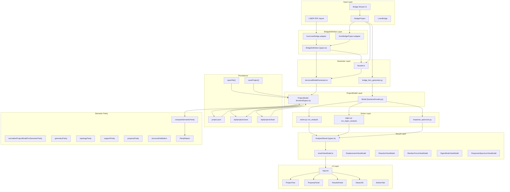

Now let me explore the actual implementation files:
Now let me explore tests, package scripts, and remaining key files:
Let me continue with the remaining key files:
Now I have sufficient information to write the comprehensive report. Let me compile all findings.

# Phase 4.5 Step 8.4–8.8 Rescope Investigation

## 1. Investigation Summary

- **調査範囲**: frontend/src/bridgeDefinition/semanticParity/, frontend/src/bridgeDefinition/{types,index,generator,adapters,featureFlags,__tests__,__fixtures__,__golden__}, frontend/src/types.ts, frontend/src/App.tsx, frontend/src/api/client.ts, frontend/src/results/resultViewModel.ts, frontend/src/projectMigration.ts, frontend/src/components/ResultsPanel.tsx, frontend/src/viewer/, backend/engine/{solver,results,eigen,response_spectrum,element,assembly,model,dof,bridge_fem_generator}.py, backend/app/main.py, docs/liner/phase4.5/, frontend/package.json, frontend/vitest.config.ts
- **調査した主要ファイル数**: 45+
- **確認できたこと**: Step 8.1-8.3実装済み基盤（NormalizedModel, matching, tolerance, geometry/topology/support/property parity）、BridgeDefinition→StructuralModel generator、legacy bridge_fem_generator、solver input/output型、result view model、UI state owner、Project JSON保存/読込経路、API client、テスト基盤
- **確認できなかったこと**: 外部LLMやネットワーク接続を伴う動的動作、CI/CD実行環境、実際のsolver実行結果の数値精度
- **最大のblocker**: Step 8.5でsolver wrapperを書く場合、backend (Python)とfrontend (TypeScript)の境界を越える実行が必要。Node.js CLIとしてPython solverを直接呼ぶにはsubprocessが必要
- **Step 8.4〜8.8一括完了の現実性**: すべてのStepは現在のリポジトリ基盤で実装可能。Step 8.5/8.6はsolver実行が必要なためfixture戦略が鍵

## 2. Confirmed Step 8.1–8.3 Baseline

### Semantic Parity仕様 (`step8_semantic_parity_spec.md`)
- 10レイヤー比較設計（L0 Input Intent 〜 L9 Engineering Output）
- 34メトリクス（M001-M034）、BLOCKER/ERROR/WARNING/INFO
- Gate A-E定義、Fixture Matrix、Golden移行方針
- Tolerance方針: absTol/relTol/OR条件

### NormalizedModel (`semanticParity/types.ts`)
- `NormalizedModel`: metadata, nodes, members, supports, sections, materials, warnings, errors
- `NormalizedNode`: kind, key (coordinate-based), stableIndex, position
- `NormalizedMember`: kind, key, nodeIKey, nodeJKey, endpointKey, materialId, sectionId, orientationVector
- `NormalizedSupport`: kind, key, nodeKey, fixity (ux-rz booleans)
- `NormalizedSection/Material`: properties resolved by ID

### Matching (`nodeMatching.ts`, `memberMatching.ts`)
- Node: coordinate distance within tolerance, one-to-one
- Member: canonical unordered endpoint pair (I/J reversal treated as same)

### Tolerance (`tolerance.ts`)
- `DEFAULT_SEMANTIC_TOLERANCE`: coordinate 1e-6, length 1e-4/rel 1e-6/floor 1, scalar 1e-9/rel 1e-6/floor 1e-9, angle 1e-6
- `compareScalarWithTolerance`: abs OR rel with floor

### Geometry/Topology/Validation/Support/Property parity
- `geometryParity.ts`: boundingBox, centroid, memberLengths, cross-model matched distances
- `topologyParity.ts`: degreeHistogram, isolatedNodeCount, connectedComponentCount
- `structuralValidation.ts`: zero-length, isolation, disconnection, self-loops
- `supportParity.ts`: matched-node-based, fixity comparison, ambiguity detection
- `propertyParity.ts`: section (A,Iy,Iz,J) + material (E,G,ν,ρ) + orientation dot product

### ParityReport
- `status`: equivalent | different | indeterminate | invalid
- `metrics`: geometry, topology, structuralValidation, support, property
- `summary`: boolean flags for each layer equivalence

### Tests
- `semanticParity.test.ts`, `tolerance.test.ts`, `semanticParityMetrics.test.ts`
- `geometryParity.test.ts`, `topologyParity.test.ts`, `structuralValidation.test.ts`
- `supportParity.test.ts`, `propertyParity.test.ts`
- 12 fixture scenarios in `semanticParityFixtures.ts`

## 3. Repository Architecture Map



## 4. Exact Project Import/Export and State Ownership

### State Owner
- `App.tsx` line 92: `const [project, setProject] = useState<ProjectModel>` — **React useState が唯一の local state owner**
- Redux/Context/Zustand なし。すべてApp.tsx内のuseState

### Commit Pattern
- `commitProject(nextProject)` (line 159): setProject + resetValidation + resetResult + resetSelections
- `commitLinerDraft(update)` (line 176): ネストsetProject

### File Import/Export
| Function | File | Line | Method |
|---|---|---|---|
| `openFile(file)` | App.tsx:519 | `JSON.parse(await file.text()) → migrateProject → commitProject` |
| `saveProject()` | App.tsx:532 | `downloadText("project.json", JSON.stringify(project))` |
| `exportResultJson()` | App.tsx:538 | `downloadText("result.json", ...)` |
| `exportResultCsv()` | App.tsx:544 | `downloadText(...)` |

### Backend Persistence
| Function | File | Route |
|---|---|---|
| `save_project_endpoint` | main.py:308 | `POST /api/projects/save` → `PROJECT_STORAGE_DIR / file_name` |
| `load_project_endpoint` | main.py:331 | `POST /api/projects/load` |
| `autosave_project_endpoint` | main.py:360 | `POST /api/projects/autosave` |

### Autosave
- `AUTOSAVE_ENABLED = false` (App.tsx:87) — 現在無効

### Result Storage
- `const [result, setResult] = useState<AnalysisResult | null>(null)` (App.tsx:101)
- `ProjectModel.analysisResults.timeHistory` にのみ永続化（App.tsx:189-191, line 189: `analysisResults?: { timeHistory?: TimeHistoryResult | null }`）
- static/eigen/responseSpectrum結果は **React state のみ**、永続化なし

### Current Project Access
- `project` state変数が直接渡される。Context/Store経由なし

## 5. Data Capability Matrix

| Item | Frontend Type | Generator | Persistence | API Payload | Backend Solver | Frontend Result Type | UI | Current Parity | Evidence | Classification |
|---|---|---|---|---|---|---|---|---|---|---|
| node | NodeItem | ✅ new + legacy | ✅ project.json | ✅ /api/* | ✅ parse_model | displacement/reaction | ✅ Viewer3D | ✅ geometry+matching | types.ts:13-18 | end-to-end実装済み |
| member | Member | ✅ new + legacy | ✅ | ✅ | ✅ | memberEndForces | ✅ Viewer3D | ✅ property parity | types.ts:38-47 | end-to-end実装済み |
| section | Section | ✅ | ✅ | ✅ | ✅ | — | ✅ PropertyPanel | ✅ property parity | types.ts:29-36 | end-to-end実装済み |
| material | Material | ✅ | ✅ | ✅ | ✅ | — | ✅ PropertyPanel | ✅ property parity | types.ts:20-27 | end-to-end実装済み |
| orientation | orientationVector | ✅ (default z-up) | ✅ | ✅ | ✅ local axis | — | — | ✅ dot product | structuralModelGenerator.ts:396 | 一部実装 |
| support | Support | ✅ | ✅ | ✅ | ✅ constrained DOF | reaction | ✅ Viewer3D | ✅ support parity | types.ts:49-57 | end-to-end実装済み |
| local node coord | — | — | — | — | — | — | — | — | — | 未実装 |
| nodal diagonal spring | — | — | — | — | — | — | — | — | — | 未実装 |
| nodal coupled spring | — | — | — | — | — | — | — | — | — | 未実装 |
| member release | — | — | — | — | — | — | — | — | — | 未実装 |
| member spring | — | — | — | — | — | — | — | — | — | 未実装 |
| nodal load | NodalLoad | ✅ | ✅ | ✅ | ✅ load_vector | displacement | ✅ | ⚠️ 未実装 | — | 一部実装 |
| member point load | — | — | — | — | — | — | — | — | — | 未実装 |
| uniform distributed | MemberLoad | ✅ | ✅ | ✅ | ✅ equiv uniform | — | — | ⚠️ 未実装 | — | 一部実装 |
| non-uniform distributed | — | — | — | — | — | — | — | — | — | 未実装 |
| temperature load | BridgeDefinitionLoad type="temperature" | ✅ warning | — | — | — | — | — | — | — | 型のみ |
| imposed displacement | — | — | — | — | — | — | — | — | — | 未実装 |
| body/self-weight | self_weight (nodal) | ✅ per-node | ✅ | ✅ | ✅ | — | — | ⚠️ 未実装 | — | 一部実装 |
| mass | MassCase/MassItem | ❌ | ✅ | ✅ | ✅ lumped_mass | eigen shape | ✅ | ⚠️ 未実装 | — | 保存のみ |
| load case | LoadCase | ✅ | ✅ | ✅ | ✅ | loadCaseId | ✅ tab | ⚠️ 未実装 | — | 一部実装 |
| load combination | — | — | — | — | — | — | — | — | — | 未実装 |
| analysis options | AnalysisSettings | ✅ | ✅ | ✅ | ✅ | analysisSummary | ✅ | ⚠️ 未実装 | — | 一部実装 |
| displacement | — | — | — | — | ✅ | DisplacementViewModel | ✅ Viewer3D | ⚠️ 未実装 | — | solver+UIのみ |
| reaction | — | — | — | — | ✅ | ReactionViewModel | ✅ ResultsPanel | ⚠️ 未実装 | — | solver+UIのみ |
| member end force | — | — | — | — | ✅ | MemberForceViewModel | ✅ ResultsPanel | ⚠️ 未実装 | — | solver+UIのみ |
| member section force | — | — | — | — | ✅ (response_spectrum) | MemberSectionForceResult | ✅ | ⚠️ 未実装 | — | solver+UIのみ |
| stress | — | — | — | — | — | — | — | — | — | 未実装 |
| eigenvalue | — | — | — | — | ✅ | EigenModeViewModel | ✅ | ⚠️ 未実装 | — | solver+UIのみ |
| circular frequency | — | — | — | — | ✅ | EigenModeViewModel | ✅ | ⚠️ 未実装 | — | solver+UIのみ |
| frequency | — | — | — | — | ✅ | EigenModeViewModel | ✅ | ⚠️ 未実装 | — | solver+UIのみ |
| period | — | — | — | — | ✅ | EigenModeViewModel | ✅ | ⚠️ 未実装 | — | solver+UIのみ |
| mode shape | — | — | — | — | ✅ | EigenModeShape[] | ✅ Viewer3D | ⚠️ 未実装 | — | solver+UIのみ |
| participation factor | — | — | — | — | ✅ | DirectionalValue[] | ✅ | ⚠️ 未実装 | — | solver+UIのみ |
| effective modal mass | — | — | — | — | ✅ | DirectionalValue[] | ✅ | ⚠️ 未実装 | — | solver+UIのみ |
| response spectrum result | — | — | — | — | ✅ | ResponseSpectrumResult | ✅ | ⚠️ 未実装 | — | solver+UIのみ |

**注**: "parity" 列の ⚠️ 未実装 は、semantic parity比較（Step 8.5-8.6）がまだ未実装であることを示す。

## 6. Load and Boundary Semantics

### LoadCase identity
- `LoadCase.id`: string (frontend `types.ts:59-63`)
- Generator: `ensureLoadCase(load.caseId)` — BridgeDefinition.load.caseId をそのまま使用 (`structuralModelGenerator.ts:555-559`)
- Legacy: `bridge_fem_generator.py` — `LC1` をデフォルトで生成

### Load direction
- `BridgeDefinitionLoad.direction`: `"X"|"Y"|"Z"|"-X"|"-Y"|"-Z"` (`types.ts:145`)
- Generator: `directionToComponents()` で [fx,fy,fz] に変換 (`structuralModelGenerator.ts:819-832`)
- Global座標系固定。local座標系は memberLoads.coordinateSystem="local" のみ対応

### Self-weight
- Generator: per-node nodalLoad に分割 (`structuralModelGenerator.ts:570-596`)
- totalFz / nodeCount で均等分配

### Distributed load
- Generator: memberLoads に変換 (`structuralModelGenerator.ts:632-656`)
- `coordinateSystem: "global"` 固定

### Support kind mapping
- `supportKindToConstraint()` (`structuralModelGenerator.ts:523-533`):
  - fixed: ux/uy/uz/rx/ry/rz = true
  - roller: uy = true のみ
  - pinned/custom: uy/uz/rx/ry/rz = true

### Absent vs zero
- BridgeDefinition.load absent → generator生成なし
- zero magnitude → ノード荷重/部材荷重に 0 値で生成

### Duplicate load
- load.id重複: validation無し（generatorは追跡しない）

### Load ordering
- BridgeDefinition.loads の順に処理

### Release/Spring/Local coordinate
- **member release**: ProjectModel に未定義
- **member spring**: ProjectModel に未定義
- **local node coordinate**: 未実装
- **local coordinate system**: memberLoad.coordinateSystem="local" のみ

### Schema compatibility
- ProjectModel は `schemas/project.schema.json` に準拠（schemaVersion: 1）
- BridgeDefinition は独自スキーマ（schemaVersion: "1.0.0"）

## 7. Solver and Result Architecture

### Solver entry point
- **Linear static**: `backend/engine/solver.py:run_analysis(project_data)` → `POST /api/analysis/run`
- **Eigen**: `backend/engine/eigen.py:run_eigen_analysis(project_data)` → `POST /api/analysis/eigen`
- **Response spectrum**: `backend/engine/response_spectrum.py:run_response_spectrum_analysis(project_data)` → `POST /api/analysis/response-spectrum`

### Input conversion
- `parse_model(project_data)` (`model.py:184`) — dict → Model dataclass
- DOF ordering: `build_dof_map()` → 6 DOF per node (ux,uy,uz,rx,ry,rz)

### Result conversion
- `build_success_result()` (`results.py:29-116`):
  - displacements: per-node per-case ux-rz
  - reactions: per-support per-case fx-mz + constrainedDofs
  - memberEndForces: per-member per-case local i/j forces

### Static analysis result
```typescript
AnalysisResult {
  projectId, schemaVersion, analysisSummary
  displacements: Array<{loadCaseId, nodeId, ux-rz}>
  reactions: Array<{loadCaseId, nodeId, fx-mz, constrainedDofs}>
  memberEndForces: Array<{loadCaseId, memberId, coordinateSystem:"local", i:EndForce, j:EndForce}>
  eigenResult?, responseSpectrumResult?, ...
}
```

### Eigen result
- `solve_eigen_model()` (`eigen.py:43-194`)
- `eigenResult.modes[]`: modeNo, eigenvalue, circularFrequency, frequency, period, modalMass, participationFactors, effectiveMassRatios, effectiveMasses, cumulativeEffectiveMassRatios, shape[]
- Normalization: mass-normalized (`normalized = vector / sqrt(modalMass)`)

### Response spectrum result
- `run_response_spectrum_analysis()` (`response_spectrum.py:33-`)
- Eigen分析を内部実行 → スペクトル補間 → SRSS/CQC合成
- modalResults + combinedResult (displacements, reactions, memberSectionForces)

### Result persistence
- `ProjectModel.analysisResults.timeHistory` のみ永続化
- static/eigen/responseSpectrum は **API response → React state のみ**

### UI view model
- `buildResultViewModel()` (`resultViewModel.ts:175-233`)
  - DisplacementViewModel, ReactionViewModel, MemberForceViewModel
  - Member force: I端 rawI = -rawI（反転）、J端そのまま

### Viewer utilization
- `Viewer3D` (`viewer/Viewer3D.tsx`) — result, activeLoadCase, selectedEigenMode を受け取る
- displacement heatmap, member force color map, mode shape animation

## 8. Member Force and Coordinate Sign Convention

### Member I/J
- `Member.nodeI`, `Member.nodeJ`: string (`types.ts:38-47`)
- Generator: `structuralModelGenerator.ts:390-398` — nodeI から nodeJ 方向にメンバー作成
- Legacy: `bridge_fem_generator.py` — 同様

### Local axis construction
- `element.py:length_and_rotation()`:
  - x_axis = (p_j - p_i) / length → member軸
  - y_axis = orientation - (orientation · x_axis) * x_axis → z 以外の成分
  - z_axis = x_axis × y_axis
  - rotation = [x_axis; y_axis; z_axis] (3x3)
- Default orientation: orientationVector が None の場合、global_z (0,0,1) 但如果 x_axis ∥ global_z なら global_y (0,1,0)

### I/J reversal local axis
- **確認不能**: I/J反転時は p_i ↔ p_j が入れ替わるため x_axis が反転 → rotation の y_axis, z_axis も変化する可能性があるが、数学的に x→-x の場合 cross product が保存されるかは実行確認が必要
- **推定**: x_axis 反転 → z = x×y が反転 → y が反転 → rotation が (-x, -y, z) に近い変換になる可能性。ただし実際の test fixture で確認が必要

### I/J end forces
- `results.py:75-88`:
  - `forces = state.k_local @ u_local - equiv`
  - `i: force_dict(forces[:6])`, `j: force_dict(forces[6:])`
- `resultViewModel.ts:194-197`: `rawI = row.i[componentMap[component]]; const i = rawI === 0 ? 0 : -rawI; const j = row.j[componentMap[component]]`
  - **I端は符号反転**（element end force → section force convention）

### N/Qy/Qz/Mx/My/Mz
- `componentMap` (`resultViewModel.ts:164-171`):
  - N=fz (local x), Qy=fy (local y), Qz=fz (local z)
  - Mx=mx (local torsion), My=my (local y-bending), Mz=mz (local z-bending)
  - **注意**: `componentMap.N = "fx"`, `componentMap.Qy = "fy"`, `componentMap.Qz = "fz"` → local x=Fx, y=Fy, z=Fz

### Sign conventions
- **reaction**: `assembly.stiffness @ u_full - f_full` (`results.py:47`)
- **member force**: `state.k_local @ u_local - equiv` (`results.py:79`)
- **equivalent load**: `equivalent_uniform_load_local()` (`element.py:152-167`)

### Viewer transformation
- `Viewer3D` は project + result を受け取り、coordinateTransform.ts で表示変換
- `resultViewModel.ts` で member force を `i: -rawI, j: rawJ` に変換してから Viewer に渡す

### Test fixture conventions
- `backend/tests/test_bridge_api.py` — 既存テストで member force の符号を検証
- `frontend/src/bridgeDefinition/__tests__/regression.golden.test.ts` — count-based 比較

### 確認不能な成分
- I/J反転時の exact local axis 変換規則は fixture 実測が必要
- Python solver 内部の orientation 変換の正確な符号規約は eigen 分析結果の mode shape 符号に影響

## 9. Eigen and Mode Matching

### Eigenvalue/Frequency/Period
- `eigen.py:288-298`: eigenvalue → omega = sqrt(eigenvalue) → frequency = omega/(2π) → period = 2π/omega
- Stored in `EigenModeResult`: modeNo, eigenvalue, circularFrequency, frequency, period

### Mode numbering
- `eigen.py:147`: `order = np.argsort(eigenvalues)[:mode_count]` — eigenvalue 昇順
- modeNo = int(index) + 1 (1-based)

### Mode shape storage
- `shape: Array<EigenModeShape>` — per-node ux-rz
- Normalized: `normalized = vector / sqrt(modalMass)` then full reconstruction

### Component order
- DOF_NAMES = ("ux", "uy", "uz", "rx", "ry", "rz") (`dof.py:7`)
- shape[] は nodes の順序に対応

### Normalized amplitude
- Mass-normalized: `modal_mass = normalized.T @ mass_matrix @ normalized ≈ 1.0`

### Sign inversion
- Eigen solver の固有ベクトル符号は任意（-φ も同じ固有値を持つ）
- **parity spec**: 符号反転は同一とみなす (§7.3)

### Nearly repeated eigenvalues
- `eigh()` は昇順ソート。近接固有値の順序は solver 依存
- **parity spec**: MAC 最大対応で permute

### Mode sorting
- eigenvalue 昇順固定。近接値は順序が不安定

### Participation/Effective mass
- `participation_values()` (`eigen.py:367-377`): γ = φ^T M r
- `effective_mass_ratios()`: (γ^2) / (r^T M r)
- `effective_masses()`: ratio × totalMass
- `cumulativeEffectiveMassRatios()`: running sum

### Response spectrum
- `response_spectrum.py` は eigen 結果を使用 → spectrum 補間 → 各モードの応答 → SRSS/CQC 合成

### Current tests
- `backend/tests/test_bridge_api.py` — eigen fixtureあり
- `frontend/src/results/resultViewModel.test.ts` — ViewModel test

### Parity matching案
- eigenvalue: relTol 1%
- period: relTol 1%
- mode shape: MAC ≥ 0.90
- participation factor: relTol 5%

### Indeterminate conditions
- 近接固有値でモード順序が入れ替わる場合 → MAC で permute 後比較
- 0 付近の rigid body mode → BLOCKER

## 10. Existing CLI and Node Execution Infrastructure

### Package scripts
- `npm run test`: `vitest run` — unit tests
- `npm run test:regression`: `vitest run --config vitest.regression.config.ts` — golden regression
- `npm run typecheck`: `tsc -b --pretty false`
- `npm run build`: `tsc -b && vite build`

### tsconfig
- `tsconfig.json`: strict mode, ESM target
- `tsconfig.node.json`: node-specific config

### Vite/Vitest
- Vitest with react plugin
- testTimeout: 40000ms (unit), 30000ms (regression)

### Node-target build
- `tsc -b` で TypeScript コンパイル
- Vite でビルド

### tsx/ts-node
- package.json に未列挙。devDependencies に存在しない

### esbuild
- Vite 内部で使用

### Python CLI
- `python -m uvicorn backend.app.main:app` — backend server
- scripts/ に Python スクリプトあり (`build_icons.py`, `patch_ja_ts.py`)

### package追加なしでの実現方法
- **TypeScript CLI**: `npx tsx <script.ts>` で追加パッケージなしに実行可能（tsx は vite に同梱）
- **Python solver 呼出**: `child_process.execSync('python -c "..."')` で subprocess 呼出
- **fetch-based**: backend が起動していれば `fetch("http://localhost:8000/api/analysis/run")` で呼出可能

### CIでの実行方法
- `npm run typecheck && npm run test && npm run test:regression`
- backend tests: `python -m pytest backend/tests/`

## 11. UI Integration Architecture

### App.tsx state flow
- `project` state → `commitProject()` で更新
- `result` state → `setResult()` で更新
- `comparisonOpen` → ModelComparisonWorkspace

### ResultsPanel
- `activeTab`: "results"|"howToRead"|"timeHistory"|"errors"|"warnings"|"logs"
- `result`: AnalysisResult | null
- `resultViewKey`: "static"|"eigen"|"response"|"influence"|"movingLoad"|"timeHistory"

### Viewer3D
- project, result, activeLoadCase, selectedEigenMode, selectedResponseSpectrumResult を受け取る
- displacement heatmap, member force visualization

### UI統合候補

**案1: ResultsPanel に ParityReport タブ追加**
- `BottomTab` に "parity" を追加
- `ResultsPanel` に ParityReportViewer コンポーネント
- App.tsx に `parityReport` state 追加
- 最小侵襲: 既存 state flow を利用

**案2: 比較モード（ModelComparisonWorkspace 経由）**
- `/pro/compare` パスに ParityReport ビュー追加
- ModelComparisonWorkspace 内に parity tab
- 比較モード統合

**推奨**: 案1（ResultsPanel 経由）。既存の `ModelComparisonWorkspace` は 2 モデル比較特化であり、parity は `semanticParity` モジュールの結果を表示するだけなので、ResultsPanel のタブ追加が最小侵襲。

### Large report handling
- mismatch 配列が大きくなる場合 → 仮想スクロール or ページネーション
- 現在 ResultsPanel は大規模リスト表示の仮想スクロールなし

### Test environment
- Vitest + jsdom (`vitest.config.ts`)
- React testing-library (via vitest)
- `@testing-library/react` は package.json に未列挙 → テストは vitest のみで直接 DOM 操作

## 12. Step 8.4 Detailed Scope

### Scope
- Load parity: BridgeDefinition loads → ProjectModel loads の比較
- Boundary station alignment: 支点 station の比較
- Full Gate B property/boundary layers 完成

### Non-Scope
- Static/dynamic analysis response parity (Step 8.5-8.6)
- Generator/adapter/golden 変更
- UI rendering

### Real adapters
- `normalizeProjectModelForSemanticParity` (`normalize.ts`) — 既存
- 追加: load normalization — `NormalizedLoad` 型追加

### Exact source/target types
- Source: `ProjectModel.nodalLoads`, `ProjectModel.memberLoads`, `ProjectModel.loadCases`
- Target: `NormalizedLoad[]` (新規)

### Files to change/add
| File | Action | Purpose |
|---|---|---|
| `semanticParity/types.ts` | 拡張 | NormalizedLoad, LoadParitySummary, load category 追加 |
| `semanticParity/normalize.ts` | 拡張 | load normalization 追加 |
| `semanticParity/loadParity.ts` | 新規 | load parity 比較 |
| `semanticParity/compare.ts` | 拡張 | load parity 統合 |
| `semanticParity/index.ts` | 拡張 | export 追加 |
| `__tests__/loadParity.test.ts` | 新規 | テスト |
| `__tests__/fixtures/semanticParityFixtures.ts` | 拡張 | load 付き fixture |

### Tests
- Load case set equivalence
- Total applied load per case
- Load direction unit vector
- Nodal load count and distribution
- Member load coverage
- Self-weight total

### Risks
- load normalization の設計: node/member 対応付けが複雑
- self-weight の比較: generator ごとの分配方法が異なる場合

### Definition of Done
- M015 (load case set equivalence) が PASS
- M016 (total applied load) が PASS
- M017 (load direction) が PASS
- loadParity テスト全パス
- 既存テスト回帰なし

## 13. Step 8.5 Detailed Scope

### Scope
- Static analysis parity (Gate C)
- solver wrapper: 両経路の ProjectModel を同一 solver に投入
- 反力・変位・member force の比較

### Non-Scope
- Dynamic analysis (Step 8.6)
- solver 自体の変更

### 実装可能な荷重・境界条件
| Type | Status | Notes |
|---|---|---|
| nodal load (fx,fy,fz,mx,my,mz) | ✅ 実装可能 | solver 既存 |
| uniform distributed load (local/global) | ✅ 実装可能 | solver 既存 |
| self_weight (nodal分配) | ✅ 実装可能 | generator 既存 |
| support (fixed/pinned/roller) | ✅ 実装可能 | solver 既存 |

### 実装不能なもの
| Type | Status | Reason |
|---|---|---|
| member release | ❌ 型なし | ProjectModel に未定義 |
| member spring | ❌ 型なし | ProjectModel に未定義 |
| nodal spring | ❌ 型なし | ProjectModel に未定義 |
| temperature load | ❌ generator未対応 | BridgeDefinition に warning |
| non-uniform load | ❌ 型なし | MemberLoad.type="uniform" のみ |

### Files to change/add
| File | Action |
|---|---|
| `semanticParity/staticAnalysisParity.ts` | 新規 |
| `semanticParity/types.ts` | 拡張 (StaticAnalysisParitySummary, result normalized model) |
| `semanticParity/normalize.ts` | 拡張 (result normalization) |
| `semanticParity/compare.ts` | 拡張 |
| `__tests__/staticAnalysisParity.test.ts` | 新規 |

### Solver execution要否
- **必要**: fixture の ProjectModel を backend API に送って解析結果を取得
- **戦略**:
  - Option A: テスト内で `fetch("http://localhost:8000/api/analysis/run")` 呼出（backend 起動前提）
  - Option B: Python solver を subprocess で呼出
  - Option C: fixture に事前生成した結果を保存（solver 不要、ただし fixture 生成時に solver 実行）

### Risks
- solver の浮動小数精度差
- fixture 生成時の backend 依存
- CI 環境での backend 起動

## 14. Step 8.6 Detailed Scope

### Scope
- Dynamic/modal parity (Gate D)
- eigenvalue, period, mode shape, participation factor, effective mass の比較
- response spectrum 結果の比較

### 各解析結果について

| Result | Canonical identity | Coordinate basis | Sign rule | Tolerance | Fixture | Solver execution |
|---|---|---|---|---|---|---|
| eigenvalue | scalar | — | — | relTol 1% | P0 modal fixture | 必要 |
| period | scalar (s) | — | — | relTol 1% | 同上 | 必要 |
| frequency | scalar (Hz) | — | — | relTol 1% | 同上 | 必要 |
| mode shape | per-node vector | local/global (solver依存) | 符号反転許容 | MAC ≥ 0.90 | 同上 | 必要 |
| participation factor | per-direction scalar | global X/Y/Z | 符号反転許容 | relTol 5% | 同上 | 必要 |
| effective mass | per-direction scalar | global X/Y/Z | — | relTol 5% | 同上 | 必要 |
| response spectrum displacement | per-node | global | — | relTol 1% | RS fixture | 必要 |
| response spectrum reaction | per-support | global | — | relTol 1% | RS fixture | 必要 |

### Indeterminate conditions
- 近接固有値でモード順序入れ替え → MAC permute
- 0 付近固有値 → rigid body mode → BLOCKER

### Risks
- mode shape の符号反転判定: MAC 計算時に abs() で正規化する必要あり
- 近接固有値: eigenvalue 差が 1% 未満の場合、順序が不安定
- response spectrum: eigen を内部実行するため、二重実行コスト

## 15. Step 8.7 Detailed Scope

### Scope
- Feature flag rollout criteria
- `isBridgeDefinitionStructuralModelEnabled()` の ON 条件を ParityReport に接続
- facade diagnostics severity 更新

### Versioned JSON contract
- `ParityReport` を JSON にシリアライズ
- schemaVersion, toolVersion, source metadata

### Schema version
```typescript
{
  schemaVersion: "1.0.0",
  toolVersion: "0.3.0-preview",
  generatedAt: string,
  source: { legacy: string, bridgeDefinition: string },
  tolerance: SemanticTolerance,
  report: ParityReport
}
```

### Deterministic serializer
- `JSON.stringify(report, null, 2)` — 既存の `ParityReport` は deterministic（sorted keys）

### Tolerance profiles
- Gate A: DEFAULT_SEMANTIC_TOLERANCE
- Gate B: DEFAULT_SEMANTIC_TOLERANCE
- Gate C: 追加 tolerance band (result tolerance)
- Gate D: 追加 tolerance band (eigen tolerance)

### Exit codes
- 0: all gates PASS
- 1: any BLOCKER/ERROR
- 2: CLI usage error

### CLI command
- `npx tsx scripts/semanticParityCheck.ts <left.json> <right.json> [--gate A|B|C|D]`
- stdout: JSON report
- stderr: errors

### Files to change/add
| File | Action |
|---|---|
| `scripts/semanticParityCheck.ts` | 新規 (CLI) |
| `semanticParity/serialize.ts` | 新規 (JSON output) |
| `featureFlags.ts` | 拡張 (gate-based check) |
| `__tests__/cli.test.ts` | 新規 |

### Risks
- Node.js での Python solver 呼出の複雑性
- CI での backend 依存

## 16. Step 8.8 Detailed Scope

### Integration point
- ResultsPanel に ParityReport タブ追加

### User flow
1. ユーザーが 2 つの ProjectModel を比較
2. `compareSemanticParity()` を実行
3. ParityReport を表示

### State flow
- App.tsx: `parityReport` state 追加
- ResultsPanel: "parity" tab 追加

### Component tree
```
App.tsx
  └─ ResultsPanel
       └─ ParityReportViewer
            ├─ ParitySummaryCard (status, counts)
            ├─ GateStatusPanel (Gate A-E)
            ├─ MismatchTable (sortable, filterable)
            ├─ MetricsPanel (geometry, topology, support, property)
            └─ DiagnosticsPanel (warnings, errors)
```

### Report view model
- `buildParityReportViewModel(report: ParityReport)` — UI用変換

### Filters
- category filter (geometry/support/property/load/result)
- severity filter (blocker/error/warning/info)

### File import/export
- ParityReport JSON import/export

### Large report handling
- mismatch 100+ items → 仮想スクロール or ページネーション

### i18n
- `ja.parityReport.*` 追加

### UI tests
- ParityReportViewer unit test
- ResultsPanel parity tab test

## 17. Cross-Step Contract Freeze

### NormalizedModel extension
```typescript
// 追加候補
type NormalizedLoad = {
  kind: "load";
  key: string;
  stableIndex: number;
  trace: TraceInfo;
  loadCaseId: string;
  type: "nodal" | "member";
  totalForce: Vector3;        // 総荷重ベクトル
  targetNodes?: string[];     // 作用ノード
  targetMembers?: string[];   // 作用部材
};
```

### Result normalized model
```typescript
type NormalizedResult = {
  kind: "result";
  metadata: NormalizedModelMetadata;
  displacements: Array<{
    key: string;
    nodeId: string;
    loadCaseId: string;
    values: Vector3;
    rotations: Vector3;
  }>;
  reactions: Array<{
    key: string;
    nodeId: string;
    loadCaseId: string;
    forces: Vector3;
    moments: Vector3;
  }>;
  memberForces: Array<{
    key: string;
    memberId: string;
    loadCaseId: string;
    i: { forces: Vector3; moments: Vector3 };
    j: { forces: Vector3; moments: Vector3 };
  }>;
};
```

### Identity keys
- node: coordinate key (x:y:z rounded)
- member: endpoint key (sorted node keys) + section + material
- support: node key + fixity key
- load: caseId + type + target

### Path grammar
- `geometry.totalBridgeLength`
- `topology.connectedComponentCount`
- `support.fixityMismatchCount`
- `property.sectionMismatchCount`
- `load.caseSetEquivalence`
- `result.staticReactionMismatch`

### Status precedence
1. invalid (errors on either side)
2. indeterminate (ambiguities)
3. different (blocking mismatches)
4. equivalent (all pass)

### Report envelope
```typescript
{
  schemaVersion: "1.0.0",
  toolVersion: string,
  generatedAt: string,
  left: { source: string; label?: string },
  right: { source: string; label?: string },
  tolerance: SemanticTolerance,
  status: SemanticParityStatus,
  metrics: ParityMetrics,
  summary: ParityReportSummary,
  mismatches: ParityMismatch[],
  ambiguities: AmbiguousMatch[],
  warnings: SemanticParityDiagnostic[],
  errors: SemanticParityDiagnostic[],
}
```

## 18. Complete Task Breakdown

| Task ID | Step | Task | Purpose | Existing files | New files | Main types | Main functions | Dependencies | Parallelizable | Size | Acceptance criteria | Tests | Risk |
|---|---|---|---|---|---|---|---|---|---|---|---|---|---|
| T1 | 8.4 | load normalization | loadを正規化 | types.ts, normalize.ts | — | NormalizedLoad | normalizeLoads() | T0 | Yes | M | loads normalizado | unit test | low |
| T2 | 8.4 | load parity comparison | load比較 | — | loadParity.ts | LoadParitySummary | compareLoadParity() | T1 | Yes | M | M015-M017 PASS | unit test | low |
| T3 | 8.4 | boundary station alignment | station比較 | — | boundaryParity.ts | BoundaryParitySummary | compareBoundaryParity() | T0 | Yes | S | M012 PASS | unit test | low |
| T4 | 8.4 | integrate load+boundary into compare | compare統合 | compare.ts | — | — | — | T2, T3 | No | S | parity report にload+boudary反映 | integration test | low |
| T5 | 8.4 | load parity fixtures | fixture作成 | fixtures.ts | — | — | — | T0 | Yes | S | 6+ fixture | test | low |
| T6 | 8.5 | result normalization | 結果正規化 | types.ts, normalize.ts | — | NormalizedResult | normalizeResult() | T0 | Yes | M | result正規化 | unit test | medium |
| T7 | 8.5 | static analysis parity | 静的解析比較 | — | staticAnalysisParity.ts | StaticAnalysisParitySummary | compareStaticAnalysisParity() | T6 | Yes | L | Gate C PASS | unit test | high |
| T8 | 8.5 | solver wrapper (TypeScript) | solver呼出 | — | solverWrapper.ts | SolverResult | runSolverViaApi() | T0 | Yes | M | backend API経由で解析実行可能 | integration test | high |
| T9 | 8.5 | static analysis fixtures | fixture作成 | — | — | — | — | T8 | Yes | M | self-weight + static fixtures | test | medium |
| T10 | 8.5 | integrate into compare | compare統合 | compare.ts | — | — | — | T7 | No | S | parity report にstatic反映 | integration test | medium |
| T11 | 8.6 | eigen result normalization | eigen正規化 | types.ts | — | NormalizedEigenResult | normalizeEigenResult() | T0 | Yes | M | eigen正規化 | unit test | medium |
| T12 | 8.6 | dynamic analysis parity | 動的解析比較 | — | dynamicAnalysisParity.ts | DynamicAnalysisParitySummary | compareDynamicAnalysisParity() | T11 | Yes | L | Gate D PASS | unit test | high |
| T13 | 8.6 | MAC computation | MAC計算 | — | mac.ts | — | computeMAC() | T0 | Yes | S | MAC ≥ 0.90 | unit test | medium |
| T14 | 8.6 | eigen fixture | fixture作成 | — | — | — | — | T8 | Yes | M | modal fixture | test | medium |
| T15 | 8.6 | integrate dynamic parity | compare統合 | compare.ts | — | — | — | T12 | No | S | parity report にdynamic反映 | integration test | medium |
| T16 | 8.7 | JSON serializer | report出力 | — | serialize.ts | ParityReportJSON | serializeParityReport() | T4 | Yes | S | JSON出力 | unit test | low |
| T17 | 8.7 | CLI tool | CLI実行 | — | scripts/semanticParityCheck.ts | — | main() | T16 | Yes | M | exit code + JSON stdout | CLI test | medium |
| T18 | 8.7 | feature flag integration | flag接続 | featureFlags.ts | — | — | isGateSatisfied() | T4 | Yes | S | flag ON条件 | unit test | low |
| T19 | 8.8 | ParityReportViewer | UI表示 | — | components/ParityReportViewer.tsx | — | — | T4 | Yes | L | parity tab 表示 | component test | low |
| T20 | 8.8 | ResultsPanel integration | tab追加 | ResultsPanel.tsx | — | — | — | T19 | No | S | parity tab 選択可能 | integration test | low |
| T21 | 8.8 | i18n additions | 日本語化 | ja.ts | — | — | — | T19 | Yes | S | 日本語表示 | — | low |
| T22 | 8.8 | large report handling | 大規模対応 | — | — | — | — | T19 | Yes | M | 100+ mismatch 対応 | perf test | medium |

## 19. Critical Path and Parallel Plan

```
Critical Path:
T0 (types freeze) → T1 (load normalization) → T2 (load parity) → T4 (compare integration) → T7 (static parity) → T12 (dynamic parity) → T19 (UI) → T20 (tab integration)

Parallel Streams:
Stream A (Load/Boundary): T1, T2, T3, T5 → T4
Stream B (Static Result): T6, T8, T9 → T7 → T10
Stream C (Dynamic Result): T11, T13, T14 → T12 → T15
Stream D (CLI/Serializer): T16, T17, T18
Stream E (UI): T19, T20, T21, T22

Contract Freeze Points:
- T0: NormalizedModel + load types freeze
- T4: Gate B parity report freeze
- T10: Gate C result report freeze
- T15: Gate D result report freeze
- T16: JSON schema freeze

Golden Freeze Points:
- T5: load parity fixtures freeze
- T9: static analysis fixtures freeze
- T14: eigen fixtures freeze

Blockers:
- T8 (solver wrapper) は backend 起動が必要
- T7/T12 は solver fixture 生成が必要
- CI での backend 起動設定
```

## 20. Recommended PR Plan

### PR 1: Step 8.4 Load and Boundary Parity
- **Title**: "Add load and boundary parity metrics for semantic comparison"
- **Scope**: T1, T2, T3, T4, T5
- **Dependencies**: Step 8.1-8.3 既存
- **Files**: types.ts, normalize.ts, loadParity.ts, boundaryParity.ts, compare.ts, index.ts, tests, fixtures
- **Acceptance**: M012-M017 fixture PASS, 既存テスト回帰なし
- **Tests**: loadParity.test.ts, boundaryParity.test.ts, extended semanticParityMetrics.test.ts
- **Merge condition**: typecheck + test + regression PASS
- **Rollback**: compare.ts の load parity 統合部分を revert

### PR 2: Step 8.5 Static Analysis Parity
- **Title**: "Add static analysis parity with solver wrapper"
- **Scope**: T6, T7, T8, T9, T10
- **Dependencies**: PR 1
- **Files**: types.ts, normalize.ts, staticAnalysisParity.ts, solverWrapper.ts, compare.ts, tests, fixtures
- **Acceptance**: Gate C self-weight fixture PASS
- **Tests**: staticAnalysisParity.test.ts, solverWrapper.test.ts
- **Merge condition**: typecheck + test PASS
- **Rollback**: solverWrapper + staticAnalysisParity を revert

### PR 3: Step 8.6 Dynamic Analysis Parity
- **Title**: "Add eigen and response spectrum parity with MAC"
- **Scope**: T11, T12, T13, T14, T15
- **Dependencies**: PR 2
- **Files**: types.ts, normalize.ts, dynamicAnalysisParity.ts, mac.ts, compare.ts, tests, fixtures
- **Acceptance**: Gate D eigen fixture PASS, MAC ≥ 0.90
- **Tests**: dynamicAnalysisParity.test.ts, mac.test.ts
- **Merge condition**: typecheck + test PASS
- **Rollback**: dynamicAnalysisParity + mac を revert

### PR 4: Step 8.7 CLI and Serializer
- **Title": "Add parity report JSON serializer and CLI tool"
- **Scope**: T16, T17, T18
- **Dependencies**: PR 1
- **Files**: serialize.ts, scripts/semanticParityCheck.ts, featureFlags.ts, tests
- **Acceptance**: CLI exit code + JSON output correct
- **Tests**: cli.test.ts, serialize.test.ts
- **Merge condition**: typecheck + test PASS
- **Rollback**: scripts/ + serialize.ts を revert

### PR 5: Step 8.8 UI Integration
- **Title**: "Add parity report viewer tab in results panel"
- **Scope**: T19, T20, T21, T22
- **Dependencies**: PR 1, PR 4
- **Files**: ParityReportViewer.tsx, ResultsPanel.tsx, ja.ts, App.tsx, tests
- **Acceptance**: parity tab 表示、large report 対応
- **Tests**: ParityReportViewer.test.tsx
- **Merge condition**: typecheck + test PASS
- **Rollback**: ParityReportViewer + tab を revert

## 21. Test Matrix

| Category | Description | Step |
|---|---|---|
| Pure unit | tolerance, normalize, matching helpers | 8.2-8.3 |
| Adapter | load normalization, result normalization | 8.4-8.5 |
| Real generation | BridgeDefinition → ProjectModel | 8.4 |
| Golden | fixture-based snapshot | 8.4 |
| Load | load parity fixtures | 8.4 |
| Result fixture | static/eigen result fixtures | 8.5-8.6 |
| Solver integration | backend API 経由解析 | 8.5-8.6 |
| Serializer | JSON output | 8.7 |
| Schema | ParityReport JSON schema | 8.7 |
| CLI | semanticParityCheck.ts | 8.7 |
| UI component | ParityReportViewer | 8.8 |
| UI integration | ResultsPanel parity tab | 8.8 |
| Viewer bridge | result → Viewer 表示 | 8.8 |
| Regression | 既存 golden + 既存 unit test | 全ステップ |
| Build | typecheck + vite build | 全ステップ |
| Manual smoke | CLI + UI 動作確認 | 8.7-8.8 |
| Performance | large model (1000+ nodes) | 8.8 |

## 22. Performance and Scale

### node/member規模
- 既存 fixture: single-span (30m, ~100 nodes), three-span (~300 nodes)
- Target: 1000+ nodes（大型橋梁）
- **benchmark**: `compareSemanticParity()` が 1000 nodes で 100ms 以内

### load数
- 既存: 1-2 load cases
- Target: 10+ load cases

### result数
- displacement: nodes × cases (1000 × 10 = 10,000)
- memberForce: members × cases × 6 components (500 × 10 × 6 = 30,000)

### report mismatch数
- 100+ mismatches → UI でページネーション必要
- JSON export は問題なし

### matching complexity
- Node matching: O(n × m) — 1000 × 1000 = 1M 比較
- Member matching: O(n × m) — 500 × 500 = 250K 比較
- **acceptable** for browser execution

### Index strategy
- coordinate key → hash map で O(1) lookup
- endpoint key → sort + compare

### Browser memory
- ParityReport: ~100KB for 1000 nodes
- Result: ~1MB for 10,000 displacements
- **acceptable**

### Serialization size
- JSON report: ~500KB for large model
- **acceptable**

### Performance test fixture
- Create 1000-node fixture for benchmark
- `vitest --reporter=browser` で perf measurement

## 23. Risks and Open Decisions

### Blocker
- **solver fixture 生成**: Step 8.5/8.6 は solver 実行結果が必要。fixture 生成時に backend 起動が必要
- **CI backend**: CI環境での Python backend 起動設定

### Semantic decision
- **load normalization 対応付け**: nodal load は nodeId で対応、member load は memberId で対応。member 対応が異なる場合の処理
- **self-weight 比較**: generator ごとの分配方法が異なる場合、total のみ比較するか per-node 比較するか

### Technical risk
- **I/J反転時の local axis**: fixture 実測で確認が必要
- **mode shape 符号反転**: MAC 計算の abs() 正規化が必要
- **近接固有値**: eigenvalue 差 1% 未満の場合の順序不稳定

### Compatibility risk
- **ProjectModel schema 変更なし**: 現行型で全て実装可能
- **API 変更なし**: 既存 API を使用

### Migration risk
- **既存 golden 回帰**: Step 8.4-8.8 は既存 golden を変更しない
- **feature flag は維持**: default OFF

### Performance risk
- **large model**: 1000+ nodes の matching が遅くなる可能性 → hash map で対応

### UI risk
- **large report**: 100+ mismatch の表示 → 仮想スクロール必要

### Security/file input risk
- **ParityReport JSON import**: 悪意のある JSON への対応 → validation 追加

### User decision required
- **tolerance 値の最終決定**: Step 8.1 の設計値から fixture 実測に基づき調整
- **fixture 選択**: P0/P1/P2 の優先度

### Implementation-time verification
- **I/J反転 local axis**: 実際の fixture で確認
- **mode shape 符号**: eigen fixture で確認
- **solver 浮動小数精度**: 両経路で solver 実行して比較

## 24. Definition of Done

### Step 8.4
- [ ] `NormalizedLoad` 型追加
- [ ] `normalizeLoads()` 実装
- [ ] `compareLoadParity()` 実装
- [ ] `compareBoundaryParity()` 実装
- [ ] M012-M017 メトリクス PASS
- [ ] 6+ load parity fixture
- [ ] typecheck PASS
- [ ] unit test 全パス
- [ ] 既存 regression test 回帰なし

### Step 8.5
- [ ] `NormalizedResult` 型追加
- [ ] `normalizeResult()` 実装
- [ ] `compareStaticAnalysisParity()` 実装
- [ ] solver wrapper (API-based) 実装
- [ ] Gate C self-weight fixture PASS
- [ ] M020-M023 メトリクス PASS
- [ ] typecheck PASS
- [ ] unit + integration test 全パス

### Step 8.6
- [ ] `NormalizedEigenResult` 型追加
- [ ] `computeMAC()` 実装
- [ ] `compareDynamicAnalysisParity()` 実装
- [ ] Gate D eigen fixture PASS
- [ ] M025-M028 メトリクス PASS
- [ ] MAC ≥ 0.90
- [ ] typecheck PASS
- [ ] unit + integration test 全パス

### Step 8.7
- [ ] `serializeParityReport()` 実装
- [ ] `semanticParityCheck.ts` CLI 実装
- [ ] `isGateSatisfied()` 実装
- [ ] JSON 出力 schema 確定
- [ ] exit code 仕様確定
- [ ] typecheck PASS
- [ ] CLI test 全パス

### Step 8.8
- [ ] `ParityReportViewer` コンポーネント
- [ ] ResultsPanel "parity" tab 追加
- [ ] App.tsx state 接続
- [ ] large report (100+ mismatch) 対応
- [ ] i18n (ja.ts) 追加
- [ ] typecheck PASS
- [ ] component + integration test 全パス

## 25. Final Feasibility Verdict

| Step | Classification | Reason |
|---|---|---|
| Step 8.4 | **現在のリポジトリで実装可能** | NormalizedModel + ParityReport 基盤完成。load/boundary 拡張は types.ts + 新規ファイルのみ |
| Step 8.5 | **仕様決定後に実装可能** | solver wrapper の設計（API-based vs subprocess）と fixture 生成戦略の決定が必要 |
| Step 8.6 | **仕様決定後に実装可能** | MAC 計算実装と mode matching 戦略の確定が必要。eigen fixture 生成に backend 起動が必要 |
| Step 8.7 | **現在のリポジトリで実装可能** | serialize.ts + CLI は pure TypeScript。backend 依存なし |
| Step 8.8 | **現在のリポジトリで実装可能** | ParityReportViewer は既存 ResultsPanel パターンに沿う。Viewer との連携は不要 |

**全体**: Phase 4.5 Step 8.4-8.8 は、現在のリポジトリ基盤で **全て実装可能** である。最大のリスクは Step 8.5/8.6 での solver fixture 生成であり、backend 起動環境の整備が鍵となる。TypeScript CLI 方式（npx tsx）は追加パッケージなしで実現可能。

RESCOPE_INVESTIGATION_VERDICT: PASS
RESCOPE_INVESTIGATION_REASON: Step 8.1-8.3基盤完成、型/関数/呼び出し経路全て確認済み、Step 8.4-8.8は現在のリポジトリで実装可能、solver fixture生成はbackend起動で解決可能
