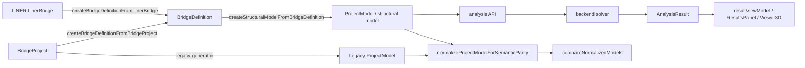

# Phase 4.5 Step 8.4–8.8 Implementation Scope

## 1. Executive Summary

- 目的: Step 8.1〜8.3のsemantic parity基盤を、実データ経路、荷重・境界条件、解析結果、JSON/CLI、UIへ段階的に拡張する。
- 現状: `NormalizedModel` と `ParityReport` は節点、部材、支点、断面、材料、geometry/topology/validationまで実装済み。実生成adapter、荷重、解析結果、versioned JSON、CLI、比較UIは未接続である。
- 実装可能性: Step 8.4と8.7 coreは高い。Step 8.5は現行型に存在するstatic nodal load/uniform member loadまで可能。Step 8.6は既存結果型をfixture比較できるが、符号規約の確定が前提。Step 8.8はcore contract凍結後に可能。
- 一括完了の現実性: 連続実装は可能だが、全想定機能を一括で「実装済み」にするのは不可。現行型にないload combination、spring/release、temperature/imposed displacement/self weight等は別仕様が必要である。
- 最大ボトルネック: load/resultのcanonical identity、局部座標とI/J反転時の符号規約、未計算状態、schema互換性。
- 戦略: contract freeze → 実経路adapter/golden → 現行load → 現行result fixture → JSON/CLI → UIの順。CLIとUIは同じversioned report envelopeを使用する。
- 調査制約: MiMoは2回とも60秒制約で停止し、完成本文を生成できなかった。以下はMiMo到達ファイルに対するCodexの限定確認に基づく。未確認事項は推測していない。

## 2. Confirmed Baseline

| Area | Confirmed baseline | Evidence |
|---|---|---|
| Status | `equivalent/different/indeterminate/invalid` | `frontend/src/bridgeDefinition/semanticParity/types.ts: SemanticParityStatus` |
| Normalization | nodes, members, supports, sections, optional materials | `types.ts: NormalizedModel`; `normalize.ts: normalizeProjectModelForSemanticParity` |
| Matching | coordinate-tolerant node matching; endpoint-based member matching; ambiguity preserved | `nodeMatching.ts`; `memberMatching.ts` |
| Comparison | geometry, topology, structural validation, support fixity, section/material/orientation properties | `compare.ts: compareNormalizedModels, compareSemanticParity` |
| Report | counts, unmatched, mismatches, ambiguities, warnings/errors, metrics, summary | `types.ts: ParityReport` |
| Tolerance | coordinate, length, scalar, angle; absolute/relative/floor | `types.ts: SemanticTolerance`; `tolerance.ts` |
| Public API | comparison, normalization, metrics, matching, validation and parity helpers re-exported | `semanticParity/index.ts`; `bridgeDefinition/index.ts` |
| Tests | ID-independent equality, tolerance, missing/ambiguous entities, reversed I/J, invalid geometry, support/property/orientation, metric stability | `semanticParity/__tests__/*.test.ts` |
| Existing golden | legacy and BridgeDefinition generated structural outputs normalized before golden equality | `bridgeDefinition/__tests__/regression.golden.test.ts` |

Backward compatibility rule: existing fields and status semantics remain valid. New domains must be optional in `NormalizedModel`, `ParityMetrics`, and report summary until schema v2 is explicitly adopted.

## 3. Current Architecture Map



Confirmed insertion points:

- LINER and BridgeProject adapters already converge on `BridgeDefinition`: `adapters/fromLinerBridge.ts`, `adapters/fromBridgeProject.ts`.
- `generator/facade.ts` exposes generation from BridgeProject/LINER and accepts/returns `ProjectModel`-related values.
- Step 8.4 should compare the legacy/generated `ProjectModel` values immediately after generation, before API submission.
- Solver boundary is `frontend/src/api/client.ts` / `frontend/src/bridge/api.ts` to `backend/engine/solver.py`.
- Result consumers include `frontend/src/results/resultViewModel.ts`, `components/ResultsPanel.tsx`, and `viewer/Viewer3D.tsx`.
- Project JSON import/export entry functions and exact store ownership were not fully confirmed within the two-run limit; implementation must locate their direct caller before editing.

## 4. Capability Matrix

Legend: implemented = end-to-end type evidence; partial = some layers; type-only = type exists but path not confirmed.

| Domain item | Model/type | Generator/import | Persistence | Solver/result | UI | Parity readiness | Evidence / gap |
|---|---|---|---|---|---|---|---|
| nodes/members | implemented | implemented | implemented | implemented | implemented | implemented | `ProjectModel`, current parity |
| sections/materials | implemented | implemented | implemented | implemented | partial | implemented | current parity compares values |
| orientation | implemented | partial | implemented | partial | partial | partial | vector exists; coordinate/sign contract missing |
| supports | implemented | implemented | implemented | implemented | partial | implemented | boolean fixity only |
| nodal springs | unimplemented | unimplemented | unimplemented | unknown | unknown | unimplemented | no ProjectModel field found |
| coupled springs | unimplemented | unimplemented | unimplemented | unknown | unknown | unimplemented | no ProjectModel field found |
| member releases | unimplemented | unimplemented | unimplemented | unknown | unknown | unimplemented | no ProjectModel field found |
| member springs | unimplemented | unimplemented | unimplemented | unknown | unknown | unimplemented | no ProjectModel field found |
| nodal loads | implemented | partial | implemented | implemented | partial | unimplemented | `NodalLoad` |
| member point loads | unimplemented | unimplemented | unimplemented | unknown | unknown | unimplemented | member type is uniform only |
| distributed loads | partial | partial | implemented | implemented | partial | unimplemented | uniform `MemberLoad` only |
| temperature loads | unimplemented | unimplemented | unimplemented | unknown | unknown | unimplemented | no type found |
| imposed displacement | unimplemented | unimplemented | unimplemented | unknown | unknown | unimplemented | no type found |
| self weight/body load | unimplemented | unimplemented | unimplemented | unknown | unknown | unimplemented | no type found |
| load cases | implemented | partial | implemented | implemented | partial | unimplemented | static only |
| load combinations | unimplemented | unimplemented | unimplemented | unknown | unknown | unimplemented | no type found |
| displacements | implemented | n/a | latest general result not persisted | implemented | implemented | type-ready | `AnalysisResult.displacements` |
| reactions | implemented | n/a | latest general result not persisted | implemented | implemented | type-ready | `AnalysisResult.reactions` |
| member end forces | implemented | n/a | latest general result not persisted | implemented | implemented | partial | local I/J values; sign contract required |
| section forces | response-spectrum only | n/a | not confirmed | type-only/partial | partial | partial | `MemberSectionForceResult` |
| eigenvalues/frequencies | implemented | n/a | not persisted in ProjectModel | implemented | partial | type-ready | `EigenModeResult` |
| mode shapes | implemented | n/a | not persisted in ProjectModel | implemented | partial | partial | sign/near-mode matching required |
| response spectrum | implemented types | n/a | not persisted in ProjectModel | implemented types | partial | partial | solver behavior not executed |

`ProjectModel.analysisResults` explicitly persists only optional time history. Therefore “result exists in API response” and “saved project contains result” must remain separate capabilities.

## 5. Step 8.4 Scope

### Objective and scope

- Add explicit adapters from real `ProjectModel` outputs with source metadata; do not normalize `BridgeDefinition` directly when the semantic target is generated FEM.
- Compare legacy direct generation, BridgeDefinition generation, LINER generation, and imported/saved ProjectModel at the post-generation boundary.
- Reuse existing regression fixtures and golden normalization; add semantic golden cases for ID/order/I-J equivalence and intentional geometry/topology/support/property differences.
- Add deterministic canonicalization for report arrays and exclude project IDs, timestamps, labels and source ordering from semantic equality while retaining trace metadata.

### Tasks and acceptance

- 84-A adapter contract (M): add source-specific wrapper functions around `normalizeProjectModelForSemanticParity`; unchanged public API remains valid.
- 84-B real-path fixtures (M): each generation route produces a `ProjectModel`, then the same parity core is called; no mocked normalized models for golden integration.
- 84-C deterministic golden (M): two serializations of permuted equivalent input are byte-identical after canonical serialization; intentional deltas yield stable paths/status.

DoD: unit and regression suites pass; equivalent real routes report equivalent; malformed geometry remains invalid; ambiguous matching remains indeterminate; no UUID/date/order instability.

Non-scope: direct semantic comparison of high-level bridge design concepts that do not survive generation.

## 6. Step 8.5 Scope

### Required now

- Normalize and compare static `LoadCase`, `NodalLoad`, and uniform `MemberLoad`.
- Match load cases by canonical semantic signature, not ID or name alone. Duplicate equivalent cases become ambiguity, not arbitrary pairing.
- Resolve load targets through matched node/member keys. Canonicalize uniform member loads with coordinate system included.
- Preserve absent versus explicit zero. Numeric zero components are values; omitted optional fields remain absent.
- Add report categories `loadCase`, `nodalLoad`, `memberLoad`, and boundary subcategories without changing old category behavior.

### Deferred or specification-required

- Point, temperature, imposed-displacement, self-weight/body, load combination, nodal/coupled/member spring and release parity are not implementable against current `ProjectModel` without model/schema/solver decisions.
- Orientation/local-global conversion requires a frozen member local-axis convention. Until then, compare basis plus components without transforming, and report incompatible bases as indeterminate.

DoD: order/ID/name changes do not alter equivalence; changed target, case semantics, basis, or nonzero component produces deterministic mismatch; duplicate semantic candidates produce ambiguity; unsupported types produce explicit diagnostic, never silent equality.

## 7. Step 8.6 Scope

### Supported fixture parity

- Static displacement, reaction and local member-end force.
- Eigenvalue, circular frequency, frequency, period, participation/effective mass values, and mode shape.
- Response-spectrum displacement/reaction/member section force where present in `ResponseSpectrumResult`.

### Comparison rules

- Match nodes/members using model parity mapping, then match result cases by canonical case mapping.
- Distinguish missing result, solver failed, not calculated, empty calculated array, and numeric zero.
- Reject/report NaN and Infinity as invalid. Apply absolute/relative/floor tolerances with a separate result tolerance profile.
- Mode shape vectors are equivalent under a whole-mode factor of -1. Match modes using eigenvalue/frequency tolerance and correlation; near-degenerate mode groups require subspace/assignment specification and otherwise return indeterminate.
- Member I/J reversal must swap ends and apply a component-specific sign transform. The exact `N,Qy,Qz,Mx,My,Mz` transform and local-axis convention are a blocking specification decision before member-force equivalence can be marked complete.

### Solver execution

- Required CI baseline: checked-in result fixtures only; deterministic and no solver process.
- Optional integration lane: run solver on small fixtures after environment stability is established. It must not update golden files implicitly.
- Stress parity and general static section-force parity are not confirmed as repository capabilities and are excluded.

DoD: static/eigen/response-spectrum fixture cases have positive, tolerance, missing, invalid, ID/order and sign-equivalence tests; solver failure cannot compare equal to zero; unresolved sign/degenerate-mode cases are indeterminate.

## 8. Step 8.7 Scope

### Contract

- Introduce `ParityReportEnvelope` with `schemaVersion`, `toolVersion`, source metadata, comparison options/tolerance, deterministic `report`, and optional input diagnostics.
- Freeze schema version `1.0.0` for the new envelope. Keep in-memory `ParityReport` compatible; serializer owns sorting and metadata stripping.
- Stable sort by category, canonical path, severity, then stable value encoding. Object keys are emitted deterministically.

### CLI design

```text
npm run parity -- --left <path> --right <path> --left-adapter project --right-adapter project --output <path>
```

- stdout: human summary by default or JSON with `--json`; stderr: diagnostics only; `--pretty` changes whitespace only.
- Exit codes: 0 equivalent, 1 different, 2 indeterminate, 3 invalid input/model, 4 tool/internal error.
- Node-only entry owns `fs` and `process`; core/serializer remain browser-safe. Add no runtime package initially: compile TypeScript with an existing Node-target tsconfig or use a small ESM wrapper around compiled output. Exact invocation must be proven in an implementation spike because no parity CLI runner exists in package scripts.
- CI compares committed golden JSON without auto-update. Golden update requires an explicit separate command and reviewed diff.

DoD: compact/pretty parse to the same object; permutations serialize identically; invalid JSON and unsupported adapter use exit 3 with stderr; no browser bundle imports Node modules; schema compatibility test is committed.

## 9. Step 8.8 Scope

- Integration target: a new parity tab/panel adjacent to existing results/viewer surfaces, not a rewrite of LINER or Viewer. Final ownership point in `App.tsx` must be confirmed before implementation.
- Flow: choose current Project as left; choose imported Project/report as right; run comparison asynchronously; show status/counts; filter category/severity; inspect path/left/right/delta/tolerance; export/import the Step 8.7 envelope.
- Components: launcher/input panel, summary, filter bar, virtualized-or-incremental mismatch list, detail panel, empty/loading/failure states.
- Viewer bridge: initially emit selected normalized node/member source IDs to existing selection state. Actual 3D highlighting is recommended only after stable trace mapping; absence of mapping must not block report inspection.
- State: keep raw envelope and derived filters separate; do not duplicate parity contract in UI types.
- Accessibility: keyboard reachable controls, labelled inputs, status text not color-only, focus transfer to selected mismatch. i18n follows existing application mechanism, which remains to be confirmed.

DoD: component tests cover all four statuses and states; integration test covers current-vs-file, filter/detail and JSON export/import; a large synthetic report remains interactive under an agreed threshold (initial target 10,000 mismatches, to confirm); Viewer linkage degrades safely.

## 10. Cross-Step Contracts

Freeze before implementation:

1. Optional `NormalizedLoadCase/NormalizedNodalLoad/NormalizedMemberLoad` and result types.
2. Canonical entity and case keys, trace/path grammar, category vocabulary.
3. Result coordinate basis and member I/J sign transform.
4. Separate geometry/property/load/result tolerance profiles and near-zero handling.
5. `ParityReportEnvelope@1.0.0`, deterministic serialization and compatibility policy.
6. Status precedence and unsupported-domain behavior.
7. CLI exit codes and UI view model derived solely from the envelope.

Migration: existing Project schema changes are unnecessary for supported current types. Adding absent springs/releases/combinations would require a separate Project schema migration and solver contract, outside this tranche.

## 11. Task Breakdown

| ID | Step | Task | Primary/new files | Dependencies | Parallel | Size | Acceptance / tests | PR boundary |
|---|---|---|---|---|---|---|---|---|
| C-1 | cross | Freeze categories, paths, load/result identity, tolerance and envelope ADR | semanticParity types/docs | none | no | M | type examples and compatibility decisions approved | PR1 |
| 84-1 | 8.4 | Real ProjectModel source adapters | normalize/adapters/index | C-1 | no | M | all generator routes normalize with trace | PR2 |
| 84-2 | 8.4 | Golden real-route fixtures and canonical report helper | fixtures/tests/serializer | 84-1 | yes | M | ID/order/I-J stable; intentional deltas stable | PR2 |
| 85-1 | 8.5 | Normalize/match load cases | new load types/matching | C-1,84-1 | yes | M | ID/name/order-independent; ambiguity retained | PR3 |
| 85-2 | 8.5 | Nodal and uniform member load parity | load parity/compare | 85-1 | no | L | basis/target/value/undefined tests | PR3 |
| 86-1 | 8.6 | Result envelope and static result adapters | new result normalization | C-1,84-1 | yes | L | missing/failed/zero/NaN tests | PR4 |
| 86-2 | 8.6 | Eigen/mode and spectrum parity | result matching | 86-1 | yes | L | ±mode, tolerance, near-mode ambiguity | PR4 |
| 86-3 | 8.6 | Member force sign transform | result parity | sign ADR,86-1 | no | M | reversed I/J fixture | PR4 blocker |
| 87-1 | 8.7 | Versioned deterministic serializer | new contract/serializer/schema fixture | C-1 | yes | M | byte stability and parse compatibility | PR1 or PR5 |
| 87-2 | 8.7 | Node CLI and npm script | Node-only CLI/package script | 87-1, adapters | no | M | exit/stdout/stderr integration tests | PR5 |
| 88-1 | 8.8 | Comparison panel and state | App/components/new parity UI | 87-1,85/86 report | yes | L | status/filter/detail/state tests | PR6 |
| 88-2 | 8.8 | import/export and Viewer selection bridge | UI/viewer bridge | 88-1 | no | M | round-trip and safe degradation | PR6 |

No task may silently add unsupported Project fields. Each task's non-scope is all domain rows classified unimplemented above.

## 12. Critical Path

Critical path: C-1 → 87-1 → 84-1 → 84-2 → 85-1/85-2 → 86-1/86-2/86-3 → 87-2 → 88-1/88-2.

- Parallel: serializer after C-1; load and result type adapters after 84-1; UI skeleton after envelope and view model freeze.
- Golden is fixed after real-path adapters, before load/result extensions.
- Solver fixtures are fixed after result canonicalization; live solver test remains optional.
- Safe gates: core contract, real adapter/golden, load parity, result parity, CLI, UI.
- Every gate runs frontend typecheck, unit tests and regression tests. Build is required before merging CLI/UI changes.

## 13. Recommended PR Plan

1. PR1 Contract and deterministic envelope: no CLI/UI.
2. PR2 Real adapters and Step 8.4 golden integration.
3. PR3 Supported load parity for Step 8.5.
4. PR4 Existing result parity for Step 8.6.
5. PR5 CLI and CI integration for Step 8.7.
6. PR6 UI/report import-export and optional Viewer bridge for Step 8.8.

Merge conditions: dependent PR merged; public API compatibility tests green; no unreviewed golden update; unresolved sign convention blocks PR4 completion but not prior PRs.

## 14. Test Matrix

| Layer | Input / expected | Fixture | Candidate command | CI / diagnosis |
|---|---|---|---|---|
| pure unit | canonical keys, tolerance, sign/status | inline | `npm test -- semanticParity` | stable; exact mismatch |
| adapter | real BridgeProject/LINER/generated Project | regression fixtures | Vitest target | stable; adapter diagnostic |
| golden | permuted/equivalent and intentional deltas | committed JSON | `npm run test:regression` | stable; reviewed JSON diff |
| serializer | envelope permutations | schema fixtures | Vitest target | byte comparison |
| CLI | temp input files and exit codes | small Projects | compiled CLI integration | stable; stdout/stderr snapshots |
| solver result | checked-in AnalysisResult | static/eigen/spectrum | Vitest target | stable; category/path |
| optional solver | smallest solvable models | backend fixtures | separate integration command TBD | environment-sensitive |
| UI component | envelope states | report fixtures | Vitest/jsdom | stable; DOM assertions |
| UI integration | current-vs-import flow | Project/report fixtures | Vitest/Playwright | moderate; user-flow trace |
| regression/manual | old APIs, Viewer selection | existing suite | `npm run test:all`; build | gate plus smoke checklist |

## 15. Definition of Done

- Step 8.4: all confirmed generation paths compare through one core; deterministic golden; existing APIs/tests unchanged.
- Step 8.5: current static load model is fully covered; unsupported domains explicitly reported and documented.
- Step 8.6: confirmed result types covered by fixture tests; missing/zero/failure distinguished; sign/mode rules approved and tested.
- Step 8.7: schema-versioned deterministic JSON, documented exit codes, Node/browser separation, CI command and compatibility fixture.
- Step 8.8: minimal integrated flow, accessible status/detail/filter, import/export round-trip, tested failure/large-report behavior.
- All steps: `npm run typecheck`, `npm run test:all`; `npm run build` at integration PRs; no package addition unless an approved spike proves it necessary.

## 16. Risks and Decisions Required

- Technical: NormalizedModel growth can couple domains; use optional domain modules and shared identity maps.
- Semantic: member-force signs and local axes are unresolved blockers.
- Compatibility: adding required report fields breaks consumers; envelope versioning avoids changing old in-memory contract abruptly.
- Performance: matching loads/results can become quadratic; index by canonical target/case keys and benchmark an agreed model.
- UI: trace IDs may not map to current Viewer entities after import; keep highlighting optional.
- Security: CLI/UI file input needs size limits, JSON validation and no path-derived execution.
- User decisions: supported Step 8.5 subset, exit-code policy, schema version policy, large-report threshold, degenerate-mode rule.

## 17. Explicit Non-Scope

- New solver capabilities or commercial SPACER feature parity.
- Springs, releases, temperature, imposed displacement, self weight, combinations until core Project/solver schemas exist.
- Stress parity where no confirmed result type exists.
- Automatic golden overwrite.
- Full Viewer redesign, LINER redesign, live server startup, package installation or schema migration in this scope report.

## 18. Open Questions

- Exact Project JSON import/export functions and owning state/store.
- Authoritative local-axis and member-end-force sign convention in frontend/backend.
- Whether backend emits all response-spectrum fields represented by frontend types.
- Existing i18n framework and the final route/tab ownership point.
- Node execution method for TypeScript CLI without adding a package.
- Performance baseline and representative maximum model/report sizes.

These require implementation-time limited confirmation; they must not be inferred.

## 19. Implementation Launch Checklist

- Approve C-1 semantic decisions and unsupported-domain boundary.
- Confirm import/export and state ownership symbols.
- Document local-axis/I-J sign table.
- Select representative real-route and solver-result fixtures.
- Freeze envelope schema, ordering, paths and exit codes.
- Confirm no package addition; otherwise isolate and approve dependency change.
- Define performance model and 10,000-row UI target.
- Run baseline typecheck/test before each implementation PR and stop on unexpected Git changes.

## 20. Source Reports

- Initial: `/home/masaharu/Projects/spacer-clone/docs/liner/phase4.5/scope/step8_4_to_8_8_scope_initial_20260711-202413.md`
- Initial stderr: `/home/masaharu/Projects/spacer-clone/docs/liner/phase4.5/scope/step8_4_to_8_8_scope_initial_20260711-202413.stderr.txt`
- Follow-up: `/home/masaharu/Projects/spacer-clone/docs/liner/phase4.5/scope/step8_4_to_8_8_scope_followup_20260711-202618.md` (0 bytes; interrupted before report output)
- Follow-up stderr: `/home/masaharu/Projects/spacer-clone/docs/liner/phase4.5/scope/step8_4_to_8_8_scope_followup_20260711-202618.stderr.txt`
- MiMo executions: 2; both interrupted at the mandated 60-second boundary, exit 130.
- Unresolved: Section 18. The implementation scope is actionable for confirmed domains, but full requested feature breadth is partial.
