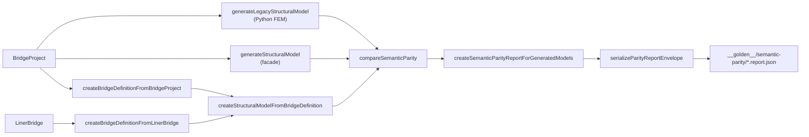

# Phase 4.5 Step 8.4 — Real-Route Semantic Parity Golden Integration

> **Status:** Implemented (PR1)
> **Date:** 2026-07-11

## Objective

Connect real generator output paths (legacy Python FEM, BridgeDefinition structural model, LINER structure-only) to the existing Step 8.2–8.3 semantic parity core, and freeze deterministic golden parity reports alongside the existing Step 7 count-based regression.

## Implemented Scope

- `generatedModelParity.ts` helpers that wrap `compareSemanticParity` and `serializeParityReportEnvelope` without duplicating comparison logic.
- Real-route integration tests for `BridgeProject` → legacy Python + BridgeDefinition facade paths.
- Explicit adapter route verification (`createBridgeDefinitionFromBridgeProject` → `createStructuralModelFromBridgeDefinition`).
- LINER structure-only helper and tests (`createBridgeDefinitionFromLinerBridge` → `createStructuralModelFromBridgeDefinition`), with loads explicitly marked absent.
- Deterministic semantic parity golden reports under `frontend/src/bridgeDefinition/__golden__/semantic-parity/`.
- Intentional-difference golden cases (geometry, topology, support/property) built from real-route `ProjectModel` fixtures with in-test mutation only.
- Order-independence regression for array reordering (golden serialization is byte-identical for equivalent reordered ProjectModel arrays).

## Explicit Non-Scope

- Load parity expansion (Step 8.5).
- Static/dynamic/result parity (Step 8.6+).
- Solver execution or analysis response comparison.
- LINER load mapping (`fromLinerBridge` still returns empty loads).
- Generator, adapter, feature flag, schema, UI, backend, or existing `__golden__/*.json` (outside `semantic-parity/`) changes.
- Automatic golden updates in CI.
- CLI or UI report consumers (Step 8.7–8.8).

## Architecture



## Files

| Path | Role |
| --- | --- |
| `frontend/src/bridgeDefinition/semanticParity/generatedModelParity.ts` | Public helpers: compare, envelope creation, route-specific model generation |
| `frontend/src/bridgeDefinition/__tests__/semanticParityHelpers.ts` | Test-only real-route wiring, golden I/O, shuffle/snapshot helpers |
| `frontend/src/bridgeDefinition/__tests__/semanticParity.golden.test.ts` | Real-route, intentional-diff, ordering, LINER structure-only tests |
| `frontend/src/bridgeDefinition/__fixtures__/semanticParityGoldenFixtures.ts` | Mutation helpers and minimal LINER fixture |
| `frontend/src/bridgeDefinition/__golden__/semantic-parity/*.report.json` | Frozen deterministic parity report envelopes |
| `frontend/src/bridgeDefinition/index.ts` | Re-exports new public helpers/types |

## Golden Strategy

Golden files are `ParityReportEnvelope` JSON documents serialized with:

- `serializeSemanticParityReportForGolden` (golden-specific path canonicalization; normal `serializeParityReportEnvelope` unchanged)
- Fixed `generatedAt`: `2026-07-11T12:00:00.000Z`
- Fixed `toolVersion`: `spacer-clone-semantic-parity-8.4`
- Stable `sources.*.generatorRoute` and `metadata` (fixture name, bridge/LINER id, `loadsMapped`)

Tests read committed goldens and compare byte-identical serialized output. Golden updates are manual only: regenerate the affected `__golden__/semantic-parity/*.report.json` file locally, review the JSON diff, and commit the reviewed changes. Step 8.4 does not ship a committed golden writer or unskip-based update mechanism.

### Golden cases

| File | Purpose | Current status |
| --- | --- | --- |
| `single-span-simple-real-route.report.json` | Legacy vs BridgeDefinition on `single-span-simple` | `invalid` (BD path: 7 disconnected girder-line components; legacy connected grid) |
| `intentional-geometry-difference.report.json` | Node coordinate shift on legacy model | `different` |
| `intentional-topology-difference.report.json` | Removed member on legacy model | `different` |
| `intentional-support-property-difference.report.json` | Support fixity + section area mutation | `different` |

## Deterministic Rules

- Reuse `compareSemanticParity` / `compareNormalizedModels`; no parallel comparator.
- No absolute filesystem paths or runtime timestamps in goldens.
- Serializer canonical sorting applies to mismatches, diagnostics, ambiguities, and unmatched lists.
- Golden serialization additionally normalizes source-array index trace paths (for example `nodes/3` → `nodes/{sourceId}` or `nodes/*`) so reordered `ProjectModel` arrays produce byte-identical golden output.
- Source metadata uses stable fixture names and route labels, not generated node/member IDs.
- Intentional mutations clone real-route `ProjectModel` in tests; generator output is never modified.

## Tests

```bash
cd frontend && npm run test -- semanticParity
cd frontend && npm run test -- bridgeDefinition
cd frontend && npm run test:regression
cd frontend && npm run typecheck
```

Coverage highlights:

- Real-route legacy ↔ BridgeDefinition golden stability
- Facade vs explicit adapter route structural identity
- Intentional geometry/topology/support-property golden stability
- Order-independent golden serialization under array shuffle (byte-identical `serializeSemanticParityReportForGolden` output)
- LINER structure-only generation (`loadsMapped: false`)

## Backward Compatibility

- Existing Step 7 `__golden__/*.json` and `regression.golden.test.ts` unchanged.
- Public semantic parity API extended with optional helpers; `compareSemanticParity` signature unchanged.
- `ParityReportEnvelope` / serializer contract from Step 8.4 PR1 reused by later CLI/UI steps.

## Known Limitations

- Real-route `single-span-simple` is **not** semantically equivalent today; golden documents actual `invalid` status rather than forcing equivalence.
- BridgeDefinition generator currently yields multiple disconnected girder-line components for the P0 fixture; topology validation flags this as a blocker on the BD side.
- Array reorder stability is asserted via byte-identical `serializeSemanticParityReportForGolden` output; runtime `ParityReport` paths may still include source-array indices.
- LINER route compares structure only; load parity deferred to Step 8.5.
- Load/boundary station alignment metrics beyond fixity (M012–M017) not yet in comparison core.

## Next Step

- **Step 8.5 / PR2:** Normalized load types, `loadParity.ts`, and load semantic comparison on matched node/member keys.
- Calibrate tolerances from fixture measurements after load parity lands.
- Revisit real-route golden status once BD topology connectivity matches legacy intent.

## Document History

| Date | Change |
| --- | --- |
| 2026-07-11 | Step 8.4 PR1: real-route helpers, semantic parity goldens, tests, and documentation. |
