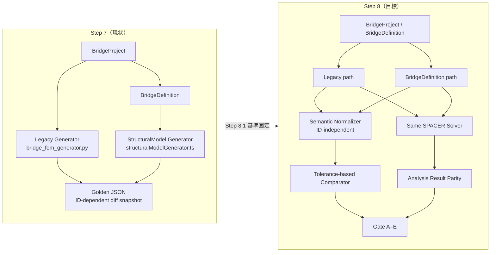
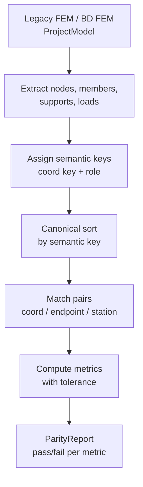
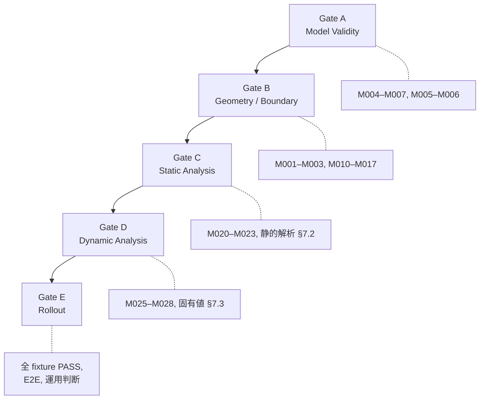

# Phase 4.5 Step 8.1 — Semantic Parity 評価項目・判定基準設計書

> **Status:** Step 8.1 — 判定基準固定（DOCS ONLY）。本書は実装仕様ではなく、Step 8.2 以降の semantic comparison 実装・回帰・feature flag マージゲートの **source of truth** となる。
> **Date:** 2026-07-11
> **Phase:** Phase 4.5 Step 8.1
> **Related docs:**
> - [bridge_definition_architecture_freeze.md](../../../road/legacy-integration/bridge_definition_architecture_freeze.md) — Architecture Freeze（§9 一致基準の再定義）
> - [bridge_definition_design.md](../../../road/legacy-integration/bridge_definition_design.md) — Phase 4.5 全体設計
> - [bridge-fem-generator.md](../../../frame/modeler/bridge-fem-generator.md) — 旧 FEM Generator 仕様

---

## 1. 文書の目的

### 1.1 Step 8.1 の位置づけ

Step 8.1 は **実装フェーズではない**。旧 FEM Generator（`backend/engine/bridge_fem_generator.py`）と新 BridgeDefinition StructuralModel Generator（`frontend/src/bridgeDefinition/generator/structuralModelGenerator.ts`）の **semantic parity（意味論的同等性）** を評価するための項目・判定基準・ゲート条件を **固定** するフェーズである。

本書で定義した基準は、Step 8.2 以降の comparison helper 実装、回帰テスト拡張、`useBridgeDefinitionFemPath`（`VITE_USE_BRIDGE_DEFINITION_STRUCTURAL_MODEL`）の ON 条件更新の判断根拠となる。

### 1.2 目標と非目標

| 区分 | 内容 |
| --- | --- |
| **目標** | 同一の `BridgeProject` または等価な `BridgeDefinition` を入力した際、旧経路と新経路が **構造的・解析的に等価** なモデルを生成することを、定量的・段階的に判定できる基準を定義する |
| **非目標** | 旧新 Generator の **完全な内部一致**（node ID / member ID / 採番順 / 中間オブジェクト形状 / JSON プロパティ順 / 要素数の完全一致） |
| **維持事項** | feature flag **default OFF**（`isBridgeDefinitionStructuralModelEnabled()` は env 未設定時 `false`） |

### 1.3 現状との関係

Step 6〜7 の golden regression（`frontend/src/bridgeDefinition/__tests__/regression.golden.test.ts`）は、旧経路と新経路の **差分スナップショット固定**（count 中心、**ID 依存** の node/member/support/load 比較）である。本書は Architecture Freeze §9 に従い、マージゲートの真の北を **構造性能同等性** へ移すための判定仕様である。



---

## 2. Semantic Parity の定義

### 2.1 正式定義

**Semantic Parity（意味論的同等性）** とは、同一の `BridgeProject` または同一設計意図を表す `BridgeDefinition` を入力した際、旧経路（Legacy Generator）と新経路（BridgeDefinition → StructuralModel Generator）が、**内部の節点番号・部材番号・離散化手順・メッシュトポロジが異なっていても**、以下の観点で **工学的に同等** と判定できる状態を指す。

1. **幾何（Geometry）** — 橋長、径間境界、主桁 transverse 位置、支点 station、設計上の代表座標
2. **接続（Connectivity / Topology）** — 主桁・横桁（将来）の接続意図、モデルの連結性、孤立節点の不在
3. **拘束（Boundary Condition）** — 支点位置の意味、可動方向・回転拘束の **semantic** 一致
4. **荷重伝達（Load Transfer）** — load case 構成、総荷重、作用方向、設計意図に沿った分配
5. **剛性（Stiffness）** — 部材剛性（EA, EI 等）の等価性、支点剛性の意味論一致
6. **質量（Mass）** — 総質量・質量分布の等価性（固有値解析の前提）
7. **解析応答（Analysis Response）** — 同一 solver・同一 load case における反力・変位・主要断面力・固有値の許容差内一致

### 2.2 同等性の判定原理

| 原理 | 説明 |
| --- | --- |
| **設計意図優先** | BridgeDefinition は設計モデル。旧 Generator 出力形状への迎合は成功条件ではない（Architecture Freeze §1.4, §9） |
| **ID 非依存** | 比較は semantic key・幾何・グラフ役割に基づく。`N_BC_001_002` と `N1` の一致は要求しない |
| **許容差ベース** | 浮動小数・離散化差は **absTol / relTol** で評価。「だいたい一致」は禁止。各 metric に数値基準を付す |
| **段階ゲート** | Model Validity → Geometry/Boundary → Static → Dynamic → Rollout の順で BLOCKER を解消 |
| **同一 solver 前提** | 解析結果比較は SPACER 既存 solver（`backend/engine/solver.py` の `run_analysis` / eigen 相当）を **両経路共通** で使用 |

### 2.3 Parity ではないもの（明示的除外）

以下は semantic parity の **必要条件ではない**。

- exact node ID / member ID / support nodeId
- exact 採番順・JSON キー順
- exact element count / mesh division 結果
- exact 中間表現（`RegressionDiff` の ID マップ一致）
- BridgeDefinition 内部フィールドと旧 Generator 内部状態の 1:1 対応

---

## 3. 比較レイヤー（Comparison Layers）

比較は Layer 0（入力意図）から Layer 9（工学的出力）まで **10 層** で構成する。下位 Layer の BLOCKER 未解消時は上位 Layer の FAIL を **BLOCKED** とみなす（結果は記録するが Gate 判定には含めない）。

| Layer | 名称 | 対象項目 | 目的 |
| --- | --- | --- | --- |
| **L0** | Input Intent | `BridgeProject` / `BridgeDefinition` の spans, crossSection, loads, generationSettings, supports 意味 | 比較対象入力が同一設計意図であることを確認。adapter 変換の正しさの前提 |
| **L1** | Geometric | 総橋長 `L_total`、径間長・境界 station、主桁 transverse offset 列、girder line 代表座標、deck 幅 | 設計幾何が等価か。離散化前の **意味論的寸法** 一致 |
| **L2** | Topological | 連結成分数、孤立 node 数、zero-length member 数、主桁ライン連続性、横桁接続（将来）、semantic role（main/edge/support attachment） | 解析可能な連結モデルか。部材の **接続意図** が破綻していないか |
| **L3** | Property | material E, G, ν, density（解決後）, section A, Iy, Iz, J。部材–属性割当の semantic coverage | 剛性・質量計算の入力が等価か |
| **L4** | Boundary Condition | 支点 station・transverse 位置、fixity 意味（pinned/fixed/roller 相当）、bridge axis 方向可動性、中間支点 vs 端部支点 | 拘束条件の **工学的意味** が一致するか |
| **L5** | Load | load case ID 集合、各 case の総荷重（ΣF）、方向ベクトル、self_weight / distributed / vehicle の作用対象 semantic、impact factor 適用 | 荷重伝達経路の設計意図が等価か |
| **L6** | Mass | 総質量、質量 case 構成、節点質量分配の総和・代表分布 | 固有値解析の前提が等価か |
| **L7** | Static Response | 同一 load case の支点反力総和、平衡チェック、代表 node 変位、代表 member 軸力/曲げ、envelope、正規化変形相関 | **feature flag ON の必須条件**（Gate C） |
| **L8** | Dynamic Response | mode count、固有値/周期、modal mass、participation factor、MAC（候補）、rigid body mode 検出 | 段階導入（Gate D）。P1 以降 |
| **L9** | Engineering Output | 主桁延長、横桁本数、鋼重概算、summary.supports 相当の工学的サマリ | 積算・設計書向け。Gate E 参考 |

---

## 4. 必須一致 / 許容差 / 非目標 — 評価メトリクス表

### 4.1 判定記号

| Severity | 意味 | Gate への影響 |
| --- | --- | --- |
| **BLOCKER** | 解析不能・物理的に無効・設計意図の根本不一致 | 該当 Gate **FAIL**。feature flag ON 不可 |
| **ERROR** | 工学的に許容困難な偏差。修正必須 | Gate **FAIL**（Rollout 前）。Warning 昇格条件あり |
| **WARNING** | 許容可能だが調査推奨。診断・ログ用 | Gate **PASS with warnings** |
| **INFO** | 参考情報。count 差分等 | Gate 判定に影響しない |

**Required for Flag ON:** `Y` = `useBridgeDefinitionFemPath` ON の必須合格、`N` = 参考のみ、`Phase` = 段階導入。

### 4.2 メトリクス一覧

| ID | Layer | Metric | Comparison Method | Tolerance | Severity | Required for Flag ON | Notes |
| --- | --- | --- | --- | --- | --- | --- | --- |
| M001 | L1 | Total bridge length `L_total` | `abs(L_legacy - L_new) <= tol` | absTol: `max(1e-6, 1e-6 * L_total)` m | **BLOCKER** | Y | Σ span.length。設計意図の根幹 |
| M002 | L1 | Span boundary stations | 各境界 station の sorted 集合比較 | absTol: 1e-4 m | **BLOCKER** | Y | 径間数不一致も BLOCKER |
| M003 | L1 | Primary girder transverse positions | semantic girder role=`main` の offset 集合 | absTol: 1e-4 m | **ERROR** | Y | 端部桁含む。集合比較（順序不問） |
| M004 | L2 | Model connectedness | 連結成分数 = 1 | exact: 1 | **BLOCKER** | Y | disconnected model 禁止 |
| M005 | L2 | Isolated node count | 部材接続次数 0 の node 数 | exact: 0 | **BLOCKER** | Y | 旧 Generator 検証項目と整合 |
| M006 | L2 | Zero-length member count | ‖end−start‖ < ε の member 数 | exact: 0（ε=1e-9 m） | **BLOCKER** | Y | |
| M007 | L2 | Primary girder presence | role=main の girder ラインが全 span をカバー | coverage ≥ 100% | **BLOCKER** | Y | missing primary girder |
| M008 | L2 | Member count delta | \|N_m_legacy − N_m_new\| / max(N_m_legacy, 1) | relTol: なし（非目標） | **INFO** | N | diagnostic のみ。FAIL 条件にしない |
| M009 | L2 | Node count delta | 同上 | relTol: なし | **INFO** | N | diagnostic のみ |
| M010 | L3 | Material E, G resolved | 代表 material の key 属性 | relTol: 1e-6 | **ERROR** | Y | ref 解決後比較 |
| M011 | L3 | Section A, Iy, Iz, J resolved | 代表 section 属性 | relTol: 1e-6 | **ERROR** | Y | |
| M012 | L4 | Support station alignment | 支点位置の station 集合 | absTol: 1e-4 m | **ERROR** | Y | 端部+中間支点 |
| M013 | L4 | Support condition semantics | fixity 意味ベクトル（UX,UY,UZ,RX,RY,RZ）を semantic class に正規化後比較 | exact semantic match | **BLOCKER** | Y | support condition semantics mismatch |
| M014 | L4 | Support count at span boundaries | 各境界の支点 semantic 数 | 意味一致（数値一致不要） | **WARNING** | N | 離散化により node 数は異なりうる |
| M015 | L5 | Load case set equivalence | case ID / type の集合 | exact set match | **ERROR** | Y | |
| M016 | L5 | Total applied load per case | Σ\|F\| または ΣF_z（自重） | relTol: 1e-6 | **BLOCKER** | Y | total applied load mismatch |
| M017 | L5 | Load direction unit vector | 各 case の代表方向 | absTol: 1e-6（成分） | **ERROR** | Y | |
| M018 | L6 | Total structural mass | Σ nodal mass または equivalent | relTol: 1e-3 | **BLOCKER** | Y | total mass major mismatch。質量未設定時は WARNING |
| M019 | L6 | Mass distribution centroid (optional) | 橋軸方向の一次モーメント比 | relTol: 1e-2 | **WARNING** | N | Step 8.6 |
| M020 | L7 | Static equilibrium | ΣR − ΣF = 0（各 DOF） | relTol: 1e-5 on ΣF | **BLOCKER** | Y | equilibrium failure |
| M021 | L7 | Support reaction total per case | 全支点反力の和 | relTol: 1e-3 | **BLOCKER** | Y | static reaction major mismatch |
| M022 | L7 | Reference node displacement | 代表点（mid-span 等）変位 | relTol: 1e-2 | **ERROR** | Y | 符号・単位系一致前提 |
| M023 | L7 | Reference member force | 代表主桁 member の軸力/曲げ | relTol: 1e-3 | **ERROR** | Y | semantic member matching 後 |
| M024 | L7 | Normalized deformation correlation | 全 node 変位ベクトルの cosine similarity | ≥ 0.98 | **WARNING** | N | envelope 補助 |
| M025 | L8 | Rigid body mode count (eigen) | 自由度数 − 拘束数 | exact: 0 modes below threshold | **BLOCKER** | Phase | rigid body mode |
| M026 | L8 | Eigenvalue / period (mode 1–3) | 低次モード | relTol: 0.01（1%） | **ERROR** | Phase | Step 8.6 以降 |
| M027 | L8 | Modal mass participation | 主要方向 | relTol: 0.05 | **WARNING** | Phase | |
| M028 | L8 | MAC between mode shapes | 対応モードペア | MAC ≥ 0.90 | **WARNING** | Phase | 符号反転許容 |
| M029 | — | Exact node ID match | string equality | — | — | N | **非目標** |
| M030 | — | Exact member ID match | string equality | — | — | N | **非目標** |
| M031 | — | Exact element ordering | array order | — | — | N | **非目標** |
| M032 | — | Exact JSON property order | — | — | — | N | **非目標** |
| M033 | — | Exact intermediate object shape | RegressionDiff 形状一致 | — | — | N | **非目標** |
| M034 | — | Exact mesh topology | 同一 node–member グラフ | — | — | N | **非目標**。graph isomorphism 要求しない |

---

## 5. 許容差方針（Tolerance Policy）

### 5.1 一般式

全 numeric metric は次の **OR 条件** で合格とする。

```text
pass := (absDiff <= absTol) OR (relDiff <= relTol)
```

ただし `relDiff` は `absDiff / max(|reference|, floor)` で計算し、`floor` は quantity ごとに §5.2 の表で定める。reference は原則 **legacy 経路の値**（ベースライン）とする。

### 5.2 量別デフォルト許容差

| 量カテゴリ | absTol | relTol | floor | 根拠 |
| --- | --- | --- | --- | --- |
| **座標（m）** | 1e-6 | — | — | モデルスケール ≤ 100 m では abs のみ。L > 100 m は `max(1e-6, 1e-8 * L_total)` |
| **長さ・station（m）** | 1e-4 | 1e-6 | 1.0 m | 離散化・丸め差。Step 7 の `roundCoordinate(1e-6)` と整合 |
| **角度（rad）** | 1e-6 | — | — | skew 等。度換算 ≈ 5.7e-5° |
| **荷重（N/kN 等）** | — | 1e-6 | 1e-3 kN | 総荷重比較。局所分配は WARNING 可 |
| **反力（kN）** | — | 1e-3〜1e-5 | 0.1 kN | 小荷重 case は absTol 併用 |
| **変位（m）** | 1e-9 | 1e-2〜1e-4 | 1e-6 m | 剛域では rel 緩和。大変形は WARNING |
| **断面力（kN, kNm）** | — | 1e-3 | 0.01 | 代表 member のみ Gate C |
| **固有値（Hz, rad/s）** | — | 0.001〜0.01 | — | 低次モード 1%、高次は WARNING |
| **質量（kg, t）** | — | 1e-3〜1e-6 | 1 kg | 密度未設定時は比較 skip |

### 5.3 調整方針

- 上記は **Step 8.1 時点の設計初期値** である。
- Step 8.2 で comparison helper 基盤を実装後、**fixture 実測**（§9 の Fixture Matrix）に基づき absTol / relTol を調整する。
- 調整は本書の **patch revision**（Step 8.2 完了時 mini-update 可）で記録する。実装コード内の magic number だけ変更して doc を更新しない。
- INFO 級 metric（element count delta）は tolerance 対象外。

---

## 6. ID-independent 比較方針

### 6.1 原則

旧経路（`N_BC_{xi}_{yi}` 形式）と新経路（`N` + 連番等）は **ID 名前空間が異なる**。比較は **幾何・semantic role・グラフ構造** により対応付けてから metric を計算する。

### 6.2 比較技法一覧

| 技法 | 用途 | MVP（Step 8.2–8.4） | 段階導入（Step 8.5+） |
| --- | --- | --- | --- |
| **Rounded coordinate key** | node 対応 | `(round(x,6), round(y,6), round(z,6))` を key | スケール依存 round |
| **Coordinate hashing** | node 集合比較 | sorted key multiset equality | spatial hash grid |
| **Geometry-based node matching** | 1:1 対応 | 同一 key の node を対応 | nearest-neighbor（距離 < tol） |
| **Member endpoint geometry matching** | member 対応 | `(keyI, keyJ)` 無向ペア | role tag 付き |
| **Component role matching** | girder/support/load 対応 | `role`, `station`, `offset` semantic key | adapter 由来 ID |
| **Semantic tag matching** | 部材分類 | `groupKey`, load `target` kind | 将来 bracing tag |
| **Nearest-neighbor matching** | 支点・荷重点 | station + transverse の最近接 node | KD-tree |
| **Canonical sorting** | 順序非依存比較 | semantic key で sort 後 compare | stable tie-break |
| **Stable semantic key** | 回帰 golden 正規化 | `spanIndex:station:offset:role` | BD schema ID 参照 |
| **Graph isomorphism approximation** | 全局構造 | **採用しない（MVP）** | 連結成分 + degree sequence のみ参考 |
| **MAC (Modal Assurance Criterion)** | モード形状 | — | Step 8.6 |

### 6.3 完全 graph isomorphism を避ける理由

- 計算コスト・実装複雑性が高い。
- メッシュ密度が意図的に異なる場合、同型グラフが存在しないのが正常。
- Architecture Freeze §9.2: メッシュが異なれば member 数は **異なってよい**。
- 代替: **semantic coverage**（主桁ライン上の connectivity、支点–主桁接続、load path existence）で十分。

### 6.4 正規化パイプライン（概念）



---

## 7. 解析結果比較設計

### 7.1 前提

| 項目 | 規定 |
| --- | --- |
| **Solver** | 両経路の `ProjectModel` を **同一** SPACER solver に投入（`run_analysis` / eigen 解析） |
| **analysisSettings** | legacy 生成結果の settings を baseline とし、new 経路も同一 settings を使用（差分がある場合は INPUT ERROR） |
| **Load case** | case ID・係数・組合せを一致させる |
| **単位系** | `project.units` 一致を L0 で確認 |

### 7.2 静的解析（Static Analysis Parity — Gate C 必須）

| 比較項目 | 方法 | 許容差 | Severity |
| --- | --- | --- | --- |
| 解析成功 | `analysisSummary.status` ∈ {success, warning} | — | BLOCKER（failed） |
| 平衡チェック | ΣR = ΣF（作用・反力） | relTol 1e-5 | BLOCKER |
| 支点反力総和 | 全 support reaction vector sum per case | relTol 1e-3 | BLOCKER |
| 代表 node 変位 | mid-span / quarter-span の semantic 点 | relTol 1e-2 | ERROR |
| 代表 member 力 | 最大 moment / axial の semantic member | relTol 1e-3 | ERROR |
| Envelope | 全支点反力 max/min | relTol 1e-3 | WARNING |
| 正規化変形相関 | u_new · u_legacy / (\|u_new\|\|u_legacy\|) | ≥ 0.98 | WARNING |

**参考点の選び方:** fixture ごとに `referencePoints[]` を Step 8.2 で宣言（station, offset, role）。自動: 各 span の L/2、主桁 central line。

### 7.3 固有値解析（Dynamic Analysis Parity — Gate D 段階）

| 比較項目 | 方法 | 許容差 | 備考 |
| --- | --- | --- | --- |
| Mode count | 要求 mode 数の取得 | exact | analysisSettings.eigen.modeCount |
| Eigenvalue / period | 低次 n モード | relTol 1% | |
| Modal mass | 各 mode | relTol 5% | WARNING 可 |
| Participation factor | 橋軸方向成分 | relTol 5% | |
| Mode shape sign | 符号反転 | **同一とみなす** | MAC 計算前に abs 正規化 |
| Mode ordering swap | 近接固有値 | MAC 最大対応で permute | 順序不一致のみでは FAIL しない |
| MAC | 対応 mode ペア | ≥ 0.90 | WARNING。Step 8.6 |

### 7.4 剛体モード

固有値解析で **ゼロ付近のモード** が rigid body に相当する場合、BLOCKER（M025）。支点 semantics（M013）の FAIL と連動調査。

---

## 8. Gate 定義

feature flag **default OFF** を維持したまま、段階的に ON 条件を厳格化する。



| Gate | 名称 | 必須 Metric / 条件 | FAIL 時 | Flag ON との関係 |
| --- | --- | --- | --- | --- |
| **A** | Model Validity | M004, M005, M006, M007。diagnostics に severity=error なし | 解析実行不可 | ON 不可 |
| **B** | Geometry / Boundary | M001, M002, M003, M010–M013, M015–M017。BLOCKER/ERROR ゼロ | 設計モデル不一致 | ON 不可 |
| **C** | Static Analysis | M020, M021, M022, M023 + §7.2 全 BLOCKER/ERROR ゼロ | 構造挙動不一致 | **ON の必須条件** |
| **D** | Dynamic Analysis | M025 + §7.3 ERROR ゼロ（WARNING 許容） | 動的挙動不一致 | Phase 2 で ON 必須化可 |
| **E** | Rollout | Gate A–C 全 fixture PASS。Gate D は P1 fixture subset。E2E smoke。docs 更新 | 本番 default ON 不可 | default OFF 維持。明示 opt-in のみ |

### 8.1 現行 feature flag

| 名称 | 場所 | Default |
| --- | --- | --- |
| `VITE_USE_BRIDGE_DEFINITION_STRUCTURAL_MODEL` | `frontend/src/bridgeDefinition/featureFlags.ts` | **OFF**（env 未設定 / `"true"` 以外） |
| `useLegacyFemPath` / `useBridgeDefinitionFemPath` | BridgeDefinition generationSettings（移行期） | legacy 優先 |

Step 8.7 完了まで **default OFF は変更しない**。

---

## 9. Fixture Matrix

### 9.1 既存 regression fixture（Step 7）

出典: `frontend/src/bridgeDefinition/__fixtures__/bridgeRegressionFixtures.ts`

| Fixture | 検証できること | 不足・限界 | Covered Layers |
| --- | --- | --- | --- |
| **single-span-simple** | 単径間、基本格子、端部支点、count baseline | 荷重なし、解析応答未検証 | L0–L4, L9 partial |
| **two-span-continuous** | 連続 2 径間、中間支点 station | 荷重・解析なし | L0–L4 |
| **three-span-continuous** | 3 径間、複数中間支点 | 同上 | L0–L4 |
| **curved-radius** | `lines[]` 参照線（曲線意図） | 新 Generator の曲線離散化は MVP 未完全。幾何 parity 限定的 | L0–L1 partial |
| **asymmetric-supports** | distributed load 1 件 | 支点非対称は lines のみ。support semantics 明示弱 | L0–L5 partial |
| **multiple-loads** | distributed + vehicle、複数 line | self_weight なし。解析未実行 | L0–L5 partial |

### 9.2 追加 fixture 提案（優先度付き）

| Priority | Fixture 名 | 目的 | Covered Layers | 備考 |
| --- | --- | --- | --- | --- |
| **P0** | self-weight-only | 自重分配・総荷重・静平衡 | L5–L7 | Gate C 最小セット |
| **P0** | support-type-variation | pinned / fixed / roller semantic | L4 | M013 直接検証 |
| **P0** | modal-analysis-case | eigen + mass case | L6–L8 | Gate D |
| **P1** | cross-beam-grid | 横桁接続トポロジ | L2 | 新 Generator 横桁対応後 |
| **P1** | multiple-girders | lane_count > 2 の主桁列 | L1–L2 | M003 |
| **P1** | mesh-density-variation | coarse / fine meshDivision | L2 INFO | count diagnostic |
| **P1** | material-section-variation | 非 default 材料断面 | L3 | M010–M011 |
| **P2** | LinerBridge-route | `fromLinerBridge` 経路 | L0–L4 | LINER 統合前 |
| **P2** | true-curved-alignment | 平面曲線 + station 沿い離散化 | L1 | curved-radius 強化 |
| **P2** | skew-support | skewAngleDeg ≠ 0 | L4 | |
| **P2** | vertical-profile | 縦断勾配 | L1 | Wizard lines Z |
| **P2** | offset-eccentric-bearing | bearing eccentricity | L4 | bearings[] 将来 |
| **P2** | impact-factor-load | impactFactor 適用 | L5 | |

---

## 10. Step 8 実装分割

Step 8.1 は本書のみ。以降は **comparison helper 中心** に分割する（generator 本体の大規模変更は Gate 不合格時のみ）。

| Step | Scope | Expected Files（新規・拡張） | Test Target | Exit Criteria | Risk |
| --- | --- | --- | --- | --- | --- |
| **8.1** | 判定基準固定 | `docs/liner/phase4.5/step8_semantic_parity_spec.md` | — | 本書レビュー合意 | 低 |
| **8.2** | Semantic comparison helper 基盤 | `frontend/src/bridgeDefinition/__tests__/semanticParity/`（新規 dir）, `semanticCompare.ts`, `tolerance.ts`, `semanticKeys.ts` | unit: tolerance, key, normalize | Legacy/New ProjectModel を入力に ParityReport 生成。ID 非依存 | 中 — API 設計の固定 |
| **8.3** | Geometry / topology parity | `geometryParity.ts`, `topologyParity.ts` | fixture M001–M009 | Gate A + B の BLOCKER 検出 | 中 — 曲線・横桁 |
| **8.4** | Boundary / load / property parity | `boundaryParity.ts`, `loadParity.ts`, `propertyParity.ts` | M010–M019 | Gate B 完走 | 中 — load semantic mapping |
| **8.5** | Static analysis parity | `staticAnalysisParity.ts`, solver 呼出 wrapper | Gate C, `/api/fem/generate` 相当 | 既存 6 fixture + self-weight P0 PASS | 高 — solver 浮動小数 |
| **8.6** | Dynamic analysis parity | `dynamicAnalysisParity.ts` | Gate D, modal P0 | MAC / eigen 1% 以内 | 高 — mode swapping |
| **8.7** | Feature flag rollout criteria | `featureFlags.ts` doc, facade diagnostics severity 更新, rollout checklist | E2E opt-in, regression suite | Gate A–C 全 PASS で ON **許可**（default 仍 OFF） | 中 — 運用判断 |

**Step 8.2 制約:** comparison helper **のみ**。generator / adapter / golden の挙動変更は Step 8.2 の scope 外（読取専用利用可）。

---

## 11. Golden Regression 移行方針

### 11.1 現状（Step 7）

| 属性 | 内容 |
| --- | --- |
| 形式 | `__golden__/{fixture}.json` — legacy summary + BD summary + `RegressionDiff` |
| 比較 | `expect(actual).toEqual(golden)` — **完全一致** |
| 依存 | node ID 一致時のみ coordinate / member connection 比較（`regressionHelpers.ts`） |
| 焦点 | count delta、ID 一致 subset の mismatch 列挙 |
| 限界 | memberCount delta（例: single-span −66）を **許容として明示していない** |

### 11.2 将来（Step 8.2+）

| 属性 | 内容 |
| --- | --- |
| 形式 | `semantic-parity/{fixture}.report.json` — metric ID ごとの pass/fail + tolerance + severity |
| 比較 | ID-independent、 tolerance-based、explicit pass/fail |
| 解析 | optional `analysis-parity/{fixture}.json` — 反力・変位ベクトル（正規化） |
| Gate 連動 | BLOCKER FAIL → test fail。INFO → 記録のみ |

### 11.3 段階移行

1. **Phase 1（Step 8.2–8.3）:** 既存 golden **維持**。semantic report を **並行生成**（snapshot 未 commit 可）。
2. **Phase 2（Step 8.5）:** Gate C metric を regression に追加。golden は dual-track（旧 diff + 新 parity）。
3. **Phase 3（Step 8.7）:** feature flag ON 条件を ParityReport に切替。旧 golden は **deprecated** 标注、削除は Gate E 後。
4. **禁止:** Step 8.1–8.4 で既存 `__golden__/*.json` の一括削除・一括更新。

---

## 12. Decision Log

| # | 決定事項 | 理由 | 参照 |
| --- | --- | --- | --- |
| D1 | Step 8 の正式ゴールは **semantic parity** | 設計意図モデルと解析モデルの分離。旧 Generator は参照実装に過ぎない | Architecture Freeze §9, §10 |
| D2 | exact node/member ID 一致は **不要** | ID 採番は Generator 責務。旧新で名前空間が異なる | Freeze §3, §9.3 |
| D3 | exact element count 一致は **必須ではない** | メッシュ改善を許容。INFO diagnostic のみ | Freeze §9.2, M008–M009 |
| D4 | 優先順位: geometry → connectivity → support → load → response | 下流ほど設計目的に直結。P0 は L1–L7 | Freeze §9.2 星表 |
| D5 | 比較は **ID-independent** | Step 7 regression の ID 依存限界を克服 | §6 |
| D6 | 比較は **tolerance-based** | 浮動小数・離散化差を定量評価 | §5 |
| D7 | **Static analysis parity** は feature flag ON の **必須条件** | Gate C。構造挙動が設計の証明 | §8 |
| D8 | **Dynamic parity** は **段階導入** | 質量・剛性 P0 完了後。Gate D | §8, Step 8.6 |
| D9 | **既存 golden 維持**（段階移行） | 移行期の回帰検知を失わない | §11 |
| D10 | **feature flag default OFF 維持** | 明示 opt-in。production 無断切替防止 | `featureFlags.ts`, Freeze §10 |
| D11 | **legacy generator 削除**は **最終 gate（E）後** | 解析同等性確認前の削除禁止 | Freeze §10.1 |
| D12 | **Step 8.2 は comparison helper のみ** | 判定基準先行。generator 変更と混在させない | §10 |

---

## 13. 用語・参照実装マップ

| 概念 | 参照 |
| --- | --- |
| 旧 Generator | `backend/engine/bridge_fem_generator.py` |
| 新 Generator | `frontend/src/bridgeDefinition/generator/structuralModelGenerator.ts` |
| Facade / count warning | `frontend/src/bridgeDefinition/generator/facade.ts` — `BD_SM_COMPARE_*` |
| Golden regression | `frontend/src/bridgeDefinition/__tests__/regression.golden.test.ts` |
| Feature flag | `frontend/src/bridgeDefinition/featureFlags.ts` |
| FEM schema | `schemas/project.schema.json`, `schemas/generated-fem.schema.json` |
| Solver | `backend/engine/solver.py` — `run_analysis` |
| API 解析付き生成 | `backend/tests/test_bridge_api.py` — `runAnalysis: True` |

---

## Document History

| Date | Change |
| --- | --- |
| 2026-07-11 | Step 8.1: Initial semantic parity evaluation spec. 比較レイヤー L0–L9、メトリクス表、Gate A–E、Fixture Matrix、Step 8.2–8.7 分割、Golden 移行方針、Decision Log を定義。 |
