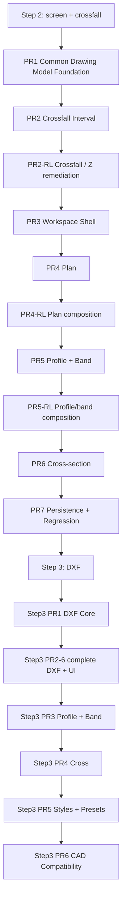

# Implementation Plan

<!-- DOC-AUTHORITY:START -->
> **Authority:** HISTORICAL / RETAINED EVIDENCE
> This document records delivery history. Current road facts are governed by [`../../../scoping/stage4_road_design_scope.md`](../../../scoping/stage4_road_design_scope.md), and target implementation sequence and gates by [`../../../planning/stage6-10/stage10_gap_migration_sequence.md`](../../../planning/stage6-10/stage10_gap_migration_sequence.md).
<!-- DOC-AUTHORITY:END -->

> Status: `REDLINE_REMEDIATION_DESIGN`
> Date: 2026-07-13
> Redline: [redline_ui_and_drawing_remediation_design.md](../../../road/output/redline_ui_and_drawing_remediation_design.md)
> Phase: Phase 5 / Plan
> Related docs: [README.md](README.md), [formal_drawing_ui_design.md](../../../road/output/formal_drawing_ui_design.md), [dxf_export_design.md](../../../road/output/dxf_export_design.md), [drawing_standard_preset_design.md](../../../road/output/drawing_standard_preset_design.md), [phase5_liner_formal_drawing_design.md](../../../road/output/phase5_liner_formal_drawing_design.md), [drawing_model_design.md](../../../road/output/drawing_model_design.md), [crossfall_transition_design.md](../../../road/design/crossfall_transition_design.md), [redline_ui_and_drawing_remediation_design.md](../../../road/output/redline_ui_and_drawing_remediation_design.md)

## 1. 確認済み事実

- 第1編は `screen + crossfall` を扱う Step 2 であり、第2編は DXF を扱う Step 3 である。
- Step 2 完了前に Step 3 を進めてはいけない。
- 既存 preview と importer preview は残置し、formal source にはしない。
- Step 2 の exit gate は全 PR 完了とし、Step 3 着手条件はその後に置く。
- plan / profile / cross の byte count は AC ではなく回帰 baseline 注記へ移し、AC は `DrawingDocument` との primitive / layer / text parity に限定する。
- Redline RL-01〜11 は [redline_ui_and_drawing_remediation_design.md](../../../road/output/redline_ui_and_drawing_remediation_design.md) の AC-RD-01〜20 に対応（Stage 2）。
- Step 3 PR1（DXF core）は完了。PR2–PR6 と UI は [step3_complete_dxf_implementation.md](step3_complete_dxf_implementation.md) に従い単一ブランチで完遂する。

## 2. 提案

### 2.1 全体順序

1. Common Drawing Model Foundation
2. Crossfall Interval
3. Workspace Shell
4. Plan
5. Profile + Band
6. Cross-section
7. Persistence + Regression
8. DXF Core
9. Styles + Presets
10. CAD Compatibility

### 2.1.1 Redline remediation tracks（提案）

Step 2 PR 番号は維持しつつ、redline 実装を次の overlay として挿入する。

| Track | Maps to | Scope |
| --- | --- | --- |
| RL-A | PR2 + grid | Z 式・template elevation 永続化・二重適用防止 |
| RL-B | PR2 + setup UI | scalar UI 除去・migration 硬化 |
| RL-C | PR2 + PR3 | crossfall 日本語 i18n・measured 日本語 diagnostic |
| RL-D | PR3 | formal workspace フル幅 interval section / card |
| RL-E | PR4–PR5 | plan 情報帯・profile 格子/軸・band 正式行 |
| RL-F | PR4 | plan 曲線可視性（DD-RC-01） |
| RL-G | PR4–PR6 | テキスト可読性（DD-TR-01） |
| RL-H | PR6 | 横断中心線（DD-CS-01） |

### 2.2 Step 2 PR1-7

#### PR1 Common Drawing Model Foundation

- Purpose: `DrawingDocument` / `DrawingModel` / `DrawingViewport` の基礎を固定する
- Scope: runtime model と viewport helper の導入
- Non-scope: DXF serializer, 既存 preview の全面置換
- Dependencies: なし
- Target files: `frontend/src/liner/core/types.ts`, `frontend/src/liner/core/pipeline/pipeline.ts`
- New files: drawing runtime model, viewport helpers
- Tests: model types, viewport conversion tests
- Manual verification: empty/loading/ready の描画確認
- Acceptance criteria: screen と DXF が同一 model を参照できる
- Rollback point: runtime model を feature flag で無効化
- Risk: 既存 preview との重複
- Complexity: M
- Exit gate: model と viewport の基礎が安定している

#### PR2 Crossfall Interval

- Purpose: scalar crossfall を interval/state に移行する
- Scope: `crossSections`, `verticalAlignment`, `width`, `sourceRevision` 連携を含む state 形状の固定；**RL-A/B/C**（Z 式、scalar UI 除去、i18n）
- Non-scope: Step 3 DXF, importer multiple template の正式接続
- Dependencies: PR1
- Target files: `frontend/src/liner/schema/types.ts`, `frontend/src/liner/core/grid/gridGeneration.ts`, `CrossSectionTemplateEditor.tsx`, `LinerEditPage.tsx`, `CrossfallIntervalEditor.tsx`
- New files: interval resolver, trace model
- Tests: overlap/gap/touch tests; Z formula; elevation round-trip; migration
- Manual verification: pivot / transition の目視；日本語 UI；measured diagnostic
- Acceptance criteria: Step 2 crossfall が区間ベースで解決され、`z = profile + templateElevation + crossfallDelta`；scalar UI なし
- Rollback point: scalar path を維持
- Risk: 互換保存・二重 Z
- Complexity: L
- Exit gate: source truth / runtime derived の分離が成立している

#### PR3 Workspace Shell

- Purpose: `/pro/liner/drawings/{plan|profile|cross-section}` の shell を作る
- Scope: tabs, panels, toolbar, station selector, diagnostics, page split；**RL-D** フル幅 interval section
- Non-scope: DXF button の Step 3 有効化
- Dependencies: PR1
- Target files: `frontend/src/liner/` の route / shell 周辺
- New files: tabs, panels, toolbar, station selector
- Tests: route state tests
- Manual verification: keyboard navigation, responsive **1366×768 interval layout**
- Acceptance criteria: station 選択を保持したまま tab 切替できる；interval 表が横スクロール不要
- Rollback point: 旧 preview へ戻す
- Risk: route 深度増加
- Complexity: M
- Exit gate: route / tab / accessibility が安定している

#### PR4 Plan

- Purpose: plan 図面を formal source で描く
- Scope: plan renderer, plan labels, station axis integration；**RL-E** 情報帯/枠 primitive；**DD-RC-01** 直交 fit / 曲線 bounds；**DD-TR-01** plan 注記・帯可読性
- Non-scope: DXF 出力
- Dependencies: PR1, PR3
- Target files: plan preview 周辺
- New files: plan renderer, plan labels
- Tests: plan geometry tests; arc/clothoid clip ratio = 1.0; text heightMm ≥ 7
- Manual verification: station, zoom, fit; **arc/clothoid 曲線視認** at 1366×768 / 1920×1080
- Acceptance criteria: plan が empty/loading/error を含めて表示できる；AC-RD-11, AC-RD-16〜18
- Rollback point: 既存 preview に切替
- Risk: label 密度
- Complexity: M
- Exit gate: plan route が安定している

#### PR5 Profile + Band

- Purpose: profile と band を実装する
- Scope: profile renderer, band layout, station axis；**RL-E** 格子・軸・datum・縮尺・正式 band 行；**DD-TR-01** 帯行高・衝突
- Non-scope: DXF compatibility, cross-section
- Dependencies: PR1, PR3
- Target files: profile preview 周辺
- New files: profile renderer, band layout
- Tests: station axis tests; band row overlap budget
- Manual verification: scale / band / title; 1366 / 1920 帯可読性
- Acceptance criteria: station と band が physicalDistance で整列する；AC-RD-15, AC-RD-20
- Rollback point: band 非表示
- Risk: height 計算
- Complexity: L
- Exit gate: profile / band の整列が安定している

#### PR6 Cross-section

- Purpose: cross-section を formal source で描く
- Scope: section renderer, section layout, station/section switch；**DD-CS-01** `offset=0` 補助中心線（破線・「中心線」/「CL」）
- Non-scope: DXF exporter（中心線は Step 3 export 既定に含めない）
- Dependencies: PR1, PR3, PR2
- Target files: section preview 周辺
- New files: section renderer, section layout
- Tests: section selection tests; centerline `DrawingLine` at offset 0
- Manual verification: section switch; 中心線視認 at 1366 / 1920
- Acceptance criteria: cross-section が station/section 依存で切り替わる；AC-RD-13, AC-RD-19
- Rollback point: 断面表示を disabled
- Risk: 高密度断面
- Complexity: M
- Exit gate: cross-section の formal source が安定している

#### PR7 Persistence + Regression

- Purpose: 保存と回帰確認を固める
- Scope: save/load, regression harness, trace regression
- Non-scope: Step 3 DXF
- Dependencies: PR4, PR5, PR6
- Target files: save/load, regression harness
- New files: trace regression
- Tests: regression baseline checks
- Manual verification: reload parity
- Acceptance criteria: formal drawing の再現性が担保され、new fixture は review gate を通過したものだけ採用される
- Rollback point: 新規保存を止める
- Risk: 既存データ移行
- Complexity: M
- Exit gate: Step 2 の最終 gate を満たす

### 2.3 Step 3 PR1-6

#### PR1 DXF Core

- Purpose: `DrawingDocument -> DxfDocument -> serializer` を作る
- Scope: dxf model, serializer, version / codepage
- Non-scope: Step 2 未完了状態での着手
- Dependencies: Step 2 完了
- Target files: export 周辺
- New files: dxf model, serializer
- Tests: serializer round-trip tests
- Manual verification: LibreCAD 開封
- Acceptance criteria: DXF の骨格が出る
- Rollback point: export disabled
- Risk: entity 漏れ
- Complexity: L
- Exit gate: Step 2 の全 exit gate が green

#### PR2 Plan

- Purpose: plan DXF を完成させる
- Scope: plan dxf mapping, line / text entity
- Non-scope: profile / cross-section
- Status: **IN PROGRESS** — see [step3_complete_dxf_implementation.md](step3_complete_dxf_implementation.md)
- Dependencies: PR1
- Target files: plan export / formal workspace UI
- New files: formal DXF export helpers, CAD layer/sheet presets
- Tests: line / text / band / deterministic / UI download tests
- Manual verification: user visual review **after merge**
- Acceptance criteria: plan は `DrawingDocument` の primitive / layer / text parity を満たし、byte count は回帰 baseline 注記として扱う
- Rollback point: plan DXF 非表示
- Risk: lineweight
- Complexity: M
- Exit gate: plan の screen parity が取れる + LibreCAD open PASS

#### PR3 Profile + Band

- Purpose: profile DXF を完成させる
- Scope: profile dxf mapping, band entity
- Non-scope: plan / cross-section
- Dependencies: PR1
- Target files: profile export
- New files: profile dxf mapping
- Tests: band entity tests
- Manual verification: profile 目視
- Acceptance criteria: profile は `DrawingDocument` の primitive / layer / text parity を満たし、byte count は回帰 baseline 注記として扱う
- Rollback point: band 省略
- Risk: テキスト崩れ
- Complexity: L
- Exit gate: profile の screen parity が取れる

#### PR4 Cross

- Purpose: cross-section DXF を完成させる
- Scope: cross dxf mapping, cross entity
- Non-scope: plan / profile
- Dependencies: PR1
- Target files: section export
- New files: cross dxf mapping
- Tests: cross entity tests
- Manual verification: cross 目視
- Acceptance criteria: cross は `DrawingDocument` の primitive / layer / text parity を満たし、byte count は回帰 baseline 注記として扱う
- Rollback point: cross DXF 非表示
- Risk: 小図面の annotation 密度
- Complexity: S
- Exit gate: cross-section の screen parity が取れる

#### PR5 Styles + Presets

- Purpose: preset 連携を入れる
- Scope: style / preset resolver, preset application
- Non-scope: core serializer changes
- Dependencies: PR1-4
- Target files: style / preset
- New files: preset resolver
- Tests: preset application tests
- Manual verification: style parity
- Acceptance criteria: `mlit-cad-r7.12` 候補 preset の図面表現を参考として適用できる
- Rollback point: default preset のみ使用
- Risk: 版差分
- Complexity: M
- Exit gate: preset の適用が安定している

#### PR6 CAD Compatibility

- Purpose: 日本語 TEXT と CAD 互換を固める
- Scope: parser / exporter, compatibility checks, codepage pin
- Non-scope: new geometry model
- Dependencies: PR1-5
- Target files: parser / exporter
- New files: compatibility checks
- Tests: parse tests
- Manual verification: LibreCAD 目視完了
- Acceptance criteria: 目視確認を含めて CAD compatibility が成立し、13 項目構成が維持される
- Rollback point: 文字装飾を簡略化
- Risk: codepage
- Complexity: M
- Exit gate: manual LibreCAD review が完了している

## 3. Open Decision

| ID | 論点 | 未決理由 | 推奨初期値 |
| --- | --- | --- | --- |
| OD-PLAN-01 | Step 2 完了判定 | Step 3 着手条件を固定したい | PR7 完了時 |
| OD-PLAN-02 | preview 残置期間 | dual-run の長さを決めたい | parity until stable |
| OD-PLAN-03 | manual gate の最小セット | 目視確認の抜けを防ぎたい | LibreCAD + route smoke |
| OD-PLAN-04 | regression snapshot 粒度 | 変更検出を安定化したい | per route + per station |
| OD-PLAN-05 | Step 2 exit gate 判定 | Step 3 着手条件を固定したい | PR7 完了時 |

| OD-PLAN-06 | redline remediation 完了判定 | RL-A〜H と PR2–6 の対応 | redline AC 全 PASS（AC-RD-01〜20） |

## 4. Acceptance Criteria

- Step 2 PR1-7 と Step 3 PR1-6 が順序付きで並ぶ
- Redline RL-A〜H が PR にマップされている（[redline_ui_and_drawing_remediation_design.md](../../../road/output/redline_ui_and_drawing_remediation_design.md) §16）
- Redline AC-RD-01〜20 と `/tmp/phase5-redline-verification/` スクリーンショット gate がある（1366×768 / 1920×1080 含む）
- 各 PR に Purpose / Scope / Non-scope / Dependencies / Target files / New files / Tests / Manual verification / Acceptance criteria / Rollback point / Risk / Complexity / Exit gate がある
- 第1編 = screen + crossfall, Step 2 が明示される
- 第2編 = DXF, Step 3 が明示される
- Step 2 完了前に Step 3 禁止が明記される
- Step 3 完遂方針は [step3_complete_dxf_implementation.md](step3_complete_dxf_implementation.md) を参照する
