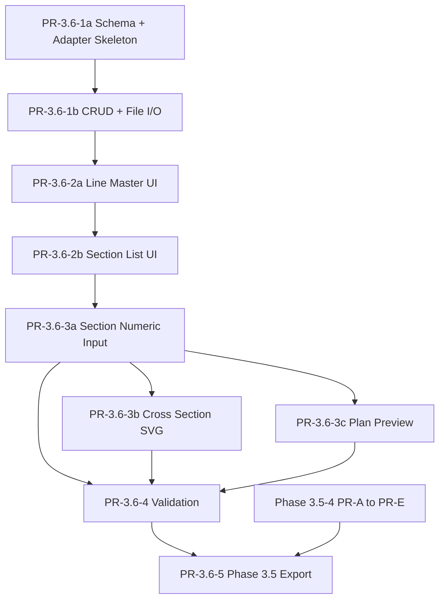

# Phase 3.6 Implementation Priority and PR Breakdown

## 0. 方針

Phase 3.6 は Phase 3.5 と独立した importer module として段階実装する。1 PR は 1 責務を原則とし、Phase 3.5 の 6 タブを変更しない。

本書は設計後の実装計画であり、本 PR では実装しない。

## 1. PR 一覧

| PR | 名称 | 主な責務 | Phase 3.5 前提 |
|---|---|---|---|
| PR-3.6-1a | JSON スキーマ + adapter 骨格 | 型、schema 文書の実体化、adapter interface | vNext draft schema |
| PR-3.6-1b | プロジェクト/橋梁 CRUD + ファイル I/O | 独立 JSON 保存、読み込み、一覧 | なし |
| PR-3.6-2a | 基準ライン & 橋軸線マスタ UI | girderLineSets 管理 | なし |
| PR-3.6-2b | 横断面リスト UI | section 追加、複製、入力率 | なし |
| PR-3.6-3a | 横断面編集 UI（数値入力） | PDF 1 ページ = 1 画面、表入力 | なし |
| PR-3.6-3b | 横断面編集 UI（横断図 SVG） | 入力点の断面図確認 | なし |
| PR-3.6-3c | 横断面編集 UI（平面プレビュー） | section の平面位置確認 | Phase 3.5 geometry helper があれば利用 |
| PR-3.6-4 | バリデーション層 | 写経ミス検出、診断表示 | C0/C1 共通化は Phase 3.5-4 PR-A 後 |
| PR-3.6-5 | Phase 3.5 draft エクスポート | adapter 完成、conversion log | Phase 3.5-4 PR-A〜PR-E 完了 |

## 2. 依存関係



テキスト版:

```text
3.6-1a -> 3.6-1b -> 3.6-2a -> 3.6-2b -> 3.6-3a
3.6-3a -> 3.6-3b
3.6-3a -> 3.6-3c
3.6-3a/3b/3c -> 3.6-4 -> 3.6-5
Phase 3.5-4 PR-A〜PR-E -> 3.6-5
```

## 3. PR 詳細

### PR-3.6-1a: JSON スキーマ + adapter 骨格

対象:

- `frontend/src/liner/importer/types.ts`
- `frontend/src/liner/importer/adapter.ts`
- `schemas` 配下の実 JSON Schema

Done:

- importer schema version `"0.1.0"` が定数化される。
- M2 の型が TypeScript と JSON Schema に反映される。
- adapter interface が Phase 3.5 vNext draft を返す形で定義される。
- 実装は骨格に留め、UI は含めない。

### PR-3.6-1b: プロジェクト/橋梁 CRUD + ファイル I/O

対象:

- importer project list
- bridge create / edit / delete
- independent JSON save / load

Done:

- Phase 3.5 draft と別ファイルで保存できる。
- 既存 project を壊さない。
- importer JSON の round-trip が通る。

### PR-3.6-2a: 基準ライン & 橋軸線マスタ UI

Done:

- `girderLineSets` を編集できる。
- 径間ごとの参照方式切替を保持できる。
- CSV / テキスト貼り付け支援が最低限動く。

### PR-3.6-2b: 横断面リスト UI

Done:

- PDF page 単位で section を作成できる。
- 前ページ複製ができる。
- 入力率と診断集約が表示される。

### PR-3.6-3a: 横断面編集 UI（数値入力）

Done:

- PDF 1 ページ = 1 画面の編集体験が成立する。
- `********` を null + flags として入力できる。
- sourceRef がセル単位で保存される。

### PR-3.6-3b: 横断面編集 UI（横断図 SVG）

Done:

- point の累加幅 / 計画高から横断図を描画する。
- 未定義点と警告点を視覚表示する。
- 新規 npm パッケージを使わない。

### PR-3.6-3c: 横断面編集 UI（平面プレビュー）

Done:

- section の XY 点を平面表示する。
- 前後 section との位置関係を確認できる。
- Phase 3.5 geometry helper が使える場合は共通利用する。

### PR-3.6-4: バリデーション層

Done:

- M4 の rule が importer diagnostics として実装される。
- 入力中、画面遷移時、エクスポート時の実行タイミングが分かれる。
- C0/C1 は Phase 3.5 の共通 geometry diagnostics を流用する。

### PR-3.6-5: Phase 3.5 draft エクスポート

Done:

- M5 の adapter が完成する。
- conversion log が保存される。
- Phase 3.5 vNext draft として pipeline に渡せる。
- 補助入力不足時に明確な Error / Warning を出す。

## 4. Phase 3.5-4 完了を前提とする PR

PR-3.6-5 は Phase 3.5-4 の PR-A〜PR-E 完了を前提にする。理由は、変換後 draft を Phase 3.5 pipeline / grid / frame へ渡すことが最終確認対象になるためである。

PR-3.6-4 の C0/C1 共通化も Phase 3.5 側の診断実装完了後に行う。完了前は importer 専用の簡易診断に留める。

## 5. 実装停止条件

- Phase 3.5 vNext schema と M5 adapter 写像が吸収不能に衝突する。
- 独立画面としての起動導線が既存アーキテクチャで表現不能。
- 実 PDF の定型構造が M2 の model と大きく異なる。
- UX 上の重大判断が必要になる。

