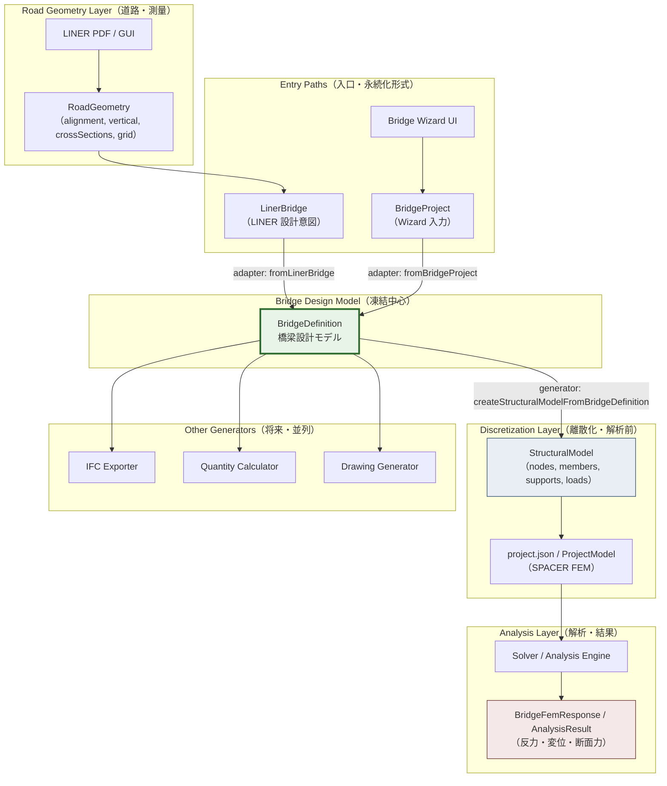

# BridgeDefinition Architecture Freeze

> **Status:** Architecture Freeze（設計凍結）— Step 7.5 完了時点の責務境界・設計思想の確定版。実装変更は Step 8 以降の別タスクで本書に従う。
> **Date:** 2026-07-11
> **Phase:** Phase 4.5 Step 7.5
> **Related docs:**
> - [bridge_definition_design.md](./bridge_definition_design.md) — Phase 4.5 全体設計・段階計画
> - [bridge-domain-model.md](../../design/bridge-domain-model.md) — BridgeProject（Wizard 入力モデル）
> - [bridge-fem-generator.md](../../design/bridge-fem-generator.md) — 旧 FEM Generator 仕様
> - [integration_with_frame_model.md](../integration_with_frame_model.md) — LINER → project.json 統合

---

## 本書の位置づけ

Phase 4.5 Step 1〜7 で実装された BridgeDefinition パイプライン（adapter / generator MVP / golden regression）を踏まえ、**BridgeDefinition の本質的な責務と下流境界を凍結**する。本書は Step 8 以降の実装・回帰・旧 Generator 移行の判断基準となる。

**凍結の核心:** BridgeDefinition は **橋梁設計そのものを表現する中間モデル（Bridge Design Model）** である。「旧 `bridge_fem_generator.py` に合わせるための中間データ」ではない。StructuralModel / BridgeFemResponse / `project.json` は **解析・出力側の下流** である。

---

# 1. BridgeDefinition とは何か

## 1.1 目的

複数の入口（LINER PDF/GUI、Bridge Wizard、将来の手動編集・IFC インポート等）から得られる橋梁設計意図を、**入口非依存の共通語彙**で正規化し、各種 Generator が参照できる **設計モデル** として保持すること。

本書でいう BridgeDefinition は、**解析用節点・部材へ離散化される前の、橋梁の構造設計意図を表す solver-independent な canonical model** である。旧 FEM Generator 互換用 DTO ではなく、複数下流 consumer に対する正本の設計境界である。

## 1.2 責務

| 責務 | 内容 |
| --- | --- |
| **設計意図の正規化** | 径間・支点・主桁配置・床版・荷重ケース等を、解析離散化前の意味論で記述する |
| **入口の吸収** | `LinerBridge`、`BridgeProject` 等の上流モデルを adapter 経由で統一表現へ変換する（adapter は BridgeDefinition の外側） |
| **拡張の受け皿** | 構造形式（箱桁・PC 桁等）、支承・下部構造、設計条件を **種別 + パラメータ** として表現する余地を持つ |
| **下流への契約** | Generator に渡す「何を架設し、どこに支点があり、どの荷重を想定するか」を明示する |

## 1.3 存在理由

現状、LINER 経路（`frameModelMapper`）と Bridge Wizard 経路（`bridge_fem_generator.py`）は **途中の意味論モデルを共有していない**。将来の横桁・対傾構・照査・図面・数量計算を両経路に重複実装するコストを避けるため、**解析モデル生成の直前** に設計モデルを一本化する層が必要である。

## 1.4 設計思想

1. **上流 = 設計、下流 = 解析** — 線形・測点・部材配置規則は上流。節点・部材・DOF・荷重ベクトルは下流。
2. **Generator 非依存** — BridgeDefinition は SPACER / OpenSees / MIDAS 等のいずれにも依存しない。
3. **離散化は Generator の仕事** — メッシュ分割・節点 ID・局所座標・member orientation は StructuralModel 生成時に決定する。
4. **旧 Generator との一致は性能同等性** — node 数・member 数そのものは成功指標ではない（§9 参照）。

## 1.5 対象範囲

- 橋梁上部構造の形式・配置（主桁・横桁・対傾構の **設計上の存在と位置**）
- 下部構造の設計上の支点（橋台・橋脚・支承の **意味と配置**）
- 径間構成・測点・線形参照（道路中心線に沿った橋梁位置決め）
- 床版の設計属性（幅員・種別・厚さ等の **意図**）
- 材料・断面の **参照**（実体属性のカタログは下流または別マスタ）
- 設計荷重ケース（種別・大きさ・作用対象の **設計意図**）
- 設計条件のうち構造生成に影響するもの（衝撃係数、生成方針のヒント等）
- 座標系ポリシー・alignment 参照（幾何の **意味**、FEM 座標値ではない）

## 1.6 対象外

- 解析メッシュ・節点・部材・DOF・拘束行列
- Solver 設定・解析ケースの実行パラメータ
- 解析結果（反力・断面力・変位・応力・固有値）
- UI 状態・Wizard ステップ・PDF バイナリ
- 道路土工・舗装・排水等非構造専業領域
- 詳細な維持管理・点検履歴（将来拡張の候補だが MVP 凍結範囲外）

---

# 2. BridgeDefinition が表現するもの

各項目について **持つべき / 持たないべき / 理由** を示す。現行型（`frontend/src/bridgeDefinition/types.ts`）は本節の凍結方針に沿った MVP 実装である。

| 概念 | 持つべき | 持たないべき | 理由 |
| --- | --- | --- | --- |
| **道路中心線（Road Centreline）** | **参照として持つ** — `alignmentRefs` で alignment ID・起点測点・総延長を参照 | 中心線の詳細要素（緩和曲線・縦断・横断勾配の計算結果そのもの） | 詳細幾何は RoadGeometry / LINER pipeline の責務。BridgeDefinition は「どの線形に沿って橋が架かるか」の **アンカー** のみ保持し、重複を避ける |
| **線形（Alignment / 平面・縦断）** | **参照 + 座標ポリシー** — `coordinatePolicy`、`alignmentRefs`、必要なら `stations` の cumulative distance | 離散化された 3D 節点座標列、FEM 用グリッド点 | 線形計算は上流。BridgeDefinition は橋梁構造の位置決めに必要な **測点・スパン境界** まで |
| **測点（Station）** | **持つ** — `stations[]`（station 値、label、role: origin/pier/expansion 等） | 測点に紐づく解析節点 ID | 測点は設計・施工の共通言語。節点への写像は Generator |
| **主桁配置** | **持つ** — `girders[]`（offset、role、spanIds、section/material 参照） | 主桁を構成する FEM member 列・分割数 | 配置は設計意図。離散化・接続トポロジは Generator |
| **横桁配置** | **持つ** — `crossBeams[]`（station、girderIds、section 参照） | 横桁 member の nodeI/nodeJ | 横桁は「どの測点に何本あるか」が設計。格子化は Generator |
| **対傾構（Bracing / Lateral Bracing）** | **将来持つ** — `superstructure.params` または専用配列で種別・配置規則 | bracing member の離散 ID | MVP では未モデル化。設計上の存在のみ将来追加（§7） |
| **床版（Deck）** | **持つ** — `deck`（width、thickness、kind: rc / steel_composite / orthotropic） | 床版のシェル要素・剛床仮定の行列 | 床版は設計属性。モデル化方式（剛床・床版要素）は Generator / Solver 依存 |
| **支承（Bearing）** | **持つ** — `bearings[]`（supportId、type: elastomeric / pot / fixed） | 支承剛性行列・非線形履歴 | 支承 **種別と配置の設計意図**。拘束の数値化は Generator |
| **橋台（Abutment）** | **持つ** — `supports[]` の `substructureKind: "abutment"` + station | 橋台の土圧・背面壁 FEM モデル | 下部構造の **支点意味** のみ。詳細構造は別ドメイン |
| **橋脚（Pier）** | **持つ** — `supports[]` の `substructureKind: "pier"` + station、skewAngleDeg | 橋脚柱・柱頭の離散モデル | 同上。複数列支点は `transversePosition` で将来拡張 |
| **径間（Span）** | **持つ** — `spans[]`（start/end station、length、index） | 径間内メッシュ分割結果 | 径間は設計の基本単位。分割数は `generationSettings.meshDivision`（ヒント）として持ち、実ノード列は Generator |
| **材料（Material）** | **参照のみ持つ** — girder の `materialRefId`、`generationSettings.defaultMaterialId` | 材料カタログの全文・温度依存・弾塑性パラメータ | 材料実体は project マスタまたは StructuralModel 解決時に展開 |
| **断面（Section）** | **参照のみ持つ** — girder / crossBeam の `sectionRefId`、defaultSectionId | 断面の計算済み断面二次モーメント等の解析用キャッシュ | 断面形状の **選択** は設計。数値属性の解決は下流 |
| **設計荷重（Design Load）** | **持つ** — `loads[]`（type、magnitude、direction、target: girder/deck/line 等、impactFactor） | nodalLoad / memberLoad のベクトル・節点への分配結果 | 荷重は設計ケースの意図。離散化・衝撃の適用詳細は Generator |
| **設計条件（Design Conditions）** | **部分的に持つ** — 衝撃係数（load の impactFactor）、superstructure.params、metadata.notes | 道路橋示方書の全文照査パラメータ・疲労・耐震詳細 | 構造生成に直結する条件のみ。照査ロジックは別 Generator |
| **維持管理情報（Maintenance / Asset）** | **持たない（MVP）** — 将来 `metadata` 拡張の候補 | 点検履歴・劣化評価・メンテナンススケジュール | BridgeDefinition は **設計時** モデル。維持管理は運用ドメイン |

### 補足: `loads[].target.kind: "node"` について

現行型に `target: { kind: "node"; refId }` があるが、これは **FEM 節点 ID ではない**。荷重作用位置の **設計上の論理参照**（例: 特定主桁・特定測点の代表点）であり、Generator が実節点へ解決する。§3 の禁止事項に抵触しない。

### 補足: `generationSettings` について

`meshDivision` / `meshDensity` は **離散化のヒント** であり、BridgeDefinition が StructuralModel を内包することを意味しない。旧 Wizard の `BridgeGenerationSettings` からの移行過渡期のフィールドであり、将来的には Generator 設定へ分離可能（§8）。

---

# 3. BridgeDefinition が絶対に持たないもの

以下は **StructuralModel / project.json / Solver 領域** に属し、BridgeDefinition に含めてはならない。

| 禁止カテゴリ | 例 | 理由 |
| --- | --- | --- |
| **離散化トポロジ** | `Node`, `Member`, 要素接続表 | 設計モデルと解析モデルの混在を防ぐ |
| **自由度・拘束** | DOF 番号、fixity フラグ、拘束テンプレート ID | 支点 **意味**（supports / bearings）は上流、**数値拘束** は下流 |
| **局所座標系** | Local Axis、member orientation ベクトル | 部材軸は離散化後の幾何から導出 |
| **解析メッシュ** | x_positions / y_positions 配列、要素分割数の **結果** | メッシュは Generator 出力 |
| **Solver 設定** | 解析タイプ、収束条件、固有値解法パラメータ | `analysisSettings` は project.json 領域 |
| **解析結果** | 反力、断面力、変位、応力、固有値、モード形状 | 結果は Solver 出力。設計モデルに逆流させない |
| **FEM ID 名前空間** | `N_BC_001_002` 形式の節点 ID、member ID | ID 採番規則は Generator / mapper の責務 |
| **旧 Generator 内部状態** | `_y_positions` 計算結果のキャッシュ | 旧実装への適合のための漏れ出しを禁止 |

**違反の判定:** BridgeDefinition JSON に `nodes[]` / `members[]` / `supports[].fixities` が出現した時点でスキーマ違反（設計凍結方針）。Step 7 regression が node/member **数** を比較している事実は、移行期の **観測用** であり、本書が定める成功基準ではない（§9）。

---

# 4. BridgeDefinition → StructuralModel 変換責務

## 4.1 Generator が担当すること

| 段階 | 責務 | 出力イメージ |
| --- | --- | --- |
| **幾何離散化** | spans × meshDivision × girders.offset から 3D 節点候補を生成 | `StructuralNode[]` |
| **トポロジ生成** | 主桁・横桁・対傾構（将来）の接続 | `StructuralMember[]` |
| **属性解決** | materialRefId / sectionRefId → project materials/sections | 解決表 + diagnostic |
| **支点実装** | supports + bearings → 拘束テンプレート適用 | `StructuralSupport[]` |
| **荷重離散化** | loads + impact → nodal / member load | `StructuralLoad[]` |
| **局所座標** | 部材軸・橋軸整合 | per-member local frame |
| **解析ケース** | load case 分组 | `loadCases[]` |
| **project 写像** | schemaVersion, units, analysisSettings 補完 | `ProjectModel` / `project.json` |

現行 MVP: `createStructuralModelFromBridgeDefinition()`（`frontend/src/bridgeDefinition/generator/`）。旧 Python: `bridge_fem_generator.generate_fem_model()`。いずれも **同一責務** の別実装である。

## 4.2 BridgeDefinition が担当しないこと

- 節点・部材の生成アルゴリズムの選択
- メッシュ密度の **結果** の保持
- 旧 Generator との ID 互換性の保証
- JSON Schema（`project.schema.json`）への最終適合（mapper が補完）
- 解析の実行・結果の保持

## 4.3 境界（契約）

```text
BridgeDefinition  OUT  →  { 設計意図の完全なスナップショット }
Generator         IN   →  BridgeDefinition + オプション（projectId, 既存 materials カタログ）
Generator         OUT  →  StructuralModel（内部）→ ProjectModel（project.json 候補）
```

**単方向依存:** Generator は BridgeDefinition を読む。BridgeDefinition は Generator の存在を知らない（`useLegacyFemPath` は移行用メタで、凍結後は Generator 側設定へ移動予定）。

**診断の帰属:** 変換不能・欠落参照の warning/error は Generator の `diagnostics[]` に出力。adapter の warning は adapter の戻り値に留める。

---

# 5. BridgeDefinition → 複数 Generator 思想

BridgeDefinition は **単一の FEM 出力** に向けた DTO ではなく、複数の下流 consumer が読める **設計ハブ** である。

| 下流 Generator / Consumer | 入力 | BridgeDefinition から読むもの |
| --- | --- | --- |
| **StructuralModel / SPACER** | BridgeDefinition | 全フィールド → 格子 / フレーム離散化 |
| **OpenSees** | BridgeDefinition | spans, supports, materials refs, loads → OpenSees ノード・要素・pattern |
| **MIDAS / SAP2000** | BridgeDefinition | 同上 → 各ソフトのネイティブモデル |
| **IFC** | BridgeDefinition | superstructure kind, girders, deck, substructure → IFC 橋梁エンティティ |
| **DXF / 図面** | BridgeDefinition | stations, girders, spans → 平面・立面 |
| **3D Viewer** | BridgeDefinition または StructuralModel | 設計プレビューは BD、解析プレビューは SM |
| **数量計算** | BridgeDefinition | girders, crossBeams, deck 寸法 → 積算 |
| **照査（Design Check）** | StructuralModel + Result | BD 単体では照査しない（荷重・断面は BD、応力は Result） |

**明文化する原則:**

1. BridgeDefinition は **いずれの Generator にも依存しない**（import・型・フィールド名が特定 Solver を前提にしない）。
2. 各 Generator は **独立したモジュール** として追加可能（OpenSees exporter を SPACER generator なしで実装可能）。
3. **同一 BridgeDefinition** から異なる離散化が生じてもよい（メッシュ方針は Generator 固有）。
4. `project.json` は **SPACER 用 StructuralModel のシリアライズ** であり、BridgeDefinition の正規出口ではない（出口の一つ）。

---

# 6. 責務境界の書き直し

## 6.1 全体データフロー



## 6.2 各レイヤの一文定義

| レイヤ | モデル | 責務 |
| --- | --- | --- |
| **Road Geometry** | `LinerDomainDraftVNext`, alignment 計算結果 | 道路線形の計算・測点・グリッド。橋梁以外も含む |
| **LINER 橋梁意図** | `LinerBridge` | PDF/GUI 由来の 1 橋梁分の設計束ね（sections, spans, girderLineSets, substructure） |
| **Wizard 入力** | `BridgeProject` | 6 ステップ UI の永続化形式。簡略横断 + 荷重 + 生成設定 |
| **橋梁設計** | **BridgeDefinition** | 入口非依存の構造設計意図（本書の凍結対象） |
| **解析前** | **StructuralModel** | 離散化済みフレームモデル（節点・部材・拘束・荷重） |
| **SPACER FEM** | `ProjectModel` / `project.json` | 既存解析エンジン入力スキーマ |
| **解析結果** | `BridgeFemResponse`, `AnalysisResult` | 反力・変位・断面力等（下流の下流） |

## 6.3 Bridge Wizard / BridgeProject の位置

- **BridgeProject は入口モデル** — UI ステップ・`schemas/bridge.schema.json` 互換のまま維持。
- **FEM 生成は BridgeProject から直接行わない（目標姿勢）** — `BridgeProject` → adapter → `BridgeDefinition` → generator → `StructuralModel` → `project.json`。
- **移行期** — `bridge_fem_generator.py` および facade の `generateStructuralModel()` が並存。feature flag（`useLegacyFemPath` / `useBridgeDefinitionFemPath`）下で切替。
- **`generatedFem` / `BridgeFemResponse`** — Wizard UI の表示・回帰用サマリ。**設計モデルではない**。

## 6.4 LINER 経路の位置

- **短期:** `mapToFrameModel()` 直接経路が残存（integration_with_frame_model Mode B）。
- **中期目標:** `LinerBridge` → `BridgeDefinition` → `StructuralModel` へ収束。RoadGeometry 計算は従来どおり LINER core が担当し、結果を adapter が参照する。
- **`linerTrace`** — StructuralModel → project.json 写像時のトレーサビリティ。BridgeDefinition には含めない。

## 6.5 RoadGeometry と橋梁構造の境界

- **RoadGeometry は位置・線形・測点・縦断・横断を扱う。**
- **BridgeDefinition は橋梁構造配置・設計意図を扱う。**
- Road alignment は主桁そのものではない。線形が存在しても、そこから主桁へ無条件に昇格しない。
- `lines` や座標列は、橋梁構造の候補を示すことはあっても、主桁配置の確定にはならない。
- 主桁配置、横桁配置、支承配置は別の設計判断であり、RoadGeometry からの自動同一視はしない。

---

# 7. 将来概念の扱い

構造形式・部材種別は **BridgeDefinition 上で種別（kind）+ パラメータ（params）として表現** し、**解析離散化は各 Generator 側** で行う。

| 将来概念 | BridgeDefinition での表現 | Generator での扱い |
| --- | --- | --- |
| **箱桁（Box Girder）** | `superstructure.kind: "box_girder"`, params（高さ・幅・板厚） | 箱桁のシェル/梁要素分割 |
| **I桁 / H桁（Plate Girder）** | `kind: "plate_girder"`, girders に section 参照 | 主桁ライン離散化 |
| **PC桁** | `kind: "pc_girder"`, params（プレテンション等） | 同左 + 材料非線形は Solver |
| **RC床版** | `deck.kind: "rc"`, thickness | 剛床・床版要素の選択 |
| **PC床版** | `deck.kind` 拡張 or params | 同上 |
| **Composite（合成梁）** | `deck.kind: "steel_composite"` | 合成断面の離散化 |
| **支承 / 伸縮装置** | `bearings[]`, supports の expansion role | 剛性・可動方向の数値化 |
| **橋脚 / 橋台** | `supports[]` + substructureKind | 支点拘束パターン。詳細 FEM は別 |
| **横桁** | `crossBeams[]` | 横桁 member 生成 |
| **対傾構** | 将来 `bracings[]` または superstructure.params | 対傾 member 生成 |
| **ケーブル / アーチ / トラス** | `superstructure.kind` 拡張（`cable_stayed`, `arch`, `truss`） | 形式固有の離散化アルゴリズム |

**設計思想:** 新形式を追加するときは **BridgeDefinition schema の additive 拡張** と **専用 Generator ブランチ** を追加する。既存 `slab_girder_grid` MVP を壊さない。

---

# 8. 拡張方針

## 8.1 後方互換（Backward Compatibility）

- 既存 `BridgeProject`（`schemaVersion: "0.1.0"`）、`JipLinerImporterProject`、`project.json` は **非破壊**。
- BridgeDefinition は新規スキーマ（`schemas/bridge-definition.schema.json`, 現行 `1.0.0`）として追加。既存 JSON の必須変更なし。
- adapter は旧フィールドを読み、欠落時は warning + 既定値（現行 adapter の挙動を維持）。

## 8.2 Version

- `BridgeDefinition.schemaVersion` は **semver**（現行 `1.0.0`）。
- **Minor:** フィールド追加（optional）。旧 consumer は無視可能。
- **Major:** 意味論変更・必須フィールド削除。migration registry で変換。

## 8.3 Schema

- Single source: `schemas/bridge-definition.schema.json`。
- TS 型（`types.ts`）と Python dataclass（将来 `bridge_definition.py`）は schema に追随。§3 禁止事項は schema `not` / レビューで担保。

## 8.4 Feature

- 構造形式・部材は `superstructure.kind` + optional 配列で feature gate。
- 未対応 kind の Generator は `diagnostics` で明示エラー。黙って slab_girder_grid に落とさない。

## 8.5 Adapter

- **純粋関数**、副作用なし。`validate*ForBridgeDefinition()` で warning を返す。
- 1 入口 1 adapter（`fromLinerBridge`, `fromBridgeProject`）。双方向 adapter は不要（BD → Wizard は将来 optional export）。
- adapter は **BD の内側に入れない** — パイプラインの外側変換。

## 8.6 Generator

- **複数実装可** — SPACER（TS/Python）、将来 OpenSees 等。
- 共通入力は BridgeDefinition のみ。`generationSettings` の離散化ヒントは Generator が解釈し、解釈結果を BD に書き戻さない。
- 回帰テストは **性能同等性** を主眼に再定義（§9）。

---

# 9. Step 8 以降 何を一致させるべきか

## 9.1 凍結判断

旧 `bridge_fem_generator.py` との一致目標は **node 数・member 数そのものではない**。

Step 6〜7 で node/member/support **数** の比較（facade の `compareCounts`, golden regression）を行っているのは、移行期の **実装デバッグ補助** である。Step 8 以降の **マージゲート** は本節の優先順位に従う。

## 9.2 一致させるべきもの（優先順位付き）

### 一致優先順位（星表記）

| 優先度 | 比較対象 | 内容 | 備考 |
| --- | --- | --- | --- |
| ★★★★★ | **構造性能・解析結果** | 同じ荷重ケースで反力・支点反力、主要断面力、変位の数値比較（許容誤差内） | **最優先。** 設計の目的は構造挙動の一致 |
| ★★★★★ | **荷重伝達** | 自重・活荷重の作用経路、load case 構成 | 荷重の意味が等価か |
| ★★★★★ | **拘束条件** | 支点位置の意味（橋軸方向可動/固定、回転拘束） | fixity の数値は離散化に依存しうるが、**意味** は一致 |
| ★★★★☆ | **部材接続** | 主桁・横桁の接続トポロジ（どの部材がどこで接続するか） | メッシュが異なれば member 数は異なってよい |
| ★★★★☆ | **幾何** | 橋長、主桁 transverse 位置、支点 station、スパン境界 | 設計幾何の一致 |
| ★★★★☆ | **質量 / 自重** | 総自重・質量分布の等価性 | 固有値解析の前提 |
| ★★★☆☆ | **固有値** | 主要モード次数・周波数（正規化方針を揃えた上で） | 質量・剛性が P0/P1 で一致していれば追随 |
| ★★★☆☆ | **数量** | 主桁延長、横桁本数、鋼重概算 | 積算・設計書向け |
| ★★☆☆☆ | **node/member 数** | 離散化件数 | **参考指標のみ。** 意図的なメッシュ改善で不一致を許容 |

## 9.3 Golden Regression の位置付け

現状の `frontend/src/bridgeDefinition/__golden__/` は、BridgeDefinition 経路と旧 Generator 経路の **差分固定** であり、設計同等性や解析同等性の保証ではない。golden JSON は移行期の回帰検知には有効だが、BridgeDefinition の設計目的を「旧 Generator と同じ ID / 件数 / 中間形式にする」方向へ引き戻してはならない。

Step 8 以降の regression は以下へ進化させる。

- **semantic comparison** — 支点意味、荷重経路、主桁・横桁接続意図を比較する。
- **geometry normalization** — 座標系・測点・丸めを正規化して比較する。
- **ID-independent comparison** — node/member ID と採番順に依存しない比較へ移行する。
- **tolerance-based numeric comparison** — 浮動小数点差分は設計許容値で評価する。
- **solver result comparison** — 反力、主要変位、主要断面力を同一荷重条件で比較する。

ただし、旧 Generator parity を確認するために count / topology 比較を暫定利用することは許容する。これらは warning / diagnostic の材料であり、Architecture Freeze 後の最終マージゲートではない。

## 9.4 Step 8 への具体的提言

1. **回帰 golden を再定義** — 件数サマリ JSON に加え、代表 fixture で **解析結果ベクトル**（反力・変位）の golden を追加。
2. **feature flag マージ条件の更新** — `useBridgeDefinitionFemPath` ON 時の合格条件を P0 充足に変更。P3 は warning のみ。
3. **旧 Generator の位置づけ** — ベースライン **挙動** の参照実装であり、スキーマの模範ではない。
4. **LINER 経路の統合** — `frameModelMapper` 直接出口を BD 経由に切替える際も、P0 基準で LINER GC-06 等を検証。
5. **診断コードの整理** — `BD_SM_COMPARE_NODECOUNT` 等は `severity: info` へ格下げまたは削除を検討。

---

# 10. Architecture Freeze 決定事項

## 10.1 決定事項一覧

1. BridgeDefinition は橋梁設計意図モデルである。
2. BridgeDefinition は solver-independent である。
3. BridgeDefinition は node / member / DOF を持たない。
4. Road alignment と girder は別概念であり、無条件に同一視しない。
5. StructuralModel が離散化責務を持つ。
6. 旧 Generator 一致は検証手段であり、設計目的ではない。
7. Step 8 は semantic parity を目標にする。
8. ID / member count の完全一致は必須ではない。
9. feature flag の default OFF を維持する。
10. 旧経路削除は解析結果同等性確認後に行う。

## 10.2 最終提言

BridgeDefinition は、橋梁を **「どのような構造として架設するか」** を記述する **Bridge Design Model** である。解析のための中間データ（pre-FEM DTO）ではなく、設計者・各ツールが共有する **意味論のハブ** である。

**理由:**

1. **責務の明確化** — 設計（意図）と解析（離散化・計算）を混在させると、Wizard の `BridgeProject` と同様に UI 入力と FEM 格子設定が再び同居し、Phase 4.5 の目的（G1〜G4）が達成できない。
2. **複数出口の前提** — IFC・図面・数量・複数 Solver へ同一設計を流すには、Solver 固有の node/member を上流に置けない。
3. **旧 Generator からの独立** — 旧 `bridge_fem_generator` は **一つの Generator 実装** に過ぎない。設計モデルを旧実装の入力形状に合わせると、LINER の測点・線形意味論が失われる。
4. **回帰哲学の転換** — 構造工学において「同じ橋」は「同じ節点数」ではなく「同じ挙動」で定義される。Step 8 以降は **構造性能の同等性** を真の北とする。
5. **コードとの整合** — 現行 `types.ts` のコメント・フィールド構成は本凍結方針と一致している。`generationSettings` のみ移行期の境界にあり、Generator 外部設定への移動は許容される改善である。

**StructuralModel の位置づけ:** BridgeDefinition の **唯一の正規下流ではない** が、SPACER 解析における **必須の離散化層** である。`project.json` は StructuralModel の SPACER 向けシリアライズ、解析結果はさらにその下流である。

**Step 8 の作業者へ:** 本書に反する変更（BridgeDefinition への node/member 追加、件数一致のマージゲート維持、旧 Generator 仕様へのスキーマ迎合）は **Architecture Freeze 違反** としてレビューで拒否する。

---

## Document History

| Date | Change |
| --- | --- |
| 2026-07-11 | Step 7.5: Initial architecture freeze document. BridgeDefinition を Bridge Design Model として責務凍結。旧 Generator 一致基準を構造性能同等性へ再定義。 |
