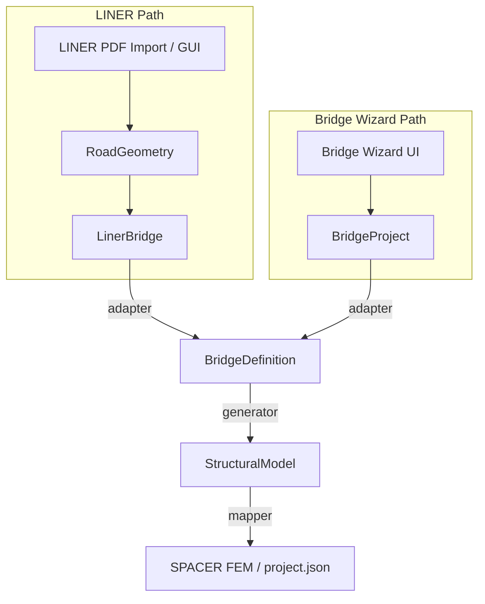

# Phase 4.5 — BridgeDefinition 中間レイヤー設計書

> Status: **Partial implementation** — Step 1（命名整理）・Step 2（型 + JSON Schema + validation test）・Step 3（LinerBridge → BridgeDefinition adapter）・Step 4（BridgeProject → BridgeDefinition adapter）・Step 5（BridgeDefinition → StructuralModel generator MVP）完了。UI / App / 既存 FEM generator への接続は未実装（Step 6 で feature flag 下の段階移行予定）。
> Repo: spacer-clone
> 作成日: 2026年7月8日
> 関連: [integration_with_frame_model.md](../integration_with_frame_model.md), [phase35_bridge_adapter_spec.md](../phase3.6/phase35_bridge_adapter_spec.md), [bridge-domain-model.md](../../design/bridge-domain-model.md), [bridge-fem-generator.md](../../design/bridge-fem-generator.md)

---

## Purpose

LINER（線形座標・PDF インポート）経路と Bridge Wizard 経路が、それぞれ独立した Bridge 型と FEM 生成パイプラインを持つ現状を整理し、**BridgeDefinition** を共通の構造設計中間表現として導入する設計を定義する。

本ドキュメントは Phase 4.5 の **source of truth** である。実装 PR は本書の境界・段階計画に従う。

---

## 1. 背景

### 1.1 現状の 3 系統の関係

| 系統 | 入口 | 中間表現 | FEM 出力 |
| --- | --- | --- | --- |
| **LINER** | PDF インポート UI / GUI 線形編集 | `JipLinerImporterProject` → `LinerDomainDraftVNext` → `CanonicalLinerIntermediateResult` | `mapToFrameModel()` → `project.json` |
| **Bridge Wizard** | 6 ステップ Wizard UI | `BridgeProject` (`frontend/src/bridge/types.ts`) | `backend/engine/bridge_fem_generator.py` → `project.json` |
| **SPACER** | 既存フレーム解析 UI | `ProjectModel` (`project.json`) | 解析エンジン入力（最終形） |

LINER は **道路線形（測点・平面・縦断・横断・グリッド）** を主眼に、`frontend/src/liner/` 配下の pure TypeScript pipeline でフレームモデルを生成する。Bridge Wizard は **簡略横断面 + スパン長 + 荷重** から格子状 FEM を Python 側で直接生成する。いずれも最終的には `schemas/project.schema.json` 互換の `project.json` を目指すが、**途中の意味論モデルが共有されていない**。

### 1.2 Bridge 型の二重化

現状、名称 `Bridge` / `BridgeProject` が複数の文脈で使われ、責務が重なっている。

| 型名 | 配置 | 主な責務 |
| --- | --- | --- |
| `LinerBridge` | `frontend/src/liner/importer/types.ts` | PDF インポート用の橋梁エンティティ（sections, spans, girderLineSets, substructure） |
| `BridgeProject` | `frontend/src/bridge/types.ts`, `backend/engine/bridge_model.py` | Wizard 用ドメインモデル（crossSection, spans, lines, loads, generationSettings） |
| `LinerDomainDraftVNext` | `frontend/src/liner/schema/types.ts` | LINER 計算用 draft（alignment, verticalAlignment, gridDefinitions, piers 等） |

`LinerBridge`（importer）と `BridgeProject`（wizard）はどちらも「橋梁」だが、前者は **道路測量・線形** 中心、後者は **解析用簡略モデル** 中心であり、型のフィールド集合も生成経路も異なる。

### 1.3 Phase 4.5 で中間層を導入する理由

1. **FEM 生成経路の二重実装** — LINER は TS `frameModelMapper`、Wizard は Python `bridge_fem_generator`。将来の箱桁・鈑桁・PC 桁・横桁・対傾構・支承・照査・図面出力を両経路に重複実装するコストが高い。
2. **設計意図と解析モデルの混在** — Wizard の `BridgeProject` は UI ステップ入力と FEM 格子生成設定が同居。LINER の `LinerDomainDraftVNext` は線形計算 draft と構造要素（piers, crossBeams）が同居。
3. **拡張性** — 構造形式（superstructure type）、部材配置、支承条件、荷重ケースを **解析モデル生成前** に正規化する共通層がないと、新機能が各入口に分散する。
4. **integration_with_frame_model.md §10** — Mode C（Wizard bridge）が Deferred とされていた。Phase 4.5 はその橋渡しを **破壊的変更なし** で準備する。

---

## 2. 目的

| # | 目的 | 説明 |
| --- | --- | --- |
| G1 | Road Geometry と Structural Model の分離 | 線形・測点・横断は上流。節点・部材・支点・荷重は下流。 |
| G2 | 責務分離 | `LinerBridge`（LINER 橋梁意図）、`BridgeProject`（Wizard 入力）、`BridgeDefinition`（構造設計中間）、`StructuralModel`（解析前モデル）を明確化。 |
| G3 | FEM 生成経路一本化 | `BridgeDefinition` → `StructuralModel` → `project.json` を共通終端とし、既存 generator は adapter 経由で段階移行。 |
| G4 | 拡張性 | 箱桁・鈑桁・PC 桁・横桁・対傾構・支承・照査・図面出力を BridgeDefinition / StructuralModel 側に追加可能なスキーマ余地を確保。 |

---

## 3. 非スコープ

本 Phase（設計書）および直後の実装バッチで **意図的に行わない** こと:

- TypeScript / Python の実装変更（本ドキュメント作成を除く）
- UI 変更（Bridge Wizard ステップ、LINER 画面）
- 既存 FEM 生成ロジックの挙動変更（`bridge_fem_generator.py`, `frameModelMapper.ts`）
- PDF バイナリインポートの完成
- DXF 仕様変更
- 照査機能（応力度・疲労等）
- 図面作成機能
- `App.tsx` の大規模分割
- 既存 `BridgeProject` JSON / API / テストの破壊的変更

---

## 4. 用語定義

| 用語 | 定義 | 現行コード上の近似 |
| --- | --- | --- |
| **RoadGeometry** | 道路・橋梁位置決めの幾何。平面線形、縦断、横断勾配、測点定義、幅員変化。解析節点ではない。 | LINER: `alignment`, `verticalAlignment`, `crossSections`, `stationDefinition`, `measuredGrid` |
| **LinerBridge** | LINER 系統における 1 橋梁分の **設計意図** 。RoadGeometry + スパン/支点/横桁/主桁線 master + importer メタデータ。FEM 部材ではない。 | `LinerBridge`（`liner/importer/types.ts`）+ 正規化後 `LinerDomainDraftVNext`（1 bridge 分） |
| **BridgeProject** | Bridge Wizard が保持する **Wizard 入力プロジェクト** 。横断组成、スパン、衝撃係数、3D 線、荷重、メッシュ設定。 | `frontend/src/bridge/types.ts` の `BridgeProject` |
| **BridgeDefinition** | **新設** 共通中間表現。構造設計者が意図する橋梁構造（スパン、支点、上部構造形式、主桁・横桁・支承・床版・荷重・生成設定）を、入口非依存で記述。 | `frontend/src/bridgeDefinition/types.ts`, `schemas/bridge-definition.schema.json`（Step 2） |
| **StructuralModel** | 解析直前モデル。節点・部材・材質断面参照・支点条件・荷重・局所座標・member orientation・解析ケース。`project.json` への写像前。 | 概念的には `FrameMappingResult` + 荷重/ケース、または generator 内部状態 |
| **FEM Model** | SPACER が検証・解析する JSON。 | `ProjectModel` / `schemas/project.schema.json` |
| **SPACER Project** | アプリが保存する解析プロジェクト全体。FEM + 解析設定 + 拡張（`liner`, `linerTrace` 等）。 | `ProjectModel` + metadata |

**境界の原則:** BridgeDefinition **より上流** は設計意図・線形。BridgeDefinition **より下流** は解析モデル（離散化・ID・拘束・荷重ベクトル）。

---

## 5. 現状コード調査

調査日: 2026-07-08。主要ファイルは `rg --files` およびリポジトリ走査に基づく。

### 5.1 サマリ表

| 領域 | 現在の責務 | BridgeDefinition 導入時の影響 | 変更候補（将来） |
| --- | --- | --- | --- |
| **LINER — importer** | PDF 由来 JSON の CRUD、検証、Phase 3.5 draft への adapter | `LinerBridge` は RoadGeometry 源として維持。FEM 直結はしない。`LinerBridge` → `BridgeDefinition` adapter を新設 | `frontend/src/liner/importer/types.ts`, `importer/export/ImporterToPhase35Adapter.ts`, 新規 `liner/bridgeDefinition/` |
| **LINER — core** | 線形計算 pipeline、中間結果、診断 | `CanonicalLinerIntermediateResult` は RoadGeometry 計算結果。BridgeDefinition には **計算後の幾何スナップショット** を渡す | `frontend/src/liner/core/pipeline/`, `core/types.ts` |
| **LINER — mapper** | 中間結果 → frame entity draft | 短期は現行維持。中期は `BridgeDefinition` → `StructuralModel` → 既存 mapper 相当に統合 | `frontend/src/liner/mapper/frameModelMapper.ts` |
| **LINER — headless** | テスト/自動化用 `project.json` 組立 | 新経路では `BridgeDefinition` 経由の golden 比較を追加。旧経路は feature flag 下で並存 | `frontend/src/liner/headless/createHeadlessLinerFrameProject.ts` |
| **LINER — schema** | `LinerDomainDraftVNext`, project liner 拡張 | draft は RoadGeometry 層として維持。BridgeDefinition schema は別ファイルで追加検討 | `frontend/src/liner/schema/types.ts`, 新規 `schemas/bridge-definition.schema.json`（未決） |
| **Bridge Wizard — types** | Wizard ドメイン型、FEM summary 型 | `BridgeProject` は Wizard 永続化形式として維持。→ `BridgeDefinition` adapter を追加 | `frontend/src/bridge/types.ts` |
| **Bridge Wizard — UI/State** | 6 ステップ入力、API 呼び出し | UI は `BridgeProject` のまま。Step 6 は adapter 経由で FEM 生成（段階移行） | `BridgeWizardState.ts`, `steps/Step6ModelGeneration.tsx` |
| **Bridge Wizard — API** | `/api/fem/generate` 等 | 新 endpoint または body に `bridgeDefinition` オプション追加（後方互換） | `frontend/src/bridge/api.ts`, `backend/app/` routes |
| **Backend — bridge_model** | `BridgeProject` parse/validate | Python `BridgeDefinition` dataclass を将来追加。現行 parse は維持 | `backend/engine/bridge_model.py` |
| **Backend — bridge_fem_generator** | `BridgeProject` → `project.json` | 内部を `BridgeDefinition` → `StructuralModel` → project 写像に段階リファクタ | `backend/engine/bridge_fem_generator.py` |
| **Schemas** | `bridge.schema.json`, `project.schema.json`, `generated-fem.schema.json` | `bridge-definition.schema.json` 新設候補。既存 schema は非破壊 | `schemas/` |
| **Tests** | Wizard FEM golden, importer export, liner geometry | 変換 unit test、FEM 件数比較 golden を追加 | `backend/tests/test_bridge_fem_generator.py`, `frontend/src/liner/importer/export/*.test.ts`, `frontend/src/bridge/*.test.ts` |

### 5.2 主要データフロー（現状）

**LINER 経路:**

```text
JipLinerImporterProject.bridges[]
  → ImporterToPhase35Adapter → LinerDomainDraftVNext
  → buildIntermediateResult() → CanonicalLinerIntermediateResult
  → mapToFrameModel() → FrameMappingResult
  → createHeadlessLinerFrameProject() → ProjectModel
```

**Bridge Wizard 経路:**

```text
BridgeProject (UI state)
  → POST /api/fem/generate
  → bridge_fem_generator.generate_fem_model()
  → project.json + GeneratedFemModel summary
```

**共通終端:** `schemas/project.schema.json` 準拠の `ProjectModel`。

### 5.3 型フィールド対照（抜粋）

| 概念 | Importer `LinerBridge` | `LinerDomainDraftVNext` | `BridgeProject` |
| --- | --- | --- | --- |
| スパン | `spans[]` (station range) | `spans[]`, `piers[]` | `spans[]` (length) |
| 横断 | `sections[]`, girderLineSets | `crossSections[]`, `measuredGrid?` | `crossSection` (lane 组成) |
| 線形 | `alignmentMetadata?` | `alignment`, `verticalAlignment` | `lines[]` (3D polyline) |
| 下部構造 | `substructure?` | `piers`, `crossBeams?` | （暗黙: 端部支点のみ generator 内） |
| 荷重 | — | — | `loads[]`, `impactFactor` |
| メッシュ | — | `generationSettings`, `sampling` | `generationSettings` |

---

## 6. 目標アーキテクチャ

BridgeDefinition 境界で **上流 = 設計意図**、**下流 = 解析モデル** とする。



**説明:**

- **LINER PDF / GUI** は RoadGeometry（線形計算）を完成させ、橋梁固有のスパン・支点・主桁線を **LinerBridge** に束ねる。
- **Bridge Wizard** は従来どおり **BridgeProject** を編集する。
- 両経路は **BridgeDefinition** に収束する。ここで superstructure 形式、部材配置規則、支承タイプ、荷重ケースが入口非依存の語彙になる。
- **StructuralModel** は離散化済み解析モデル（節点・部材・拘束・荷重）。既存 `frameModelMapper` 出力や `bridge_fem_generator` 内部状態に相当。
- **SPACER FEM** は現行 `project.json` 互換形式。解析エンジンは変更しない。

---

## 7. 型設計案

以下は TypeScript 初期型案。**Step 2（2026-07-09）** で `frontend/src/bridgeDefinition/types.ts` および `schemas/bridge-definition.schema.json` として実装済み。Python `@dataclass` は **Step 3 以降または generator 実装前** に追加する（本 Step では未実装）。

### Step 2 実装ファイル

| 種別 | パス | 状態 |
| --- | --- | --- |
| TypeScript 型 | `frontend/src/bridgeDefinition/types.ts` | 実装済み |
| TypeScript export | `frontend/src/bridgeDefinition/index.ts` | 実装済み |
| JSON Schema | `schemas/bridge-definition.schema.json` | 実装済み（`schemaVersion: "1.0.0"`） |
| Schema validation test | `backend/tests/test_bridge_definition_schema.py` | 実装済み |
| Python dataclass | `backend/engine/bridge_definition.py`（予定） | **未実装** — generator 実装前 |
| LinerBridge → BridgeDefinition adapter | `frontend/src/bridgeDefinition/adapters/fromLinerBridge.ts` | **実装済み** — Step 3（純粋関数 + unit test）。UI / App / importer pipeline には未接続 |
| BridgeProject → BridgeDefinition adapter | `frontend/src/bridgeDefinition/adapters/fromBridgeProject.ts` | **実装済み** — Step 4（純粋関数 + unit test）。UI / App / FEM generator には未接続 |
| BridgeDefinition → StructuralModel generator | `frontend/src/bridgeDefinition/generator/structuralModelGenerator.ts` | **実装済み** — Step 5（純粋関数 + unit test）。UI / App / Bridge Wizard / backend FEM generator には **未接続** |

### 初期型案（設計参照用）

```typescript
/** Phase 4.5 initial — not implemented */
type BridgeDefinitionSchemaVersion = "0.1.0";

type BridgeDefinitionSource =
  | { kind: "liner"; linerModelId: string; importerBridgeId?: string }
  | { kind: "wizard"; bridgeProjectId: string }
  | { kind: "manual" };

type CoordinatePolicyRef = {
  policyId: string;
  /** e.g. "global", "bridge-local", "span-local" */
  frame: "global" | "bridge-local";
  axisConvention?: "x-longitudinal-y-transverse-z-up";
};

type AlignmentRef = {
  alignmentId: string;
  originStation: number;
  totalLength: number;
};

type BridgeDefinitionStation = {
  id: string;
  station: number;
  label?: string;
  role?: "origin" | "pier" | "expansion" | "custom";
};

type BridgeDefinitionSpan = {
  id: string;
  index: number;
  startStation: number;
  endStation: number;
  length: number;
  girderLineSetId?: string;
};

type SupportDefinition = {
  id: string;
  station: number;
  kind: "fixed" | "pinned" | "roller" | "custom";
  substructureKind?: "abutment" | "pier" | "virtual_pier";
  skewAngleDeg?: number;
  /** Transverse position hints for future multi-support rows */
  transversePosition?: "centre" | "edge" | number;
};

type SuperstructureKind =
  | "slab_girder_grid"   // current wizard MVP
  | "box_girder"
  | "plate_girder"
  | "pc_girder"
  | "custom";

type GirderDefinition = {
  id: string;
  label: string;
  role: "main" | "edge" | "barrier" | "custom";
  /** Transverse offset from alignment centre, metres */
  offset: number;
  spanIds: string[];
  sectionRefId?: string;
  materialRefId?: string;
};

type CrossBeamDefinition = {
  id: string;
  station: number;
  girderIds?: string[];
  sectionRefId?: string;
};

type BearingDefinition = {
  id: string;
  supportId: string;
  type: "elastomeric" | "pot" | "fixed" | "custom";
  /** Future: stiffness matrix ref */
};

type DeckDefinition = {
  id: string;
  width: number;
  thickness?: number;
  /** Future: composite / RC */
  kind?: "steel_composite" | "rc" | "orthotropic";
};

type BridgeLoadDefinition = {
  id: string;
  caseId: string;
  type: "self_weight" | "distributed" | "vehicle" | "temperature";
  magnitude: number;
  direction: "X" | "Y" | "Z" | "-X" | "-Y" | "-Z";
  target: { kind: "girder" | "deck" | "node" | "line"; refId: string };
  impactFactor?: number;
};

type BridgeGenerationSettings = {
  meshDivision: number;
  meshDensity: "coarse" | "standard" | "fine";
  girderSpacingOverride?: number;
  defaultMaterialId?: string;
  defaultSectionId?: string;
  /** Feature flag: use legacy direct generator */
  useLegacyFemPath?: boolean;
};

type BridgeDefinitionMetadata = {
  createdAt?: string;
  updatedAt?: string;
  schemaVersion: BridgeDefinitionSchemaVersion;
  notes?: string;
};

/** Canonical intermediate structural design intent */
interface BridgeDefinition {
  id: string;
  name: string;
  source: BridgeDefinitionSource;
  coordinatePolicy: CoordinatePolicyRef;
  alignmentRefs: AlignmentRef[];
  stations: BridgeDefinitionStation[];
  spans: BridgeDefinitionSpan[];
  supports: SupportDefinition[];
  superstructure: {
    kind: SuperstructureKind;
    /** Extensible payload per kind */
    params?: Record<string, unknown>;
  };
  girders: GirderDefinition[];
  crossBeams: CrossBeamDefinition[];
  bearings: BearingDefinition[];
  deck: DeckDefinition;
  loads: BridgeLoadDefinition[];
  generationSettings: BridgeGenerationSettings;
  metadata: BridgeDefinitionMetadata;
}
```

**Python 方針:** `backend/engine/bridge_definition.py`（新規）に frozen dataclass 群を **Step 3 以降または generator 実装前** に追加する。`to_dict` / `from_dict` は `bridge_model.py` と同パターン。TS ↔ Python の同期方法は §13 未決事項。**Step 2 時点では Python dataclass は未実装。**

---

## 8. 変換パイプライン案

### 8.1 LINER 経路: LinerBridge → BridgeDefinition

**入力:** Importer `LinerBridge` + 正規化済み `LinerDomainDraftVNext` +（任意）`CanonicalLinerIntermediateResult`

| BridgeDefinition フィールド | 変換元 | 変換ルール |
| --- | --- | --- |
| `source` | importer project / bridge id | `{ kind: "liner", ... }` |
| `coordinatePolicy` | `coordinatePolicyId`, `coordinateSystem` | policy registry 参照。未登録は warning |
| `alignmentRefs` | `alignment`, `stationDefinition` | originStation, 総延長を pipeline 出力から |
| `stations` | `stationDefinition.explicitStations`, pier stations | 測点列 + 支点測点 |
| `spans` | `spans[]`, `piers[]` | start/end station, length 計算 |
| `supports` | `piers[]`, `substructure.supports[]` | kind マッピング（abutment/pier/virtual_pier） |
| `girders` | `girderLineSets`, `measuredGrid.lines` | 横断オフセット、role → main/edge |
| `crossBeams` | `crossBeams[]`, `substructure.crossBeams` | station 一致で統合 |
| `superstructure` | 現状は `slab_girder_grid` 固定 | 将来 importer メタから推論 |
| `deck` | `widthChangePoints`, section 幅員 | 代表幅員 |
| `loads` | 現状空 | LINER は荷重未対応。placeholder |
| `generationSettings` | `generationSettings`, `sampling` | mesh 相当を写像 |

**配置:** `frontend/src/bridgeDefinition/adapters/fromLinerBridge.ts`（純粋関数、`validateLinerBridgeForBridgeDefinition` で warnings 返却）

**Step 3 実装状況（2026-07-09）:** adapter と unit test を追加済み。`createBridgeDefinitionFromLinerBridge()` は deterministic に `BridgeDefinition` を生成する。importer export pipeline・`App.tsx`・FEM generator には **接続していない**。

**既存 adapter との関係:** `ImporterToPhase35Adapter` は維持。Phase 3.5 draft 生成 **後** に optional で BridgeDefinition を派生させる（draft を要求しない経路は Step 4 以降）。

### 8.2 Bridge Wizard 経路: BridgeProject → BridgeDefinition

**入力:** `BridgeProject`（`schemas/bridge.schema.json` 準拠）

| BridgeDefinition フィールド | 変換元 | 変換ルール |
| --- | --- | --- |
| `source` | `BridgeProject.id` | `{ kind: "wizard", bridgeProjectId }` |
| `coordinatePolicy` | 既定 | `{ policyId: "wizard-default", frame: "bridge-local" }` |
| `alignmentRefs` | `spans`, `lines` | 総延長 = Σ span.length。lines は参照用 |
| `stations` | x 格子端点 | 0, 各 span 境界 |
| `spans` | `spans[]` | index, length, cumulative station |
| `supports` | generator 暗黙端部支点 | 最初・最後 x 位置を fixed/pinned に |
| `girders` | `crossSection` + `generationSettings` | `_y_positions` 相当の transverse offset 列 |
| `crossBeams` | 現状空 | 将来 Step 追加 |
| `superstructure` | `slab_girder_grid` | MVP 固定 |
| `deck` | `crossSection.total_width` 相当 | lane 组成から幅員 |
| `loads` | `loads[]`, `impactFactor` | 型・方向を BridgeLoadDefinition に |
| `generationSettings` | `generationSettings` | snake_case ↔ camelCase 正規化 |

**配置:** `frontend/src/bridgeDefinition/adapters/fromBridgeProject.ts`（純粋関数、`validateBridgeProjectForBridgeDefinition` で warnings 返却）

**Step 4 実装状況（2026-07-09）:** adapter と unit test を追加済み。`createBridgeDefinitionFromBridgeProject()` は deterministic に `BridgeDefinition` を生成する。Bridge Wizard UI・`App.tsx`・FEM generator には **接続していない**。

**Step 5 実装状況（2026-07-10）:** `createStructuralModelFromBridgeDefinition()` と `validateBridgeDefinitionForStructuralModel()` を `frontend/src/bridgeDefinition/generator/` に追加済み。`BridgeDefinition` から `ProjectModel` 候補（nodes, members, materials, sections, supports, loads, analysisSettings, metadata）を deterministic に生成する MVP generator。`App.tsx`・Bridge Wizard UI・`/api/fem/generate`・`bridge_fem_generator.py`・`frameModelMapper.ts` には **接続していない**。Step 6 で既存 FEM Generator へ feature flag（`useLegacyFemPath` / `useBridgeDefinitionFemPath`）下で段階移行予定。

**配置候補（将来 API 境界）:** `backend/engine/bridge_project_adapter.py`（API 境界用、未実装）

---

## 9. BridgeDefinition → StructuralModel

詳細アルゴリズムは既存 generator / mapper に委譲。本節は **責務境界** のみ定義。

| 生成段階 | 責務 | 出力 |
| --- | --- | --- |
| **節点生成** | スパン × メッシュ × 主桁 transverse 位置から 3D 節点候補 | `StructuralNode[]` { id, x, y, z, tags } |
| **部材生成** | 縦桁・横桁・対傾構（将来）トポロジ | `StructuralMember[]` { id, nodeI, nodeJ, groupKey, sectionRef, materialRef } |
| **材質・断面属性** | BridgeDefinition の ref を project materials/sections ID に解決 | 解決表 + 欠落 diagnostic |
| **支点条件** | supports + bearings → 拘束テンプレート | `StructuralSupport[]` |
| **荷重** | loads + impact → nodal / member load 候補 | `StructuralLoad[]` |
| **ローカル座標** | 部材軸、橋軸 align | per-member local frame |
| **member orientation** | 曲げ弱軸・強軸向き | orientation vector（現行 `bridge_fem_generator` 同等） |
| **解析ケース** | load case 分组 | `AnalysisCase[]` → project `loadCases` |

**StructuralModel → FEM Model:** 既存 `ProjectModel` フィールドへ写像（nodes, members, supports, loadCases, nodalLoads, memberLoads）。`linerTrace` 相当の trace は LINER 経路のみ optional 付与。

**境界:** StructuralModel は **JSON Schema 検証前** の内部型。project.json へは mapper が `schemaVersion`, `units`, `materials`, `sections` を補完する。

---

## 10. 段階的実装計画

| Step | 作業内容 | 触る候補ファイル | リスク | 完了条件 |
| --- | --- | --- | --- | --- |
| **1** | Bridge / BridgeProject 命名・責務整理（`Bridge` → `LinerBridge` 等） | `liner/importer/types.ts`, `bridge/types.ts`, 本 doc | 混同継続 | 用語表がコードコメントと一致。挙動変更なし |
| **2** | BridgeDefinition 型・schema 追加 | 新規 `frontend/src/bridgeDefinition/types.ts`, `schemas/bridge-definition.schema.json` | schema 配置未決 | **完了** — typecheck pass。schema validate fixture 1 件 |
| **3** | LinerBridge → BridgeDefinition adapter | `frontend/src/bridgeDefinition/adapters/fromLinerBridge.ts`, tests | LINER pipeline 回帰 | **完了** — adapter unit test pass。importer / UI / App 未接続 |
| **4** | BridgeProject → BridgeDefinition adapter | `frontend/src/bridgeDefinition/adapters/fromBridgeProject.ts`, tests | Wizard API 互換 | **完了** — adapter unit test pass。UI / App / FEM 未接続 |
| **5** | BridgeDefinition → StructuralModel generator | `frontend/src/bridgeDefinition/generator/structuralModelGenerator.ts` | ロジック重複 | **完了** — 単体テストで node/member/support 生成確認。UI / App / FEM 未接続 |
| **6** | 既存 Bridge FEM Generator 段階移行 | `bridge_fem_generator.py`, `frameModelMapper.ts`, feature flag | FEM 出力差分 | golden: 旧経路と node/member/support 数一致 |
| **7** | 回帰テスト・docs 更新 | tests, `docs/design/*`, 本 doc Status | docs  drift | pytest + vitest 全 pass。設計書 Status → Implemented 部分反映 |

---

## 11. 互換性方針

1. **既存 JSON を壊さない** — `BridgeProject` (`schemaVersion: "0.1.0"`), `JipLinerImporterProject`, `project.json`, 既存 golden fixture はそのまま valid。
2. **段階導入** — 新経路は `generationSettings.useLegacyFemPath` または環境/feature flag で opt-in。default は旧経路。
3. **adapter 経由** — UI は引き続き `BridgeProject` / importer JSON を編集。BridgeDefinition は永続化 optional（最初は変換時のみ）。
4. **旧経路の削除タイミング** — Step 6 で 6 ヶ月相当の golden 一致後。別 Phase で deprecation 告知。
5. **API** — `/api/fem/generate` は `bridge` body 維持。将来 `bridgeDefinition` フィールド追加は additive。

---

## 12. テスト方針

| 層 | 内容 | 既存テストとの関係 |
| --- | --- | --- |
| **型変換 unit test** | LinerBridge ↔ BD, BridgeProject ↔ BD | 新規 vitest/pytest |
| **schema validation** | `bridge-definition.schema.json` | 新規 fixture |
| **golden fixture** | BD JSON snapshot（built-in sample, wizard template） | importer export tests 維持 |
| **BridgeProject 既存** | `BridgeWizardState.test.ts`, `bridgeValidation.test.ts` | 変更後も pass 必須 |
| **Liner importer export** | `importerPhase35Bridge.test.ts`, `adapter.test.ts` | 変更後も pass 必須 |
| **FEM 件数比較** | nodeCount, memberCount, supportCount 旧 vs 新 | `test_bridge_fem_generator.py` 拡張 |
| **Playwright E2E** | Wizard Step 6 生成（将来） | 本 Phase では未実装 |

---

## 13. 未決事項

| ID | 論点 | 候補 | 決定期限 |
| --- | --- | --- | --- |
| O1 | schema 配置 | `schemas/bridge-definition.schema.json` vs `project.schema.json` `$defs` | **決定:** `schemas/bridge-definition.schema.json`（Step 2） |
| O2 | TS ↔ Python 同期 | 手動 mirror / codegen / JSON Schema single source | Step 2〜5 |
| O3 | 既存 importer 橋梁型 rename | Step 1 で `LinerBridge` に統一済み | — |
| O4 | App.tsx 分割 | BridgeDefinition 導入とは独立。別 Phase | — |
| O5 | LinerBridge 保存形式 | project.liner 内 BD 埋込 vs 別ファイル | Step 3 前 |
| O6 | BridgeDefinition バージョニング | semver + migration registry | **初期値:** `"1.0.0"`（Step 2） |
| O7 | SPACER project JSON との関係 | BD を `project.bridgeDefinition?` として top-level 拡張 | Step 5 前 |
| O8 | 座標系・軸方向・符号 | [coordinate_system_policy.md](../coordinate_system_policy.md) との統一。Wizard y 对称 vs LINER measured grid | Step 5 前 |

---

## 14. Codex 実装時の注意

1. **まず型追加のみ** — Step 2 では runtime 挙動を変えない。
2. **既存挙動を変えない** — default code path は legacy のまま。
3. **rename は小さく** — 1 PR 1 概念。type alias で transitional 命名。
4. **adapter は純粋関数化** — 副作用なし。diagnostics を戻り値に含める。
5. **snapshot / golden を先に作る** — 実装前に expected BD / FEM counts を commit。
6. **App.tsx を一気に触らない** — Wizard 統合は Step 4 以降、最小 diff。
7. **generated FEM の出力差分を必ず確認** — Step 6 merge 条件。差分は意図的でなければ revert。

---

## Related Documents

| Document | Relevance |
| --- | --- |
| [integration_with_frame_model.md](../integration_with_frame_model.md) | LINER → project.json 統合。Mode C deferred |
| [phase35_bridge_adapter_spec.md](../phase3.6/phase35_bridge_adapter_spec.md) | Importer → Phase 3.5 adapter |
| [frame_model_mapping.md](../frame_model_mapping.md) | 現行 mapper 規則 |
| [bridge-domain-model.md](../../design/bridge-domain-model.md) | BridgeProject 現行定義 |
| [bridge-fem-generator.md](../../design/bridge-fem-generator.md) | Wizard FEM 生成仕様 |
| [coordinate_system_policy.md](../coordinate_system_policy.md) | 座標系 |
| [normalization_context_design.md](../phase3.7/normalization_context_design.md) | Importer 正規化 |

---

## Pre-Implementation Checklist

- [ ] O1〜O8 のうち Step 1 に必要な項目（O3）を確認
- [ ] Golden fixture 置き場所を `examples/bridge-definition/` に決定
- [ ] Feature flag 名を `useBridgeDefinitionFemPath` で仮置き（変更可）
- [ ] Step 2 PR は types + schema + validation test のみ

---

## Document History

| Date | Change |
| --- | --- |
| 2026-07-08 | Initial design (Phase 4.5 docs-only) |
| 2026-07-09 | Step 2: TypeScript types, JSON Schema, schema validation test added |
| 2026-07-09 | Step 3: LinerBridge → BridgeDefinition adapter (`fromLinerBridge.ts`) + unit tests; UI / App / FEM 未接続 |
| 2026-07-09 | Step 4: BridgeProject → BridgeDefinition adapter (`fromBridgeProject.ts`) + unit tests; UI / App / FEM 未接続 |
| 2026-07-10 | Step 5: BridgeDefinition → StructuralModel generator MVP (`structuralModelGenerator.ts`) + unit tests; UI / App / Bridge Wizard / backend FEM generator 未接続。Step 6 で feature flag 下の段階移行予定 |
