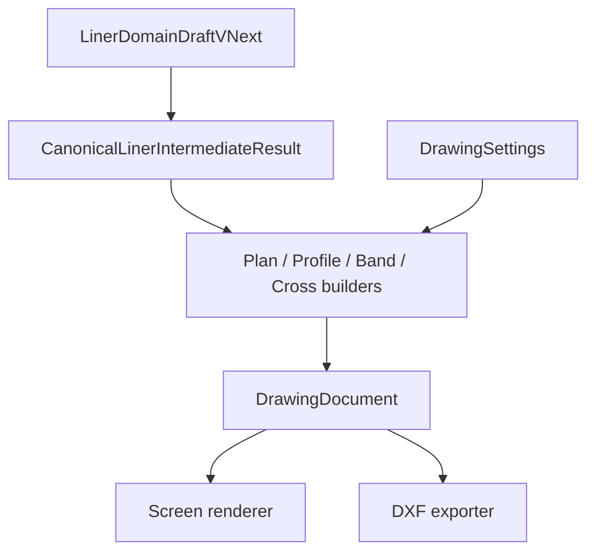

# Phase 5 - Liner Formal Drawing / Crossfall Design Pack

> Status: `REDLINE_REMEDIATION_DESIGN`
> Date: 2026-07-13
> Redline: [redline_ui_and_drawing_remediation_design.md](redline_ui_and_drawing_remediation_design.md)
> Phase: Phase 5
> Ownership: confirmed facts / proposals / Open Decisions are separated
> PHASE5_FINAL_SCOPE_VERDICT: `READY_WITH_OPEN_DECISIONS`
> PHASE5_STEP2_READINESS: `NEEDS_FOUNDATION`
> PHASE5_STEP3_READINESS: `NEEDS_STEP2`

## 目的

Phase 5 は、LINER の formal drawing と crossfall transition を実装前に凍結するための設計パックである。
第1編は `screen plan/profile/band/cross-section + crossfall` の完全実装方針を定め、第2編は `3DXF` の出力方針を定める。
本パックの出力は **DXF** であり、SXF 正式納品や別形式の import を意味しない。

## 文書一覧

phase5 配下の文書は次の 9 件のみを正とする。

1. [README.md](README.md)
2. [phase5_liner_formal_drawing_design.md](phase5_liner_formal_drawing_design.md)
3. [drawing_model_design.md](drawing_model_design.md)
4. [crossfall_transition_design.md](crossfall_transition_design.md)
5. [implementation_plan.md](implementation_plan.md)
6. [formal_drawing_ui_design.md](formal_drawing_ui_design.md)
7. [drawing_standard_preset_design.md](drawing_standard_preset_design.md)
8. [dxf_export_design.md](dxf_export_design.md)
9. [redline_ui_and_drawing_remediation_design.md](redline_ui_and_drawing_remediation_design.md)

## 確認済み事実

- 現行 `LinerDomainDraftVNext` は `measuredGrid`, `crossSections`, `generationSettings`, `sampling` を持ち、`buildIntermediateResult()` が `CanonicalLinerIntermediateResult` を生成する。根拠: `frontend/src/liner/schema/types.ts:91`, `frontend/src/liner/core/pipeline/pipeline.ts:388`.
- `buildLinerPreviewFromDraft()` は既存 preview を screen projection に残置したまま可視化している。根拠: `frontend/src/liner/adapters/linerPreviewAdapter.ts:83`.
- `CrossSectionTemplateEditor` は `template.crossSlope.valuePercent` から `offsetLines[].elevation` を再計算し、elevation 入力は readonly である。根拠: `frontend/src/liner/components/CrossSectionTemplateEditor.tsx:50-58`, `:274-280`.
- `LinerEditPage` は `SuperelevationEditor`（scalar）と `CrossfallIntervalEditor` を併記している。根拠: `frontend/src/liner/pages/LinerEditPage.tsx:270-284`.
- `generateGridPoints()` は `z = profileElevation + crossfallOffset` とし、template `offsetLine.elevation` は加算していない。根拠: `frontend/src/liner/core/grid/gridGeneration.ts:125-126`.
- measured grid 存在時は `generateMeasuredGridPoints()` が優先され、interval crossfall は適用されない（警告 `LINER_CROSSFALL_MEASURED_GRID_PRECEDENCE`）。根拠: `frontend/src/liner/core/pipeline/pipeline.ts:523-541`.
- formal builders は plan/profile/band の基本 primitive のみで、renderer は `DrawingDocument` のみを描画する。根拠: `frontend/src/liner/drawing/builders/formalBuilders.ts`, `frontend/src/liner/drawing/rendering/DrawingDocumentSvg.tsx`.
- **DXF 出力 scope は変更しない。** Step 3 PR2（Plan export）は **未着手**。

## Scope

第1編の scope は `screen plan/profile/band/cross-section + crossfall` の runtime 設計である。
第2編の scope は `3DXF` の runtime export 設計である。
Phase 5 の総 scope は次に限定する。

- `LinerDomainDraftVNext` → `CanonicalLinerIntermediateResult` → runtime `DrawingDocument` → screen / DXF の経路
- `DrawingSettings` のみ保存し、`DrawingDocument` は保存しない方針
- crossfall の型、解決順、遷移条件、移行、診断
- Redline Stage 2: 横断テンプレート elevation・区間 UI・図面上下構成（[redline_ui_and_drawing_remediation_design.md](redline_ui_and_drawing_remediation_design.md)）
- Step2 / Step3 の PR 境界
- Open Decision の集中管理

## Non-scope

- 既存 UI の全面置換
- 既存 `frontend/src/liner/` の実装書き換え
- `package.json` / lockfile 変更
- SXF 正式納品

## 設計原則

1. 図面は domain draft から直接描かず、`CanonicalLinerIntermediateResult` を通す。
2. runtime `DrawingDocument` は screen / DXF の共通中間であり、保存対象にしない。
3. `DrawingSettings` だけを保存し、document は runtime 生成物として扱う。
4. model の距離は m、paper は mm、screen renderer は px とし、Y 反転は viewport に閉じ込める。
5. profile / band は physicalDistance を主軸にし、band の physicalDistance は profile と同一の model 座標系で扱う。
6. crossfall interval は station 依存の回転状態のみを担い、template `offsetLines[].elevation` が基準横断形状を担う（[redline_ui_and_drawing_remediation_design.md](redline_ui_and_drawing_remediation_design.md) §4）。
7. scalar cross-slope UI は除去し、legacy scalar 読み込みは migration のみで維持する。
8. builders は `DrawingDocument` primitive を組み立て、renderer は `DrawingDocument` のみを描画する。
9. plan 曲線可視性（DD-RC-01）: 幾何 viewport は直交 fit、サンプル polyline、世界座標 bounds。
10. テキスト可読性（DD-TR-01）: 図種別 `textHeightMm` 下限 7 mm、1366×768 / 1920×1080 の screen px clamp。
11. 横断図中心線（DD-CS-01）: `offset=0` 補助 `DrawingLine` は screen のみ、domain / DXF scope 外。

## Architecture

## Step2 / Step3 境界

Step2 は第1編の完全実装であり、screen plan/profile/band/cross-section + crossfall の実装基盤を固める。
Step3 は第2編であり、3DXF 出力を `DrawingDocument` 起点へ寄せる。
crossfall は第1編 Step2 の対象であり、第2編の中身ではない。
第1編は screen 4図 + crossfall + 保存を扱い、第2編は 3DXF を扱う。

## Implementation sequence

Step2 の PR 順序は PR1-7、Step3 の PR 順序は PR1-6 を正とする。
Step2 開始条件は `PR1 Common Drawing Model Foundation` の仕様固定であり、Step3 開始条件は Step2 の PR1-7 exit gates が全て PASS になった後である。

- Step2 PR1: Common Drawing Model Foundation
- Step2 PR2: Crossfall model foundation
- Step2 PR3: Workspace and persistence gate
- Step2 PR4: Plan view
- Step2 PR5: Profile / band
- Step2 PR6: Cross-section
- Step2 PR7: Validation / migration / regression
- Step3 PR1: DXF core
- Step3 PR2: Plan export — **未着手**（DXF scope 変更なし）
- Step3 PR3: Profile / band export
- Step3 PR4: Cross-section export
- Step3 PR5: Style / preset wiring
- Step3 PR6: CAD compatibility checks

## Open Decision Table

| Decision ID | 項目名 | 現在の状態 | 未決理由 | Step2影響 | Step3影響 | 推奨初期値 | 決定期限 | 決定者 | 決定後に更新する文書 |
| --- | --- | --- | --- | --- | --- | --- | --- | --- | --- |
| OD-01 | 発注者 | 未決 | 正式な発注主体が未固定で、承認経路と責任分界が揺れる | 高 | 中 | 現行契約主体を採用 | Step2開始前 | 発注者 | `README.md`, `phase5_liner_formal_drawing_design.md` |
| OD-02 | 契約時期 | 未決 | 設計凍結と契約書反映の時点が未確定 | 高 | 中 | Step2 前半で契約反映 | Step2開始前 | 発注者/契約管理 | `README.md`, `phase5_liner_formal_drawing_design.md` |
| OD-03 | 基準版 | 未決 | 参照する CAD 基準版の固定が必要 | 高 | 高 | `mlit-cad-r7.12` 候補。発注者決裁までは compliance claim を禁止 | Step2開始前 | 設計責任者 | `README.md`, `drawing_standard_preset_design.md` |
| OD-04 | NEXCO地整 | 未決 | 地整ごとの差分をどこまで採用するか未固定 | 中 | 高 | Phase 5 は `common` のみを対象とし、`NEXCO` / 地整 preset は対象外 | Step2開始前 | 発注者/設計責任者 | `README.md`, `drawing_standard_preset_design.md` |
| OD-05 | DXF version | 未決 | export 互換と CAD 読み取りの両立が必要 | 高 | 高 | `AC1021` 比較開始候補。Step 3 の PR6 で決定 | Step2開始前 | 実装責任者 | `README.md`, `drawing_standard_preset_design.md` |
| OD-06 | model-paper scale | 未決 | model と paper の既定縮尺を固定する必要がある | 高 | 高 | model space は `m` 必須。paper space は Step 3 で決定 | Step2開始前 | 設計責任者 | `README.md`, `drawing_standard_preset_design.md` |
| OD-07 | title / band rows | 未決 | title block と band 行数の固定が必要 | 中 | 高 | title block は Phase 5 独自の最小枠候補、standard band rows は station / additional / cumulative / design / ground / grade / vertical / horizontal / cross-slope の候補に分離 | Step2開始前 | UI/図面責任者 | `README.md`, `phase5_liner_formal_drawing_design.md`, `drawing_standard_preset_design.md` |
| OD-08 | scale | 未決 | 画面と DXF の既定 scale を揃える必要がある | 中 | 高 | `plan 1:500`、`profile H1:500 V1:100`、`cross 1:100` を候補とする | Step2開始前 | 設計責任者 | `README.md`, `phase5_liner_formal_drawing_design.md` |
| OD-09 | font | 未決 | 字形差分を抑える既定 font が必要 | 中 | 高 | `Noto Sans CJK JP` を候補とし、実機確認前は未確定扱い | Step2開始前 | 実装責任者 | `README.md`, `drawing_standard_preset_design.md` |
| OD-10 | UTF8-CP932 | 未決 | エンコーディング分岐の責務が必要 | 高 | 高 | `UTF-8 + AC1021` を候補、`CP932 + ANSI_932 compatibility` を補助候補 | Step2開始前 | 実装責任者 | `README.md`, `drawing_standard_preset_design.md` |
| OD-11 | pivot | 未決 | fixed pivot の既定と変更条件が必要 | 高 | 中 | center pivot | Step2開始前 | 設計責任者 | `README.md`, `phase5_liner_formal_drawing_design.md` |
| OD-12 | design_standard | 未決 | 図面標準の参照粒度が未決 | 中 | 高 | `design_standard` は MVP 無効、`linear_slope` のみを有効対象とする | Step2開始前 | 設計責任者 | `README.md`, `drawing_standard_preset_design.md` |
| OD-13 | measured precedence | 未決 | measured grid 優先の扱いを固定する必要がある | 高 | 高 | `measuredGrid` 優先候補。UI では warning を併記する | Step2開始前 | 実装責任者 | `README.md`, `phase5_liner_formal_drawing_design.md` |
| OD-14 | multiple line branch merge | 未決 | 複数 branch を merge する規則が必要 | 中 | 中 | Phase5 Step2/3では単一基準lineのみ正式対象。branch/mergeは表示diagnosticを出してformal drawing対象外とする | Step3開始前 | 実装責任者 | `README.md`, `phase5_liner_formal_drawing_design.md` |
| OD-15 | SXF時期 | 未決 | SXF への派生可否判断時期を固定したい | 中 | 高 | Phase 5 外で再評価 | Step3開始前 | 発注者 | `README.md`, `drawing_standard_preset_design.md` |
| OD-16 | sourceRevision | 未決 | crossSections / verticalAlignment を含める範囲が未決 | 高 | 高 | runtime 影響のみを sourceRevision に反映。formal ready ではなく transition facts を優先する | Step2開始前 | 実装責任者 | `README.md`, `phase5_liner_formal_drawing_design.md` |
| OD-17 | scale-by-view | 未決 | plan/profile/section の scale 分岐が必要 | 中 | 高 | view 別の既定値を優先し、plan / profile / cross の採番を固定する | Step2開始前 | 設計責任者 | `README.md`, `drawing_standard_preset_design.md` |
| OD-18 | band rows density | 未決 | band 行密度と省略条件を統一したい | 中 | 中 | `measuredGrid` 優先候補を前提にしつつ、UI warning を出して最小表示を既定とする | Step2開始前 | UI責任者 | `README.md`, `phase5_liner_formal_drawing_design.md` |
| OD-19 | sourceRevision granularity | 未決 | sourceRevision の粒度を明確にしたい | 高 | 高 | 入力 revision の差分単位を採用し、sourceRevision は正式 readiness の文脈でのみ扱う | Step2開始前 | 実装責任者 | `README.md`, `phase5_liner_formal_drawing_design.md` |

## Redline remediation (Stage 2)

Stage 2 是正仕様は [redline_ui_and_drawing_remediation_design.md](redline_ui_and_drawing_remediation_design.md) を正とする。

- AC-RD-01〜20: 受入基準（同文書 §12）。**1366×768** と **1920×1080** の screen 検証を含む
- 凍結設計決定: **DD-RC-01**（plan 曲線可視性）、**DD-TR-01**（テキスト可読性）、**DD-CS-01**（横断中心線）
- RL-A〜H: implementation_plan の overlay track（同文書 §14 / [implementation_plan.md](implementation_plan.md) §2.1.1）
- スクリーンショット検証: `/tmp/phase5-redline-verification/`
- DXF / Step 3 PR2: **scope 不変・未着手**

## Implementation gate

- `PHASE5_FINAL_SCOPE_VERDICT = READY_WITH_OPEN_DECISIONS`
- `PHASE5_STEP2_READINESS = NEEDS_FOUNDATION`
- `PHASE5_STEP3_READINESS = NEEDS_STEP2`
- Step2 開始条件 = `PR1 Common Drawing Model Foundation` の仕様固定
- Step3 開始条件 = Step2 の PR1-7 exit gates を全 PASS

## 2編境界

第1編は `screen plan/profile/band/cross-section + crossfall` を扱い、第2編は `3DXF` を扱う。
`crossfall` は第1編 Step2 の一部であり、第2編の中身ではない。

## 参考

- [README.md](README.md)
- [phase5_liner_formal_drawing_design.md](phase5_liner_formal_drawing_design.md)
- [drawing_model_design.md](drawing_model_design.md)
- [crossfall_transition_design.md](crossfall_transition_design.md)
- [implementation_plan.md](implementation_plan.md)
- [formal_drawing_ui_design.md](formal_drawing_ui_design.md)
- [drawing_standard_preset_design.md](drawing_standard_preset_design.md)
- [dxf_export_design.md](dxf_export_design.md)
- [redline_ui_and_drawing_remediation_design.md](redline_ui_and_drawing_remediation_design.md)
