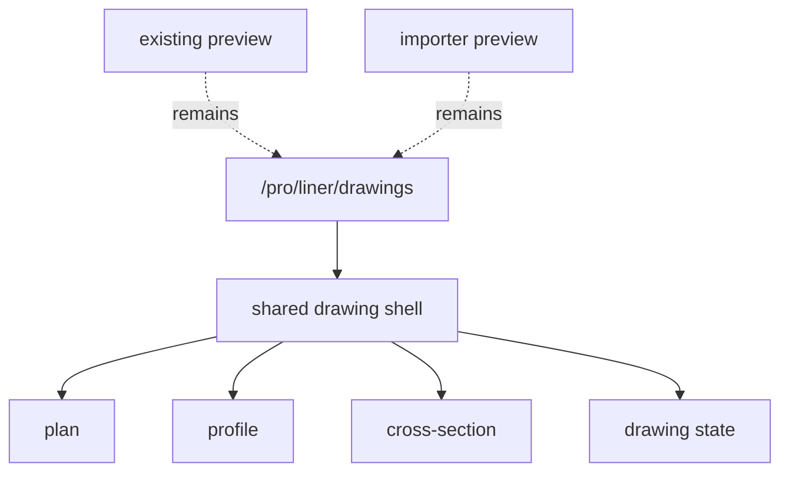

# Formal Drawing UI Design

> Status: `REDLINE_REMEDIATION_DESIGN`
> Date: 2026-07-13
> Redline: [redline_ui_and_drawing_remediation_design.md](redline_ui_and_drawing_remediation_design.md)
> Phase: Phase 5 / UI
> Readiness: `README.md` の `READY_WITH_OPEN_DECISIONS`
> Related docs: [README.md](README.md), [drawing_model_design.md](drawing_model_design.md), [phase5_liner_formal_drawing_design.md](phase5_liner_formal_drawing_design.md), [redline_ui_and_drawing_remediation_design.md](redline_ui_and_drawing_remediation_design.md), [../phase4.5/phase4_5_closeout.md](../phase4.5/phase4_5_closeout.md), [../intermediate_result_model.md](../intermediate_result_model.md)

## 1. 確認済み事実

- 既存 preview は `buildLinerPreviewFromDraft()` で screen projection を残置している。根拠: `frontend/src/liner/adapters/linerPreviewAdapter.ts:83`.
- `LinerDomainDraftVNext` は `crossSections`, `generationSettings`, `sampling`, `measuredGrid?` を持ち、画面/図面の上流入力になっている。根拠: `frontend/src/liner/schema/types.ts:91`.
- `buildIntermediateResult()` は `sourceRevision` を含む canonical intermediate を生成している。根拠: `frontend/src/liner/core/pipeline/pipeline.ts:388`.
- 現行の正式図面 UI は未凍結であり、`/pro/liner/drawings/{plan|profile|cross-section}` の新規 route 方針を先に固定する必要がある。
- Step 2 の formal source は preview と分離し、Step 2 exit gate の完了まで Step 3 の DXF は有効化しない。
- `LinerFormalDrawingWorkspacePage` は `CrossfallIntervalEditor` を `280–360px` サイドバー内に配置し、1366×768 で表が横スクロールになる。根拠: `frontend/src/styles.css:4328-4332`, `LinerFormalDrawingWorkspacePage.tsx:143-149`.
- `CrossfallIntervalEditor` は英語ラベル・raw enum 表示（`flat`, `left one-way`, `interval add` 等）。根拠: `frontend/src/liner/components/CrossfallIntervalEditor.tsx:30-36`, `:162-183`.
- `LinerEditPage` は `SuperelevationEditor` と `CrossfallIntervalEditor` を併記。根拠: `frontend/src/liner/pages/LinerEditPage.tsx:270-284`.

## 2. 提案

### 2.1 Route 構成

正式図面 UI は次の 3 route に分割する。

- `/pro/liner/drawings/plan`
- `/pro/liner/drawings/profile`
- `/pro/liner/drawings/cross-section`

共通 shell は route 直下に置き、tab 切替でも URL を維持する。既存 preview と importer preview は残置し、formal source にはしない。

### 2.2 UI 構成

各 route は `tabs / panels / toolbar / state` を共通語彙として持つ。

- `tabs`: plan / profile / cross-section の切替
- `panels`: station, layer, style, validation, diagnostics, export
- `toolbar`: zoom, pan, fit, snap, station jump, page, export
- `state`: selected station, selected section, active layer, loading / error / empty

### 2.3 Station 選択

station 選択は formal drawing の一次入力とし、displayed station だけでなく physicalDistance を持つ選択状態を保持する。profile と cross-section は station 依存、plan は station を補助表示として扱う。
station / page / diagnostics / fit / zoom / pan は共通操作として扱う。

### 2.4 State

最低限次を定義する。

- `empty`: データ未選択
- `loading`: canonical / drawing document 組み立て中
- `ready`: 図面表示可能
- `error`: 生成失敗または整合性エラー

error は retry と diagnostics への導線を持ち、loading 中は skeleton を表示する。
empty / loading / error は screen と formal source の両方で一貫した意味を持つ。

### 2.5 A11y / Responsive

- keyboard で tab, toolbar, station chooser を操作可能にする
- aria-label を route / panel / toolbar button に付与する
- 高密度表示でも focus ring を失わない
- narrow viewport では panels を drawer 化し、toolbar は折り返し可能にする

### 2.6 Crossfall interval layout（redline 提案）

**確認済み:** 現状はサイドバー内テーブルで 1366×768 可読性不足。

**提案（採用）:**

| ブレークポイント | レイアウト |
| --- | --- |
| `≥1280px` | フル幅 editable **section**（tabs 下・canvas 上）または既定展開 **drawer** |
| `<1280px` | **card mode**（区間 1 件 = 1 カード） |

横スクロールのみの回避策は不採用。`CrossfallIntervalEditor` は setup / formal workspace で同一コンポーネントを共有する。

### 2.7 Setup UI — scalar 除去（redline 提案）

- `LinerEditPage` から `SuperelevationEditor` を除去（scalar UI のみ；legacy 読み込みは維持）
- `CrossSectionTemplateEditor` の elevation を手編集可能にする（[redline_ui_and_drawing_remediation_design.md](redline_ui_and_drawing_remediation_design.md) §3.2）
- `CrossfallIntervalEditor` を `ja.liner.*` 完全日本語化（ラベル・aria・tooltip・validation）

### 2.8 Component 候補

- `FormalDrawingWorkspace`
- `FormalDrawingTabs`
- `FormalDrawingToolbar`
- `StationSelector`
- `FormalDrawingViewport`
- `FormalDrawingPanels`
- `FormalDrawingStatusBanner`
- `FormalDrawingErrorState`
- `FormalDrawingDiagnosticsPanel`
- `CrossfallIntervalSection`（desktop full-width / mobile card wrapper）

### 2.9 テキスト可読性と解像度受入（凍結決定 DD-TR-01）

図面 canvas は formal drawing workspace 内で fit-to-container される。テキストは builder が paper mm（`heightMm`）で設定し、renderer が viewport + canvas scale 後の screen px を出力する。

**図種別 paper 文字高（mm）:** plan 幾何 ≥ 7、plan 帯 7/8、profile 幾何 7、profile 帯 7/8、cross-section ≥ 7。定数は [drawing_standard_preset_design.md](drawing_standard_preset_design.md) §2.4.1 と `FORMAL_DRAWING_LAYOUT` を正とする。

**screen px clamp（fit 後）:**

| 解像度 | 一般注記 min | タイトル・主要点 min | max |
| --- | --- | --- | --- |
| 1366×768 | 8 px | 10 px | 24 px |
| 1920×1080 | 10 px | 12 px | 28 px |

**表示優先度:** タイトル > 主要点 > 測点 > 曲線情報 > 補助。衝突時は低優先から ellipsis / 間引き。plan 測点は stagger を適用。

**canvas 高:** 1366×768 では `max-height` 制約により canvas が ≈408 px まで縮小し得る（read-only audit 根拠）。テキスト可読は mm 下限と px clamp の両方で担保する。1920×1080 では canvas ≈520 px を想定。

**受入:** [redline_ui_and_drawing_remediation_design.md](redline_ui_and_drawing_remediation_design.md) AC-RD-12, AC-RD-16〜20。

## 3. 確認済み / 提案 / Open Decision

### 3.1 確認済み

- route 直下で plan/profile/cross-section の 3 画面を分ける。
- existing preview と importer preview は残置する。
- reachability と a11y を崩さない。

### 3.2 提案

- `/pro/liner/drawings/{plan|profile|cross-section}` を正式 route に採用する。
- tabs は keep mounted を基本とする。
- Step 2 の DXF button は hidden に固定し、Step 3 開始後に enable する（Step 3 PR2 は **未着手**）。
- crossfall interval UI は日本語化し、1366×768 で横スクロール不要とする。
- reachability / a11y / error / loading / empty の意味論は維持する。

### 3.3 Open Decision

| ID | 論点 | 未決理由 | 推奨初期値 |
| --- | --- | --- | --- |
| OD-UI-01 | 1画面での 3 tab 同時保持 | route 破綻を避けたい | keep mounted |
| OD-UI-02 | station selector の表示形式 | plan/profile/cross で最適値が異なる | combined dropdown + slider |
| OD-UI-03 | loading skeleton 粒度 | 画面ちらつきを抑えたい | viewport + panels separate |
| OD-UI-04 | error の復帰導線 | 再生成を簡単にしたい | retry + diagnostics |
| OD-UI-05 | Step 2 の DXF button | 誤操作を避けたい | hidden |
| OD-UI-07 | crossfall interval レイアウト | 1366×768 可読性 | full-width section / narrow card |
| OD-UI-08 | scalar UI 除去タイミング | migration 互換 | RL-B と同時 |

## 4. Acceptance Criteria

- route 直下で plan/profile/cross-section が独立して開ける
- tab 切替でも station 選択が保持される
- loading / empty / error が UI 上で判別できる
- 既存 preview と importer preview は残置される
- Step 2 の DXF button は hidden で、Step 3 開始まで enable されない
- responsive と a11y の最低条件を満たす
- 1366×768 で crossfall interval 編集が横スクロールなしで全列可読
- crossfall / template UI 文言が日本語（raw enum 非表示）
- **1366×768 / 1920×1080** で formal drawing canvas 上の注記が DD-TR-01 の px 下限を満たす（AC-RD-16〜18）
- plan arc/clothoid fixture で曲線が視認できる（AC-RD-16）
- cross-section に補助中心線（破線）と「中心線」/「CL」ラベルが表示される（AC-RD-19）
