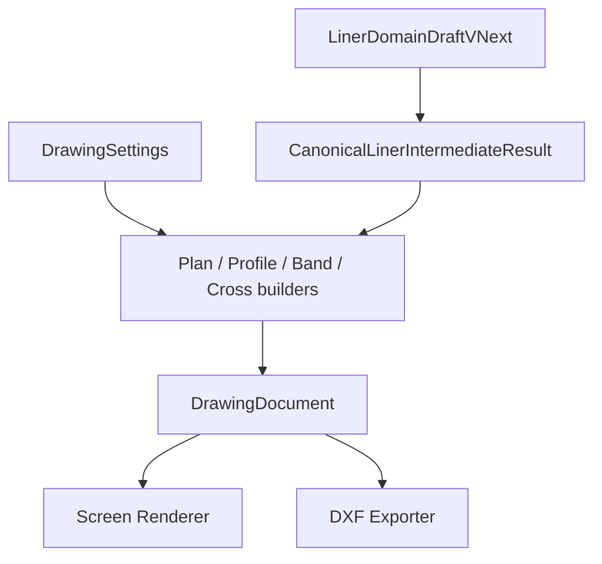

# Phase 5 - Liner Formal Drawing Design

> Status: `REDLINE_REMEDIATION_DESIGN`
> Date: 2026-07-13
> Redline: [redline_ui_and_drawing_remediation_design.md](redline_ui_and_drawing_remediation_design.md)
> Phase: Phase 5 / 第1編
> Readiness: `README.md` の `READY_WITH_OPEN_DECISIONS`
> This chapter covers screen plan/profile/band/cross-section + crossfall.
> Related docs: [README.md](README.md), [drawing_model_design.md](drawing_model_design.md), [crossfall_transition_design.md](crossfall_transition_design.md), [implementation_plan.md](implementation_plan.md), [formal_drawing_ui_design.md](formal_drawing_ui_design.md), [drawing_standard_preset_design.md](drawing_standard_preset_design.md), [dxf_export_design.md](dxf_export_design.md), [redline_ui_and_drawing_remediation_design.md](redline_ui_and_drawing_remediation_design.md), [../cad_output_spec.md](../cad_output_spec.md)

## 1. 確認済み事実

- `LinerDomainDraftVNext` は `alignment`, `stationDefinition`, `verticalAlignment`, `crossSections`, `gridDefinitions`, `measuredGrid?`, `spans`, `piers`, `crossBeams?`, `widthChangePoints?`, `generationSettings`, `sampling` を持つ。根拠: `frontend/src/liner/schema/types.ts:91`.
- `buildIntermediateResult()` は `CanonicalLinerIntermediateResult` を組み立て、`sourceRevision` を生成し、`grid`, `stations`, `spans`, `piers`, `dependencyGraph` をまとめる。根拠: `frontend/src/liner/core/pipeline/pipeline.ts:388`.
- `buildLinerPreviewFromDraft()` は既存 preview を残置しつつ、screen projection と diagnostics を組み立てている。根拠: `frontend/src/liner/adapters/linerPreviewAdapter.ts:83`.
- `mapToFrameModel()` は grid point / grid line / support から frame draft と `linerTrace` を生成する。根拠: `frontend/src/liner/mapper/frameModelMapper.ts:270`.
- crossfall は第2編の型仕様ではなく、第1編 Step2 の screen 保存・表示基盤として扱う。interval は station 依存回転状態、template elevation は基準横断形状（[redline_ui_and_drawing_remediation_design.md](redline_ui_and_drawing_remediation_design.md) §4）。
- `CrossSectionTemplateEditor` は legacy scalar から elevation を再計算し入力は readonly。根拠: `frontend/src/liner/components/CrossSectionTemplateEditor.tsx:50-58`, `:274-280`.
- formal plan/profile/band builders は基本 primitive のみ。情報帯・格子・band 正式行は未実装。根拠: `frontend/src/liner/drawing/builders/formalBuilders.ts`.

## 2. 提案

### 2.1 目的

第1編は、`screen plan/profile/band/cross-section + crossfall` を同じ図面意味論で扱うための完全実装方針を定める。
ここでの役割は、「何を図面として描くか」と「どの runtime 生成物を共有するか」を固定することである。

### 2.2 全体アーキテクチャ

図面入力は `LinerDomainDraftVNext` から `CanonicalLinerIntermediateResult` を生成し、そこに `DrawingSettings` を与えて runtime `DrawingDocument` を組み立てる。
`DrawingSettings` は canonical 計算入力ではない。
`DrawingDocument` は screen renderer と DXF Exporter の両方が読む runtime object である。

### 2.3 scope / non-scope

scope:

- screen plan の runtime 共通化
- profile / band の physicalDistance 結合
- cross-section の drawing runtime 共有
- crossfall の第1編内完全実装
- `DrawingSettings` の保存

non-scope:

- `DrawingDocument` の保存
- `package.json` / lockfile
- SXF 正式納品

### 2.4 implementation boundary

1. 図面は `LinerDomainDraftVNext` から `CanonicalLinerIntermediateResult` を経由した geometry と metadata のみを入力にする。
2. `DrawingSettings` は canonical 計算入力ではなく、runtime `DrawingDocument` 構築時の補助設定とする。
3. model は m、paper は mm、screen renderer は px を使う。
4. Y 反転は viewport の責務に閉じ込める。
5. profile / band は physicalDistance を主座標にし、band の physicalDistance は profile と同じ model 距離を参照する。
6. crossfall interval は回転状態のみ。template `offsetLines[].elevation` は手編集可能な基準横断形状とし、scalar による上書きを禁止する。
7. Final Z は `profileElevation + templateRelativeElevation + crossfallDeltaZ`（単一 pivot 回転、二重適用なし）。measured grid 優先時は Japanese diagnostic。
8. DXF / Step 3 PR2 scope は変更しない（未着手）。

### 2.5 実画面 acceptance criteria

- preview は既存入力で再現できる。
- plan/profile/band/cross-section は同一 `DrawingDocument` から生成できる。
- profile / band の順序は physicalDistance で安定する。
- screen と DXF は同じ図面意味論を共有する。
- `DrawingSettings` のみが永続化され、`DrawingDocument` は保存されない。
- crossfall は screen 4図で保存・表示・再生成の一貫性を持つ（Z 式は redline §4）。
- scalar cross-slope UI は setup から除去し、legacy migration のみ残す。
- plan は情報帯/枠、profile は格子・軸・縮尺、band は physicalDistance 整列の正式行を持つ（builder 提案）。
- plan 曲線可視性（DD-RC-01）: 幾何 viewport は直交 fit、サンプル polyline + 完全世界座標 bounds。
- テキスト可読性（DD-TR-01）: 図種別 `textHeightMm`、1366×768 / 1920×1080 の screen px clamp。
- 横断図中心線（DD-CS-01）: `offset=0` 補助 `DrawingLine`（screen のみ、domain 非影響）。

### 2.6 凍結設計決定（2026-07-14 追加）

read-only audit に基づき、次の 3 決定を第1編に凍結する。詳細は [redline_ui_and_drawing_remediation_design.md](redline_ui_and_drawing_remediation_design.md) §7.3 / §8.2 / §9、[drawing_model_design.md](drawing_model_design.md) §2.9–§2.11。

| ID | 項目 | 要点 |
| --- | --- | --- |
| DD-RC-01 | Plan curve visibility | `sampledPoints` → `DrawingPolyline`；世界座標 bounds；plan 幾何 = 直交 fit；arc/clothoid golden で clip 比 1.0 |
| DD-TR-01 | Text readability | 図種別 mm 下限 7；優先度 title > major > station > curve > aux；stagger / ellipsis；1366 min 8 px / 1920 min 10 px |
| DD-CS-01 | Cross-section centerline | `offset=0` 破線 `DrawingLine`、ラベル「中心線」/「CL」、domain 非影響、DXF scope 外 |

解像度別受入は AC-RD-11〜20（同 redline §12）。

## 3. Open Decision の参照先

Open Decision の詳細は `README.md` の集中管理表を正とし、各 ID を参照して扱う。
本編では次のみを確認済み / 提案 / OD 分離の前提として扱う。

- drawing graph の順序安定性
- label 重複時の優先順位
- band の省略条件
- section 標準高さの既定値
- DXF layer の命名規則
- measured precedence
- title / band rows
- scale / font / pivot

## 4. Manual Evidence

### 4.1 参照方針

マニュアルは参考資料として扱い、市販仕様の複製はしない。各記述は topic / fact / Phase5 示唆 / adopt / reject product-specific に分けて扱う。

### 4.2 Evidence 表

| Source | Page | Topic | Fact | Phase5 示唆 | Adopt | Reject product-specific |
| --- | --- | --- | --- | --- | --- | --- |
| `JIP-LINER_マニュアル.pdf` | p15 | PV / DXF | PV は GDRAW プロットと DXF のビューワ；PV から DXF 変換 | runtime 図面/出力境界 | 参照可 | 文言の転記はしない |
| `JIP-LINER_マニュアル.pdf` | p25-26 | GDRAW 自動 / 任意図面 | 自動図面と任意図面の区別 | 4図の生成責務分離 | 参照可 | 製品固有の命名は採用しない |
| `JIP-LINER_マニュアル.pdf` | p54-59 | 測点 | 測点データ・範囲・出力名称 | measured precedence / station 軸 | 参照可 | 手順の丸写しはしない |
| `JIP-LINER_マニュアル.pdf` | p60-63 | 縦断勾配 | 測点データ参照・クラウン高さ・VCL | profile 計画高責務 | 参照可 | 製品固有の構成は採用しない |
| `JIP-LINER_マニュアル.pdf` | p64-66 | 横断勾配 | 変化点ごとの測点・勾配・VCL | crossfall interval 責務 | 参照可 | 具体例の転記はしない |
| `JIP-LINER_マニュアル.pdf` | p67-72 | 断面高さ設定 | 縦断+横断参照・立ち上がり量・法線 | template relative elevation | 参照可 | 数値の複写はしない |
| `JIP-LINER_マニュアル.pdf` | p75-91 | 平面 / 交角 / 座標 / 寸法 | plan 系の基本要素 | plan 情報帯・寸法共通化 | 参照可 | 図表の転載はしない |
| `JIP-LINER_マニュアル.pdf` | p112-120 | line / section 順序 | 順序付けの説明 | drawing graph 順序安定性 | 参照可 | 製品の並びルールは採用しない |
| `JIP-LINER_マニュアル.pdf` | p27-28 | GCONVA / CAD layer | CAD layer への変換 | preset layer 設計 | 参照可 | GCONVA 後段は採用しない |
| `JIP-LINER_マニュアル.pdf` | p7 / p15 / p28 | SPACER 連動 | SPACER 連動言及 | 連携境界の把握 | 参照可 | 製品固有連動は採用しない |
| `SPACER操作マニュアル.pdf` | p4 | PV / DRAFT / DXF | TV / PV 節；DRAFT プロット・DXF ビューワ | runtime 生成物分類 | 参照可 | 製品固有 UI は採用しない |
| `SPACER操作マニュアル.pdf` | p15 | DRAFT 帳票 / PV | DRAFT 帳票(*.PR4)・PLOTFILE を PV 表示 | formal vs 帳票境界 | 参照可 | 名称の流用はしない |
| `SPACER操作マニュアル.pdf` | p36 | 節点座標 / OL2 | JIP-LINER OUTLINE 連動ファイル *.OL2 | outline 座標連携参考 | 参照可 | 名称の流用はしない |
| `SPACER操作マニュアル.pdf` | p129-155 | DRAFT 図面作成 | 6.6 図面作成（タイトル・描画部材・断面力図等） | drafting 流れ・band 行参考 | 参照可 | 作図手順の複製はしない |

### 4.3 参照の扱い

- これらの文書は設計判断の参考であり、製品仕様の写しではない。
- Phase5 では topic と fact のみを抽出し、製品固有の操作名や文面は採用しない。
- 不明点は README の Open Decision に戻す。

## 5. PR 順序

Step2 は PR1-7 で第1編を完全実装する。

- PR1: Common Drawing Model Foundation
- PR2: Crossfall model foundation
- PR3: Workspace and persistence gate
- PR4: Plan view
- PR5: Profile / band
- PR6: Cross-section
- PR7: Validation / migration / regression

Step3 は PR1-6 で第2編の DXF 実装を進める。

- PR1: DXF core
- PR2: Plan export
- PR3: Profile / band export
- PR4: Cross-section export
- PR5: Style / preset wiring
- PR6: CAD compatibility checks
