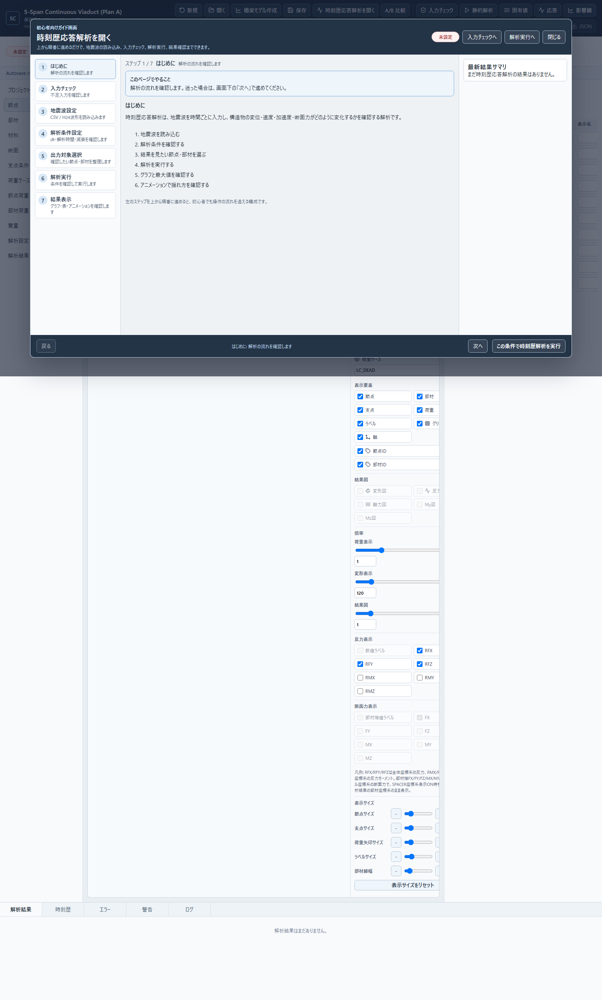
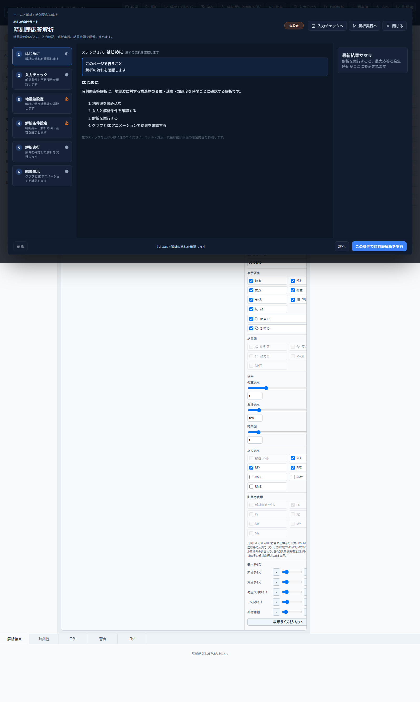
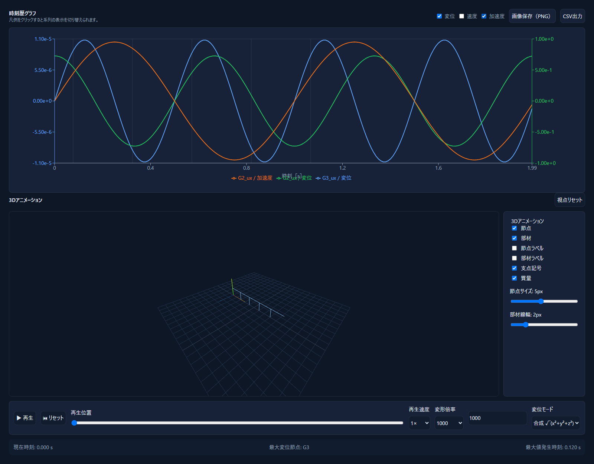

# 時刻歴応答解析ガイド UI 刷新

設計書: `docs/spec/th-analysis-revision-2026-06.md`

## 実装チェックリスト

- [x] ① UI/ビジュアル刷新
- [x] ② 入力チェック画面の不要ボタン削除
- [x] ③ 解析条件設定画面の刷新
- [x] ④ 出力対象選択ステップ廃止 + リダイレクト
- [x] ⑤ 時刻歴グラフのスケーリング修正
- [x] ⑥ 3D アニメーション復旧 (再生/シーク/速度/倍率/モード/表示要素/サイズ)
- [x] テスト追加 (Vitest / Playwright)
- [x] スクリーンショット添付
- [x] CHANGELOG 更新

## スクリーンショット

### Before

### After: ガイド

### After: グラフ / 3D アニメーション

## 判断ログ

- 設計書の「5ステップ」は列挙された項目が6件で、旧7ステップから「出力対象選択」だけを廃止すると6ステップになります。列挙内容と業務フローを優先し、6ステップで実装しました。
- リポジトリは pnpm ではなく npm と `package-lock.json` を使用しているため、品質ゲートは同等の `npm run lint` / `npm run typecheck` / `npm test` / `npm run test:e2e` で実行しました。
- SPAのクライアント遷移ではHTTPステータスを返せないため、Viteサーバーでは `/th/output-targets` をHTTP 301で `/th/run` に転送し、静的配布時はクライアント側でも同URLへ置換する二段構成にしました。
- 変位と加速度を同じY軸に載せると微小変位が再び潰れるため、物理量ごとに独立した `domain={["auto","auto"]}` のY軸を使用しました。
- 解析エンジン、API契約、入力スキーマ、前段のモデル入力画面は変更していません。

## 検証

- `npm run lint`
- `npm run typecheck`
- `npm test` (397 tests)
- `npm run test:e2e` (5 tests)
