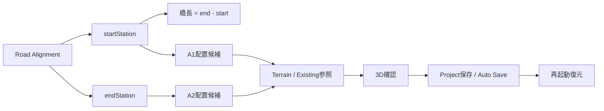

# Phase 4-02 橋梁区間設定（Bridge Range Setting）

## 概要

Phase 4-A で確定した `BridgeLayoutDocument` を唯一の正本とし、
Road Alignment 上でユーザーが**橋梁開始測点（startStation）・終了測点（endStation）**を
設定すると、**橋長**と**A1/A2配置候補**が自動生成され、
Terrain + Road + Existing 上で3D確認でき、Project保存・Auto Save・再起動復元まで成立する。

## 責任境界

- **正本**: `BridgeLayoutDocument`（schema 0.1.0）
- **参照のみ**: Road / Terrain / Existing（正本を複製しない。ID/referenceで接続）
- **A1/A2**: 橋梁端部の配置点 / 配置線 / downstream handoff用の最小配置情報。
  橋台躯体寸法・パラペット・翼壁・基礎・杭・詳細CIM・構造照査は Phase 4-02 対象外。
- **station体系**: Road Module の physical distance [m]（origin 0・equation なし）を正式定義。

## 座標・skew規約

- domain XYZ: X=道路軸 / Y=横断 / Z=標高（metric）
- three.x = domain.x / three.y = domain.z / three.z = -domain.y（共通 `renderCoordinate`）
- skew: **反時計回り正**（counterclockwise-positive）を唯一の規約とし、
  旧資産の別符号規約は混入させない（必要時はAdapter境界で変換）。

## 実装モジュール

### bridgeLayout/bridgeLayoutTypes.ts（拡張・非破壊）
- `BridgeRange.bridgeLength?`: 自動算出スナップショット（正式値は常に end - start）
- `AbutmentPlacement.placement?`: A1/A2配置候補スナップショット
  （domainX/Y・elevation・tangentAzimuthRad・terrainElevation・roadReferenceId・coordinateContextId・capturedAt）

### bridgeLayout/bridgeLayoutDomain.ts（Step A）
- `readRoadAlignmentContext`: Road Module正式データ参照（fail-closed・正本複製なし）
- `buildRoadAlignmentContextFromInputs`: RoadInputs→context
- `computeBridgeLength` = end - start
- `validateBridgeRangeInput`: finite / NaN reject / Infinity reject / start<end /
  alignment範囲内 / road・alignment reference有効
- `buildBridgeLayoutFromRange`: 測点→BridgeLayoutDocument（roadReference解決・A1/A2 station設定）
- `applyBridgeRangeToDocument`: 測点変更時の橋長・A1/A2再計算

### bridgeLayout/bridgeLayoutPlacement.ts（Step B）
- `computeAbutmentPlacementCandidate`: station→XYZ/標高/接線方向（Road Module正式API委譲）
- `lookupTerrainElevation`: `getGridElevation` 相当（TIN外・gridなしはnull）
- `getProjectTerrainGrid`: Project地形サーフェス参照
- `computeBridgeRangeBBox` / `isExistingNearRange`（線分-bbox交差判定）/ `collectExistingNearRange`
- `assembleBridgeLayoutView`: UI/3D用ビューモデル（候補・Terrain elevation/diff・Existing近傍・validation）

### bridgeLayout/bridgeLayoutScene.ts + BridgeLayoutSceneViewer（Step C）
- Terrain + Road + Existing + **Bridge Range**（オレンジ強調ライン + transparent envelope）+
  **A1/A2 marker**（緑/青 + label sprite）を単一render座標系で描画
- Bridge Range centerline は Road と同一 alignment からサンプリング（A1/A2がRoadからずれない）

### BridgeLayoutModuleShellPage（Step C・F）
- 橋梁名 / Road / Alignment / startStation / endStation / bridgeLength（自動算出）/
  validation / A1/A2情報 / Terrain参照状態 / Existing参照状態 / 保存（Auto Save）/ 3D表示
- Road Module未設定時は Reference Mountain プレビュー（fail-closedで保存不可）

### Persistence（Step D）
- `writeBridgeLayoutDocument` → Project Data Core（既存責任境界）→ Auto Save
- `.spacerproj`（buildProjectPackage）は Project JSON 全体を保持し bridgeLayout を round-trip
- 再起動復元: `restoreFromPersistence` で Bridge Range / bridgeLength / A1/A2 復元

## 必須validation

| 項目 | 内容 |
|---|---|
| finite number | NaN / Infinity reject |
| startStation < endStation | == も reject |
| alignment範囲内 | 0 ≤ station ≤ totalLength |
| roadReference | moduleId=road + alignmentId解決（fail-closed） |
| alignmentReference | 未保存段階でも現在のRoad Alignmentへ解決可能なら有効 |
| bridgeLength | 存在時は end - start と一致（不一致 reject） |
| placement | finite・roadReferenceId必須・terrainElevation finite-or-null |

## テスト

- bridgeLayoutDomain.test.ts: Road reference / Bridge Range / 橋長 / build / 再計算
- bridgeLayoutPlacement.test.ts: A1/A2 XYZ・elevation・tangent・Terrain参照・Existing近傍・validation
- bridgeLayoutScene.test.ts: 水平Terrain・Bridge Range/A1/A2一致・renderCoordinate整合
- bridgeLayoutUi.test.tsx: 入力画面・橋長自動算出・保存&A1/A2 placement・fail-closed・3Dトグル
- bridgeLayoutPersistence.test.ts（実FS）: save→restart→restore / .spacerproj export→import / 既存Project regression / 不正document非永続化
- bridgeLayoutValidation.test.ts: robustness（malformed入力でthrowしない）・bridgeLength・placement round-trip

## 証跡（screenshot / Luna目視）

- `evidence/p4-02-01-bridge-layout-input.png`（入力画面）
- `evidence/p4-02-02-bridge-layout-3d-full.png`（3D全景）
- `evidence/p4-02-03-bridge-layout-viewer-terrain-existing.png`（Terrain+Existing+Bridge Range）
- `evidence/p4-02-04-restart-restore.png`（再起動復元後）

Luna（Codex GPT-5.6, read-only sandbox）目視判定: **総合 PASS**
（WebGL描画・Terrain水平・Road姿勢・Bridge Range位置・A1/A2位置・Existing位置関係・再起動復元）
