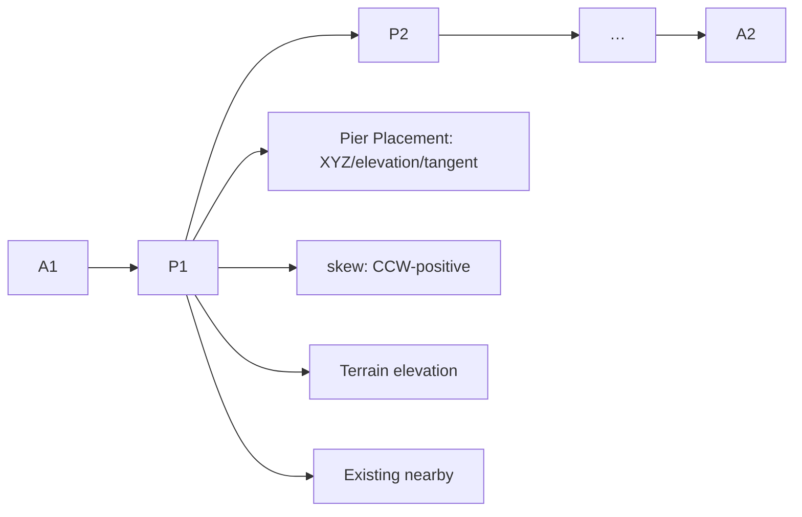

# Phase 4-03 橋脚配置・支間割（Pier Placement / Span Layout）

## 概要

Phase 4-02 で確定した橋梁区間 `A1 ───── A2` の内部に、
`A1 ─ P1 ─ P2 ─ … ─ Pn ─ A2` として P1..Pn 橋脚配置候補と支間割を設定する。

`BridgeLayoutDocument` を唯一の正本とし、Road / Terrain / Existing 参照、
3D確認、Project保存、Auto Save、再起動復元まで成立させる。

## 責任境界

- **正本**: `BridgeLayoutDocument`（schema 0.1.0）の `piers` / `spans` / `skew`
- **参照のみ**: Road / Terrain / Existing（正本を複製しない）
- **P1..Pn**: 橋脚の配置候補（配置点 / 配置線 / downstream handoff用）。
  橋脚柱詳細・梁・壁式・フーチング・杭・基礎設計・耐震設計は後続Phase対象外。
- **station体系**: Road Module の physical distance [m]（Phase 4-02と同一）
- **skew**: **反時計回り正（counterclockwise-positive）** を唯一の規約。
  `skewSource: automatic（道路直角の自動初期候補）| user（ユーザー指定）`

## 実装モジュール

### bridgeLayout/bridgeLayoutTypes.ts（拡張・非破壊）
- `PierPlacementCandidate extends AbutmentPlacementCandidate`
- `PierPlacement` 拡張: `label?` / `placement?` / `skewSource?` / `metadata?`
- `SkewSource = "automatic" | "user"`

### bridgeLayout/bridgeLayoutPiers.ts（Step A）
- `listOrderedSupports`: A1, P1..Pn, A2 を station 順に整列（span生成・UI表示用）
- `nextPierId`: P1, P2, … の採番
- `addPier` / `removePier` / `updatePierStation` / `updatePierSkew`
- `validatePierConfiguration`:
  - pierId 必須 / 重複禁止 / finite station（NaN/Infinity reject）
  - station 重複 reject / A1 < P1 < … < Pn < A2 順序 / Bridge Range 外 reject

### bridgeLayout/bridgeLayoutPlacement.ts（Step B・C）
- `computePierPlacementCandidate`: station→XYZ / elevation / tangent（Road Module正式API委譲）
- `defaultAutomaticSkew(tangent)`: 道路直角 = tangent + PI/2（CCW・(-PI,PI]正規化）
- `refreshPierPlacements`: 全Pier placement 再計算 + Terrain elevation + skewSource 反映
- `computePierRangeBBox`: Pier単独周辺 bbox（Existing参照用）
- `assembleBridgeLayoutView` 拡張: `pierCandidates`（P1..Pn候補・skew・Terrain elevation/diff・周辺Existing）と `spans` を返す

### bridgeLayout/bridgeLayoutSpans.ts（Step B）
- `generateSpans`: A1-P1 / P1-P2 / … / Pn-A2 を自動生成
  - spanId / index / startSupportId / endSupportId / startStation / endStation / length
  - length = endStation - startStation（>0 検証）
  - derived span はユーザーが直接正本編集しない（常に再生成）
- `validateSpanConfiguration`:
  - length > 0 / supports順序と一致（chain）/ 全span合計 = bridgeLength
- `describeSpans`: span 一覧表示

### bridgeLayout/bridgeLayoutScene.ts + BridgeLayoutSceneViewer（Step D）
- P1..Pn marker（配置確認用・詳細橋脚モデルではない）
- skew指示線（黄色・反時計回り正・道路直角から skewAngleRad 回転）
- span label（S1..Sn・支間中点）
- `focusBounds`: 橋梁焦点 box で camera framing（Terrain全域ではなく橋周辺を表示）

### BridgeLayoutModuleShellPage（Step D・G）
- Supports一覧（A1 / P1..Pn / A2）
- Pier編集: 追加（最大ギャップ中点を初期station）/ 削除 / station編集 / skew編集（空欄=自動）
- Pier情報: station / XYZ / elevation / terrain elevation / skew / 周辺Existing
- Span一覧（自動生成・直接編集不可）
- サマリー: bridgeLength / pier count / span count / span total / validation / save state
- 保存時: refreshPierPlacements + generateSpans + validatePierConfiguration / validateSpanConfiguration

## 必須validation

| 項目 | 内容 |
|---|---|
| pierId | 必須・重複禁止 |
| station | finite（NaN/Infinity reject）・重複 reject |
| 順序 | A1 < P1 < P2 < … < Pn < A2 |
| 範囲 | 各Pierは A1..A2 の橋梁区間内 |
| skew | finite or null・CCW-positive・source=automatic/user |
| span | length > 0・chain一致・合計 = bridgeLength |

## テスト

- bridgeLayoutPiers.test.ts: 0/1/複数Pier・dup ID/station・NaN/Infinity・範囲外・順序・skew
- bridgeLayoutSpans.test.ts: span自動生成・length合計・追加/削除/移動再生成・chain・placement・automatic skew
- bridgeLayoutPierTerrainExisting.test.ts: 候補XYZ/tangent・Terrain elevation/diff・missing/TIN外warning・周辺Existing・station変更再計算
- bridgeLayoutScene.test.ts: Pier marker位置一致・skew線・span label・座標系整合・focusBounds
- bridgeLayoutPierUi.test.tsx: Pier編集・span一覧・保存復元・ordering validation・3D
- bridgeLayoutPierPersistence.test.ts（実FS）: save→restart→restore / .spacerproj round-trip / 不正配置非永続化

## 証跡（screenshot / Luna目視）

- `evidence/p4-03-01-bridge-layout-pier-edit.png`（編集画面）
- `evidence/p4-03-02-bridge-layout-3d-full.png`（3D全景・橋梁焦点framing）
- `evidence/p4-03-03-bridge-layout-viewer-terrain-existing.png`（Viewport近景・Pier/span/skew/Existing）
- `evidence/p4-03-04-restart-restore.png`（再起動復元後）

Luna（Codex GPT-5.6, read-only sandbox）目視判定: **総合 PASS**
（P1/P2がRoad上に正しく並ぶ・A1<P1<P2<A2順序・span/skew表示・Terrain水平・
河川/既設道路/鉄道/地下管路との位置関係・camera framing・再起動復元）
