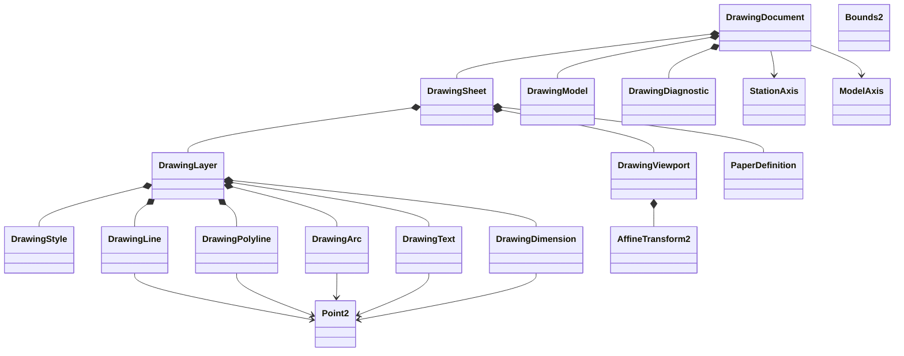
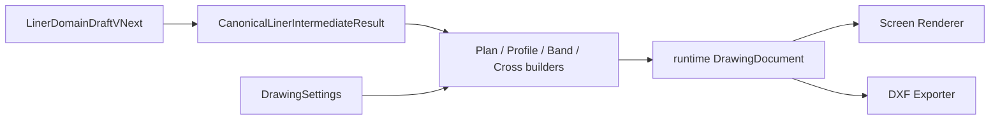
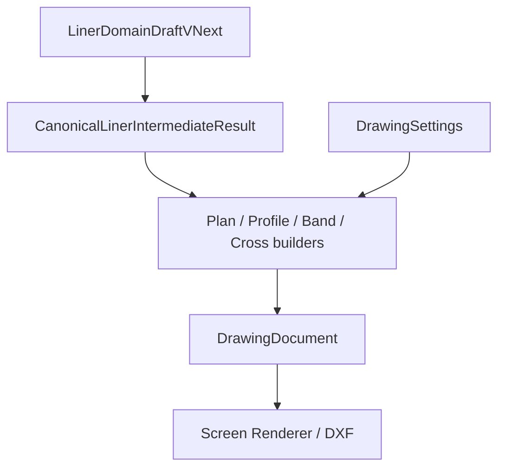

# Drawing Model Design

<!-- DOC-AUTHORITY:START -->
> **Authority:** ACTIVE REFERENCE
> Current implementation facts are governed by [`../../scoping/stage4_road_design_scope.md`](../../scoping/stage4_road_design_scope.md). Target ownership and contracts are governed by [`../../planning/stage6-10/README.md`](../../planning/stage6-10/README.md); `RoadDesignDocument` is the target road source of truth.
<!-- DOC-AUTHORITY:END -->

> Status: `REDLINE_REMEDIATION_DESIGN`
> Date: 2026-07-13
> Redline: [redline_ui_and_drawing_remediation_design.md](redline_ui_and_drawing_remediation_design.md)
> Phase: Phase 5 / 第1編補遺
> Readiness: `README.md` の `READY_WITH_OPEN_DECISIONS`
> Related docs: [README.md](../../history/road/phase5/README.md), [phase5_liner_formal_drawing_design.md](phase5_liner_formal_drawing_design.md), [formal_drawing_ui_design.md](formal_drawing_ui_design.md), [dxf_export_design.md](dxf_export_design.md), [drawing_standard_preset_design.md](drawing_standard_preset_design.md), [redline_ui_and_drawing_remediation_design.md](redline_ui_and_drawing_remediation_design.md)

## 1. 確認済み事実

- `CanonicalLinerIntermediateResult` は `horizontal`, `vertical`, `stations`, `grid`, `spans`, `piers`, `frameHints`, `sections`, `diagnostics`, `dependencyGraph` を持つ。根拠: `frontend/src/liner/core/types.ts:433`.
- `GridPointResult` は `physicalDistance`, `displayedStation`, `offset`, `x`, `y`, `z`, `localFrame`, `labels`, `source`, `roles`, `zProvenance` を持つ。根拠: `frontend/src/liner/core/types.ts:297`.
- `buildGridResult()` は grid point と line/cell を canonical に整列している。根拠: `frontend/src/liner/core/pipeline/pipeline.ts:268`.
- `generateMeasuredGridPoints()` は measured grid を優先し、`station` と `cumulativeWidth` を保持する。根拠: `frontend/src/liner/core/grid/measuredGridGeneration.ts:104`.
- `createPlanDrawingBuilder()` / `createProfileDrawingBuilder()` は centerline・grid・station text 等の基本 primitive のみ生成する。根拠: `frontend/src/liner/drawing/builders/formalBuilders.ts:191-224`, `:311-397`.
- `DrawingDocumentSvg` は `DrawingDocument` のみを描画し、canonical 再計算や draft 変更を行わない。根拠: `frontend/src/liner/drawing/rendering/DrawingDocumentSvg.tsx`.
- `generateGridPoints()` は template `offsetLine.elevation` を Z に加算していない（redline RL-02）。根拠: `frontend/src/liner/core/grid/gridGeneration.ts:125-126`.

## 2. 提案

### 2.1 canonical flow

`LinerDomainDraftVNext` から `CanonicalLinerIntermediateResult` を生成し、`DrawingSettings` を添えて runtime `DrawingDocument` に落として screen / DXF へ流す。
`DrawingSettings` は canonical 計算入力ではない。
`DrawingDocument` は保存しない。

### 2.2 指定型名

この設計で使う型名は次に固定する。

- `DrawingDocument`
- `DrawingSheet`
- `DrawingViewport`
- `DrawingLayer`
- `DrawingStyle`
- `DrawingModel`
- `DrawingLine`
- `DrawingPolyline`
- `DrawingArc`
- `DrawingText`
- `DrawingDimension`
- `Point2`
- `Bounds2`
- `AffineTransform2`
- `PaperDefinition`
- `DrawingDiagnostic`
- `StationAxis`
- `ModelAxis`

### 2.3 class diagram

### 2.4 dataflow

### 2.5 model / paper / viewport

model は m、paper は mm、screen は px とする。
viewport は Y 反転を担当し、`AffineTransform2` を使って model 座標を screen 座標へ写像する。
`StationAxis` は model 側の単調増加軸であり、viewport 反転の影響を受けない。
`ModelAxis` は screen と DXF の common source であり、non-persistence とする。

### 2.6 profile-band physicalDistance

profile / band は physicalDistance を主キーとし、band 側も physicalDistance を model distance として保持する。
station 表示は補助であり、配列順や描画順の正規化は physicalDistance に従う。

### 2.7 保存境界

保存するのは `DrawingSettings` のみである。
`DrawingDocument` は runtime artifact であり、project 保存や sourceRevision の永続化対象にしない。
`CanonicalLinerIntermediateResult` は保存モデルではなく、計算結果として再生成する。
`Plan / Profile / CrossSection / Band builders` は保存境界の外側に置く。

### 2.8 builder–renderer 境界

| 層 | 責務 | 禁止 |
| --- | --- | --- |
| Builders (`formalBuilders.ts`) | `CanonicalLinerIntermediateResult` + `DrawingSettings` → `DrawingDocument` primitives / viewports / diagnostics | DOM・React・draft 直接描画 |
| Renderer (`DrawingDocumentSvg`) | `DrawingDocument` → SVG | canonical 再計算・Z 式の再実装 |
| DXF exporter (Step 3) | `DrawingDocument` → DXF | **scope 変更なし**；PR2 未着手 |

**提案（redline §6–7）:** plan 情報帯、profile 格子・軸・縮尺注記、band 正式行はすべて builder が primitive として追加し、renderer は変更しない。

### 2.9 plan 曲線可視性 — viewport fit 分離（凍結決定 DD-RC-01）

read-only audit（2026-07-14）により、plan 幾何が profile/band 用の縦断 fit を流用すると曲線が clip 外に落ちることが確認された。以下を **凍結** する。

| 項目 | 凍結決定 |
| --- | --- |
| 曲線 primitive | `DrawingPolyline`（`id`: `plan-centerline` 等）。入力は `CanonicalLinerIntermediateResult.horizontal.sampledPoints`（`pipeline` の `sampleDisplay()` 由来） |
| 曲線注記入力 | `horizontal.segments`（`arc` / `clothoid` / `straight`）から半径・緩和長等の `DrawingText` を生成。primitive 自体は polyline サンプリングで足りる |
| 完全 model bounds | plan **幾何** viewport の bounds は **世界座標 (x, y) m** の union とする。含める対象: 中心線 polyline、オフセット線、grid 線、測点 tick、曲線注記 anchor。`longitudinalFitBounds`（chainage 軸 X のみ）は **plan 幾何に使わない** |
| fit 責務 | plan 幾何 viewport → **直交 fit**（`fitTransform` / `fitTransformPlan` 相当）。profile / band viewport → **縦断 fit**（`fitTransformLongitudinal` + `horizontalScaleMmPerMeter`）。同一 sheet 内でも viewport ごとに fit 方式を分離する |
| clipping 責務 | renderer（`DrawingDocumentSvg`）が `viewport.paperBounds` を `<clipPath>` に用いる。CSS `overflow: hidden` は二次的制約 |
| 大座標 | domain 座標の正規化は canonical 計算の責務外。builder が plan レイヤ全点から model bounds を集約し、viewport fit が paper へ写像する |
| 数値検証（受入） | golden fixture（例: arc R=50 m L=80 m、clothoid L=60 m）で、変換後 `plan-centerline` の **全サンプル点** が `plan-viewport.paperBounds` 内（clip 比 = 1.0）。直線 100 m fixture は回帰維持 |

`DrawingArc` entity への分割は screen 可視性の必須条件としない（サンプル密度が十分なら polyline で可）。

### 2.10 テキスト可読性 — model / paper / screen 境界（凍結決定 DD-TR-01）

| 層 | 責務 |
| --- | --- |
| Builder / preset | 図種別 `textHeightMm`（paper mm）を `DrawingSettings` / `FORMAL_DRAWING_LAYOUT` 定数で固定 |
| Viewport | model → paper への幾何写像。テキスト anchor は paper または model の `coordinateSpace` で明示 |
| Renderer | `primitive.heightMm` を viewBox 上の `font-size` として描画。screen px は canvas fit scale の結果 |
| Screen clamp | workspace canvas fit 後の **screen px** に対し、図種共通の min / max px clamp を renderer または layout 境界で適用（下表） |

図種別 paper 文字高（mm、下限は `minReadableTextHeightMm = 7`）:

| 図種 / 用途 | 定数名（候補） | 凍結値 |
| --- | --- | --- |
| plan 幾何注記（測点・曲線） | `planAnnotationTextHeightMm` | **≥ 7**（現行 6.5 は不適合） |
| plan 方位・縮尺 | `planNorthTextHeightMm` | 10 |
| plan 帯 値 | `bandValueTextHeightMm` | 7 |
| plan 帯 ラベル | `bandLabelTextHeightMm` | 8 |
| profile 幾何注記 | `profileAnnotationTextHeightMm` | 7 |
| profile 帯 | 上記 band 定数 | 7 / 8 |
| cross-section タイトル・点注記 | layout 定数化 | **≥ 7**（model 座標直書き 2.2–3.2 mm は不適合） |

screen px clamp（canvas fit 後）:

| 解像度 | min px（一般注記） | min px（タイトル・主要点） | max px |
| --- | --- | --- | --- |
| **1366×768** | 8 | 10 | 24 |
| **1920×1080** | 10 | 12 | 28 |

表示優先度（高 → 低）: **タイトル** > **主要点**（交点・PI 等）> **測点** > **曲線情報**（R・緩和）> **補助**（grid 補助・凡例）。

衝突・密度: 測点ラベルは同一 paper Y への重ね置きを禁止し、index による **stagger** または間引きを適用。帯セルは `planRowHeightMm` / `profileRowHeightMm` ≥ 値文字高 + 2 mm。溢れは **ellipsis**（`…`）で省略し aux から落とす。

### 2.11 横断図中心線 — 補助 primitive（凍結決定 DD-CS-01）

| 項目 | 凍結決定 |
| --- | --- |
| primitive | `DrawingLine`（`offset = 0` の鉛直補助線）。`SectionSliceResult` の Z 範囲（または polyline Z 範囲 + padding）を端点とする |
| layer / style | 専用 layer（例: `cross-section-centerline`）。線種は **破線**（`strokeDasharray`）。幾何 polyline より細い `geometryStrokeWidthMm`  tier |
| ラベル | 日本語 **中心線** または略記 **CL**（`DrawingText`、aux 優先度） |
| domain 影響 | **なし**。crossfall・template `elevation`・相対標高計算・grid Z には参加しない |
| 保存 | `DrawingDocument` runtime のみ。draft / `CanonicalLinerIntermediateResult` には書き込まない |
| DXF scope | **Step 2 screen のみ**。Step 3 cross-section export の既定 entity には含めない（別 OD で明示決定するまで） |

### 2.12 Step3 保留 entity

Step3 では次の entity を保留し、`DrawingDocument` からの移行を急がない。

- 既存 preview view model
- 既存 frame 連携用 adapter
- band の legacy layout helper
- section の legacy annotation helper
- DXF 向け style preset bridge
- page split / diagnostics の旧 UI glue

## 3. 総合イメージ

