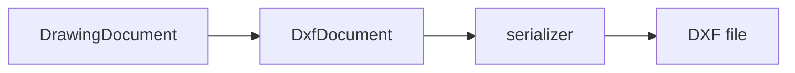

# DXF Export Design

<!-- DOC-AUTHORITY:START -->
> **Authority:** ACTIVE REFERENCE
> Current implementation facts are governed by [`../../scoping/stage4_road_design_scope.md`](../../scoping/stage4_road_design_scope.md). Target ownership and contracts are governed by [`../../planning/stage6-10/README.md`](../../planning/stage6-10/README.md); `RoadDesignDocument` is the target road source of truth.
<!-- DOC-AUTHORITY:END -->

> Status: `STEP3_IMPLEMENTING`
> Date: 2026-07-14
> Phase: Phase 5 / Step 3
> Readiness: `README.md` の `READY_WITH_OPEN_DECISIONS`
> Implementation: [step3_complete_dxf_implementation.md](../../history/road/phase5/step3_complete_dxf_implementation.md)
> Related docs: [README.md](../../history/road/phase5/README.md), [drawing_model_design.md](drawing_model_design.md), [phase5_liner_formal_drawing_design.md](phase5_liner_formal_drawing_design.md), [formal_drawing_ui_design.md](formal_drawing_ui_design.md), [../cad_output_spec.md](cad_output_spec.md), [../intermediate_result_model.md](../design/intermediate_result_model.md)

## 1. 確認済み事実

- plan の実証値は `3873B` で `LINE60` まで到達している。根拠: `frontend/src/liner/...` の plan 実証ログ相当の検証メモ。
- profile の実証値は `12574B` で `LINE201` まで到達している。根拠: 同上の profile 実証メモ。
- cross-section の実証値は `615B` で `LINE4` まで到達している。根拠: 同上の cross 実証メモ。
- 日本語 `TEXT` の parse を含む offscreen LibreCAD 検証は成功したが、CAD 目視確認は未完である。
- `Maker.js` は linework helper として利用候補に入るが、正式 DXF serializer の代替ではない。
- DXF は SXF 正式納品ではなく、CAD 補助出力として扱う必要がある。
- screen と DXF は `DrawingDocument` を共通 source とし、model-paper-screen の後段変換として扱う。根拠: `frontend/src/liner/core/types.ts:433`.
- import に関する追加文言は置かない。

## 2. 提案

### 2.1 変換パイプライン

DXF 出力は `DrawingDocument` を唯一の起点とし、次の段で構成する。

1. `DrawingDocument` を `DxfDocument` に変換する
2. `DxfDocument` を serializer で DXF 文字列に落とす
3. 生成物を plan / profile / cross-section ごとに分岐する

### 2.2 実装境界

- `DrawingDocument`: screen と共有する runtime 図面モデル
- `DxfDocument`: DXF 専用の中間表現
- `serializer`: DXF 文法と version / codepage を担当
- `Maker.js`: helper であり、正式 writer ではない

### 2.3 必須ヘッダ

DXF 生成では少なくとも次を明示する。

- `ACADVER`
- `DWGCODEPAGE`
- `TABLES`
- `BLOCKS`
- `ENTITIES`

### 2.4 単位と精度

- model 単位は m
- DXF の paper/style 由来値は mm 基準
- serializer では export-time rounding を適用する
- precision は plan / profile / cross-section で共通化する
- version / codepage / model-paper の扱いは README の OD 参照を正とする。

### 2.5 Entity 方針

Step 3 必須（実装済み / 実装対象）。

- `LINE`
- `LWPOLYLINE`
- `ARC`
- `CIRCLE`
- `TEXT`
- `TABLES` / `BLOCKS` / `ENTITIES` / `EOF`
- `DrawingDimension` → LINE + TEXT 分解（native `DIMENSION` は必須でない）

将来候補（今回必須でない）。

- `MTEXT`
- `HATCH`
- native `DIMENSION`
- `SPLINE`
- `LEADER`
- custom annotative entity
- full 3D solid / mesh

### 2.5.1 Version / code page / units（Step 3 pin）

- `$ACADVER` = `AC1021`
- `$DWGCODEPAGE` = `UTF-8`
- `$INSUNITS` = meters
- `$MEASUREMENT` = metric
- 日本語 TEXT は UTF-8 round-trip を優先
- LibreCAD open 検証を自動 gate とし、ユーザー目視は merge 後

### 2.6 日本語 TEXT

日本語文字列は parser / serializer 双方で round-trip を壊さないことを優先する。CAD 側の表示差は許容しつつ、少なくとも文字化け回避のため codepage の扱いを固定する。
目視確認は LibreCAD / QCAD / AutoCAD の順に扱い、parser の offscreen 成功を screen parity の下限とする。

### 2.7 3図の扱い

- plan は線形と注記を中心に出す
- profile は縦断帯と station 注記を出す
- cross-section は断面線と寸法注記を出す

3 図は同一 serializer を使うが、レイヤ構成と entity set は分ける。

## 3. Open Decision

All rows below remain **OPEN**. Owner is the Road DXF/output owner with drawing/report QA; decision
gate is Stage 8 `O8` evidence and Stage 10 `G6` / Phase P6 before release. Recommended initial values
are not accepted Stage 6-10 decisions.

| ID | 論点 | 未決理由 | 推奨初期値 |
| --- | --- | --- | --- |
| OD-DXF-01 | lineweight の丸め | CAD 表示差を安定化したい | export-time nearest step |
| OD-DXF-02 | layer 命名 | 互換性と可読性を両立したい | semantic ASCII |
| OD-DXF-03 | 日本語 TEXT の既定 font | 目視確認が未完 | fallback + codepage pin |
| OD-DXF-04 | Maker.js 採用範囲 | helper か core かを切り分けたい | helper only |
| OD-DXF-05 | 目視確認 gate | 自動検証だけでは足りない | manual LibreCAD review |
| OD-DXF-06 | Step 3 start condition | Step 2 完了前着手を防ぎたい | Step 2 exit gates all green |

## 4. Acceptance Criteria

- `DrawingDocument -> DxfDocument -> serializer` が一本化される
- plan / profile / cross-section を個別出力できる
- `ACADVER`, `DWGCODEPAGE`, `TABLES`, `BLOCKS`, `ENTITIES` が出る
- 日本語 `TEXT` が parser で壊れない
- SXF 正式納品ではない旨を文書化する
