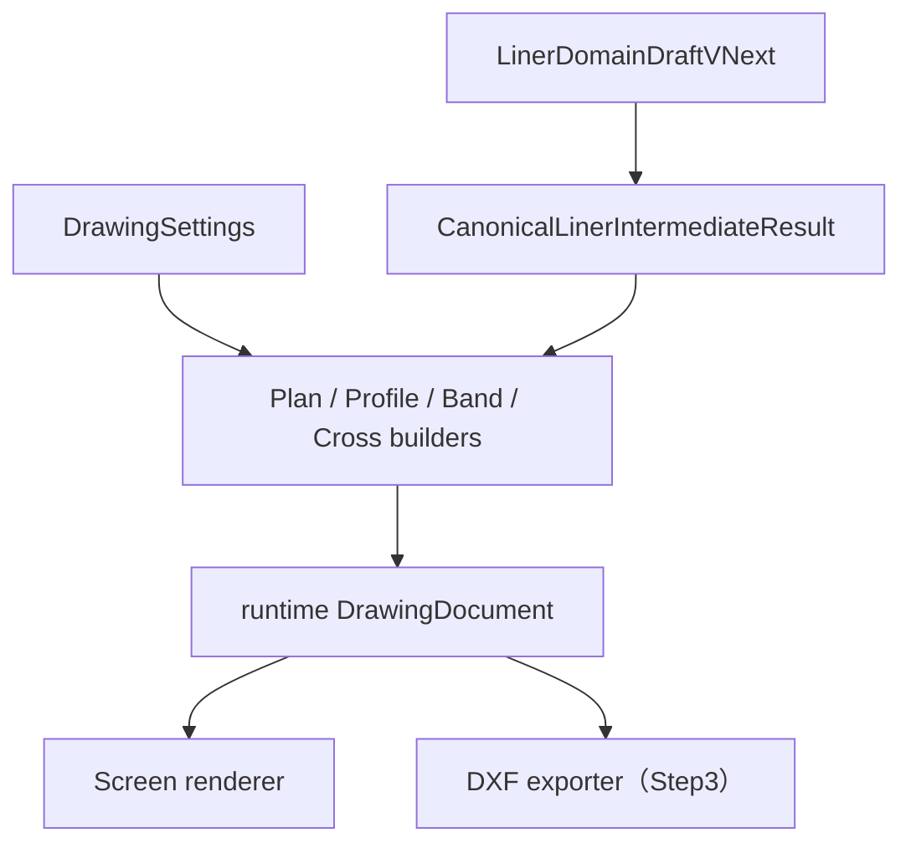

# Phase 5 Redline — UI と図面構成の是正設計

<!-- DOC-AUTHORITY:START -->
> **Authority:** ACTIVE REFERENCE
> Current implementation facts are governed by [`../../scoping/stage4_road_design_scope.md`](../../scoping/stage4_road_design_scope.md). Target ownership and contracts are governed by [`../../planning/stage6-10/README.md`](../../planning/stage6-10/README.md); `RoadDesignDocument` is the target road source of truth.
<!-- DOC-AUTHORITY:END -->

> Status: `REDLINE_REMEDIATION_DESIGN`
> Date: 2026-07-13
> Phase: Phase 5 / 第1編 Step2 是正（Stage 2 documents only）
> 関連: [README.md](../../history/road/phase5/README.md), [phase5_liner_formal_drawing_design.md](phase5_liner_formal_drawing_design.md), [drawing_model_design.md](drawing_model_design.md), [crossfall_transition_design.md](../design/crossfall_transition_design.md), [formal_drawing_ui_design.md](formal_drawing_ui_design.md), [implementation_plan.md](../../history/road/phase5/implementation_plan.md), [dxf_export_design.md](dxf_export_design.md)

## 1. 目的

本書は Phase 5 第1編の **Redline Stage 2** として、横断テンプレート幾何・横断勾配区間・正式図面 UI・図面構成の未解決点を凍結する。
製品コード・テスト・スキーマ・DXF core は本書の直接変更対象としない。実装は [implementation_plan.md](../../history/road/phase5/implementation_plan.md) の Step2 PR 順に従う。**DXF 出力 scope は不変。Step 3 PR2（Plan export）は未着手。**

## 2. Redline list

| ID | 論点 | 区分 | 参照 |
| --- | --- | --- | --- |
| RL-01 | template elevation が scalar から上書き・readonly | 事実 | §4 |
| RL-02 | Z が template elevation 未加算 | 事実 | §5.2 |
| RL-03 | scalar UI と interval UI 併存（Scalar UI removal 対象） | 事実 | §5.4 |
| RL-04 | interval エディタ英語ラベル | 事実 | §6 |
| RL-05 | measured grid 日本語 diagnostic 未整備 | 事実 | §5.3 |
| RL-06 | plan 情報帯・上下構成不足 | 提案 | §7 |
| RL-07 | profile 格子・軸・datum・band 正式行不足 | 提案 | §8 |
| RL-08 | 1366×768 interval 横スクロール | 事実 | §6.3 |
| RL-09 | plan 曲線（arc/clothoid）が clip 外 | 事実 | §7.3 |
| RL-10 | テキスト可読性・衝突（1366 / 1920） | 事実 | §9 |
| RL-11 | 横断図 offset=0 中心線欠落 | 事実 | §8.2 |

## 3. 確認済み事実（現行実装の観測）

- `offsetLines[].elevation` は schema 上は保持されるが、`linerUiAdapter.ts` の `syncTemplateOffsetElevations` と `CrossSectionTemplateEditor` の `withComputedElevations` が legacy scalar `crossSlope.valuePercent` から elevation を再計算し上書きしている。根拠: `frontend/src/liner/adapters/linerUiAdapter.ts:109`, `frontend/src/liner/components/CrossSectionTemplateEditor.tsx:50`.
- 横断テンプレート UI の elevation 入力は `readOnly` で、ユーザーが手入力できない。根拠: `frontend/src/liner/components/CrossSectionTemplateEditor.tsx:274`.
- parametric grid の Z は `profileElevation + crossfallOffset` のみで、`offsetLine.elevation` は加算されていない。根拠: `frontend/src/liner/core/grid/gridGeneration.ts:126`.
- `SuperelevationEditor`（legacy scalar UI）と `CrossfallIntervalEditor`（区間 UI）が `LinerEditPage` に併存している。根拠: `frontend/src/liner/pages/LinerEditPage.tsx:270`.
- `CrossfallIntervalEditor` のラベル・表見出し・空状態文言が英語のまま残存している。根拠: `frontend/src/liner/components/CrossfallIntervalEditor.tsx:162`.
- measured grid 存在時は interval crossfall を迂回し、日本語 diagnostic は未整備（コードは英語 `detail`）。根拠: `frontend/src/liner/core/pipeline/pipeline.ts:523`.
- builders は `CanonicalLinerIntermediateResult` を入力に `DrawingDocument` を組み立て、renderer は `DrawingDocument` のみを描画する。根拠: `frontend/src/liner/drawing/builders/formalDrawingBuilders.ts:372`, `frontend/src/liner/drawing/rendering/DrawingDocumentSvg.tsx`.
- Step3 PR2（Plan DXF export）は未着手。DXF core（Step3 PR1）のみ存在。根拠: [implementation_plan.md](../../history/road/phase5/implementation_plan.md) §2.3 PR2。

## 4. 横断テンプレート幾何 — `offsetLines[].elevation`

### 4.1 凍結仕様

| 項目 | 仕様 |
| --- | --- |
| 意味 | 基準テンプレート上の **局所段差（相対標高）**。道路横断の固定幾何ステップであり、区間横断勾配の回転成分ではない |
| 編集 | ユーザーが **手入力で編集可能** とする。offset 変更時に自動上書きしない |
| 保存 | `crossSections[].offsetLines[].elevation` として draft に永続化 |
| 禁止 | legacy scalar `crossSlope.valuePercent` からの導出・上書き・同期 |
| 禁止 | interval 解決結果による上書き |

### 4.2 legacy scalar との分離

- `crossSections[].crossSlope`（scalar）は **migration 読込専用の legacy フィールド** とする。
- v0.3.0 migration で scalar → `crossSlopeIntervals` へ昇格した後、scalar は UI に露出しない。
- scalar から elevation を再計算する `computeOffsetLineElevation` / `syncTemplateOffsetElevations` / `withComputedElevations` の **ユーザー向け経路での使用を廃止** する。
- migration 初回変換時のみ、既存 scalar から elevation の初期値を生成してよい。以降はユーザー編集値を正とする。

### 4.3 UI 要件（横断テンプレート）

- 列見出し: `ja.liner.fields.elevationUpPositive`（上向き正）
- elevation 入力: `readOnly` を解除し、`CompositionAwareInput` で数値検証
- tooltip: 「基準テンプレートの相対標高。横断勾配区間の回転とは独立して編集します。」
- offset 変更時: elevation は保持（自動再計算しない）
- validation: 空欄・非数値は field 単位で invalid、保存ブロック対象

## 5. 横断勾配区間 — 回転のみ・Z 合成・二重加算禁止

### 5.1 役割の分離

| 成分 | 入力源 | 距離依存 | 説明 |
| --- | --- | --- | --- |
| 縦断基準 | `verticalAlignment` | あり | 物理距離における設計縦断標高 |
| 基準テンプレート相対標高 | `offsetLines[].elevation` | テンプレート解決距離で固定 | §4 の局所段差 |
| 区間横断勾配回転 | `crossSlopeIntervals` | あり | pivot 周りの **回転成分のみ**（`deltaZ_crossfall`） |

**Crossfall interval は station（physicalDistance）依存の回転のみ** を担う。テンプレート幾何の段差は interval に含めない。

### 5.2 最終 Z（parametric 経路）

```text
Z_final(s, offset) =
  Z_verticalRef(s)
  + elevation_template(s, offsetLine)
  + deltaZ_crossfall(resolveInterval(s), offset, pivot(s))
```

- `Z_verticalRef(s)`: `elevationAt(s, verticalAlignment)`
- `elevation_template(s, offsetLine)`: 当該距離で解決したテンプレートの `offsetLines[].elevation`（offset 行に対応）
- `deltaZ_crossfall`: [crossfall_transition_design.md](../design/crossfall_transition_design.md) §4 の `resolveCrossfallOffset`。式 `-(slopePercent/100) * (offset - pivot)`

**二重加算禁止:**

1. `deltaZ_crossfall` と legacy scalar `applyCrossSlope` を同一経路で加算しない。
2. `elevation_template` を `computeOffsetLineElevation(offset, scalarSlope)` で再生成してから interval 回転を加えない（scalar 経路の廃止）。
3. measured grid 経路では §5.3 を適用し、parametric 合成を重ねない。

### 5.3 measured grid 優先

measured grid が有効な場合:

1. 格子点 Z は measured grid の実測値を **唯一の正** とする。
2. `crossSlopeIntervals` による `deltaZ_crossfall` は **適用しない**（bypass）。
3. 日本語 diagnostic を必ず 1 件以上出す:

| code | level | 日本語 detail（固定文言） |
| --- | --- | --- |
| `LINER_CROSSFALL_MEASURED_GRID_PRECEDENCE` | warning | 測定格子が有効なため、横断勾配区間による標高補正は適用されません。格子標高が優先されます。 |

- UI の diagnostics パネルと formal drawing workspace の status banner の両方で表示可能とする。
- measured grid 無効時は interval 解決を通常適用する。

### 5.4 legacy scalar UI の除去

| 対象 | 処置 |
| --- | --- |
| `SuperelevationEditor` | **ユーザー UI から除去**（`LinerEditPage` / formal workspace 双方） |
| `crossSections[].crossSlope` schema | **維持**（migration 読込用） |
| v0.3.0 migration | **維持**（scalar → interval 昇格） |
| 編集 UI | `CrossfallIntervalEditor` のみを横断勾配の正 UI とする |

## 6. 日本語 UI 要件（横断勾配区間エディタ）

### 6.1 ラベル・文言（`ja.ts` 経由。画面に raw enum を出さない）

| UI 要素 | 日本語ラベル |
| --- | --- |
| セクション見出し | 横断勾配区間 |
| 追加ボタン | 区間を追加 |
| 空状態 | 横断勾配区間が未設定です。 |
| 表 caption | 横断勾配区間一覧 |
| 列: id | 区間ID |
| 列: 開始 | 開始測点 |
| 列: 終了 | 終了測点 |
| 列: モード | 勾配形式 |
| 列: 左勾配 | 左側勾配（%） |
| 列: 右勾配 | 右側勾配（%） |
| 列: ピボット | 回転基準位置 |
| 列: 操作 | 操作 |
| モード `flat` | 水平 |
| モード `one_way_left` | 左片勾配 |
| モード `one_way_right` | 右片勾配 |
| モード `crown` | 拝み勾配 |
| モード `independent` | 左右独立勾配 |
| 区間 source `interval` | 明示区間 |
| 区間 source `transition` | 自動すり付け区間 |
| 符号ヘルプ | + = 右下がり（道路センターから見て右側が下がる方向を正） |

`<option value="one_way_right">` のように **enum 値をユーザーに表示しない**。`data-testid` は英語のまま維持してよい。

### 6.2 aria / tooltip / validation

- `aria-labelledby` でセクション見出しと表を関連付け
- 数値列に `aria-describedby` で符号ヘルプを参照
- ピボット列 tooltip: 「横断勾配の回転中心となるオフセット距離（m）。右方向を正。」（ラベル: 回転基準位置）
- overlap / gap / pivot 変更不可は [crossfall_transition_design.md](../design/crossfall_transition_design.md) の diagnostic code に対応する日本語メッセージを表示
- IME 合成中は `CompositionAwareInput` で確定前保存をブロック

### 6.3 レスポンシブ区間エディタ（responsive layout）

**1366×768（デスクトップ最小正式解像度）で全列を横スクロールなしで表示すること。**

| ブレークポイント | レイアウト |
| --- | --- |
| `>= 1280px`（1366 含む） | 編集面を **全幅パネルまたは右ドロワー全幅** とし、8 列テーブルをそのまま表示 |
| `< 1280px` | 区間 1 件ずつ **カードレイアウト**（縦積みフィールド） |
| 共通禁止 | **横スクロールのみ** で列を隠す単独解 |

- formal drawing workspace の panels 内でも同一規則を適用
- ドロワー展開時は viewport 幅の 100% を編集面に割り当て、toolbar は折り返し可

## 7. 平面図（plan）構成 — Plan composition

### 7.1 レイアウト（上 → 下）

```text
┌─────────────────────────────────────┐
│ 上段: 実幾何（model space, m）        │
│  - 中心線 / オフセット線              │
│  - 測点・主要点                       │
│  - 利用可能な曲線注記（半径・緩和）    │
│  - 方位記号・縮尺記号                 │
├─────────────────────────────────────┤
│ 下段: 実情報帯（表 / band）           │
│  - 測点・累加距離・交角等の行表       │
│  - profile / band と同一距離軸で整列  │
└─────────────────────────────────────┘
```

- 上段は **実座標幾何** のみ。装飾用ダミー線を置かない。
- 下段は [phase5_liner_formal_drawing_design.md](phase5_liner_formal_drawing_design.md) OD-07 / OD-18 の band 行候補に従う。
- station 表示は `displayedStation`、整列キーは `physicalDistance`。

### 7.2 builder / renderer 責務

- plan builder: `CanonicalLinerIntermediateResult` から上段 primitives と下段 band primitives を **同一 `DrawingSheet` 内の別 viewport または layer グループ** として生成
- renderer: 渡された `DrawingDocument` の layer / viewport を描画するのみ（canonical 再計算禁止）

### 7.3 平面曲線可視性 — Plan curve visibility（凍結決定 DD-RC-01）

read-only audit（2026-07-14）で、plan 幾何 viewport が profile/band 用 **縦断 fit**（`longitudinalFitBounds` + `fitTransformLongitudinal`）を流用し、世界座標 (x,y) の曲線が clip 矩形外に落ちることが確認された。以下を凍結する。

| 項目 | 凍結決定 |
| --- | --- |
| サンプリング入力 | `CanonicalLinerIntermediateResult.horizontal.sampledPoints`（`sampleDisplay()`）。`horizontal.segments` は注記（R・緩和長）用 |
| 曲線 primitive | `DrawingPolyline`（`plan-centerline`）。`DrawingArc` への entity 分割は可視性の必須条件としない |
| 完全 bounds | plan 幾何の model bounds = 世界座標 (x,y) m の **全 plan 幾何レイヤ点** の union（中心線・オフセット線・grid・測点 tick・曲線注記 anchor・arc/clothoid のサンプル bulge を含む） |
| fit | plan **幾何** viewport のみ **直交 fit**（`fitTransform` / `fitTransformPlan`）。plan **帯** viewport は profile/band と同様 **縦断 fit** で `physicalDistance` 整列を維持 |
| clipping | renderer が `viewport.paperBounds` で clip。builder は fit 後に点が bounds 内に収まることを保証する責務 |
| 大座標 | builder が bounds 集約 + fit。canonical 側での座標平行移動は行わない |
| 数値検証 | arc / clothoid golden fixture で変換後 centerline 全点 ⊆ `plan-viewport.paperBounds`（clip 比 1.0）。直線 fixture は回帰維持 |

**禁止:** plan 幾何に `longitudinalFitBounds`（chainage を X とみなす bounds）または profile 用 Y アンカー `f = bottom + maxY·scale` を適用すること。

## 8. 縦断図（profile）構成 — Profile and band composition

### 8.1 レイアウト

```text
┌─────────────────────────────────────┐
│ グリッド・軸・基準（datum）           │
│ H 縮尺 / V 縮尺 記号                 │
│ 地盤線（存在時）                      │
│ 設計線（縦断）                        │
│ 測点線（station 垂直線）              │
├─────────────────────────────────────┤
│ 下段: 詳細帯（profile と距離整列）    │
│  - 測点 / 設計標高 / 地盤 / 勾配 等   │
└─────────────────────────────────────┘
```

- 地盤データ **無し** の場合: 帯に「地盤線: データなし」を **明示表示**（空白省略しない）
- H:V 縮尺は view 別設定（候補: H1:500 V1:100）。OD-08 参照
- band の `physicalDistance` は profile 図の model X と一致

### 8.2 横断図中心線 — Cross-section centerline（凍結決定 DD-CS-01）

| 項目 | 凍結決定 |
| --- | --- |
| primitive | `DrawingLine`（`offset = 0` の補助鉛直線）。active builder（`formalBuilders.ts`）が生成する |
| layer / 線種 | 専用 layer（例: `cross-section-centerline`）、**破線** style。幾何断面線と視覚的に区別 |
| ラベル | 日本語 **中心線** または **CL** |
| domain | crossfall・template elevation・相対標高・grid Z に **影響しない** 表示専用 |
| 参照 | setup preview（`CrossSectionPreview` の `zeroOffset`）と screen 上の見た目を揃える。未使用の `formalDrawingBuilders.ts` stub に依存しない |
| DXF | **Step 2 screen scope のみ**。Step 3 cross-section export 既定には含めない |

## 9. テキスト可読性方針 — Text readability policy（凍結決定 DD-TR-01）

### 9.1 図種別 `textHeightMm`（paper mm）

| 図種 | 用途 | 凍結値（mm） |
| --- | --- | --- |
| plan | 幾何注記（測点・曲線） | ≥ `minReadableTextHeightMm`（**7**） |
| plan | 方位・縮尺 | 10 |
| plan | 帯 値 / ラベル | 7 / 8 |
| profile | 幾何注記 | 7 |
| profile | 帯 値 / ラベル | 7 / 8 |
| cross-section | タイトル・点注記 | ≥ **7**（layout 定数化。model 直書き微細文字は不適合） |

### 9.2 model → paper → screen と px clamp

1. builder が paper mm の `heightMm` を primitive に設定する。
2. viewport transform が anchor を paper 座標へ写像する。
3. workspace canvas の fit scale が screen px を決定する。
4. renderer または layout 境界で **解像度別 min/max px clamp** を適用する。

| 解像度 | 一般注記 min px | タイトル・主要点 min px | max px |
| --- | --- | --- | --- |
| **1366×768** | 8 | 10 | 24 |
| **1920×1080** | 10 | 12 | 28 |

### 9.3 表示優先度と衝突方針

優先度（高 → 低）: **タイトル** > **主要点** > **測点** > **曲線情報**（R・緩和）> **補助**。

| 方針 | 適用 |
| --- | --- |
| stagger | plan 測点ラベルが同一 paper Y に重なる場合、index により Y を段階的にずらす |
| 間引き | 測点密度が閾値超過時、低優先の測点注記を省略（主要点・曲線情報は維持） |
| ellipsis | 帯セル幅不足時は値文字列を `…` で省略（ラベル列は維持） |
| 帯行高 | `planRowHeightMm` / `profileRowHeightMm` ≥ 値 `textHeightMm` + 2 mm。1366×768 で帯値の縦方向重なりを禁止 |

### 9.4 audit 根拠（参考）

- 現行 `planAnnotationTextHeightMm = 6.5` は下限未満。1366×768 fit 後 ≈ 6.3 px。
- cross-section の 2.2–3.2 mm 直書きは 1366 で ≈ 3.1 px となり不適合。
- 直線 plan では測点ラベルが同一 Y に集中し水平衝突が発生。profile band は高密度時に帯セル重なりが発生。

## 10. データフローと永続化境界 — Builder–renderer boundary



| オブジェクト | 永続化 | 消費者 |
| --- | --- | --- |
| `LinerDomainDraftVNext` | あり | pipeline → CI |
| `DrawingSettings` | あり | builders |
| `CanonicalLinerIntermediateResult` | なし（再生成） | builders |
| `DrawingDocument` | **なし（runtime のみ）** | renderer, DXF exporter |

- builders は **canonical result のみ** を幾何入力とし、draft を直接読まない
- renderer / `DrawingDocumentSvg` は **DrawingDocument のみ** を入力とする
- `DrawingDocument` を project JSON や `sourceRevision` に含めない

## 11. DXF / Step3 境界（Step 3 PR2 未着手）

| 項目 | 状態 |
| --- | --- |
| Step3 PR1 DXF core | 既存。本 remediation では **変更しない** |
| Step3 PR2 Plan export | **未着手**。本 remediation のスコープ外 |
| Step2 図面 | screen renderer のみ |
| DXF button | Step2 では hidden（[formal_drawing_ui_design.md](formal_drawing_ui_design.md) OD-UI-05） |
| 横断中心線（DD-CS-01） | Step 2 screen のみ。Step 3 cross-section export 既定 entity に **含めない** |

## 12. 受入基準・スクリーンショット検証 — Acceptance criteria

### 12.1 自動テスト

| ID | 内容 |
| --- | --- |
| AC-RD-01 | `offsetLines[].elevation` 手編集値が offset 変更後も保持される |
| AC-RD-02 | scalar `crossSlope` 変更が elevation を上書きしない |
| AC-RD-03 | parametric Z が §4.2 の 3 項合成（二重加算なし） |
| AC-RD-04 | measured grid 有効時に interval crossfall が bypass され日本語 warning が出る |
| AC-RD-05 | `SuperelevationEditor` が UI ツリーに存在しない |
| AC-RD-06 | migration が legacy scalar を interval に昇格しつつ scalar schema を保持 |
| AC-RD-07 | builders が CI のみから DD を生成し renderer が DD のみ受け取る |
| AC-RD-08 | plan / profile の上下 2 領域が同一 sheet に存在 |
| AC-RD-09 | profile で地盤無し時に「データなし」明示 |
| AC-RD-10 | 1366×768 で interval 表が横スクロール無しで全列表示 |
| AC-RD-11 | plan arc/clothoid fixture で centerline 全点が `plan-viewport.paperBounds` 内（§7.3 / DD-RC-01） |
| AC-RD-12 | 全図種の `DrawingText.heightMm` ≥ `minReadableTextHeightMm`（7） |
| AC-RD-13 | cross-section に `offset=0` 補助 `DrawingLine`（破線・専用 layer）とラベル「中心線」または「CL」が存在（§8.2 / DD-CS-01） |
| AC-RD-14 | 直線 plan fixture で測点ラベルが stagger または間引きにより水平衝突しない（§9.3） |
| AC-RD-15 | 帯行高が値文字高 + 2 mm 以上で、同一行の帯値が縦方向に重ならない（§9.3） |

### 12.2 解像度別 screen 受入（1366×768 / 1920×1080）

formal drawing workspace で canvas fit 後の screen px を検証する。

| ID | 1366×768 | 1920×1080 |
| --- | --- | --- |
| AC-RD-16 | plan 上段で arc/clothoid 曲線が視認できる（clip による欠落なし） | 同左 |
| AC-RD-17 | 一般注記の computed `font-size` ≥ **8 px** | 一般注記 ≥ **10 px** |
| AC-RD-18 | タイトル・主要点の computed `font-size` ≥ **10 px** | タイトル・主要点 ≥ **12 px** |
| AC-RD-19 | cross-section 中心線（破線）と「中心線」/「CL」ラベルが視認できる | 同左 |
| AC-RD-20 | plan 帯・profile 帯のセル値が ellipsis または行高により読める（重なりなし） | 同左 |

検証手段: `formalBuilders.test.ts`（bounds / heightMm）、`ResizeObserver` をモックした workspace DOM テスト、または `/tmp/phase5-redline-verification/` スクリーンショット目視。

### 12.3 スクリーンショット検証

- 出力先: `/tmp/phase5-redline-verification/`
- 最低セット:
  - `plan-1366x768.png` / `plan-1920x1080.png`（**arc または clothoid** fixture 必須）
  - `profile-with-ground.png` / `profile-no-ground.png`
  - `cross-section-centerline-1366.png` / `cross-section-centerline-1920.png`
  - `crossfall-interval-editor-1366.png`
  - `crossfall-interval-editor-narrow.png`（`< 1280px` カード）
  - `measured-grid-warning.png`
- 目視: 上下帯分割・日本語ラベル・raw enum 非表示・地盤なし明示・**曲線可視**・**テキスト可読**・**横断中心線**

## 13. Non-scope

- `frontend/src/liner/dxf/` core の変更
- Step3 PR2 以降の DXF export 実装
- SXF 正式納品
- `package.json` / lockfile 変更
- measured grid 自体の入力 UI の全面改修
- NEXCO 地整 preset の追加

## 14. リスク

| リスク | 影響 | 緩和 |
| --- | --- | --- |
| 既存プロジェクトの elevation が scalar 由来 | 移行後の標高差 | migration 時のみ初期化。リリースノートで告知 |
| measured bypass とユーザー期待の乖離 | 区間編集が効かないように見える | 日本語 warning を常時表示 |
| 1366 全列表示の CSS 複雑化 | 実装遅延 | ドロワー全幅を既定。狭幅はカードへ確実にフォールバック |
| plan/profile 2 段構成の builder 肥大 | PR4/PR5 超過 | 上段幾何 / 下段帯で builder 関数を分割 |
| SuperelevationEditor 除去による既存 E2E 失敗 | CI 赤 | test を interval UI へ付け替え |
| plan 縦断 fit 流用の再発 | 曲線が再び clip 外 | DD-RC-01 を builder テストで固定（AC-RD-11） |
| テキスト微細化・衝突 | 1366 で判読不能 | DD-TR-01 の mm 下限 + px clamp + stagger（AC-RD-12〜20） |

## 15. マニュアル根拠

マニュアル PDF はリポジトリ内 `マニュアル/` を正とする。以下の **ページ番号は PDF フッターの印刷ページ番号**（目次ページ番号と一致）。

### 15.1 `JIP-LINER_マニュアル.pdf`

| ページ | トピック | Phase5 示唆 | 本 remediation での使い方 |
| --- | --- | --- | --- |
| p7 | プログラム構成（LINER / GDRAW 等） | 入出力境界の整理 | SPACER 連動の参考。製品構成は採用しない |
| p15 | PV（プロットファイルビューワ）/ DXF 変換 | runtime 図面と DXF の分離 | `DrawingDocument` は PV 相当の runtime とし永続化しない |
| p25–p26 | GDRAW 自動 / 任意図面 | 4 図の責務分離 | plan/profile/cross の builder 分離の参考 |
| p27–p28 | ツール / GCONVA | CAD layer 変換 | preset 設計の参考。GCONVA 後段の製品固有変換は不採用 |
| p54–p59 | 測点設定 | measured / station 整理 | plan 測点表示・physicalDistance 主軸の参考 |
| p60–p63 | 縦断勾配（5.4.1） | profile 上段の設計線 | §7 縦断構成の参考 |
| p64–p66 | 横断勾配（5.4.2） | 区間勾配の独立入力 | §5 interval 回転の参考。製品 UI は模倣しない |
| p67–p72 | 断面高さ設定（5.4.3） | テンプレート相対標高 | §4 `offsetLines[].elevation` の参考 |
| p75–p91 | ピア設定 / 平面確認図 | 平面図要素 | §7 上段幾何（中心線・測点・縮尺）の参考 |
| p112–p120 | スパン出力指定 / 座標変換 | 順序安定性 | drawing graph 整列の参考 |

### 15.2 `SPACER操作マニュアル.pdf`

| ページ | トピック | Phase5 示唆 | 本 remediation での使い方 |
| --- | --- | --- | --- |
| p4 | PV / DRAFT / DXF（§2.5） | runtime 生成物の分類 | screen / DXF の二系統の参考 |
| p36 | 節点座標 / JIP-LINER OUTLINE OL2 | 連動座標 | outline 系の参考。名称流用しない |
| p129–p155 | DRAFT 図面作成（§6.6） | 図面タイトル・帯 | §7 / §8 下段情報帯の参考。手順の写しはしない |

## 16. 関連 PR へのマッピング

| PR | remediation 項目 |
| --- | --- |
| PR2 Crossfall Interval | §4–§6, AC-RD-01–06, AC-RD-10 |
| PR3 Workspace Shell | §6.3 レスポンシブ, §6.2 diagnostics 表示, AC-RD-16〜20（canvas 高） |
| PR4 Plan | §7, §7.3 DD-RC-01, §9 DD-TR-01, AC-RD-11〜12, AC-RD-14, AC-RD-16〜18, AC-RD-20 |
| PR5 Profile + Band | §8, §9, AC-RD-08–09, AC-RD-15, AC-RD-20 |
| PR6 Cross-section | §8.2 DD-CS-01, AC-RD-13, AC-RD-19 |
| PR7 Persistence + Regression | AC 全般, `/tmp/phase5-redline-verification` |

Step3 PR2（Plan DXF）は **本 remediation 完了後** に別途着手する。
