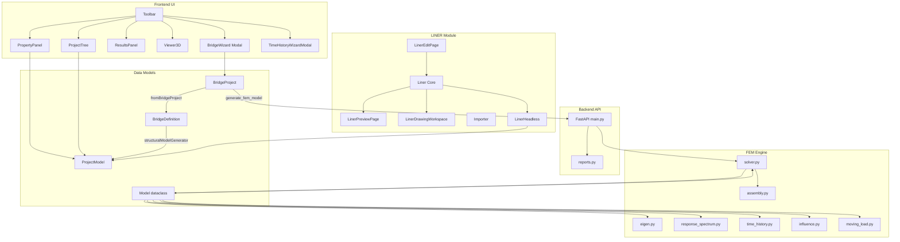
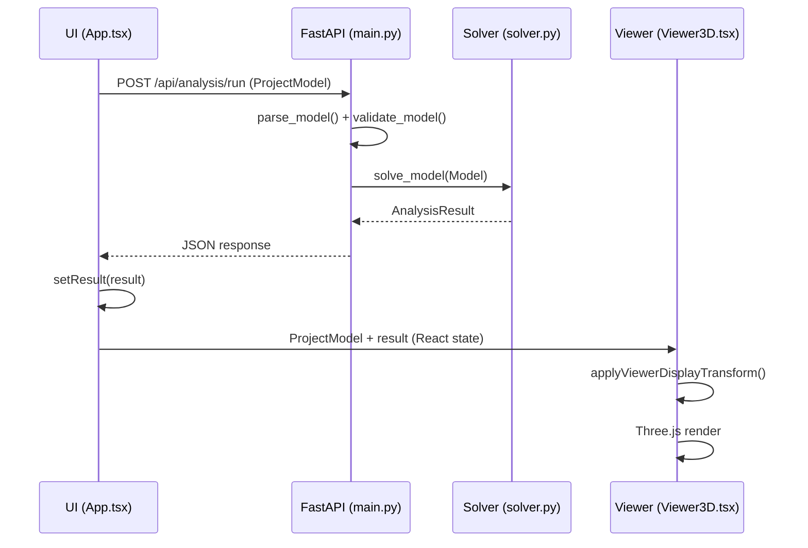

# 現行アーキテクチャ

**Generated**: 2026-07-15  
**Git HEAD**: `fd21e30`

---

## 関係図



---

## BridgeWizard経路 vs BridgeDefinition経路

### 経路 A: BridgeWizard (legacy)

```
BridgeWizard (BridgeProject)
  → Step 6 "Generate"
  → POST /api/fem/generate
  → backend/engine/bridge_fem_generator.py: generate_fem_model()
  → BridgeFemResponse { summary, fem: ProjectModel }
  → handleBridgeGenerated() (App.tsx:596)
  → bridgeProjectToProjectModel() (conversion.ts:9)
  → commitProject()
```

- **場所**: `frontend/src/bridge/` → `backend/engine/bridge_fem_generator.py`
- **保存先**: BridgeProject は `backend/data/bridges/` に CRUD
- **特徴**: z=0.0 固定、Legacy FEM 2D planar model

### 経路 B: BridgeDefinition (feature-flagged)

```
BridgeProject → fromBridgeProject adapter (bridge/api.ts:70-76)
  → BridgeDefinition (canonical intermediate)
  → generateStructuralModel() (structuralModelGenerator.ts:198)
  → ProjectModel (discretized FEM)
```

- **場所**: `frontend/src/bridgeDefinition/`
- **Flag**: `VITE_USE_BRIDGE_DEFINITION_STRUCTURAL_MODEL`（デフォルト false）
- **特徴**: frontend-side conversion、coordinatePolicy 対応

---

## UI → API → Solver → Viewer



---

## 主要保存先

| 対象 | 保存先 | 場所 |
|------|--------|------|
| ProjectModel | JSON download (browser) | `App.tsx:534-538` |
| ProjectModel (backend) | filesystem JSON | `backend/data/projects/` |
| BridgeProject | filesystem JSON | `backend/data/bridges/` |
| Importer | localStorage | `importer/storage/importerStorage.ts` |
| Viewer axis swap | localStorage | `viewer/coordinateTransform.ts:22` |
| analysisResults.timeHistory | ProjectModel 永続 | `types.ts:189-191` |
| 他の解析結果 | React state のみ | `App.tsx:103` |
| Autosave | **無効** | `App.tsx:89` |

---

## 現行正本定義

| 正本 | 場所 | 型 | 用途 |
|------|------|-----|------|
| **LINER** | `frontend/src/liner/` | 幾何計算 | 線形・断面・グリッド・中間結果 |
| **BridgeProject** | `backend/engine/bridge_model.py` | dataclass | Bridge Wizard ドメインモデル |
| **BridgeDefinition** | `frontend/src/bridgeDefinition/types.ts` | interface | 中間表現（canonical intermediate） |
| **ProjectModel** | `frontend/src/types.ts:158-196` | type | FEM解析の唯一の正本 |
| **Model** | `backend/engine/model.py:151-165` | dataclass | Backend solver入力 |
